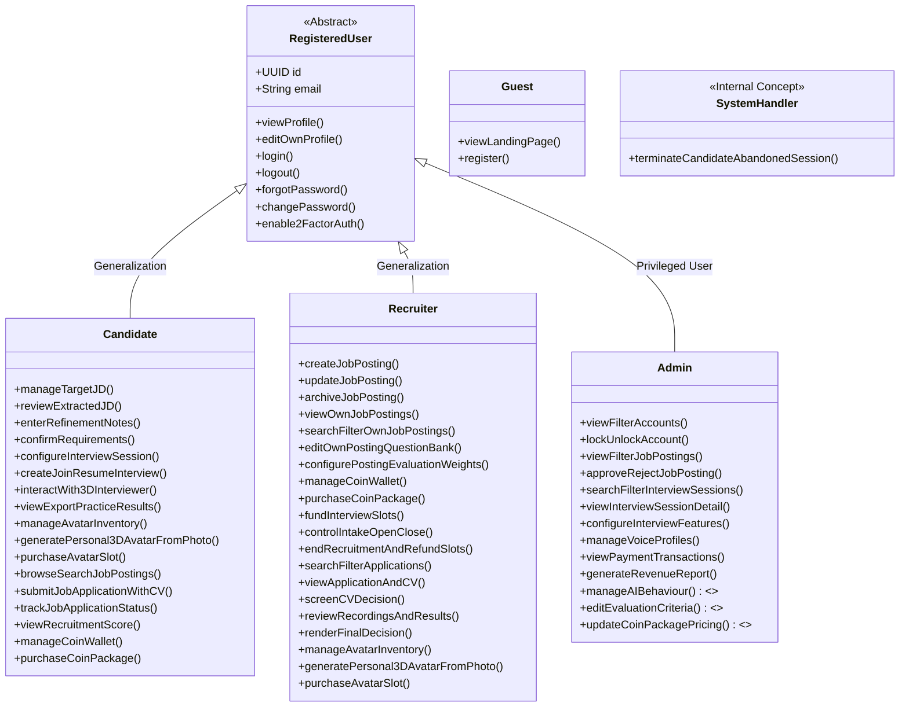

# Actors and Capabilities

This document defines the actors of the RoleCue platform and establishes their canonical capability boundaries according to the finalized product scope.

The formal use-case model contains **57** use cases. This Brain records their durable capability boundaries without assigning use-case numbers.

---

## 1. Actor Catalog & Hierarchy

### Detailed Actor Definitions

#### 1.1. Guest (Public Visitor)
* **Definition:** An unauthenticated visitor accessing the public web application.
* **Canonical Capabilities:**
  * **View Landing Page:** View platform value proposition, product overview, and public information.
  * **Register:** Initiate registration to create an account as a Candidate or Recruiter.
* **Boundary Invariant:** Guests do **NOT** have access to pricing exploration, pricing plan viewing, public 3D avatar teasers, avatar previews, 2-question voice demos, anonymous voice demos, or public interactive demos.

#### 1.2. Registered User (Abstract Authenticated User)
* **Definition:** The shared authenticated-user abstraction representing any verified account holder. Serves as the common base for Candidate, Recruiter, and Admin.
* **Canonical Capabilities:**
  * View Profile
  * Edit Own Profile
  * Log in
  * Log out
  * Forgot Password (including password-reset behavior)
  * Change Password
  * Enable 2-Factor Authentication
* **Inheritance Boundary:** Registered User inheritance does **NOT** grant Admin a personal coin wallet or personal avatar inventory. Only Candidates and Recruiters possess wallets and avatar inventories.

#### 1.3. Candidate (Interview Practice & Career Seeker)
* **Definition:** An authenticated job seeker using RoleCue to prepare for technical interviews and discover career opportunities.
* **Canonical Capabilities:**
  * **Target JD for Practice Management:** Upload or paste target job descriptions (text or PDF) for personal practice.
  * **AI-Extracted JD Review & Confirmation:** Inspect and modify structured technical competencies extracted by AI; enter natural-language refinement notes (e.g., *"Exclude C# from the interview"*); confirm requirements before Blueprint generation.
  * **Interview Configuration:** For a Target JD interview, choose an available system 3D interviewer or eligible personal 3D model from avatar inventory, an available Voice Profile, 3D environment, difficulty, and duration. For a Job Posting interview, the Job Posting's company-defined 3D interviewer model and Voice Profile apply and cannot be overridden.
  * **Interview Session Lifecycle & Coin Charging:** Create, test audio and interview readiness, join, pause, and resume interview sessions. Practice interviews are debited in coins from the Candidate's personal wallet upon session start; reconnect/resume of the same session incurs no second charge.
  * **Spoken Interaction with 3D AI Interviewer:** Conduct real-time voice conversation with speech-synchronized 3D interviewer animation. Receives a random selection of core questions from the bank with bounded follow-ups.
  * **Practice History & Diagnostic Results:** Review practice performance reports, scores across core technical competencies, radar charts, turn critiques, actionable recommendations, and export results.
  * **Personal 3D Avatar Inventory:** Access the embedded Avaturn generator to create a personal 3D avatar (RoleCue stores the final VRM asset). Manage personal avatar inventory capacity (delete models or purchase additional capacity slots with coins). Avatar generation fee is charged only upon successful VRM persistence in RoleCue.
  * **Job Posting Discovery & Application:** Browse, search, filter, and view details of approved recruiter Job Postings with open intake. Submit application with CV/resume.
  * **Recruitment Interview Participation:** Upon passing Recruiter CV screening, participate in the required technical interview funded by the Recruiter's prepaid slots (no coin charge to Candidate).
  * **Recruitment Result Visibility:** View overall recruitment evaluation score. Candidates **cannot** view recruitment transcripts or audio/video recordings during recruitment.
  * **Coin Wallet Management:** Purchase coin packages via payment gateway; view wallet coin balance and transaction history.
* **Boundary Invariant:** Candidates **never** view, edit, or confirm Interview Blueprints. Candidates do not purchase memberships or subscriptions.

#### 1.4. Recruiter (Employer Hiring Representative)
* **Definition:** A verified recruiter or hiring representative publishing job opportunities and reviewing incoming applications.
* **Canonical Capabilities:**
  * **Create Job Posting:** Begin a Job Posting (the company's Job Description) from JD-like content; review and confirm AI-extracted structured requirements.
  * **Configure Job Posting Interview:** Select the company 3D interviewer model and Voice Profile that Candidates must use for that Job Posting's interview.
  * **Manage Question Bank (Blueprint):** View and edit core questions within the question bank generated for own Job Postings.
  * **Configure Evaluation Weights:** Adjust posting-level evaluation weights across technical competencies (separate from the question bank).
  * **Update & Archive Job Posting:** Modify requirements or archive inactive Job Postings.
  * **Control Application Intake:** Open or Close intake for applications. Close temporarily halts new applications while allowing already-screened applicants to interview.
  * **End Recruitment & Reclaim Slots:** Formally end recruitment on a posting; eligible unused interview slots are refunded as coins back to the Recruiter's personal wallet.
  * **View & Search Own Postings:** Inspect, filter, and search own Job Postings.
  * **CV-First Application Screening:** Search and filter incoming applications; view candidate application details and uploaded CV/resume immediately upon submission; render CV screening decision (`Pass` or `Reject` CV screening).
  * **Review Recruitment Recordings & Final Decision:** Review completed applicant interviews, including technical evaluation results and recruitment audio/video recordings and transcripts; render definitive final **Approve** or **Reject** decision.
  * **Coin Wallet & Slot Funding:** Purchase coin packages via payment gateway; fund interview slots for Job Postings using coins; view wallet balance and transaction ledger.
  * **Personal Avatar Inventory:** Maintain personal avatar inventory; generate avatars via embedded Avaturn; purchase additional avatar capacity slots with coins.
* **Boundary Invariant:**
  * **Job Posting IS the Company JD:** No separate "Corporate JD" or company tenant entity exists.
  * **Scope Termination:** Recruitment scope strictly terminates at **Approve / Reject Application**. No multi-stage hiring funnels, panel scheduling, offers, or onboarding.
  * **No Memberships or Tax Systems:** Recruiters use coin wallets to fund interview slots and avatar operations. No corporate subscriptions or VAT invoices.

#### 1.5. Administrator (Platform Governance & Operations)
* **Definition:** A privileged operator responsible for platform security, content oversight, voice profile curation, and financial auditability.
* **Canonical Capabilities:**
  * **Account Governance:** View and filter user accounts; lock and unlock accounts.
  * **Job Posting Moderation:** View and filter submitted Job Postings; approve and reject Job Postings.
  * **Interview Session Oversight:** Search and filter interview sessions; inspect operational session details.
  * **Voice Profile Catalog Management:** View voice profiles, fetch voice profiles from external TTS providers, and delete obsolete profiles.
  * **Financial Audit & Reporting:** View payment transactions and orders; generate revenue reports.
  * **Capabilities Awaiting Confirmation:** Global AI behavior prompt calibration, global evaluation criteria/rubrics editing, Interview Feature Configuration / runtime toggle authority, and coin package price management remain open product decisions awaiting formal confirmation.
* **Boundary Invariant:**
  * **Admin DOES manage:** Provider-sourced Voice Profiles (viewing, fetching, deleting), account locks, posting moderation, and financial audits.
  * **Admin does NOT manage:** 3D avatar meshes or 3D background presets (built-in platform presets).
  * **No Wallets or Inventories:** Admin does not hold a personal coin wallet or personal avatar inventory.
  * **No Recording Access by Inference:** Session oversight does not grant Admin access to recruitment audio/video recordings.
  * **No Dispute Queues:** Admins do not adjudicate refund requests or manage billing disputes. Unused slot refunds upon End Recruitment execute automatically as internal coin movements.

#### 1.6. System Handler (Internal Automated Handler)
* **Definition:** An internal automated system handler executing scheduled background operations.
* **Canonical Capability:**
  * **Terminate Candidate's Abandoned Session:** Detects and terminates abandoned or orphaned interview sessions after extended inactivity.
* **Boundary Invariant:** The System Handler is strictly an **internal concept**, not an external entity on context diagrams. It does **not** manage invented background jobs like draft JD expiration, subscription reconciliation, or generic scheduled maintenance.

---

## 2. Canonical Capability Mapping

RoleCue's finalized capabilities are organized semantically into ten cohesive domain areas:

### 2.1. Authentication & Account Management
* **Actors:** Registered User, Guest
* **Capabilities:**
  * View landing page
  * Register new account
  * Log in & log out
  * View & edit own profile
  * Forgot Password (including password-reset behavior)
  * Change password
  * Enable 2-factor authentication

### 2.2. Target Job Description & Refinement
* **Actors:** Candidate
* **Capabilities:**
  * Upload or paste target Job Description (text or PDF) for personal practice
  * Review AI-extracted technical competencies (languages, frameworks, databases, tools, seniority)
  * Enter natural-language refinement notes (e.g., *"Exclude C# from the interview"*)
  * Confirm requirements to authorize question-bank Blueprint generation
  * Manage personal Target JD library

### 2.3. Interview Planning & Question-Bank Generation
* **Actors:** Candidate, Recruiter, System
* **Capabilities:**
  * Candidate configures a Target JD interview with an available system or eligible personal 3D interviewer model, Voice Profile, 3D environment, difficulty level, and duration
  * System generates a single internal core-question bank Blueprint per JD following confirmed requirements (strictly hidden from Candidate)
  * Recruiter views and edits core questions in the question bank for own Job Posting
  * Recruiter configures posting-level evaluation weights separately from the question bank
  * Candidate uses the Job Posting's locked company 3D interviewer model and Voice Profile for recruitment interviews

### 2.4. Real-Time Interview Simulation
* **Actors:** Candidate, System Handler
* **Capabilities:**
  * Test Audio and Interview Readiness (microphone and audio check)
  * Join and start 3D mock interview simulation
  * Coin charging boundary: Practice interview debited from Candidate wallet upon session start; reconnect/resume is free. Recruitment interview consumes prepaid Recruiter interview slot; no charge to Candidate
  * Real-time conversational spoken interaction with 3D avatar (STT / TTS with blend-shape lip-sync visemes)
  * Adaptive questioning loop: Random selection of $x$ core questions from bank with bounded follow-ups
  * Pause, resume, or end interview session
  * Capture audio/video recordings and transcripts for recruitment interviews (owning Recruiter access only)
  * Terminate abandoned interview session (System Handler)

### 2.5. Post-Interview Evaluation & History
* **Actors:** Candidate, Recruiter
* **Capabilities:**
  * Candidate views personal practice interview history and session listings
  * Candidate views practice performance report with overall score (0–100), competency breakdown, radar visualization, turn critiques, and actionable study roadmap
  * Candidate exports practice results
  * Candidate views recruitment evaluation score (transcripts and recordings remain hidden from candidate during recruitment)
  * Recruiter reviews applicant evaluation result, competency breakdown, turn critiques, and recruitment audio/video recordings and transcripts

### 2.6. Personal 3D Avatar Inventory
* **Actors:** Candidate, Recruiter
* **Capabilities:**
  * Generate personal 3D avatar through embedded free Avaturn iframe; RoleCue converts received final GLB to VRM production asset
  * Generation fee charged in coins only upon successful VRM persistence in RoleCue
  * View and manage personal avatar inventory capacity
  * Purchase additional avatar inventory capacity slots using coins
  * Remove avatars to free storage capacity

### 2.7. Recruiter Job Posting & Intake Management
* **Actors:** Recruiter
* **Capabilities:**
  * Create Job Posting from JD-like content; review and confirm extracted technical requirements
  * Select company 3D interviewer model and Voice Profile before submitting for Admin approval
  * Update and archive Job Postings
  * View and search own Job Postings
  * Control intake: Open intake or Close intake
  * Fund interview slots for Job Posting using coins from personal wallet
  * End Recruitment: formally finish recruitment and receive coin refund for eligible unused interview slots

### 2.8. Job Application & CV-First Workflow
* **Actors:** Candidate, Recruiter
* **Capabilities:**
  * Candidate browses, searches, and views approved Job Postings with open intake
  * Candidate submits application with uploaded CV/resume
  * Application and CV are immediately visible to the owning Recruiter
  * Recruiter reviews submitted application and CV; renders CV screening decision (`Pass` or `Reject`)
  * Approved applicant conducts required technical interview using Recruiter-funded slot
  * System attaches Interview Result and recruitment recordings to Application
  * Recruiter reviews applicant details, CV, evaluation result, and recordings; renders definitive **Approve** or **Reject** decision
  * Candidate tracks application status and views recruitment score

### 2.9. Coin Wallets & Payment Governance
* **Actors:** Candidate, Recruiter, Admin, External Payment Gateway
* **Capabilities:**
  * Candidate and Recruiter purchase coin packages via external payment gateway using real money
  * Personal coin wallets track balance and immutable coin transactions
  * Candidate spends coins on practice interview starts, avatar generation, and avatar capacity slots
  * Recruiter spends coins on interview slots, avatar generation, and avatar capacity slots
  * Internal coin refund credited to Recruiter wallet upon End Recruitment for eligible unused slots
  * Admin views payment transactions and orders; generates revenue reports
  * Admin coin package pricing management [Awaiting Confirmation]

### 2.10. Administration & Platform Governance
* **Actors:** Admin
* **Capabilities:**
  * View and filter user accounts; lock and unlock accounts
  * View and filter job postings; approve and reject job postings
  * Search and filter interview sessions; inspect session details
  * Configure interview features and runtime toggles [Awaiting Confirmation]
  * Manage Voice Profiles (view, fetch from TTS providers, delete)
  * Manage AI behavior prompt templates [Awaiting Confirmation]
  * Edit global evaluation criteria and rubrics [Awaiting Confirmation]

---

## 3. Strict Scope Invariants

1. **No ATS Progression:**
   Recruitment scope strictly terminates at `Approve / Reject Application`. There are no capabilities for multi-stage hiring pipelines, panel scheduling, interview scorecards, offer management, or employee onboarding.
2. **Blueprint Access Invariant:**
   Candidates **never** view, edit, or confirm an Interview Blueprint. Blueprints are ONLY the persistent core-question banks generated after requirement confirmation (evaluation configuration is a separate concern). Recruiters **can** view and edit core questions in the question bank for their own Job Postings.
3. **No Multi-Tenancy Architecture:**
   Recruiters manage their Job Postings directly. There are no company tenants, company workspaces, tenant-specific schemas, or tenant isolation middleware.
4. **No 3D Marketplace:**
   Avatars are limited to curated platform presets and user-generated personal avatars in Candidate or Recruiter inventories. There is no community publishing, avatar store, trading, or monetization.
5. **Coin Wallets Replace Memberships:**
   Platform monetization is structured around coin packages and personal wallets for Candidates and Recruiters. Admin has no wallet. There are no recurring subscriptions, memberships, or cash refund dispute queues. Unused funded interview slots are refunded as coins upon End Recruitment.
6. **Recruitment Recording & Visibility Boundary:**
   Audio/video recordings and transcripts captured during recruitment interviews are accessible exclusively to the owning Recruiter. Candidates view their evaluation score, but cannot view recruitment transcripts or recordings during recruitment. Admin does not possess recruitment recording access by inference. Practice interviews do not record video.
