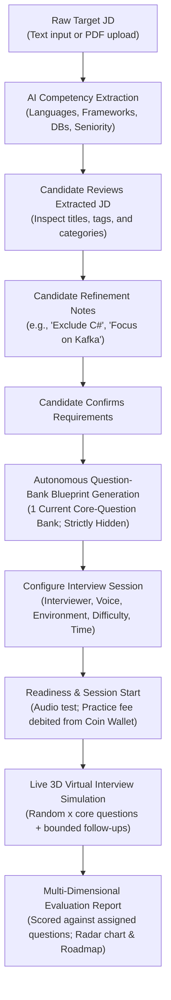
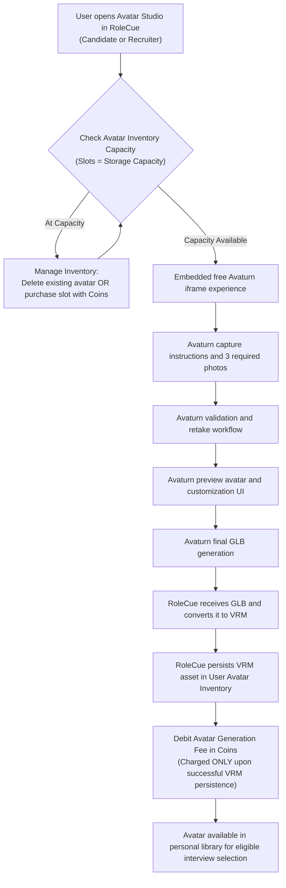

# Core Product Flows

This document details the primary end-to-end user workflows within RoleCue:
1. **Flow A:** Candidate Practice Flow (The flagship technical interview simulation)
2. **Flow B:** Job Application Flow (Lightweight recruiter job posting & candidate application)
3. **Flow C:** Personal Avatar Generation Flow (Photo-to-3D personal avatar creation)

---

## Flow A: Candidate Practice Flow

The Candidate Practice Flow is the central value engine of RoleCue. It takes a raw target job description, guides the candidate through structured requirement review and refinement, enforces human confirmation of requirements before question-bank generation, configures presentation, debits the practice fee in coins at session start, executes real-time 3D simulation with adaptive questioning, and delivers diagnostic evaluation. The system prepares its single hidden core-question bank Blueprint and immutable execution context internally.



### Step-by-Step Breakdown

#### 1. Ingestion & Preprocessing
* The Candidate provides a target Job Description by either pasting raw text or uploading a PDF document.
* If a PDF is uploaded, text is extracted in natural reading order and character encodings are normalized into clean UTF-8.

#### 2. AI Competency Extraction & Deterministic Validation
* The normalized text is parsed by an LLM via structured extraction prompts.
* The system extracts:
  * Role Title and Seniority Level (`intern`, `junior`, `mid`, `senior`, `lead`).
  * Technical Skills categorized by: `programming_language`, `framework`, `database`, `tool`, `technology`, `other`.
  * Requirement weights (`required` vs. `preferred`).
  * Technologies and Core Domain Knowledge.
* The extracted payload is deterministically validated before presentation. Duplicate or conflicting skills are reconciled. Soft skills are intentionally excluded.

#### 3. Candidate Review, Natural-Language Refinement, & Confirmation
* The Candidate reviews the extracted requirements in the user interface.
* The Candidate may:
  * Adjust the job title or seniority badge.
  * Add missing technologies or remove irrelevant tags.
  * Enter **Natural-Language Refinement Notes** in a dedicated instruction field (e.g., *"Exclude C# from the interview"*, *"Focus heavily on system architecture and distributed caching"*).
* **Human Confirmation Precedes Blueprint Generation:** The Candidate explicitly confirms the reviewed requirements. Confirmation is the gate authorizing question-bank generation.

#### 4. Autonomous Question-Bank Blueprint Generation (INTERNAL & HIDDEN)
* Following requirements confirmation, the system generates a single **Interview Blueprint** serving as the core-question bank:
  $$\text{Interview Blueprint} = \text{Confirmed Requirements} + \text{Candidate Refinement Notes}$$
* The blueprint is ONLY the persistent/current core-question bank/list generated from confirmed skills, requirements, and seniority/refinement context. It contains exclusively the bank of core questions. It does NOT contain grading rubrics, evaluation criteria, competency weights, depth benchmarks, or evaluation matrices; evaluation configuration is a separate concern.
* Exactly **one current Blueprint** exists per JD (it is absent until generated; changing configuration or difficulty does not spawn multiple current banks).
* > [!IMPORTANT]
  > **The Blueprint is strictly INTERNAL and HIDDEN from Candidates.** Candidates **never view, edit, or confirm the Blueprint**. They interact exclusively through the live simulation.

#### 5. Configure Interview Session
* The Candidate configures presentation and execution parameters:
  * **Interviewer Persona:** Visual appearance choice (system preset or eligible model from personal avatar inventory).
  * **Voice Profile:** Voice profile choice (tone, accent, gender) sourced from TTS providers.
  * **Interview Environment:** 3D virtual room background choice.
  * **Difficulty & Horizon:** Session difficulty and duration horizon.

#### 6. Readiness Verification & Start Charging
* The Candidate completes **Test Audio and Interview Readiness** (microphone and audio check).
* **Start Charging Boundary:** When the Candidate initiates the practice session, the practice interview fee is debited from their **personal coin wallet**.
* If a session experiences a network disconnect or is paused, reconnecting or resuming the same session incurs **no second charge**.

#### 7. Live Virtual Interview Simulation
* The session assigns its selected questions via `interview_questions` (linking each turn position to its persistent `core_questions` record) and applies the evaluation configuration actually used (without modeling evaluation criteria as part of the current Blueprint).
* The simulation selects a random set of $x$ core questions from the bank and may ask bounded follow-ups based on the candidate's answers and interview context.
* Execution loop:
  1. The interviewer articulates the question via TTS with synchronized blend-shape visemes.
  2. The Candidate speaks their answer; Voice Activity Detection (VAD) monitors speech boundaries and streams audio to STT.
  3. STT produces the transcript turn.
  4. The runtime analyzes the Answer with Interview Context to determine whether to ask a bounded follow-up or proceed to the next core question. Deciding whether to follow up and generating follow-up wording are decoupled responsibilities without premature vendor lock-in.
  5. The loop repeats until all selected questions are completed or the horizon ends.
* If client hardware cannot sustain WebGL 3D rendering, the interface gracefully degrades to a 2D animated waveform display without dropping voice dialogue.

#### 8. Evaluation & Learning Roadmap
* Upon session completion, the turn transcript is graded against the assigned questions and evaluation configuration across technical competencies.
* Evaluation results are stored relationally across `interviews.score`, `interviews.feedback`, `score_details (interview_id, metric_id, score)`, and `conversation_turns.feedback`, and displayed on the candidate's dashboard featuring an overall score (0–100), competency breakdown, radar chart, turn-by-turn critiques with model answers, and a prioritized study roadmap.

---

## Flow B: Job Posting & CV-First Application Flow

RoleCue incorporates a lightweight job board and CV-first recruitment flow connecting Candidates and Recruiters. The scope is strictly bounded to eliminate full ATS overhead.

```mermaid
sequenceDiagram
    autonumber
    actor Recruiter
    actor Candidate
    actor Admin
    participant System as RoleCue Platform
    participant DB as Platform Storage

    Note over Recruiter,Admin: 1. Job Posting Setup & Approval
    Recruiter->>System: Create Job Posting from JD-like content
    System->>System: AI extracts technical requirements
    Recruiter->>System: Review & confirm requirements
    System->>DB: Generate single Question-Bank Blueprint
    Recruiter->>System: Edit own-posting core questions & configure evaluation weights
    Recruiter->>System: Select company 3D interviewer model and Voice Profile
    Recruiter->>System: Submit Job Posting for approval
    System->>DB: Persist Job Posting (Status: PENDING_APPROVAL)
    Admin->>System: Approve Job Posting
    System->>DB: Set Job Posting Status to APPROVED

    Note over Recruiter,System: 2. Slot Funding & Intake Open
    Recruiter->>System: Fund interview capacity using Coins from Wallet (interview_slot)
    System->>DB: Record interview_slot on Job Posting
    Recruiter->>System: Open application intake (Intake: OPEN)

    Note over Candidate,Recruiter: 3. Unlimited Application Intake & Immediate Visibility
    Candidate->>System: Browse Approved Postings (Intake: OPEN)
    Candidate->>System: Submit Application with uploaded CV (Unlimited submissions allowed)
    System->>DB: Persist Application with CV (Status: PENDING)
    System-->>Recruiter: Application & CV immediately visible in View Application Detail

    Note over Recruiter,Candidate: 4. CV Screening & 24h Deadline
    Recruiter->>System: Screen CV in View Application Detail (Max interview_slot approvals)
    alt Recruiter rejects CV
        Recruiter->>System: Reject CV
        System->>DB: Update Application (Status: REJECTED - Terminal)
        System-->>Candidate: Notify CV rejected
    else Recruiter approves CV
        Recruiter->>System: Approve CV (Grants eligibility; does not consume slot yet)
        System->>DB: Set cv_approved_at & interview_deadline = cv_approved_at + 24 hours
        System-->>Candidate: Notify interview eligible with 24h deadline
    end

    Note over Recruiter,System: 5. Close Intake (Manual or When Limitation Met)
    opt Close Intake triggered (Manual or configured limit met)
        System->>DB: Stop new applications (Intake: CLOSED)
        System->>DB: Auto-reject remaining unscreened/not-approved Applications
        Note over System,DB: Approved candidates remain interview-eligible. No refund yet. No reopen flow.
    end

    Note over Candidate,System: 6. Recruitment Technical Interview & Slot Consumption
    opt Approved Candidate interviews before deadline
        Candidate->>System: Start recruitment interview
        System->>DB: Consume 1 funded interview slot on FIRST successful start (Free reconnect)
        Note over Candidate,System: Uses locked company 3D model & Voice Profile
        System->>DB: Record recruitment session, audio/video recordings & transcript
        System->>DB: Evaluate session and store Interview Result
        System->>DB: Attach Interview Result & recordings to Application
        System-->>Candidate: Display overall recruitment score (Transcripts/recordings hidden)
    end
    opt Candidate fails to interview before interview_deadline
        System->>DB: Deadline expired -> Auto-reject Application (Status: REJECTED - Terminal)
    end

    Note over Recruiter,System: 7. Hard-Gated Final Review & Terminal Auto-Close
    Note over Recruiter,System: Final decision HARD-GATED until MAX(interview_deadline)
    opt After MAX(interview_deadline)
        Recruiter->>System: Open View Application Detail (Reviews CV, scores, recordings)
        alt Recruiter Approves
            Recruiter->>System: Approve Application (Status: APPROVED - Terminal)
        else Recruiter Rejects
            Recruiter->>System: Reject Application (Status: REJECTED - Terminal)
        end
    end

    opt Every Application reaches terminal state (APPROVED / REJECTED)
        System->>DB: Terminal Job Posting Auto-Close
        System->>DB: Refund unused interview_slot capacity as internal Coins to Recruiter Wallet
        Note over System,DB: Refund unused JP Candidate Slot (Internal coin movement; no PayOS call)
    end
```

### Step-by-Step Breakdown

1. **Job Posting Creation & Question Bank Setup:**
   * A Recruiter creates a **Job Posting** (the company's Job Description) from JD-like content.
   * AI extracts structured requirements, and the Recruiter reviews and confirms them.
   * The system generates a single **Interview Blueprint** (core-question bank, persisted in `core_questions`) for the posting.
   * The Recruiter can view and edit core questions within their own posting's question bank.
   * The Recruiter configures posting-level evaluation weights (separate from the question bank).
   * Before submission for Admin approval, the Recruiter locks the company 3D interviewer model and Voice Profile.
   * Administrator approves the posting, making it publicly discoverable.
2. **Interview Slot Funding & Intake Open:**
   * The Recruiter funds interview capacity for the Job Posting using coins from their personal coin wallet, persisting `job_postings.interview_slot`.
   * **`interview_slot` Definition:** Represents exclusively maximum recruitment interview capacity (the maximum number of Candidates that may be approved to proceed into the recruitment interview stage). It does **not** mean total Applications/CVs submitted, company hiring headcount, or final hires. RoleCue does not persist or enforce company hiring headcount.
   * The Recruiter opens application intake.
3. **Application Intake & Immediate Recruiter Visibility:**
   * While Job Posting intake is **OPEN**, Candidates may submit an **UNLIMITED** number of Applications with uploaded CV/resumes.
   * Application submissions are **NOT limited by interview capacity** (`interview_slot`).
   * **Immediate Visibility:** The Application and uploaded CV/resume are immediately visible to the owning Recruiter in **View Application Detail** upon submission, prior to any interview taking place.
4. **Recruiter CV Screening & 24-Hour Interview Deadline:**
   * The Recruiter screens Applications and uploaded CVs inside **View Application Detail**.
   * The Recruiter may approve at most `interview_slot` Candidates to proceed to the recruitment interview stage.
   * **CV Approval Semantics:** Approving a CV grants interview eligibility; it does **not** consume the funded interview slot yet.
   * **Interview Deadline:** When an Application is approved:
     $$\text{interview\_deadline} = \text{cv\_approved\_at} + 24\text{ hours}$$
   * If an approved Candidate does not complete the recruitment interview by `interview_deadline`, the Application automatically transitions to terminal `REJECTED`.
5. **Close Intake (Manual or Limitation-Driven):**
   * Intake can be closed manually by the Recruiter (*Close Job Posting Intake*) or automatically by the System Handler (*Close Job Posting When Meet Configured Limitation* upon reaching `interview_slot` approved candidates).
   * **Close Intake Semantics:**
     * Stops accepting new Applications/CVs.
     * Automatically **REJECTS** all remaining Applications that are still unscreened or not approved to proceed to interview.
     * Candidates already approved for interview remain interview-eligible and may still complete their interviews within their 24-hour windows.
     * Close Intake is **NOT terminal Job Posting close** and does **NOT refund unused interview capacity**.
     * There is **NO Reopen Intake flow** and **NO manual End Recruitment command**.
6. **Recruitment Interview Simulation & Slot Consumption:**
   * An applicant with approved interview eligibility launches the technical interview.
   * **Slot Consumption Boundary:** The funded interview slot is consumed strictly on the Candidate's **FIRST successful recruitment interview start**. Reconnecting to or resuming that active session consumes no additional slot.
   * The Candidate is **never charged** for a Recruiter-funded recruitment interview.
   * The interview strictly runs using the Job Posting's locked company 3D interviewer model and Voice Profile, capturing audio/video recordings and turn transcripts.
7. **Result Attachment & Role-Specific Visibility:**
   * The evaluation engine generates the Interview Result (Performance Report) and attaches it, along with the audio/video recordings, to the candidate's Application.
   * **Candidate Visibility:** The Candidate can view their overall recruitment evaluation score, but **cannot** access recruitment transcripts or audio/video recordings during recruitment.
   * **Recruiter Visibility:** The owning Recruiter has full access to the applicant's profile, CV, evaluation breakdown, turn critiques, and full audio/video recordings and transcripts inside **View Application Detail**.
8. **Hard-Gated Final Recruiter Review & Terminal Decision:**
   * Recruiter final Approve/Reject decisions are **HARD-GATED** until:
     $$\text{MAX}(\text{interview\_deadline})$$
     across all interview-eligible Applications for that Job Posting.
   * Before that timestamp, the Recruiter **cannot** perform final Approve/Reject.
   * After the gate expires, the Recruiter opens **View Application Detail**, inspects candidate profile, CV, evaluation score, and authorized recordings/transcripts, and renders the definitive final decision: **Approve** or **Reject** Application.
   * All Recruiter CV, report, and recording review capabilities are consolidated inside **View Application Detail** (no separate top-level review use cases).
9. **Terminal Job Posting Auto-Close & Unused Slot Coin Refund:**
   * A Job Posting automatically reaches terminal closed state when **EVERY Application in scope has a terminal result** (`APPROVED` or `REJECTED`).
   * Terminal rejections include applications rejected during Close Intake cleanup, interview deadline expiry, Recruiter CV rejection, and final Recruiter rejection.
   * Upon terminal auto-close, the system executes **Refund unused JP Candidate Slot**, refunding all still-unused recruitment interview capacity to the Recruiter's personal coin wallet as internal coins.
   * This refund is an internal database ledger credit; it does **not** call PayOS or external payment gateways.
   * Terminal Job Posting close is strictly automated; there is **no manual End Recruitment command**.

---

## Flow C: Personal Avatar Generation & Inventory Flow

RoleCue supports personal 3D avatar generation through an embedded free Avaturn iframe experience. Both Candidates and Recruiters maintain personal avatar inventories. Avaturn owns capture, validation, customization, and final GLB generation; RoleCue converts and persists the final production VRM asset.



### Step-by-Step Breakdown

1. **Avatar Inventory Capacity Check:**
   * A Candidate or Recruiter accesses the Personal 3D Avatar Studio from RoleCue.
   * **Capacity Invariant:** Avatar slots represent **storage capacity**, not generation credits.
   * If the user's avatar inventory is at capacity, the user must either remove an existing avatar or purchase an additional avatar capacity slot using coins from their personal wallet before generating a new avatar.
2. **Avaturn Embedded Experience:**
   * RoleCue embeds the free Avaturn iframe.
   * Avaturn independently presents capture instructions, collects the three required photos, performs validation and retake handling, renders the interactive preview, and provides accessories and customization.
3. **Asset Handoff & Conversion:**
   * Avaturn generates the final GLB asset and returns it across the iframe bridge.
   * RoleCue receives the GLB and executes deterministic conversion to the standardized VRM format.
4. **Successful VRM Persistence & Generation Fee Charging:**
   * RoleCue persists the VRM model and associates it with the owning user (`user_id`).
   * **Charging Boundary:** The avatar generation fee is debited in coins from the user's personal wallet **only after successful VRM persistence**. Opening the creator, uploading photos, generating the Avaturn GLB, or initiating conversion does **not** incur a generation charge.
5. **Eligible Interview Usage:**
   * Once persisted, the avatar is stored in the user's personal library.
   * A Candidate can select an eligible personal avatar as the interviewer appearance for personal Target JD practice sessions.
   * For Job Posting interviews, company presentation settings remain locked by the Job Posting.
