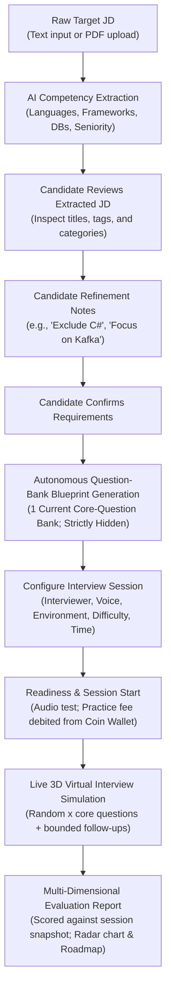
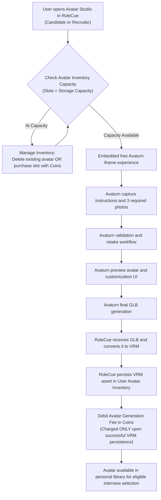

# Core Product Flows

This document details the primary end-to-end user workflows within RoleCue:
1. **Flow A:** Candidate Practice Flow (The flagship technical interview simulation)
2. **Flow B:** Job Application Flow (Lightweight recruiter job posting & candidate application)
3. **Flow C:** Personal Avatar Generation Flow (Photo-to-3D personal avatar creation)

---

## Flow A: Candidate Practice Flow

The Candidate Practice Flow is the central value engine of RoleCue. It takes a raw target job description, guides the candidate through structured requirement review and refinement, enforces human confirmation of requirements before question-bank generation, configures presentation, debits the practice fee in coins at session start, executes real-time 3D simulation with adaptive questioning, and delivers diagnostic evaluation. The system prepares its single hidden core-question bank Blueprint and immutable execution context internally.



### Step-by-Step Breakdown

#### 1. Ingestion & Preprocessing
* The Candidate provides a target Job Description by either pasting raw text or uploading a PDF document.
* If a PDF is uploaded, text is extracted in natural reading order and character encodings are normalized into clean UTF-8.

#### 2. AI Competency Extraction & Deterministic Validation
* The normalized text is parsed by an LLM via structured extraction prompts.
* The system extracts:
  * Role Title and Seniority Level (`intern`, `junior`, `mid`, `senior`, `lead`).
  * Technical Skills categorized by: `programming_language`, `framework`, `database`, `tool`, `technology`, `other`.
  * Requirement weights (`required` vs. `preferred`).
  * Technologies and Core Domain Knowledge.
* The extracted payload is deterministically validated before presentation. Duplicate or conflicting skills are reconciled. Soft skills are intentionally excluded.

#### 3. Candidate Review, Natural-Language Refinement, & Confirmation
* The Candidate reviews the extracted requirements in the user interface.
* The Candidate may:
  * Adjust the job title or seniority badge.
  * Add missing technologies or remove irrelevant tags.
  * Enter **Natural-Language Refinement Notes** in a dedicated instruction field (e.g., *"Exclude C# from the interview"*, *"Focus heavily on system architecture and distributed caching"*).
* **Human Confirmation Precedes Blueprint Generation:** The Candidate explicitly confirms the reviewed requirements. Confirmation is the gate authorizing question-bank generation.

#### 4. Autonomous Question-Bank Blueprint Generation (INTERNAL & HIDDEN)
* Following requirements confirmation, the system generates a single **Interview Blueprint** serving as the core-question bank:
  $$\text{Interview Blueprint} = \text{Confirmed Requirements} + \text{Candidate Refinement Notes}$$
* The blueprint is ONLY the persistent/current core-question bank/list generated from confirmed skills, requirements, and seniority/refinement context. It contains exclusively the bank of core questions. It does NOT contain grading rubrics, evaluation criteria, competency weights, depth benchmarks, or evaluation matrices; evaluation configuration is a separate concern.
* Exactly **one current Blueprint** exists per JD (it is absent until generated; changing configuration or difficulty does not spawn multiple current banks).
* > [!IMPORTANT]
  > **The Blueprint is strictly INTERNAL and HIDDEN from Candidates.** Candidates **never view, edit, or confirm the Blueprint**. They interact exclusively through the live simulation.

#### 5. Configure Interview Session
* The Candidate configures presentation and execution parameters:
  * **Interviewer Persona:** Visual appearance choice (system preset or eligible model from personal avatar inventory).
  * **Voice Profile:** Voice profile choice (tone, accent, gender) sourced from TTS providers.
  * **Interview Environment:** 3D virtual room background choice.
  * **Difficulty & Horizon:** Session difficulty and duration horizon.

#### 6. Readiness Verification & Start Charging
* The Candidate completes **Test Audio and Interview Readiness** (microphone and audio check).
* **Start Charging Boundary:** When the Candidate initiates the practice session, the practice interview fee is debited from their **personal coin wallet**.
* If a session experiences a network disconnect or is paused, reconnecting or resuming the same session incurs **no second charge**.

#### 7. Live Virtual Interview Simulation
* The session initializes an immutable snapshot capturing the exact question-bank/question selection context AND the evaluation configuration actually used (without modeling evaluation criteria as part of the current Blueprint).
* The simulation selects a random set of $x$ core questions from the bank and may ask bounded follow-ups based on the candidate's answers and interview context.
* Execution loop:
  1. The interviewer articulates the question via TTS with synchronized blend-shape visemes.
  2. The Candidate speaks their answer; Voice Activity Detection (VAD) monitors speech boundaries and streams audio to STT.
  3. STT produces the transcript turn.
  4. The runtime analyzes the Answer with Interview Context to determine whether to ask a bounded follow-up or proceed to the next core question. Deciding whether to follow up and generating follow-up wording are decoupled responsibilities without premature vendor lock-in.
  5. The loop repeats until all selected questions are completed or the horizon ends.
* If client hardware cannot sustain WebGL 3D rendering, the interface gracefully degrades to a 2D animated waveform display without dropping voice dialogue.

#### 8. Evaluation & Learning Roadmap
* Upon session completion, the turn transcript is graded against the session snapshot's evaluation configuration across technical competencies.
* An immutable Performance Report is stored and displayed on the candidate's dashboard, featuring an overall score (0–100), competency breakdown, radar chart, turn-by-turn critiques with model answers, and a prioritized study roadmap.

---

## Flow B: Job Posting & CV-First Application Flow

RoleCue incorporates a lightweight job board and CV-first recruitment flow connecting Candidates and Recruiters. The scope is strictly bounded to eliminate full ATS overhead.

```mermaid
sequenceDiagram
    autonumber
    actor Recruiter
    actor Candidate
    actor Admin
    participant System as RoleCue Platform
    participant DB as Platform Storage

    Note over Recruiter,Admin: 1. Job Posting Setup & Approval
    Recruiter->>System: Create Job Posting from JD-like content
    System->>System: AI extracts technical requirements
    Recruiter->>System: Review & confirm requirements
    System->>DB: Generate single Question-Bank Blueprint
    Recruiter->>System: Edit own-posting core questions & configure evaluation weights
    Recruiter->>System: Select company 3D interviewer model and Voice Profile
    Recruiter->>System: Submit Job Posting for approval
    System->>DB: Persist Job Posting (Status: PENDING_APPROVAL)
    Admin->>System: Approve Job Posting
    System->>DB: Set Job Posting Status to APPROVED

    Note over Recruiter,System: 2. Slot Funding & Intake Management
    Recruiter->>System: Fund interview slots using Coins from Wallet
    System->>DB: Record funded Interview Slots
    Recruiter->>System: Open application intake (Intake: OPEN)

    Note over Candidate,Recruiter: 3. Application Submission & Immediate Visibility
    Candidate->>System: Browse Approved Postings (Intake: OPEN)
    Candidate->>System: View Posting Details and select Apply
    Candidate->>System: Upload CV/resume and submit application
    System->>DB: Persist Application with CV (Status: PENDING_CV_SCREENING)
    System-->>Recruiter: Application & CV immediately visible in Recruiter Dashboard

    Note over Recruiter,Candidate: 4. Recruiter CV Screening
    Recruiter->>System: Screen submitted Application and CV
    alt Recruiter rejects CV
        Recruiter->>System: Reject CV
        System->>DB: Update Application (Status: CV_REJECTED)
        System-->>Candidate: Notify CV screening rejected
    else Recruiter passes CV
        Recruiter->>System: Pass CV
        System->>DB: Update Application (Status: CV_PASSED - Eligible to Interview)
        System-->>Candidate: Notify eligible to schedule/start interview
    end

    opt Applicant passed CV screening
        Note over Candidate,System: 5. Recruitment Technical Interview
        Candidate->>System: Start recruitment interview
        System->>DB: Consume 1 funded Interview Slot (Prepaid by Recruiter)
        Note over Candidate,System: Uses locked company 3D model & Voice Profile
        System->>DB: Record recruitment session, audio/video recordings & transcript
        System->>DB: Evaluate session and store Interview Result
        System->>DB: Attach Interview Result & recordings to Application
        System-->>Candidate: Display overall recruitment score (Transcripts/recordings hidden)

        Note over Recruiter,Candidate: 6. Recruiter Review & Final Decision
        Recruiter->>System: Review Application, CV, evaluation result, and recordings/transcript
        alt Recruiter Approves
            Recruiter->>System: Approve Application
            System->>DB: Update Application (Status: APPROVED)
            System-->>Candidate: Notify Application Approved
        else Recruiter Rejects
            Recruiter->>System: Reject Application
            System->>DB: Update Application (Status: REJECTED)
            System-->>Candidate: Notify Application Rejected
        end
    end

    Note over Recruiter,System: 7. Intake Closing vs. End Recruitment
    opt Close Intake (Temporary Halt)
        Recruiter->>System: Close intake (Intake: CLOSED)
        Note over Recruiter,System: Stops new applications; already-screened applicants can still interview. No slot refund.
    end
    opt End Recruitment (Completion)
        Recruiter->>System: End Recruitment
        System->>DB: Mark recruitment finished; calculate eligible unused interview slots
        System->>DB: Refund eligible unused slots as Coins to Recruiter Wallet
    end
```

### Step-by-Step Breakdown

1. **Job Posting Creation & Question Bank Setup:**
   * A Recruiter creates a **Job Posting** (the company's Job Description) from JD-like content.
   * AI extracts structured requirements, and the Recruiter reviews and confirms them.
   * The system generates a single **Interview Blueprint** (core-question bank) for the posting.
   * The Recruiter can view and edit core questions within their own posting's question bank.
   * The Recruiter configures posting-level evaluation weights (separate from the question bank).
   * Before submission for Admin approval, the Recruiter locks the company 3D interviewer model and Voice Profile.
   * Administrator approves the posting, making it publicly discoverable.
2. **Interview Slot Funding & Intake Control:**
   * The Recruiter funds **Interview Slots** for the Job Posting using coins from their personal coin wallet.
   * An interview slot represents prepaid capacity for an interview, not an application or CV review.
   * The Recruiter controls intake: **Open intake** accepts new applications; **Close intake** temporarily halts new incoming applications.
   * *Critical Distinction:* When intake is closed, applicants who already passed CV screening can still conduct their interview. Close intake does not refund slots.
3. **Application Submission & Immediate Recruiter Visibility:**
   * Candidates browse approved Job Postings with open intake.
   * The Candidate uploads a CV/resume and submits an Application.
   * **Immediate Visibility:** The Application and uploaded CV/resume are immediately visible in the owning Recruiter's dashboard before any interview occurs. The former assumption requiring a completed interview prior to application visibility is superseded.
4. **Recruiter CV Screening Decision:**
   * The Recruiter reviews the candidate profile and uploaded CV/resume.
   * The Recruiter renders a **CV Screening Decision**:
     * `CV_REJECTED`: Candidate is disqualified; no interview occurs.
     * `CV_PASSED`: Candidate is granted eligibility to conduct the required technical interview. Passing CV screening does not consume an interview slot.
5. **Recruitment Interview Simulation:**
   * An applicant with `CV_PASSED` status launches the technical interview.
   * **Slot Consumption:** Starting the interview consumes one prepaid interview slot funded by the Recruiter. The Candidate is **not** charged. Reconnecting to or resuming that active session does not consume an additional slot.
   * The interview strictly runs using the Job Posting's locked company 3D interviewer model and Voice Profile.
   * The interview captures audio/video recordings and turn transcripts.
6. **Result Attachment & Role-Specific Visibility:**
   * The evaluation engine generates the Interview Result (Performance Report) and attaches it, along with the audio/video recordings, to the candidate's Application.
   * **Candidate Visibility:** The Candidate can view their overall recruitment evaluation score, but **cannot** access recruitment transcripts or audio/video recordings during recruitment.
   * **Recruiter Visibility:** The owning Recruiter has full access to the applicant's profile, CV, evaluation breakdown, turn critiques, and full audio/video recordings and transcripts.
7. **Final Decision (Scope Termination):**
   * The Recruiter reviews the complete dossier and renders a definitive final decision: **Approve** or **Reject**.
   * Status transitions to `APPROVED` or `REJECTED`.
   * Recruitment scope terminates strictly at this binary decision. No offer management, background checks, or onboarding pipelines.
8. **End Recruitment & Unused Slot Coin Refund:**
   * When hiring completes or the position is closed, the Recruiter triggers **End Recruitment**.
   * Only ending recruitment triggers an automatic internal coin refund for eligible unused interview slots back into the owning Recruiter's personal coin wallet.
   * This refund is an internal ledger credit, not an external payment gateway cash refund.

---

## Flow C: Personal Avatar Generation & Inventory Flow

RoleCue supports personal 3D avatar generation through an embedded free Avaturn iframe experience. Both Candidates and Recruiters maintain personal avatar inventories. Avaturn owns capture, validation, customization, and final GLB generation; RoleCue converts and persists the final production VRM asset.



### Step-by-Step Breakdown

1. **Avatar Inventory Capacity Check:**
   * A Candidate or Recruiter accesses the Personal 3D Avatar Studio from RoleCue.
   * **Capacity Invariant:** Avatar slots represent **storage capacity**, not generation credits.
   * If the user's avatar inventory is at capacity, the user must either remove an existing avatar or purchase an additional avatar capacity slot using coins from their personal wallet before generating a new avatar.
2. **Avaturn Embedded Experience:**
   * RoleCue embeds the free Avaturn iframe.
   * Avaturn independently presents capture instructions, collects the three required photos, performs validation and retake handling, renders the interactive preview, and provides accessories and customization.
3. **Asset Handoff & Conversion:**
   * Avaturn generates the final GLB asset and returns it across the iframe bridge.
   * RoleCue receives the GLB and executes deterministic conversion to the standardized VRM format.
4. **Successful VRM Persistence & Generation Fee Charging:**
   * RoleCue persists the VRM model and associates it with the owning user (`user_id`).
   * **Charging Boundary:** The avatar generation fee is debited in coins from the user's personal wallet **only after successful VRM persistence**. Opening the creator, uploading photos, generating the Avaturn GLB, or initiating conversion does **not** incur a generation charge.
5. **Eligible Interview Usage:**
   * Once persisted, the avatar is stored in the user's personal library.
   * A Candidate can select an eligible personal avatar as the interviewer appearance for personal Target JD practice sessions.
   * For Job Posting interviews, company presentation settings remain locked by the Job Posting.
