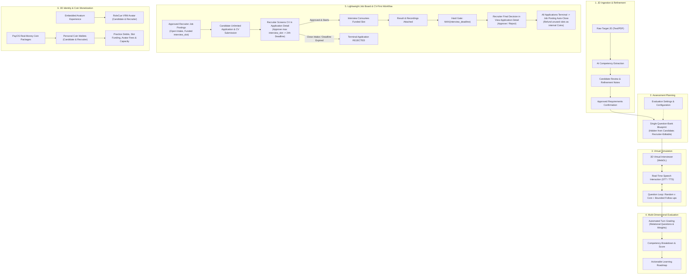

# Project Overview — RoleCue Platform

**RoleCue** is an AI-powered virtual technical interview simulation platform designed to bridge the gap between static self-study and high-stakes real-world technical interviews.

---

## 1. The Problem

Technical interview preparation is critical for career progression in software engineering, yet traditional preparation mechanisms suffer from severe structural shortcomings:

1. **Lack of Job Description (JD) Personalization:**
   Traditional platforms (e.g., LeetCode, generic question banks) present static, disconnected algorithmic puzzles. They fail to align with the specific tech stack, architecture patterns, domain constraints, and seniority expectations of a candidate's target job opening.
2. **Limited Availability of Expert Interviewers:**
   Scheduling realistic mock interviews with senior engineers or mentors is prohibitively expensive, difficult to coordinate, and rarely repeatable at scale.
3. **Absence of Real-Time Conversational Pressure:**
   Static multiple-choice quizzes and automated code grading do not prepare candidates for live technical dialogue. Candidates struggle to articulate trade-offs, explain system design rationale, and handle spontaneous interviewer Questions under time constraints.
4. **Superficial & Non-Actionable Feedback:**
   Existing tools provide binary pass/fail outcomes or generic scores. Candidates are left without insight into their root-cause conceptual gaps, technical depth, problem-solving methodology, or concrete study roadmaps.

---

## 2. Core Value Proposition

RoleCue solves these challenges by combining AI semantic parsing, generative conversational intelligence, real-time speech processing, and interactive 3D WebGL graphics into an end-to-end interview simulation experience:

* **Targeted Practice:** Practice against the exact Job Description a candidate is targeting.
* **Realistic Pressure:** Converse face-to-face with an animated 3D virtual interviewer using natural spoken voice.
* **Intelligent Questioning:** Experience an adaptive sequence of Questions determined from each answer and the internal interview context.
* **Objective Diagnostic Feedback:** Receive immediate, granular scoring across technical competencies (evaluated against an illustrative baseline set or recruiter-configured posting weights) accompanied by turn-by-turn critiques and personalized learning roadmaps.

---

## 3. Product Users & Personas

RoleCue is designed for four primary user groups:

| Actor | Profile | Primary Motivation |
| :--- | :--- | :--- |
| **Candidate** | Software engineers, students, career switchers | Prepare for specific technical job interviews, assess technical readiness, configure and conduct mock interviews (funded via personal coin wallet), create a personal 3D avatar through Avaturn and manage avatar inventory, manage personal coin wallet, discover matching job postings, and apply with CV. |
| **Recruiter** | Tech talent acquisition, hiring managers, company reps | Publish company Job Postings to attract qualified candidates, fund interview capacity (`interview_slot`) using personal coin wallet, screen incoming candidate CVs via Application Detail, manage application intake (Close Intake), review interview recordings and results in View Application Detail, render final Approve/Reject decisions, and manage avatar inventory. |
| **Guest** | Unauthenticated visitors, prospective users | View the public landing page and register for an account. |
| **Administrator** | Platform operators, technical governance | Maintain account security, approve/reject job postings, oversee interview sessions, calibrate TTS voice profiles, and audit payment transactions and revenue reports. Admin has no personal wallet or avatar inventory. |

> [!NOTE]
> System semantics also recognize **Registered User** (the shared authentication and profile base for Candidates and Recruiters) and **System Handler** (the internal automated handler responsible for terminating abandoned sessions, executing automatic Close Intake when meeting configured limitations, enforcing 24-hour interview deadlines, and auto-closing terminal Job Postings with unused slot refunds). Neither is an external actor. Registered User inheritance does **NOT** grant Admin a personal wallet or personal avatar inventory.

---

## 4. Major Product Capabilities

RoleCue organizes its capabilities into six core functional pillars:

1. **Job Description Extraction & Refinement:**
   Ingests raw text or multi-page PDF documents. Extracts normalized technical competencies (languages, frameworks, databases, tools, domain knowledge, seniority). Empowers the candidate to review extracted tags and provide natural-language refinement notes (e.g., *"Exclude C# from the interview"*). Human review and confirmation of extracted requirements must occur *before* question-bank Blueprint generation.
2. **Internal Question-Bank Blueprint Generation:**
   Generates a single comprehensive core-question bank Blueprint per JD following confirmed requirements. Specifies ONLY the persistent pool/list of core questions (persisted via `core_questions`). Does not contain grading rubrics, evaluation criteria, competency weights, depth benchmarks, or evaluation matrices. **Strictly hidden from the candidate.** For Job Postings, the owning Recruiter can view and edit core questions for their own posting. Evaluation configuration settings are maintained separately from the question bank.
3. **Real-Time 3D Virtual Interview Simulation:**
   Renders a 3D animated avatar in the browser via WebGL. The simulation selects a random set of $x$ core questions from the bank and may ask bounded follow-ups. Spoken interaction is delivered via TTS with synchronized blend-shape visemes, while STT transcribes responses. Practice interviews are debited from the Candidate's coin wallet upon start (reconnect/resume of the same session is not recharged). Recruitment interviews consume a prepaid Recruiter slot upon first start (reconnect/resume is free; Candidate is never charged). Follow-up decision logic and question wording generation remain decoupled without premature vendor lock-in.
4. **Automated Multi-Dimensional Evaluation:**
   Grades completed sessions across technical competencies against the session's assigned questions and configured weights (persisted via `interview_questions` and `metrics_percentage`, preserving historical context and evaluation criteria). Recruiters can adjust evaluation weights at the posting level. Generates comprehensive performance reports with radar charts and personalized improvement roadmaps. Evaluation scores provide evidence for human review, not automated hiring authority.
5. **Lightweight Job Posting & CV-First Application:**
   Recruiters publish Job Postings (company JDs) subject to Admin approval, lock the company 3D interviewer model and Voice Profile, and fund `interview_slot` capacity using coins. While intake is open, Candidates may submit an unlimited number of Applications with CV/resume (not capped by `interview_slot`). Submitted applications and CVs are immediately visible to the owning Recruiter in View Application Detail. The Recruiter screens CVs and may approve at most `interview_slot` Candidates to proceed to recruitment interviews (approval grants interview eligibility; deadline is `cv_approved_at + 24 hours`; no-show transitions to terminal rejection). Closing intake (manually or automatically via *Close Job Posting When Meet Configured Limitation*) halts new applications and automatically rejects remaining unscreened/not-approved applications, while already-approved Candidates remain interview-eligible. Starting the recruitment interview consumes one funded slot on the candidate's first successful start. Recruitment interviews capture audio/video recordings and transcripts for the owning Recruiter's review. Candidates view their evaluation score, but cannot view recruitment transcripts or recordings during recruitment. Recruiter final decisions are hard-gated until `MAX(interview_deadline)` across interview-eligible applications for that posting. After the gate, the Recruiter reviews candidate CV and interview results inside View Application Detail and renders the final Approve or Reject decision. When every application reaches a terminal result (`APPROVED` or `REJECTED`), the Job Posting automatically reaches terminal closed state, and all still-unused interview slots are refunded to the Recruiter's wallet as internal coins (`Refund unused JP Candidate Slot`). There is no manual End Recruitment command.
6. **Personal 3D Avatar Inventory & Coin Wallets:**
   Candidates and Recruiters maintain personal avatar inventories with storage slot capacity. RoleCue embeds the free Avaturn iframe experience (capture, validation, preview, customization, final GLB); RoleCue receives the GLB, converts it to VRM, and persists it. A generation fee is charged only upon successful VRM persistence in RoleCue. Coin wallets for Candidates and Recruiters manage internal coin movements and real-money package orders via PayOS under a unified transaction model.

---

## 5. Product Scope Boundaries

To maintain focus on interview simulation and delivery excellence, RoleCue establishes strict, long-lived boundaries:

### What RoleCue IS NOT:
* **NOT a Full Applicant Tracking System (ATS):**
  RoleCue provides a lightweight job board and application submission workflow, but recruitment scope strictly terminates at **Application Approve / Reject**. RoleCue does **NOT** support multi-stage hiring funnels, interview panel scheduling, offer letter generation, salary negotiations, background checks, or employee onboarding.
* **NOT an Autonomous Hiring Decision Engine:**
  RoleCue does not rank applicants for employers, eliminate candidates automatically, or make official employment decisions. It is an educational practice simulator and pre-application preparation platform.
* **NOT a Multi-Tenant SaaS:**
  RoleCue does not employ a complex multi-tenant architecture. There are no tenant schemas, no Row-Level Security (RLS) tenant isolation policies, and no organization workspace hierarchies. Recruiter accounts associate with company metadata via simple relational foreign keys.
* **NOT a 3D Asset Marketplace:**
  There is no community asset store, creator marketplace, or user-published 3D model sharing. Avatars and environments are curated platform presets or candidate-generated personal avatars.
* **NOT a Soft-Skills or Behavioral Grader:**
  JD extraction, blueprint generation, and interview scoring concentrate strictly on **technical competencies**. Personality analysis, micro-expression tracking, and non-technical behavioral scoring are intentionally excluded.
* **NOT a Company Headcount Management System:**
  RoleCue does not persist or enforce company hiring headcount or target hire counts. The `job_postings.interview_slot` field represents maximum recruitment interview capacity only.

---

## 6. Document Cross-References
* Actors & Use Cases: [[00_Project/Actors-and-Capabilities|Actors and Capabilities]]
* Core Workflows: [[00_Project/Core-Flows|Core Flows]]
* Terminology Standards: [[00_Project/Glossary|Glossary]]
* System Architecture: [[02_System/Context|System Context]] & [[02_System/Domain-Model|Domain Model]]
* Long-Lived Decisions: [[03_Decisions/Product-Decisions|Product Decisions]]
