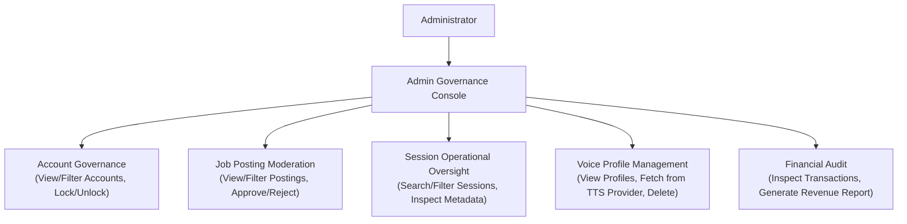

# Administration & Governance Domain

The **Administration & Governance Domain** provides the operational, supervisory, and configuration controls required to manage user accounts, review submitted job postings, inspect operational interview sessions, curate TTS voice profiles, and audit platform financial transactions.

---

## 1. Purpose

Empower platform administrators with centralized governance tools to enforce account security, maintain job posting quality, oversee operational interview sessions, curate voice synthesis options, and audit financial revenue records.

---

## 2. Core Concepts

* **Account Governance:**
  Administrative oversight of Candidate and Recruiter accounts. Supports account search and filtering, along with security locking and unlocking.
* **Job Posting Moderation:**
  Supervisory review of Job Postings submitted by Recruiters. Supports viewing, filtering, and approving or rejecting Job Postings; only approved postings become publicly available.
* **Interview Session Operational Oversight:**
  Supervisory access to interview session records. Enables searching, filtering, and inspecting operational session metadata and diagnostics.
  * **Privacy Invariant:** Operational oversight does **not** grant Administrators access to recruitment audio/video recordings or conversational transcripts.
* **Voice Profile Catalog Management:**
  Administrative management of Text-to-Speech (TTS) voice profiles made available during session configuration. Supports viewing voice profiles, fetching new voice profiles from TTS providers, and deleting obsolete voice profiles.
* **Financial Audit & Reporting:**
  Administrative oversight of platform revenue. Supports viewing and filtering unified financial transactions (`transactions` table, recording real-money PayOS orders and internal coin movements) and generating revenue reports.
* **Capabilities Excluded from Frozen Scope:**
  * *Global AI Behaviour Management:* Admin prompt engineering and conversational AI calibration templates are excluded from current scope.
  * *Global Evaluation Criteria Calibration:* Admin editing of global evaluation rubrics, criteria, and weights is excluded from current scope.
  * *Interview Feature Configuration / Runtime Toggles:* System-wide configuration of interview features and runtime toggles is excluded from current scope.
  * *Coin Package Pricing Administration:* Administrative editing of coin package pricing tiers is excluded from current scope.

---

## 3. Actors Involved

* **Administrator:** Privileged platform operator exercising governance authority across platform domains.
  * **Boundary Restriction:** Administrators do **NOT** have a personal coin wallet or personal avatar inventory. Registered User inheritance does not confer wallet or inventory ownership to an Admin.

---

## 4. Main Domain Flow

---

## 5. Business Rules & Invariants

1. **Admin Scope Boundaries (What Admin Manages vs. Does NOT Manage):**
   * **Admin DOES manage:** Provider-sourced Voice Profiles (viewing, fetching from provider APIs, deleting), account lock/unlock, job posting moderation, operational session metadata, and payment transaction audits.
   * **Admin does NOT manage:** 3D avatar meshes or 3D background presets (which are built-in platform presets).
   * **No Wallets or Avatar Inventories:** Administrators do not hold personal coin wallets or personal avatar inventories.
   * **No Recruitment Recording Access by Inference:** Session operational oversight does not grant Admin access to applicant recruitment audio/video recordings or transcripts, which are private to the owning Recruiter.
   * **No Dispute Queues:** The platform does not model refund dispute adjudication queues or cash refund forms. Unused slot refunds execute automatically as internal coin movements (`Refund unused JP Candidate Slot`) upon terminal Job Posting auto-close.
2. **Immediate Account Revocation & Notification:**
   * Locking a user account immediately invalidates active sessions and causes Go API middleware to deny subsequent authenticated actions.
   * **Lock/Unlock Notification:** Account lock/unlock operations should trigger transactional email notifications through the configured Email Provider.
   * **Decoupling Invariant:** Successful account state transitions in the database must **never** depend on successful email delivery; network timeouts or email dispatch errors do not roll back the lock/unlock state. (Implementation status: email dispatch on lock/unlock is pending verification in application code).
3. **Candidate Session Privacy:**
   Administrative session oversight is focused on operational diagnostics and session status. Unrestricted administrative browsing of candidate practice content is bounded by privacy invariants.
4. **Historical Evaluation Integrity:**
   Any future modifications to evaluation criteria or prompt templates apply solely to future sessions and must **never** retroactively alter or recalculate completed historical Performance Reports.
5. **Two-Party Auditability:**
   All administrative actions (locking accounts, approving/rejecting job postings, modifying voice profiles) are recorded in an immutable audit log.
6. **Job Posting Publication Gate:**
   Recruiter Job Postings remain unavailable to Candidates until an Administrator approves them. Admin rejection prevents public availability; Admin does not configure the Job Posting's company 3D interviewer model or Voice Profile.

---

## 6. Relationships to Other Domains

* **[[01_Domains/Auth/README|Auth Domain]]:**
  Executes account locking and unlocking operations.
* **[[01_Domains/Job-Posting-Application/README|Job-Posting-Application Domain]]:**
  Enables administrative review, filtering, and approval/rejection of submitted Job Postings.
* **[[01_Domains/Interview/README|Interview Domain]]:**
  Allows Administrators to search, filter, and inspect operational interview session metadata and diagnostics.
* **[[01_Domains/Avatar-Voice/README|Avatar-Voice Domain]]:**
  Maintains the active catalog of Voice Profiles sourced from TTS providers.
* **[[01_Domains/Payment/README|Payment Domain]]:**
  Provides unified transaction (`transactions`) inspection and revenue report generation.

---

## 7. External Integrations

* **TTS Providers:** Fetches available voice profiles from provider APIs and manages active voice options.
* **Email Provider:** Dispatches administrative notices (e.g., account lock/unlock notifications).
