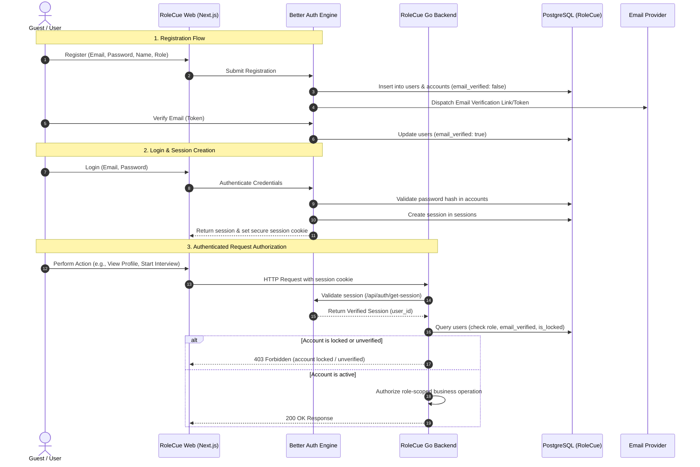

# Authentication & Identity Domain

The **Authentication & Identity Domain** manages user onboarding, credential verification, authenticated session management, role-based authorization, and account security.

---

## 1. Purpose

Provide secure, reliable identity verification and authorization for all users. Ensures that Candidates, Recruiters, and Administrators are authenticated securely and that domain resources are strictly isolated according to ownership and role boundaries.

---

## 2. Core Concepts

* **User (`users`):** The foundational identity record containing `id`, `name`, `email`, `email_verified`, `role` (`candidate`, `recruiter`, `admin`), `is_locked`, `lock_reason`, `lock_expires_at`, `two_factor_enabled`, `company_name`, `company_website`, and `onboarding_status`.
* **Better Auth Accounts (`accounts`):** Stores provider credentials, OAuth tokens, and salted password hashes linked to `users.id`.
* **Better Auth Single-Session Model (`sessions`):**
  * Manages active authenticated sessions via secure HTTP cookies (`.session_token`).
  * Stores `token`, `expires_at`, `ip_address`, `user_agent`, and `user_id`.
  * **Canonical Architecture:** RoleCue uses a Better Auth single-session cookie architecture. There is **no legacy JWT access/refresh token pair** or custom Go refresh-token rotation layer.
* **Verifications & 2FA (`verifications`, `two_factors`):**
  * `verifications`: Stores verification identifiers, values, and expiration for email verification.
  * `two_factors`: Stores TOTP secrets, backup codes, verification status, and lockouts for two-factor authentication.
* **System Roles:**
  * `candidate`: Job seekers who practice mock interviews and submit applications to job postings.
  * `recruiter`: Hiring representatives who publish job postings and review applications.
  * `admin`: Privileged platform operators who moderate job postings, oversee sessions, manage voice profiles, and audit accounts/finances.
* **Account Status & Locking:**
  * Normal accounts operate with `is_locked = false` and `email_verified = true`.
  * When `is_locked = true`, all protected actions and session authentications are immediately rejected.

---

## 3. Actors Involved

* **Guest:** Explores public landing page and initiates registration as a Candidate or Recruiter.
* **Registered User (Candidate / Recruiter / Admin):** Manages shared account capabilities:
  * View Profile
  * Edit Own Profile
  * Log in
  * Log out
  * Forgot Password (including password-reset behavior)
  * Change Password
  * Enable 2-Factor Authentication
* **Administrator:** Views and filters user accounts; locks/unlocks accounts for security governance.

---

## 4. Main Domain Flow

---

## 5. Business Rules & Invariants

1. **Password Security:** Passwords must be cryptographically hashed using standard salted hashing algorithms within Better Auth. Plaintext passwords are never logged or stored.
2. **Session Verification via Go Middleware:**
   * Go API route handlers validate session authenticity against Better Auth and verify current `users` record state (`is_locked`, `email_verified`, `role`) on every authenticated request.
   * There are no stateless JWT claims or custom refresh-token exchange endpoints.
3. **Immediate Lock Enforcement:**
   * When an Administrator marks an account as locked (`is_locked = true`), Go API middleware immediately denies all subsequent requests, returning `403 Forbidden`.
   * **Lock/Unlock Email Notification:** Locking or unlocking an account produces a transactional email notification through the configured Email Provider.
   * **Delivery Decoupling:** Successful database status transitions must **never** depend on successful email delivery; email failures do not roll back the lock/unlock state transition.
   * *(Implementation Note: Application code dispatch of lock/unlock emails is pending verification; Brain specifies the business requirement).*
4. **Email Uniqueness:** Email addresses are normalized to lowercase and must be strictly unique across all accounts in `users`.
5. **No Anonymous Privilege Escalation:** Guests have zero access to authenticated candidate, recruiter, or admin operations.
6. **Role Isolation & Ownership Boundaries:** A Candidate cannot access Recruiter management endpoints; a Recruiter cannot access Candidate practice resources without an authorized Candidate account. Candidates and Recruiters hold personal coin wallets and avatar inventories; Administrators have neither. Recruitment recordings and transcripts are private to the owning Recruiter; Candidates cannot access recruitment transcripts during recruitment, and Administrators do not have access by inference.
7. **Password Recovery:** `Forgot Password` is the single password-recovery capability. It includes issuing and validating a recovery link or token and setting a replacement password; `Reset Password` is not a separate formal capability. `Change Password` remains the authenticated-user capability for replacing a known password.

---

## 6. Relationships to Other Domains

* **All Domains:** Provides the authoritative `user_id` foreign key (`users.id`) referenced across:
  * [[01_Domains/Job-Description/README|Job-Description]] (`role_profiles.candidate_id`)
  * [[01_Domains/Job-Posting-Application/README|Job-Posting-Application]] (`job_postings.recruiter_id`, `applications.candidate_id`)
  * [[01_Domains/Avatar-Voice/README|Avatar-Voice]] (`inventories.user_id`)
  * [[01_Domains/Payment/README|Payment]] (`wallets.user_id`)
* **[[01_Domains/Administration/README|Administration]]:** Admin user governance operates directly on `users` accounts (viewing, filtering, locking/unlocking).

---

## 7. External Integrations

* **Better Auth:** Authentication framework managing credentials, accounts, password hashing, and cookie-based sessions.
* **Email Provider:** Dispatches account verification emails, password recovery links, and security/account notices.

