# Avatar & Voice Domain

The **Avatar & Voice Domain** governs the visual rendering, blend-shape lip-sync articulation, personalized 3D avatar generation and inventory management, and synthesized speech profiles for virtual technical interview simulations.

---

## 1. Purpose

Provide a lifelike, engaging human presence during virtual technical interviews. Eliminates the impersonality of text bots by delivering real-time 3D facial expressions, accurate speech-synchronized lip movement, customizable voice personas, and personal 3D avatar inventories for Candidates and Recruiters.

---

## 2. Core Concepts

* **3D Virtual Interviewer:**
  A rigged humanoid 3D mesh rendered client-side using WebGL. Supports real-time head movements, idle animations, eye blinks, and facial blend-shape morph targets.
* **Blend-Shape Visemes:**
  Standardized mouth blend-shapes corresponding to phonemic sounds. Morph target weights are interpolated in real time based on timestamped viseme frames delivered with TTS audio.
* **Personal 3D Avatar (`personal_avatars`):**
  An accepted capability delivered through RoleCue's embedded free Avaturn iframe experience. Avaturn handles capture instructions, photo validation, retakes, preview generation, customization, and final GLB generation. RoleCue receives the GLB, converts it to VRM, persists the VRM production asset, and associates it with the owning user.
* **Both-Role Avatar Inventory Ownership:**
  Both **Candidates** and **Recruiters** maintain a personal avatar inventory in their profile library. **Administrators do NOT have a personal avatar inventory.**
* **Avatar Storage Capacity vs. Generation Fee:**
  * **Storage Capacity (Avatar Slots):** Avatar slots represent storage capacity in a user's library, **not** generation credits. When inventory capacity is full, the user must either remove an existing avatar or purchase an additional capacity slot using coins from their wallet.
  * **Generation Fee:** A separate fee debited in coins from the user's personal wallet **strictly upon successful VRM persistence in RoleCue**.
* **Charging Boundary at Successful VRM Save:**
  Opening the avatar creator, uploading photos, generating a preview or GLB in Avaturn, and initiating GLB-to-VRM conversion do **not** incur a generation fee. The fee is charged only after RoleCue successfully validates, converts, and persists the production VRM asset.
* **Voice Profile (`voice_profiles`):**
  A synthesized vocal persona sourced from third-party Text-to-Speech (TTS) providers. Encapsulates external voice IDs, language, accent, gender, and speaking rate parameters. Curated and managed exclusively by Administrators.
* **3D Environment Presets:**
  Curated virtual 3D room backgrounds rendered behind the virtual interviewer. Built-in platform presets.
* **2D Waveform Fallback Mode:**
  A performance-resilient fallback interface displaying a responsive audio waveform instead of the 3D WebGL canvas when client hardware lacks GPU acceleration or WebGL support.

---

## 3. Actors Involved

* **Candidate:**
  * Accesses the Personal 3D Avatar Studio in RoleCue; completes capture and customization inside the embedded Avaturn experience.
  * Maintains personal avatar inventory; purchases additional capacity slots using coins when full.
  * Pays avatar generation fee in coins upon successful VRM save.
  * Selects an eligible personal VRM avatar for Target JD practice interviews.
* **Recruiter:**
  * Accesses the Personal 3D Avatar Studio to create, customize, and manage personal avatars in their own avatar inventory.
  * Pays generation fees and purchases capacity slots using coins from their personal wallet.
  * Selects company 3D interviewer models for Job Postings.
* **Administrator:**
  * Curates and manages **Voice Profiles** sourced from external TTS providers (viewing voice profiles, fetching new voice profiles from TTS providers, deleting voice profiles).
  * *Important Invariant:* The Admin does **NOT** manage 3D avatar meshes or 3D background presets (which are built-in presets). Admin has **no** personal avatar inventory.

---

## 4. Main Domain Flow

```mermaid
flowchart TD
    subgraph PersonalAvatar["Personal 3D Avatar Generation & Inventory Flow"]
        P1["User (Candidate or Recruiter) opens Avatar Studio"] --> P2{"Inventory Capacity Check<br/>(Slots = Storage Capacity)"}
        P2 -->|At Capacity| P3["Free storage by removing avatar<br/>OR purchase capacity slot with Coins"]
        P3 --> P2
        P2 -->|Available Capacity| P4["Embedded free Avaturn iframe"]
        P4 --> P5["Avaturn capture instructions and 3 required photos"]
        P5 --> P6["Avaturn validation / retake, preview, and customization"]
        P6 --> P7["Avaturn final GLB generation"]
        P7 --> P8["RoleCue receives GLB and converts to VRM"]
        P8 --> P9["RoleCue persists VRM asset in User Avatar Inventory"]
        P9 --> P10["Debit Avatar Generation Fee in Coins<br/>(Charged strictly on successful VRM persistence)"]
        P10 --> P11["Avatar available in personal library"]
    end

    subgraph RuntimeSync["Runtime Spoken Lip-Sync Flow"]
        R1["Interviewer Spoken Response Text"] --> R2["TTS Provider Synthesis"]
        R2 --> R3["Audio Stream + Viseme Timestamp Data"]
        R3 --> R4["Audio Playback"]
        R3 --> R5["3D Morph Target Viseme Articulation"]
        R4 <--> R5
    end

    subgraph AdminVoice["Admin Voice Profile Governance"]
        V1["Fetch Available Voice Profiles from TTS Provider"] --> V2["Manage / Curate Voice Profiles"]
        V2 --> V3["Available for Session & Posting Configuration"]
    end
```

---

## 5. Business Rules & Invariants

1. **Both-Role Avatar Inventory Ownership:**
   Both Candidates and Recruiters possess personal avatar inventories. Administrators do **not** have an avatar inventory.
2. **Avatar Slots Represent Storage Capacity:**
   Avatar slots represent storage capacity in a user's library, not generation credits. At capacity, the user must remove an existing model or purchase an additional capacity slot using coins.
3. **Successful VRM Persistence Charging Boundary:**
   The avatar generation fee is debited in coins from the user's wallet **only after successful VRM persistence in RoleCue**. No fee is charged for opening the creator, uploading photos, generating an Avaturn GLB, or starting conversion.
4. **Embedded Avaturn Free Iframe Boundary:**
   RoleCue embeds the free Avaturn iframe directly. Avaturn owns capture instructions, photo collection, validation and retakes, preview generation, customization, and final GLB generation. RoleCue does not orchestrate these steps through Avaturn Pro APIs or backend reconstruction calls.
5. **VRM is the Production Artifact:**
   RoleCue receives Avaturn's final GLB as an intermediate payload, converts it to standardized VRM, persists the VRM asset, and associates it with the owning user (`user_id`).
6. **No 3D Marketplace:**
   RoleCue does **NOT** provide a 3D asset marketplace, community model trading, or creator monetization. Avatars are restricted to system presets and user-owned personal avatars.
7. **Admin Governance Boundary:**
   * **Admin DOES manage:** Voice Profiles sourced from TTS providers (viewing, fetching, deleting).
   * **Admin does NOT manage:** 3D avatar meshes or 3D background presets.
8. **Speech and Facial Synchronization:**
   TTS audio playback and 3D facial morph animation articulate in tight visual synchronization via phoneme/viseme timing metadata.
9. **Graceful 2D Degradation:**
   If a client browser reports WebGL context loss or insufficient GPU acceleration, the simulation seamlessly switches to 2D Waveform mode without interrupting spoken dialogue.

---

## 6. Relationships to Other Domains

* **[[01_Domains/Interview/README|Interview Domain]]:**
  Supplies visual interviewer meshes and Voice Profiles for live simulation. Candidates may select an eligible personal avatar for Target JD practice; Job Posting interviews use the Recruiter's locked company configuration.
* **[[01_Domains/Payment/README|Payment Domain]]:**
  Debits the avatar generation fee upon successful VRM persistence; debits coins when purchasing additional avatar storage capacity slots.
* **[[01_Domains/Auth/README|Auth Domain]]:**
  Personal avatars are associated with the authenticated user (`user_id`) for Candidates and Recruiters. Admin accounts do not possess personal avatars.
* **[[01_Domains/Administration/README|Administration Domain]]:**
  Administrators manage the active catalog of Voice Profiles sourced from external TTS providers.

---

## 7. External Integrations

* **TTS Provider:** Synthesizes spoken voice audio and produces phoneme/viseme timing metadata for facial blend-shape animation.
* **Avaturn:** Provides the embedded free iframe experience for capture, validation, preview, customization, and final GLB generation. RoleCue receives the final GLB and performs GLB-to-VRM conversion and VRM persistence.
