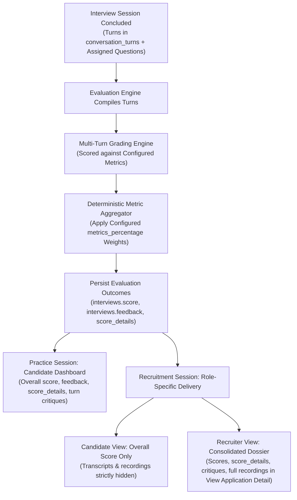

# Post-Interview Evaluation & Reporting Domain

The **Post-Interview Evaluation & Reporting Domain** transforms raw interview transcripts into structured technical assessments, actionable diagnostic feedback, and role-appropriate performance reports.

---

## 1. Purpose

Provide objective, diagnostic technical feedback. Identifies specific conceptual blind spots, assesses depth of understanding against target job requirements, and provides clear study recommendations for practice sessions while delivering structured performance evidence for recruiter evaluation.

---

## 2. Core Concepts

* **Technical Competency Dimensions (`metrics`):**
  The platform metrics used to evaluate technical interview performance:
  * Each dimension is defined in the `metrics` table (`id`, `name`).
  * A baseline illustrative set includes *Technical Accuracy*, *Depth of Understanding*, *Problem-Solving & Approach*, *Answer Relevance*, and *Communication Clarity*.
  * **Specification Status Invariant:** The existing baseline dimensions serve as an illustrative set and are configurable. Recruiter posting-level evaluation criteria and weights are configurable. Exact criteria, defaults, formulas, and validation constraints remain unresolved product decisions.
* **Posting-Level Metric Weights (`metrics_percentage`):**
  Evaluation weights are configured at the Job Posting level through `metrics_percentage (job_posting_id, metric_id, percentage)`, **separate from the core question bank (`core_questions`)**. Recruiters adjust competency percentages to match their hiring requirements.
* **Evaluation Results Persistence (`interviews`, `score_details`, `conversation_turns`):**
  Evaluation outcomes are persisted directly in the relational schema upon session conclusion:
  * **Overall Assessment:** Stored in `interviews.score` (numerical score) and `interviews.feedback` (narrative evaluation).
  * **Competency Breakdown:** Persisted in `score_details` (`interview_id`, `metric_id`, `score`).
  * **Turn-by-Turn Critiques:** Persisted in `conversation_turns.feedback` for each answered question turn.
* **Role-Specific Result Disclosure:**
  * **Practice Interviews:** The Candidate has full access to their evaluation scores, competency breakdowns (`score_details`), turn critiques (`conversation_turns.feedback`), and overall feedback (`interviews.feedback`).
  * **Recruitment Interviews:**
    * The **Candidate** can view their overall recruitment score, but **cannot** view recruitment transcripts or audio/video recordings during recruitment. These assets must not be exposed indirectly through history, result APIs, exports, or asset URLs.
    * The **Recruiter** owning the Job Posting receives full access to the applicant's profile, CV, evaluation score, competency breakdown (`score_details`), turn critiques, and recruitment audio/video recordings and transcripts consolidated directly within **View Application Detail**.
* **Historical Context Preservation:**
  The evaluation criteria and weights active for an interview remain anchored to the posting's `metrics_percentage` and the immutable turn feedback and `score_details` records generated at completion.
* **Human Review Evidence (No Automated Hiring Authority):**
  Evaluation scores and reports serve as structured evidence to assist human judgment. Evaluation thresholds and scores carry **no automated hiring or rejection authority**.

---

## 3. Actors Involved

* **Candidate:** Views personal practice interview history, evaluation scores, competency breakdowns, turn critiques, and feedback; views overall recruitment evaluation score (transcripts and recordings remain hidden).
* **Recruiter:** Adjusts posting-level evaluation weights (`metrics_percentage`) for own Job Postings; inspects candidate profile, CV, interview scores, competency breakdowns (`score_details`), turn critiques, and recruitment audio/video recordings and transcripts consolidated directly inside **View Application Detail**.
* **Administrator:** Inspects session operational records. (Global calibration of AI prompts, evaluation criteria/rubrics, and Interview Feature Configuration / runtime toggles are excluded from the frozen scope).

---

## 4. Main Domain Flow

---

## 5. Business Rules & Invariants

1. **Strict Configuration Adherence:**
   Evaluations must grade against the evaluation metrics and weights configured for that posting (`metrics_percentage`). The grading engine cannot introduce arbitrary criteria outside configured metrics.
2. **Posting Settings Separated from Question Bank:**
   Evaluation weights (`metrics_percentage`) are managed separately from the core question bank (`core_questions`). Recruiters configure evaluation weights at the posting level without mutating the question bank.
3. **Historical Evaluation Immutability:**
   Once generated and persisted, evaluation scores (`interviews.score`, `score_details`) and feedback are **immutable**. Historical scores and critiques can never be altered or recalculated if source configurations change.
4. **Role-Specific Disclosure Boundaries:**
   * In recruitment, the Candidate can view only their overall evaluation score; recruitment transcripts and audio/video recordings are hidden from the Candidate during recruitment and must not be exposed via exports, history APIs, or asset URLs.
   * No Candidate recruitment recording replay feature exists.
   * The owning Recruiter has exclusive review access to recruitment transcripts and recordings within `View Application Detail`.
5. **Formative & Diagnostic Purpose (No Auto-Hiring):**
   RoleCue evaluations provide educational and diagnostic evidence. Evaluation scores carry **no autonomous hiring or disqualification authority**.
6. **Unique Metric Evaluation per Session:**
   Every evaluated Interview Session produces at most one score entry per evaluated metric, enforced by:
   $$\text{UNIQUE}(interview\_id, metric\_id)\text{ on score_details}$$

---

## 6. Relationships to Other Domains

* **[[01_Domains/Interview/README|Interview Domain]]:**
  Consumes completed interview turns (`conversation_turns`) and records evaluation results on `interviews` (`score`, `feedback`) and `score_details`.
* **[[01_Domains/Job-Posting-Application/README|Job-Posting-Application Domain]]:**
  For recruitment interviews, links evaluations to the Application via `interviews.application_id`. Enforces role-specific visibility rules between Candidates and Recruiters (consolidated in `View Application Detail`).
* **[[01_Domains/Job-Description/README|Job-Description Domain]]:**
  Uses the technical competencies confirmed in the JD to ground technical accuracy and relevance scoring.
* **[[01_Domains/Administration/README|Administration Domain]]:**
  Administrators oversee operational session records. (Global evaluation criteria editing is excluded from the frozen scope).

---

## 7. External Integrations

* **LLM Provider:** Analyzes dialogue turns, performs criterion-based grading against the session's evaluation configuration, identifies technical misconceptions, and generates learning roadmaps.
