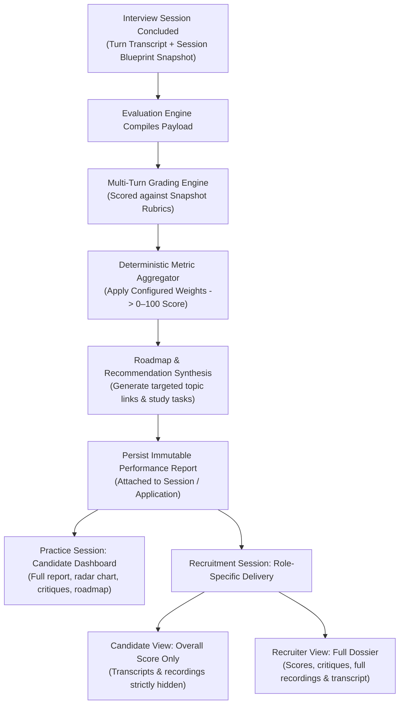

# Post-Interview Evaluation & Reporting Domain

The **Post-Interview Evaluation & Reporting Domain** transforms raw interview transcripts into structured technical assessments, actionable diagnostic feedback, and role-appropriate performance reports.

---

## 1. Purpose

Provide objective, diagnostic technical feedback. Identifies specific conceptual blind spots, assesses depth of understanding against target job requirements, and provides clear study recommendations for practice sessions while delivering structured performance evidence for recruiter evaluation.

---

## 2. Core Concepts

* **Technical Competency Dimensions (Illustrative Baseline):**
  The evaluation dimensions used to evaluate technical interview performance. Core technical dimensions include:
  1. *Technical Accuracy:* Correctness of technical concepts, code syntax, architectural patterns, and algorithmic complexity.
  2. *Depth of Understanding:* Ability to explain underlying system mechanisms, trade-offs, and boundary edge cases.
  3. *Problem-Solving & Approach:* Structured reasoning, decomposing requirements, and systematic problem formulation.
  4. *Answer Relevance:* Direct alignment with the asked question without drifting or evasiveness.
  5. *Communication Clarity:* Technical articulation precision, structure, and professional clarity.
  * **Specification Status Invariant:** Existing dimension descriptions remain illustrative; they must **not** be presented as a newly finalized formula. Exact criteria, defaults, validation constraints, and score thresholds need formal specification. Illustrative ratios (e.g., hard skill 40% / soft skill 30%) are **not** an approved global formula.
* **Recruiter Posting-Level Evaluation Settings:**
  Evaluation weights and settings are configured at the Job Posting level, **separate from the question bank Blueprint**. The platform provides basic baseline settings, and the Recruiter adjusts evaluation weights to fit their specific posting and hiring criteria.
* **Performance Report (`performance_reports`):**
  The authoritative evaluation record generated upon session completion. Contains:
  * Overall numerical score (0–100 scale).
  * Competency score breakdown across evaluated dimensions.
  * Turn-by-turn critiques comparing candidate responses against model answers.
  * Identified knowledge gaps, misconceptions, and prioritized study roadmaps.
* **Role-Specific Result Disclosure:**
  * **Practice Interviews:** The Candidate has full access to their performance report, radar chart, turn-by-turn critiques, model answers, and study roadmaps.
  * **Recruitment Interviews:**
    * The **Candidate** can view their overall recruitment score, but **cannot** view recruitment transcripts or audio/video recordings during recruitment. These assets must not be exposed indirectly through history, result APIs, exports, or asset URLs.
    * The **Recruiter** owning the Job Posting receives full access to the applicant's profile, CV, evaluation breakdown, turn critiques, and recruitment audio/video recordings and transcripts.
* **Historical Context Preservation:**
  The evaluation configuration and weights active at session runtime are captured within the session's immutable snapshot (`blueprint_snapshot` / execution context). Later modifications to posting evaluation weights or system prompt templates must **never** retroactively alter or recalculate completed historical Performance Reports.
* **Human Review Evidence (No Automated Hiring Authority):**
  Evaluation scores and reports serve as structured evidence to assist human judgment. Evaluation thresholds and scores carry **no automated hiring or rejection authority**.

---

## 3. Actors Involved

* **Candidate:** Views personal practice interview history, performance reports, competency breakdowns, radar visualizations, turn critiques, and actionable study roadmaps; exports practice reports; views overall recruitment evaluation score (transcripts and recordings remain hidden).
* **Recruiter:** Adjusts posting-level evaluation weights for own Job Postings; reviews the Interview Result, competency breakdowns, turn critiques, and recruitment audio/video recordings and transcripts attached to applicant Applications.
* **Administrator:** Inspects session operational records. (Global calibration of AI prompts, evaluation criteria, and rubric templates remains an open scope decision awaiting formal confirmation).

---

## 4. Main Domain Flow

---

## 5. Business Rules & Invariants

1. **Strict Blueprint & Configuration Adherence:**
   Evaluations must strictly grade against the rubrics and evaluation weights recorded in the session's immutable snapshot. The grading engine cannot introduce arbitrary criteria outside the snapshot.
2. **Posting Settings Separated from Question Bank:**
   Evaluation weights and scoring criteria are managed separately from the core-question bank Blueprint. Recruiters configure evaluation weights at the posting level without mutating the question bank.
3. **Historical Evaluation Immutability:**
   Once generated and persisted, a Performance Report is **immutable**. Historical scores, critiques, and radar values can never be altered or recalculated if source configurations change.
4. **Role-Specific Disclosure Boundaries:**
   * In recruitment, the Candidate can view only their overall evaluation score; recruitment transcripts and audio/video recordings are hidden from the Candidate during recruitment and must not be exposed via exports, history APIs, or asset URLs.
   * No Candidate recruitment recording replay feature exists.
   * The owning Recruiter has exclusive review access to recruitment transcripts and recordings.
5. **Formative & Diagnostic Purpose (No Auto-Hiring):**
   RoleCue evaluations provide educational and diagnostic evidence. Evaluation scores carry **no autonomous hiring or disqualification authority**.
6. **Single Performance Report per Session (1:1):**
   Every completed Interview Session produces at most one Performance Report:
   $$\text{Interview Session (1)} \longleftrightarrow \text{Performance Report (0..1)}$$

---

## 6. Relationships to Other Domains

* **[[01_Domains/Interview/README|Interview Domain]]:**
  Consumes completed interview turns, session execution context, and `blueprint_snapshot` from interview sessions.
* **[[01_Domains/Job-Posting-Application/README|Job-Posting-Application Domain]]:**
  Attaches the Performance Report (Interview Result) and recruitment recordings to the completed Application. Enforces role-specific visibility rules between Candidates and Recruiters.
* **[[01_Domains/Job-Description/README|Job-Description Domain]]:**
  Uses the technical competencies confirmed in the JD to ground technical accuracy and relevance scoring.
* **[[01_Domains/Administration/README|Administration Domain]]:**
  Administrators oversee operational session records. (Global evaluation criteria editing flagged as awaiting confirmation).

---

## 7. External Integrations

* **LLM Provider:** Analyzes dialogue turns, performs rubric-based grading, identifies technical misconceptions, and generates learning roadmaps.
