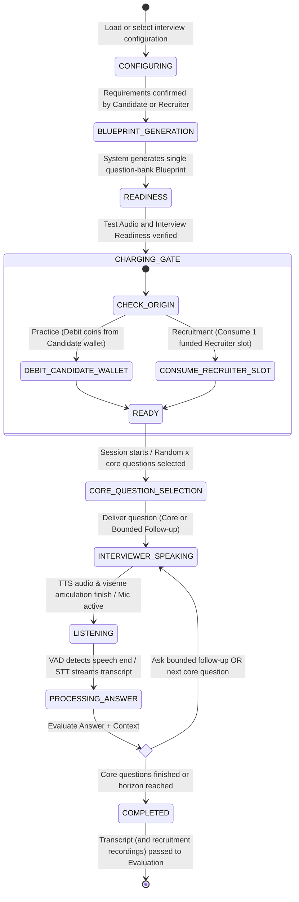

# Real-Time Interview Simulation Domain

The **Real-Time Interview Simulation Domain** coordinates the live technical interview interaction between the Candidate, the 3D virtual interviewer, speech services, and the adaptive question execution loop.

---

## 1. Purpose

Orchestrate a lifelike, conversational technical interview simulation. Executes assessment plans defined by internal question-bank blueprints, samples a random set of core questions with bounded follow-ups, synchronizes spoken audio with 3D avatar facial animations, and captures rich conversation turns and recruitment recordings for evaluation.

---

## 2. Core Concepts

* **Interview Configuration (Composite Capability):**
  A single setup capability whose visual and vocal selection depends on the interview origin:
  * **Target JD for Practice:** The Candidate chooses an available system 3D interviewer or eligible model from their personal avatar inventory, an available Voice Profile, a 3D environment, difficulty, and duration.
  * **Recruiter Job Posting:** The Recruiter selects the company 3D interviewer model and Voice Profile before Job Posting approval. The Candidate must use those locked settings and cannot override them.
* **Interview Blueprint (Core-Question Bank):**
  A conceptual and product term for the persistent **core-question bank** generated after human confirmation of extracted skills, requirements, and seniority context:
  * Persistent storage utilizes `core_questions`; there is **no separate Blueprint table** in the database.
  * Exactly **one current question bank** exists per JD (absent until generated).
  * Contains ONLY the persistent pool/list of core questions. Does NOT contain grading rubrics, evaluation criteria, competency weights, depth benchmarks, or evaluation matrices.
  * **Role Access Invariant:** Strictly **hidden from Candidates** (Candidates never view, edit, or confirm question banks). Recruiters **can** view and edit core questions within the question bank generated for their own Job Postings.
  * *Separation:* Evaluation weights and scoring settings are configured separately and are not embedded into the question bank.
* **Interview Session (`interviews`):**
  A concrete execution attempt of an interview executing from the core-question bank:
  * **Practice Session:** Debited in coins from the Candidate's personal wallet upon session start; reconnecting to or resuming the same active session is free.
  * **Recruitment Session:** Requires the Candidate to have submitted an application with a CV and received CV approval from the Recruiter. Consumes one prepaid interview slot strictly upon the Candidate's **first successful interview start**; reconnecting to or resuming that session consumes no additional slot. The Candidate is never charged.
  * **24-Hour Interview Deadline:** Approved Candidates must complete the interview before `interview_deadline = cv_approved_at + 24 hours`; failure to complete by deadline results in automatic terminal `REJECTED`.
* **Recruitment Audio/Video Recordings:**
  Recruitment interviews capture audio/video recordings and conversational transcripts.
  * Retained exclusively for review by the Recruiter owning the Job Posting inside View Application Detail.
  * Candidates view their overall recruitment evaluation score, but **cannot** view recruitment transcripts or audio/video recordings during recruitment.
  * Practice interviews do not record video; they use microphone/STT for spoken dialogue.
* **Session Execution Snapshot / Context (`blueprint_snapshot`):**
  An immutable copy of the exact question-bank/question selection context AND the evaluation configuration actually used, captured at the moment an Interview Session is initialized. Guarantees that historical turn grading, replay, and scoring remain 100% reproducible even if source questions or evaluation weights change later (without modeling evaluation criteria as part of the current question bank).
* **Conversational Turns (`conversation_turns`):**
  Sequentially indexed dialogue units capturing interviewer question text, TTS audio playback, candidate transcript, and real-time response data.
* **Adaptive Question Loop:**
  During simulation, the runtime samples a random set of $x$ core questions from the bank and may ask bounded follow-ups based on the candidate's answers and interview context.
  * Deciding whether to follow up and generating follow-up question wording are distinct responsibilities.
  * Exact sampling size $x$, selection/coverage policy, follow-up limits, and termination mechanisms remain open product decisions.
  * No specific external decision vendor (such as Jev/TypeSafe) has been selected; Jev is tentative and not approved.

---

## 3. Actors Involved

* **Candidate:** Configures Target JD interview parameters, completes Test Audio and Interview Readiness, joins, pauses, resumes, and concludes practice and recruitment interviews. For a Job Posting interview, uses the locked company presentation configured by the Recruiter.
* **Recruiter:** Views and edits core questions in the question bank for own Job Postings; configures posting-level evaluation weights; funds interview slots; reviews applicant results, transcripts, and audio/video recordings.
* **System Handler (Internal Handler):** Detects and terminates abandoned or orphaned interview sessions after extended inactivity.
* **Administrator:** Searches and filters interview sessions and views operational session metadata and diagnostics. (Global AI prompts, global evaluation criteria, and Interview Feature Configuration / runtime toggles remain awaiting confirmation).

---

## 4. Main Domain Flow

### Turn Orchestration Loop:
1. **Core Question Sampling:** At session start, the runtime samples a random set of $x$ core questions from the Blueprint's question bank.
2. **Question Delivery:** TTS synthesizes the interviewer's speech with synchronized facial blend-shape visemes.
3. **Candidate Answer:** The Candidate answers by voice. Voice Activity Detection (VAD) monitors speech boundaries and audio streams to STT.
4. **Adaptive Follow-Up Analysis:** The runtime analyzes the Answer against the Interview Context to determine whether to trigger a bounded follow-up or proceed to the next core question. Deciding whether to follow up and generating follow-up wording are decoupled responsibilities without premature vendor lock-in.
5. **Loop or Evaluation:** When all core questions and bounded follow-ups are completed, the session finalizes and hands the turn transcript (and recruitment recordings, if applicable) to the Evaluation Domain.

---

## 5. Business Rules & Invariants

1. **Blueprint Access Invariant:**
   Candidates must **never** be shown the Interview Blueprint or question banks. Candidates interact exclusively through the natural conversational interface. Recruiters **can** view and edit core questions within the question bank generated for their own Job Postings.
2. **Requirement Confirmation Precedes Blueprint Generation:**
   Extracted requirements must be reviewed and explicitly confirmed before the question-bank Blueprint is generated.
3. **Single Current Blueprint per JD:**
   Each Target JD or Job Posting has at most **one current Blueprint** containing its question bank (absent until generated). Changing difficulty or configuration does not spawn multiple current banks.
4. **Start Charging Boundary vs. Resume:**
   * A practice interview is debited in coins from the Candidate's personal wallet **upon session start**, not when it finishes.
   * A recruitment interview consumes one prepaid interview slot funded by the Recruiter strictly upon the Candidate's **first successful start**. The Candidate is **never** charged.
   * If a session disconnects or is paused, reconnecting to or resuming the same active session incurs **no second charge** and consumes no additional slot.
5. **Recruitment Interview Eligibility & 24-Hour Deadline:**
   * To launch a recruitment interview, a Candidate must have submitted an application with a CV, and the Recruiter must have approved the CV via View Application Detail. Approval grants interview eligibility, but does not consume a slot yet.
   * The interview must be completed before `interview_deadline = cv_approved_at + 24 hours`. Missing the deadline automatically transitions the Application to terminal `REJECTED`.
   * The session strictly runs using the Job Posting's locked company 3D interviewer model and Voice Profile.
6. **Recruitment Recording & Visibility Boundary:**
   Recruitment interviews capture audio/video recordings and conversational transcripts for review by the owning Recruiter. Candidates can view their overall recruitment evaluation score, but **cannot** view recruitment transcripts or audio/video recordings during recruitment. Practice interviews do not record video.
7. **Immutable Session Execution Snapshot:**
   Every session stores an immutable snapshot of the exact question-bank context and evaluation configuration upon creation. Historical evaluations remain reproducible even if the parent question bank or evaluation weights are subsequently modified (without modeling evaluation criteria as part of the current Blueprint).
8. **Question Selection & Bounded Follow-Up Policy:**
   Simulation selects a random set of $x$ core questions from the bank and may ask bounded follow-ups. The exact sample size $x$, selection/coverage policy, follow-up limits, and termination details remain unconfirmed product decisions. No specific decision vendor (such as Jev/TypeSafe) is selected; Jev is tentative and unapproved.
9. **Graceful 2D Degradation:**
   If a client device lacks WebGL acceleration, the system provides seamless fallback to an animated 2D audio waveform display without interrupting voice dialogue.
10. **Abandoned Session Cleanup:**
    If a session is disconnected and remains abandoned, the **System Handler** automatically marks the session terminated and releases system resources.

---

## 6. Relationships to Other Domains

* **[[01_Domains/Job-Description/README|Job-Description Domain]]:**
  Provides confirmed requirements and refinement notes that feed question-bank Blueprint generation.
* **[[01_Domains/Job-Posting-Application/README|Job-Posting-Application Domain]]:**
  Verifies that applicants have passed CV screening and that the posting has a funded interview slot before initiating recruitment interviews. Attaches results and recordings to the Application.
* **[[01_Domains/Avatar-Voice/README|Avatar-Voice Domain]]:**
  Supplies 3D avatar models, blend-shape viseme definitions, and TTS Voice Profiles.
* **[[01_Domains/Evaluation/README|Evaluation Domain]]:**
  Receives the final turn transcript and `blueprint_snapshot` to compute competency scores, radar charts, and learning roadmaps against configured evaluation weights.
* **[[01_Domains/Payment/README|Payment Domain]]:**
  Debits Candidate wallet coins at practice session start. Consumes prepaid Recruiter interview slots at recruitment session start.
* **[[01_Domains/Administration/README|Administration Domain]]:**
  Administrators search and filter sessions and inspect operational metadata and diagnostics. (Global AI behavior, global evaluation criteria, and Interview Feature Configuration / runtime toggles flagged as awaiting confirmation).

---

## 7. External Integrations

* **LLM Provider:** Generates internal question banks, analyzes candidate answers, and assists in dialogue orchestration. (Follow-up decision provider unselected; Jev is tentative and not approved).
* **STT Provider:** Transcribes candidate spoken audio to text.
* **TTS Provider:** Synthesizes realistic interviewer voice audio and supplies viseme timing metadata for avatar lip-sync animation.
