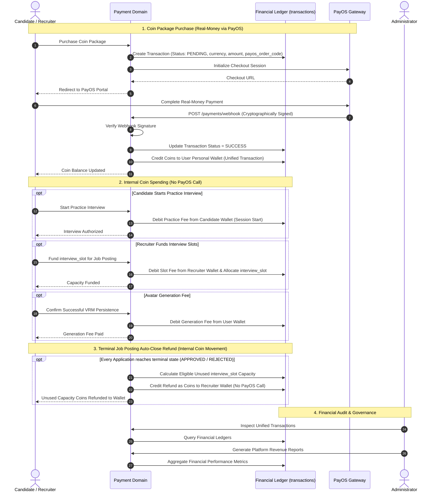

# Payment & Coin Monetization Domain

The **Payment & Coin Monetization Domain** manages real-money coin package purchases, personal coin wallets for Candidates and Recruiters, internal coin spending for interview simulations and avatar operations, and slot refund accounting upon recruitment completion.

---

## 1. Purpose

Provide a transparent, reliable coin-based monetization infrastructure. Candidates and Recruiters purchase coin packages using real money to fund their respective platform activities. Ensures rigorous ledger auditability, clean separation between external real-money transactions and internal coin movements, and deterministic charging and refund boundaries.

---

## 2. Core Concepts

* **Coin (`coins`):**
  The standard internal digital currency of RoleCue. Coins are purchased in packages (`coin_packages`) using real money via PayOS and spent internally on platform capabilities.
* **Personal Wallet (`wallets`):**
  An internal digital coin ledger owned individually by an authenticated **Candidate** or **Recruiter**. Tracks current available balance and append-only transaction history.
  * **Role Restriction Invariant:** Only Candidates and Recruiters hold personal coin wallets. **Administrators do NOT have a wallet.**
* **Coin Packages (`coin_packages`):**
  Defined coin bundles available for purchase using real money via PayOS checkout.
* **Unified Transaction Model (`transactions`):**
  An immutable ledger recording both external real-money package orders and internal coin movements. The platform operates on a single unified transaction model with fields including:
  * `from`
  * `to`
  * `amount`
  * `currency`
  * `description`
  * `status`
  * `payos_order_code`
  * **Architectural Invariant:** The team explicitly rejected the proposed payment redesign that separated `payment_orders` and `coin_transactions`. The unified transaction model is the frozen contract, and its semantic and traceability limitations are accepted technical debt for this capstone.
* **Interview Capacity Funding (`interview_slot`):**
  Recruiter uses coins from their personal wallet to purchase/fund `interview_slot` capacity on an approved Job Posting. `interview_slot` represents maximum recruitment interview capacity, not an application or CV review.
* **Avatar Operations Funding:**
  Coins fund two distinct avatar operations:
  1. *Generation Fee:* Charged strictly upon successful VRM persistence in RoleCue.
  2. *Capacity Purchase:* Buys an additional avatar storage slot when inventory is full.
* **Terminal Job Posting Slot Refund (`Refund unused JP Candidate Slot`):**
  When a Job Posting automatically reaches terminal closed state (when every application in scope has a terminal result `APPROVED` or `REJECTED`), all still-unused interview capacity is refunded as internal coins back into the owning Recruiter's personal coin wallet.
  * Refund does **not** happen on Close Intake.
  * Refund does **not** invoke PayOS (it is an internal coin ledger movement).

---

## 3. Actors Involved

* **Candidate:** Purchases coin packages using real money via PayOS; maintains a personal wallet; spends coins to start practice interview sessions and perform personal avatar operations.
* **Recruiter:** Purchases coin packages using real money via PayOS; maintains a personal wallet; spends coins to fund Job Posting `interview_slot` capacity and perform avatar operations; receives internal coin refunds for eligible unused interview capacity upon terminal Job Posting auto-close.
* **Administrator:** Audits unified payment transactions; generates platform revenue reports.
* **PayOS (Confirmed Payment Provider):** Ingests checkout intents for coin packages and delivers cryptographically signed webhooks confirming real-money transaction status via `payos_order_code`.

---

## 4. Main Domain Flow

---

## 5. Business Rules & Invariants

1. **Separation of External Payments and Internal Coins:**
   Real-money transactions occur exclusively through PayOS to acquire coin packages. Internal spending (practice interview start fees, interview slot funding, avatar generation fees, avatar storage slot purchases) and internal refunds (unused interview capacity upon terminal Job Posting close) execute purely within the internal coin ledger. Internal coin spending and refunds do **not** invoke PayOS.
2. **Unified Transaction Model Invariant:**
   Transactions are persisted in a single `transactions` table containing fields `from`, `to`, `amount`, `currency`, `description`, `status`, and `payos_order_code`. RoleCue does not use separate `payment_orders` and `coin_transactions` tables.
3. **Wallet Scope & Role Boundaries:**
   Personal coin wallets belong exclusively to **Candidates** and **Recruiters**. Administrators do **NOT** have a wallet. Registered User inheritance does not grant an Admin wallet capabilities.
4. **Practice Interview Start Charging Boundary:**
   A practice interview is debited from the Candidate's coin wallet **at session start**, not when it concludes. If a session experiences a network disconnect or is paused, reconnecting to or resuming the same session incurs **no second charge**.
5. **Recruitment Interview Slot Consumption:**
   A recruitment interview consumes one prepaid interview slot funded by the Recruiter strictly upon the Candidate's **first successful start**. The Candidate is **never charged**. Reconnecting to or resuming that active recruitment session does not consume an additional slot.
6. **Avatar Generation Charging Boundary:**
   The avatar generation fee is debited in coins **only after successful VRM persistence** in RoleCue. Opening the avatar creator, uploading photos, generating an Avaturn GLB, or initiating conversion does **not** incur a generation fee.
7. **Avatar Inventory Capacity vs. Generation Fee:**
   Avatar storage slots represent storage capacity, not generation credits. Purchasing additional storage capacity and paying a generation fee are distinct operations.
8. **Terminal Job Posting Auto-Close vs. Close Intake Refund Boundary:**
   Only **terminal Job Posting auto-close** (reached when every application has a terminal result `APPROVED` or `REJECTED`) triggers **Refund unused JP Candidate Slot**. **Close intake does NOT refund interview slots.**
9. **No Cash Refund Dispute Queues:**
   RoleCue does not operate external gateway refund queues, cash dispute adjudication forms, or administrative chargeback workflows. Unused slot refunds upon terminal auto-close execute automatically as internal ledger credits.
10. **Webhook Idempotency & Cryptographic Verification:**
    Payment webhooks from PayOS must be cryptographically verified. Handlers must be strictly idempotent; duplicate webhooks for the same order code must never result in duplicate coin credits.
11. **Ledger Immutability:**
    The unified transaction ledger is append-only. Once recorded, entries cannot be modified or deleted.

---

## 6. Relationships to Other Domains

* **[[01_Domains/Interview/README|Interview Domain]]:**
  Verifies Candidate wallet balance and debits coins at practice session start. For recruitment interviews, verifies that the Job Posting has an available funded interview slot and consumes it upon the Candidate's first successful start.
* **[[01_Domains/Job-Posting-Application/README|Job-Posting-Application Domain]]:**
  Debits Recruiter wallet coins to fund `interview_slot` capacity. Upon terminal Job Posting auto-close, calculates eligible unused capacity and credits internal coin refunds to the Recruiter's wallet (`Refund unused JP Candidate Slot`).
* **[[01_Domains/Avatar-Voice/README|Avatar-Voice Domain]]:**
  Debits the avatar generation fee upon successful VRM persistence. Debits coins when a Candidate or Recruiter purchases additional avatar storage slots.
* **[[01_Domains/Auth/README|Auth Domain]]:**
  Associates personal coin wallets and transaction records with authenticated Candidate and Recruiter `user_id`s.
* **[[01_Domains/Administration/README|Administration Domain]]:**
  Administrators audit unified payment transactions and generate revenue reports.

---

## 7. External Integrations

* **PayOS:** Confirmed third-party electronic payment processor facilitating real-money checkout for coin packages and delivering cryptographically signed webhooks confirming transaction status via `payos_order_code`.
