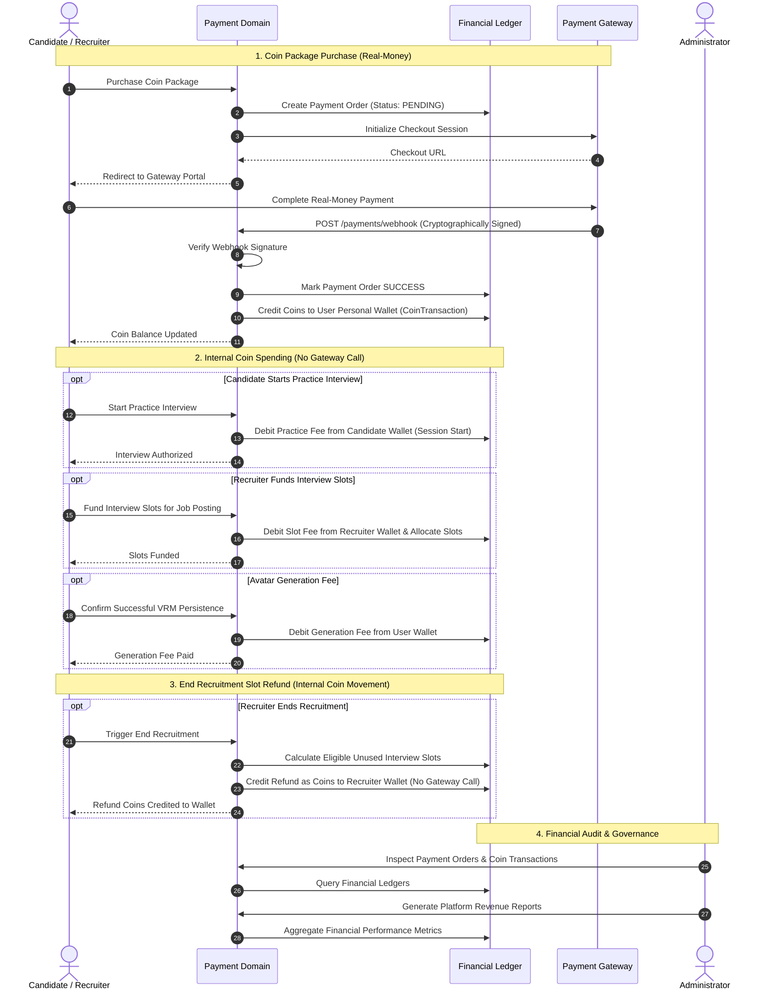

# Payment & Coin Monetization Domain

The **Payment & Coin Monetization Domain** manages real-money coin package purchases, personal coin wallets for Candidates and Recruiters, internal coin spending for interview simulations and avatar operations, and slot refund accounting upon recruitment completion.

---

## 1. Purpose

Provide a transparent, reliable coin-based monetization infrastructure. Candidates and Recruiters purchase coin packages using real money to fund their respective platform activities. Ensures rigorous ledger auditability, clean separation between external real-money transactions and internal coin movements, and deterministic charging and refund boundaries.

---

## 2. Core Concepts

* **Coin (`coins`):**
  The standard internal digital currency of RoleCue. Coins are purchased in packages using real money via external payment gateways and spent internally on platform capabilities.
* **Personal Wallet (`wallets`):**
  An internal digital coin ledger owned individually by an authenticated **Candidate** or **Recruiter**. Tracks current available balance and append-only transaction history.
  * **Role Restriction Invariant:** Only Candidates and Recruiters hold personal coin wallets. **Administrators do NOT have a wallet.**
* **Payment Order / External Transaction (`payment_orders`):**
  An immutable record of an external real-money purchase processed through a third-party Payment Gateway to acquire a coin package. Verified cryptographically via signed webhooks before coins are minted into the user's wallet.
* **Coin Transaction (`coin_transactions`):**
  An immutable internal ledger entry recording an internal debit or credit of coins within a personal wallet:
  * Types: `PACKAGE_PURCHASE_CREDIT`, `PRACTICE_INTERVIEW_DEBIT`, `INTERVIEW_SLOT_PURCHASE_DEBIT`, `AVATAR_GENERATION_DEBIT`, `AVATAR_SLOT_PURCHASE_DEBIT`, `END_RECRUITMENT_SLOT_REFUND_CREDIT`.
* **Interview Slot Capacity Funding:**
  Recruiter uses coins from their personal wallet to purchase/fund **Interview Slots** for an approved Job Posting. An interview slot represents interview capacity, not an application or CV review.
* **Avatar Operations Funding:**
  Coins fund two distinct avatar operations:
  1. *Generation Fee:* Charged strictly upon successful VRM persistence in RoleCue.
  2. *Capacity Purchase:* Buys an additional avatar storage slot when inventory is full.
* **End Recruitment Slot Refund:**
  When a Recruiter executes **End Recruitment**, eligible unused funded interview slots are refunded as coins back into the owning Recruiter's personal coin wallet.
* **Unconfirmed Commercial Parameters:**
  Package pricing, coin conversion rates, coin precision, package sizes, and initial free avatar capacities remain unconfirmed product decisions. No hypothetical prices, exchange ratios, or gateway brand constraints are locked as global defaults.

---

## 3. Actors Involved

* **Candidate:** Purchases coin packages using real money; maintains a personal wallet; spends coins to start practice interview sessions and perform personal avatar operations.
* **Recruiter:** Purchases coin packages using real money; maintains a personal wallet; spends coins to fund Job Posting interview slots and perform avatar operations; receives internal coin refunds for eligible unused interview slots upon End Recruitment.
* **Administrator:** Audits external payment orders and internal coin transactions; generates platform revenue reports. (Administrative management of coin package pricing remains awaiting confirmation).
* **Payment Gateway (External Boundary):** Ingests checkout intents for coin packages and delivers cryptographically signed webhooks confirming real-money transaction status.

---

## 4. Main Domain Flow

---

## 5. Business Rules & Invariants

1. **Separation of External Payments and Internal Coins:**
   Real-money transactions occur exclusively through external Payment Gateways to acquire coin packages. Internal spending (practice interview start fees, interview slot funding, avatar generation fees, avatar storage slot purchases) and internal refunds (unused interview slots upon End Recruitment) execute purely within the internal coin ledger. Internal coin spending and refunds are **not** external payment gateway transactions.
2. **Wallet Scope & Role Boundaries:**
   Personal coin wallets belong exclusively to **Candidates** and **Recruiters**. Administrators do **NOT** have a wallet. Registered User inheritance does not grant an Admin wallet capabilities.
3. **Practice Interview Start Charging Boundary:**
   A practice interview is debited from the Candidate's coin wallet **at session start**, not when it concludes. If a session experiences a network disconnect or is paused, reconnecting to or resuming the same session incurs **no second charge**.
4. **Recruitment Interview Slot Consumption:**
   A recruitment interview consumes one prepaid interview slot funded by the Recruiter upon session start. The Candidate is **not** charged. Reconnecting to or resuming that active recruitment session does not consume an additional slot.
5. **Avatar Generation Charging Boundary:**
   The avatar generation fee is debited in coins **only after successful VRM persistence** in RoleCue. Opening the avatar creator, uploading photos, generating an Avaturn GLB, or initiating conversion does **not** incur a generation fee.
6. **Avatar Inventory Capacity vs. Generation Fee:**
   Avatar storage slots represent storage capacity, not generation credits. Purchasing additional storage capacity and paying a generation fee are distinct operations.
7. **End Recruitment vs. Close Intake Refund Boundary:**
   Only **End Recruitment** calculates eligible unused funded interview slots and refunds them as coins back into the owning Recruiter's personal wallet. **Close intake does NOT refund interview slots.**
8. **No Cash Refund Dispute Queues:**
   RoleCue does not operate external gateway refund queues, cash dispute adjudication forms, or administrative chargeback workflows. Unused slot refunds upon End Recruitment execute automatically as internal ledger credits.
9. **Webhook Idempotency & Cryptographic Verification:**
   Payment webhooks must be cryptographically verified against the gateway's shared secret or public key. Handlers must be strictly idempotent; duplicate webhooks for the same order reference must never result in duplicate coin credits.
10. **Ledger Immutability:**
    Payment orders and internal coin transaction ledgers are append-only. Once recorded, entries cannot be modified or deleted.

---

## 6. Relationships to Other Domains

* **[[01_Domains/Interview/README|Interview Domain]]:**
  Verifies Candidate wallet balance and debits coins at practice session start. For recruitment interviews, verifies that the Job Posting has an available funded interview slot and consumes it upon session start.
* **[[01_Domains/Job-Posting-Application/README|Job-Posting-Application Domain]]:**
  Debits Recruiter wallet coins to fund interview slots. Upon End Recruitment, calculates eligible unused slots and credits coin refunds to the Recruiter's wallet.
* **[[01_Domains/Avatar-Voice/README|Avatar-Voice Domain]]:**
  Debits the avatar generation fee upon successful VRM persistence. Debits coins when a Candidate or Recruiter purchases additional avatar storage slots.
* **[[01_Domains/Auth/README|Auth Domain]]:**
  Associates personal coin wallets and transaction records with authenticated Candidate and Recruiter `user_id`s.
* **[[01_Domains/Administration/README|Administration Domain]]:**
  Administrators audit external payment orders, inspect internal coin transactions, and generate revenue reports. (Coin pricing updates flagged as awaiting confirmation).

---

## 7. External Integrations

* **Payment Gateway:** External electronic payment processors facilitating real-money checkout for coin packages and delivering cryptographically signed webhooks confirming transaction status.
