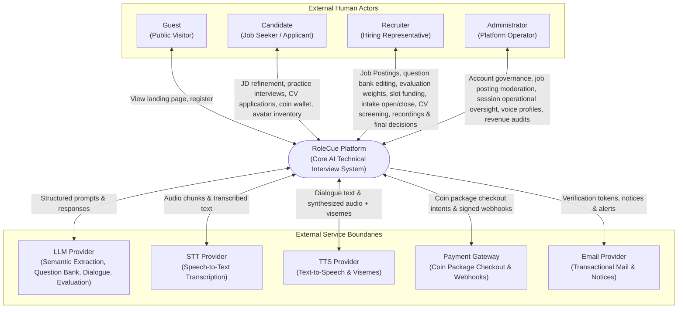

# System Context & External Boundaries

This document defines the high-level boundary of the **RoleCue Platform**, detailing the external human actors, external service integrations, and authoritative artifact links.

---

## 1. Authoritative Specifications & Diagram Reference

* **Consolidated Use Case Diagram (Version 2):**
  Canonical reference: [Use Case Diagram (Google Drive)](https://drive.google.com/file/d/14eSLFovzvjY0KR4Jm-GSV9H6xHm8svDM/view)
  * Active sheet: **Version 2** (page ID `5k5qk9e5ypGhG33TpJGQ`). (The old separate v2 file is superseded).
* **System Context Diagram (Active Team Page):**
  Canonical reference: [Context Diagram (Google Drive)](https://drive.google.com/file/d/1rCgSXSV47CpkJauqqcKY4m8pTJUulKtp/view)
  * Active team page: **Trang-3** (page ID `J-zmhIeB9AquuWCuDiuZ`). Other pages (Page-2 and Trang-1) must remain unchanged.
  * *Diagram Editing Rule:* Trang-3 requires **patch only** (preserving existing connector counts, IDs, and edges while amending stale labels and adding missing flows). Do not claim the local diagram agent's edits have passed review until formally verified.

---

## 2. System Context Diagram

---

## 3. Modeling Invariants for System Context

1. **Registered User Representation:**
   * **Rule:** `Registered User` is **not** an external entity in the Context Diagram.
   * *Rationale:* `Registered User` is an abstract generalization encompassing Candidates and Recruiters. In the physical system context, the concrete human interacting with the system is either a **Candidate** or a **Recruiter**. Registered User inheritance does **NOT** grant Admin personal wallet or avatar inventory rights.
2. **System Handler Representation:**
   * **Rule:** `System Handler` is **not** an external entity in the Context Diagram.
   * *Rationale:* The System Handler is an internal automated system concept (background worker) that terminates a candidate's abandoned session. It is not an external actor.
3. **External Service Boundaries:**
   * All external services interact via secure, authenticated network protocols (HTTPS / streaming connections).
   * Vendor agnosticism: Integrations use standardized internal adapter interfaces so underlying providers can evolve without impacting core domain logic. No specific vendor (e.g., Jev/TypeSafe) is selected for follow-up decisions; Jev is tentative and unapproved.
4. **Embedded Avatar Experience:**
   * Avaturn does not introduce a separate external human actor.
   * RoleCue embeds Avaturn's free iframe experience for personal avatar creation. Avaturn returns a final GLB; RoleCue converts and persists the VRM artifact in the user's inventory. The integration detail is specified in [[02_System/Integrations|External Integrations]].

---

## 4. Boundary Data Flow Specifications

### 4.1. External Human Actors

| External Entity | Inputs to RoleCue | Outputs from RoleCue |
| :--- | :--- | :--- |
| **Guest** | Registration credentials. | Landing page content; account confirmation. |
| **Candidate** | Target JD (text/PDF); refinement notes; requirement confirmations; session configuration; microphone audio stream; embedded Avaturn photo capture/customization; CV/resume and job application submissions; coin package checkout intents. | Extracted requirement tags; 3D virtual interviewer presentation; audio speech + lip-sync visemes; diagnostic evaluation reports; Candidate-owned VRM personal avatars; application status updates; coin wallet balance; overall recruitment evaluation scores (recordings and transcripts hidden during recruitment). |
| **Recruiter** | Job Postings from JD-like content; requirement confirmations; own-posting question bank edits; posting evaluation weights; company 3D interviewer model and Voice Profile selections; coin package checkout intents; interview slot funding; intake control (Open/Close); End Recruitment commands; CV screening decisions (**Pass / Reject**); final application decisions (**Approve / Reject**); avatar studio generation. | Own Job Postings and approval state; incoming Applications and CVs (immediately upon submission); applicant evaluation results, transcripts, and recruitment audio/video recordings; coin wallet balance and slot refund confirmations; personal VRM avatars. |
| **Administrator** | Account lock/unlock commands; job posting moderation commands (approve/reject); interview feature configurations; voice profile fetch/delete commands. *(Global AI prompt calibration, evaluation criteria editing, and coin package price updates remain awaiting confirmation).* | Filtered account lists; job posting lists; operational interview session metadata; voice profile catalog; payment order and coin transaction records; revenue reports. *(Admin does NOT possess a wallet, avatar inventory, or recruitment recording access).* |

### 4.2. External Service Boundaries

| Service Boundary | Direction | Protocol | Primary Data Exchange |
| :--- | :---: | :---: | :--- |
| **LLM Provider** | Bidirectional | HTTPS | Ingests normalized JD text $\rightarrow$ outputs structured JSON competencies. Ingests confirmed requirements $\rightarrow$ generates single core-question bank Blueprint. Ingests Candidate Answer + Interview Context $\rightarrow$ analyzes responses for adaptive question loop. Ingests session transcript + rubrics $\rightarrow$ outputs evaluation scores. |
| **STT Provider** | Bidirectional | WSS / HTTPS | Ingests candidate audio stream chunks $\rightarrow$ outputs real-time text transcripts. |
| **TTS Provider** | Bidirectional | HTTPS | Ingests interviewer dialogue text $\rightarrow$ outputs synthesized audio buffer with facial blend-shape viseme timing metadata. |
| **Payment Gateway** | Bidirectional | HTTPS | Ingests coin package checkout intent $\rightarrow$ returns gateway checkout portal URL. Dispatches cryptographically signed webhooks confirming real-money transaction status. |
| **Email Provider** | Outbound | HTTPS / SMTP | Ingests email payloads (verification tokens, password-recovery links, application notices, system alerts) $\rightarrow$ dispatches to destination mailboxes. |
