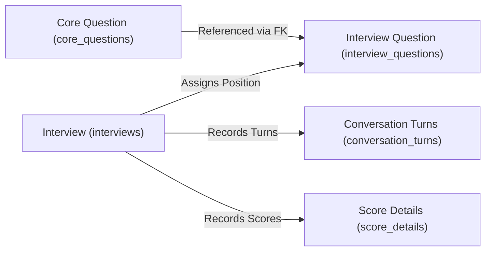

# Data Relationships & Cardinality Invariants

This document specifies the conceptual entity relationships, cardinalities, cascade behaviors, and lifecycle invariants governing data integrity across RoleCue.

---

## 1. Master Relationship Cardinality Matrix

| Parent Entity | Child Entity | Cardinality | Nullable FK? | Cascade Policy | Business Rationale |
| :--- | :--- | :---: | :---: | :--- | :--- |
| **`User` (`users`)** | `Account` (`accounts`) | `1 : 0..*` | No | `CASCADE` | Better Auth OAuth provider and hashed credential records per user. |
| **`User` (`users`)** | `Session` (`sessions`) | `1 : 0..*` | No | `CASCADE` | Better Auth active single-session cookie records per user. |
| **`User` (`users`)** | `Wallet` (`wallets`) | `1 : 0..1` | No | `CASCADE` | Personal coin wallet for Candidate or Recruiter (`UNIQUE(user_id)`); Admin has no wallet. |
| **`Wallet` (`wallets`)** | `Transaction` (`transactions`) | `1 : 0..*` | No | `RESTRICT` | Unified financial ledger entries (`from` / `to`) must never be accidentally deleted. |
| **`CoinPackage` (`coin_packages`)** | `Transaction` (`transactions`) | `1 : 0..*` | Yes | `RESTRICT` | Real-money checkout purchases for coin packages via PayOS (`payos_order_code`). |
| **`User` (`users`)** | `Inventory` (`inventories`) | `1 : 0..1` | No | `CASCADE` | Personal avatar inventory record tracking storage capacity slots for Candidate or Recruiter. |
| **`Inventory` (`inventories`)** | `Avatar` (`avatars`) | `1 : 0..*` | No | `CASCADE` | Standardized VRM personal 3D avatars stored in user inventory. |
| **`Level` (`levels`)** | `JobDescription` (`job_descriptions`) | `1 : 0..*` | No | `RESTRICT` | Seniority level tier classification (`intern`, `junior`, `mid`, `senior`, `lead`). |
| **`JobDescription` (`job_descriptions`)** | `CoreQuestion` (`core_questions`) | `1 : 0..*` | No | `CASCADE` | Core question bank (conceptual Blueprint) generated from confirmed requirements. |
| **`JobDescription` (`job_descriptions`)** | `RoleProfile` (`role_profiles`) | `1 : 0..*` | No | `CASCADE` | Candidate practice role profiles referencing target job description. |
| **`User` (`users`)** | `RoleProfile` (`role_profiles`) | `1 : 0..*` | No | `CASCADE` | Candidate owns zero or more practice role profiles. |
| **`JobDescription` (`job_descriptions`)** | `JobPosting` (`job_postings`) | `1 : 0..1` | No (Unique) | `RESTRICT` | Job Posting requirements defined 1:1 by underlying job description (`UNIQUE(jd_id)`). |
| **`User` (`users`)** | `JobPosting` (`job_postings`) | `1 : 0..*` | No | `RESTRICT` | Recruiter authors zero or more company Job Postings. |
| **`JobPosting` (`job_postings`)** | `MetricPercentage` (`metrics_percentage`) | `1 : 0..*` | No | `CASCADE` | Evaluation weights configured by Recruiter for Job Posting. |
| **`Metric` (`metrics`)** | `MetricPercentage` (`metrics_percentage`) | `1 : 0..*` | No | `RESTRICT` | Evaluation metric referenced in posting weights (`UNIQUE(job_posting_id, metric_id)`). |
| **`JobPosting` (`job_postings`)** | `Application` (`applications`) | `1 : 0..*` | No | `RESTRICT` | Applications received by an open Job Posting. |
| **`User` (`users`)** | `Application` (`applications`) | `1 : 0..*` | No | `RESTRICT` | Candidate submits zero or more applications. |
| **`RoleProfile` (`role_profiles`)** | `Interview` (`interviews`) | `1 : 0..*` | No | `RESTRICT` | Interview simulation guided by role profile requirements. |
| **`Application` (`applications`)** | `Interview` (`interviews`) | `1 : 0..1` | Yes (Unique) | `RESTRICT` | Recruitment interview references candidate application (`UNIQUE(application_id)`). Practice interviews have `application_id IS NULL`. |
| **`Interview` (`interviews`)** | `InterviewQuestion` (`interview_questions`) | `1 : 0..*` | No | `CASCADE` | Session question assignment mapping turn position to source core question. |
| **`CoreQuestion` (`core_questions`)** | `InterviewQuestion` (`interview_questions`) | `1 : 0..*` | No | `RESTRICT` | Core question referenced in interview sessions. |
| **`Interview` (`interviews`)** | `ConversationTurn` (`conversation_turns`) | `1 : 0..*` | No | `CASCADE` | Sequential conversational dialogue turns in an interview session. |
| **`Interview` (`interviews`)** | `ScoreDetail` (`score_details`) | `1 : 0..*` | No | `CASCADE` | Evaluation score breakdown per metric (`UNIQUE(interview_id, metric_id)`). |
| **`Metric` (`metrics`)** | `ScoreDetail` (`score_details`) | `1 : 0..*` | No | `RESTRICT` | Platform evaluation metric evaluated in interview score details. |
| **`Avatar` (`avatars`)** | `Interview` (`interviews`) | `1 : 0..*` | Yes | `SET NULL` | Avatar persona presented during interview session. |
| **`Voice` (`voices`)** | `Interview` (`interviews`) | `1 : 0..*` | Yes | `SET NULL` | Voice persona speaking during interview session. |
| **`Avatar` (`avatars`)** | `JobPosting` (`job_postings`) | `1 : 0..*` | No | `RESTRICT` | Required company 3D avatar locked by Recruiter for Job Posting interview. |
| **`Voice` (`voices`)** | `JobPosting` (`job_postings`) | `1 : 0..*` | No | `RESTRICT` | Required company Voice Profile locked by Recruiter for Job Posting interview. |

---

## 2. Core Integrity Invariants

### 2.1. Historical Session Reproducibility via Relational Question Mapping

* **Invariant:** Every `Interview` maps its session turn positions to persistent `core_questions` via `interview_questions (interview_id, position, core_question_id)`.
* **Integrity Guarantee:** Even if the source Job Description or Job Posting is updated, foreign key constraints (`ON DELETE RESTRICT`) ensure historical interview questions, dialogue turns, and score evaluations remain permanently reproducible and tamper-proof without requiring an unnormalized `blueprint_snapshot` column.

### 2.2. Question Bank Preservation via `ON DELETE RESTRICT`
* **Invariant:** The foreign key constraint between `interview_questions` and `core_questions` enforces `ON DELETE RESTRICT`.
* **Integrity Guarantee:** Deleting or replacing question banks must be rejected if completed interview sessions reference them. Historical practice and recruitment records must never be orphaned.

### 2.3. Consolidated Evaluation Storage & Score Detail Invariant
* **Invariant:** Evaluation scores are persisted directly on `interviews.score`, `interviews.feedback`, and `score_details (interview_id, metric_id, score)` with a strict `UNIQUE(interview_id, metric_id)` constraint. Turn-level critiques are stored in `conversation_turns.feedback`.
* **Integrity Guarantee:** A completed interview session produces an authoritative score breakdown across platform metrics. There is no separate `performance_reports` table; reporting is queried directly from relational interview and score detail tables.

### 2.4. Independent Relational Data Scoping (No Multi-Tenancy)
* **Invariant:** RoleCue does not use multi-tenant schemas or Row-Level Security tenant isolation policies.
* **Integrity Guarantee:**
  * Recruiter data is partitioned relationally by `recruiter_id`.
  * Candidate data is partitioned relationally by `candidate_id` / `user_id`.
  * Recruiter and Candidate coin wallets are partitioned strictly by `user_id`.

### 2.5. Job Posting Application & CV-First Workflow Integrity
* **Invariant (Intake Open):** Candidates may submit an unlimited number of Applications/CVs while posting status is `open`. Submissions are immediately visible to the Recruiter in `View Application Detail`. Intake is not limited by `interview_slot`.
* **CV Screening & Deadline:** Recruiter approves at most `interview_slot` Candidates (`interview_eligible`). Approval sets `interview_deadline = cv_approved_at + 24 hours`.
* **No-Show Enforcement:** If an approved Candidate does not start their interview before `interview_deadline`, the System Handler marks the application as terminal `rejected`.
* **Slot Consumption:** Slot capacity is consumed upon the Candidate's first successful interview start. Reconnects and resumes do not consume additional capacity. Candidates are never charged.
* **Hard-Gated Final Decisions:** Recruiter final decisions (`approved` or `rejected`) are **HARD-GATED until MAX(interview_deadline)** across all interview-eligible applications for that posting, consolidated in `View Application Detail`.
* **Terminal Job Posting Close & Slot Refund:** Terminal close is reached automatically when EVERY application in scope has a terminal result (`approved` or `rejected`), transitioning posting status to `closed`. The System Handler executes `Refund unused JP Candidate Slot`, refunding still-unused capacity to the Recruiter's wallet as internal coins. There is no manual End Recruitment flow and no Reopen Intake flow.

### 2.6. ACID Transactional Integrity for Unified Financial Transactions
* **Invariant:** All updates to the unified `transactions` ledger (`from`, `to`, `amount`, `currency`, `description`, `status`, `payos_order_code`) and associated wallet balance updates must execute within explicit database transactions (`BEGIN ... COMMIT`).
* **Integrity Guarantee:** Prevents race conditions during PayOS webhook verification and ensures that internal coin movements (practice interview starts, slot funding, avatar generation fees, and terminal auto-close unused slot refunds) maintain strict ledger balance consistency.
* **Accepted Technical Debt:** The team formally rejected the split `payment_orders` / `coin_transactions` redesign; the single unified `transactions` table is authoritative for this capstone.
