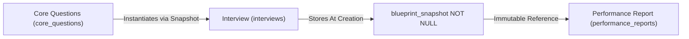

# Data Relationships & Cardinality Invariants

This document specifies the conceptual entity relationships, cardinalities, cascade behaviors, and lifecycle invariants governing data integrity across RoleCue.

---

## 1. Master Relationship Cardinality Matrix

| Parent Entity | Child Entity | Cardinality | Nullable FK? | Cascade Policy | Business Rationale |
| :--- | :--- | :---: | :---: | :--- | :--- |
| **`UserAccount` (`accounts`)** | `CandidateProfile` | `1 : 0..1` | No | `CASCADE` | Unique candidate profile record per candidate account. |
| **`UserAccount` (`accounts`)** | `RecruiterProfile` | `1 : 0..1` | No | `CASCADE` | Employer identity record per recruiter account. |
| **`UserAccount` (`accounts`)** | `CoinWallet` (`wallets`) | `1 : 0..1` | No | `CASCADE` | Personal coin wallet for Candidate or Recruiter; Admin has no wallet. |
| **`CoinWallet` (`wallets`)** | `Transaction` (`transactions`) | `1 : 0..*` | No | `RESTRICT` | Unified financial ledger entries (`from` / `to`) must never be accidentally deleted. |
| **`CoinPackage` (`coin_packages`)** | `Transaction` (`transactions`) | `1 : 0..*` | Yes | `RESTRICT` | Real-money checkout purchases for coin packages via PayOS (`payos_order_code`). |
| **`UserAccount` (`accounts`)** | `PersonalAvatar` | `1 : 0..*` | No | `CASCADE` | Candidate or Recruiter personal 3D avatars stored in their inventory. |
| **`UserAccount` (`accounts`)** | `TargetJD` (`job_descriptions`) | `1 : 0..*` | No | `CASCADE` | Candidate owns zero or more practice target JDs. |
| **`TargetJD` (`job_descriptions`)** | `CoreQuestion` (`core_questions`) | `1 : 0..*` | No | `CASCADE` | Core question bank (conceptual Blueprint) generated from confirmed requirements. |
| **`JobPosting` (`job_postings`)** | `CoreQuestion` (`core_questions`) | `1 : 0..*` | No | `RESTRICT` | Core question bank managed and edited by Recruiter for own posting. |
| **`JobPosting` (`job_postings`)** | `Interview` (`interviews`) | `1 : 0..*` | No | `RESTRICT` | Job Posting originates recruitment technical interview sessions using locked presentation. |
| **`Interview` (`interviews`)** | `ConversationTurn` (`conversation_turns`) | `1 : 0..*` | No | `CASCADE` | Sequential conversational dialogue turns in an interview session. |
| **`Interview` (`interviews`)** | `PerformanceReport` (`performance_reports`) | `1 : 0..1` | No (Unique) | `CASCADE` | Strictly at most one final report per interview session. |
| **`UserAccount` (`accounts`)** | `JobPosting` (`job_postings`) | `1 : 0..*` | No | `RESTRICT` | Recruiter authors zero or more company Job Postings. |
| **`JobPosting` (`job_postings`)** | `Application` (`applications`) | `1 : 0..*` | No | `RESTRICT` | Applications received by an approved Job Posting. |
| **`UserAccount` (`accounts`)** | `Application` (`applications`) | `1 : 0..*` | No | `RESTRICT` | Candidate submits zero or more applications. |
| **`Application` (`applications`)** | `Interview` (`interviews`) | `0..1 : 0..1` | Yes | `RESTRICT` | Nullable initially; attached only after candidate passes CV screening and completes interview. |
| **`VoiceProfile` (`voice_profiles`)** | `Interview` (`interviews`) | `1 : 0..*` | Yes | `SET NULL` | Voice persona used by session; immutable execution context preserves historical presentation details. |
| **`VoiceProfile` (`voice_profiles`)** | `JobPosting` (`job_postings`) | `1 : 0..*` | No | `RESTRICT` | Approved Job Posting requires its Recruiter-selected company Voice Profile. |

---

## 2. Core Integrity Invariants

### 2.1. Historical Session Immutability

* **Invariant:** Every `Interview` must persist an immutable `blueprint_snapshot` and execution context at the moment of session creation.
* **Integrity Guarantee:** Even if the source Target JD or Job Posting is updated, core questions are edited, or evaluation weights change, completed historical evaluation reports and turn scores remain permanently reproducible and immune to retroactive mutation.

### 2.2. Question Bank Preservation via `ON DELETE RESTRICT`
* **Invariant:** The foreign key constraint between `interviews` and `core_questions` / `job_postings` enforces `ON DELETE RESTRICT`.
* **Integrity Guarantee:** Deleting or replacing question banks must be rejected if completed interview sessions reference them. Historical practice and recruitment records must never be orphaned.

### 2.3. Single Performance Report per Session
* **Invariant:** `PerformanceReport` enforces a strict `UNIQUE(interview_id)` constraint.
* **Integrity Guarantee:** A completed interview session produces exactly one authoritative evaluation report. Re-submitting evaluation triggers cannot duplicate reports.

### 2.4. Independent Relational Data Scoping (No Multi-Tenancy)
* **Invariant:** RoleCue does not use multi-tenant schemas or Row-Level Security tenant isolation policies.
* **Integrity Guarantee:**
  * Recruiter data is partitioned relationally by `recruiter_id`.
  * Candidate data is partitioned relationally by `candidate_id` / `user_id`.
  * Recruiter and Candidate coin wallets are partitioned strictly by `user_id`.

### 2.5. Job Posting Application & CV-First Workflow Integrity
* **Invariant (Intake Open):** Candidates may submit an unlimited number of Applications/CVs while intake is `OPEN`. Submissions are immediately visible to the Recruiter in `View Application Detail`. Intake is not limited by `interview_slot`.
* **CV Screening & Deadline:** Recruiter approves at most `interview_slot` Candidates (`CV_APPROVED`). Approval sets `interview_deadline = cv_approved_at + 24 hours`.
* **No-Show Enforcement:** If an approved Candidate does not start their interview before `interview_deadline`, the System Handler marks the application as terminal `REJECTED`.
* **Slot Consumption:** Slot capacity is consumed upon the Candidate's first successful interview start. Reconnects and resumes do not consume additional capacity.
* **Hard-Gated Final Decisions:** Recruiter final decisions (`Approve / Reject Application`) are **HARD-GATED until MAX(interview_deadline)** across all interview-eligible applications for that posting, consolidated in `View Application Detail`.
* **Terminal Job Posting Close & Slot Refund:** Terminal close is reached automatically when EVERY application in scope has a terminal result (`APPROVED` or `REJECTED`). The System Handler executes `Refund unused JP Candidate Slot`, refunding still-unused capacity to the Recruiter's wallet as internal coins. There is no manual End Recruitment flow and no Reopen Intake flow.

### 2.6. ACID Transactional Integrity for Unified Financial Transactions
* **Invariant:** All updates to the unified `transactions` ledger (`from`, `to`, `amount`, `currency`, `description`, `status`, `payos_order_code`) and associated wallet balance updates must execute within explicit database transactions (`BEGIN ... COMMIT`).
* **Integrity Guarantee:** Prevents race conditions during PayOS webhook verification and ensures that internal coin movements (practice interview starts, slot funding, avatar generation fees, and terminal auto-close unused slot refunds) maintain strict ledger balance consistency.
* **Accepted Technical Debt:** The team formally rejected the split `payment_orders` / `coin_transactions` redesign; the single unified `transactions` table is authoritative for this capstone.
