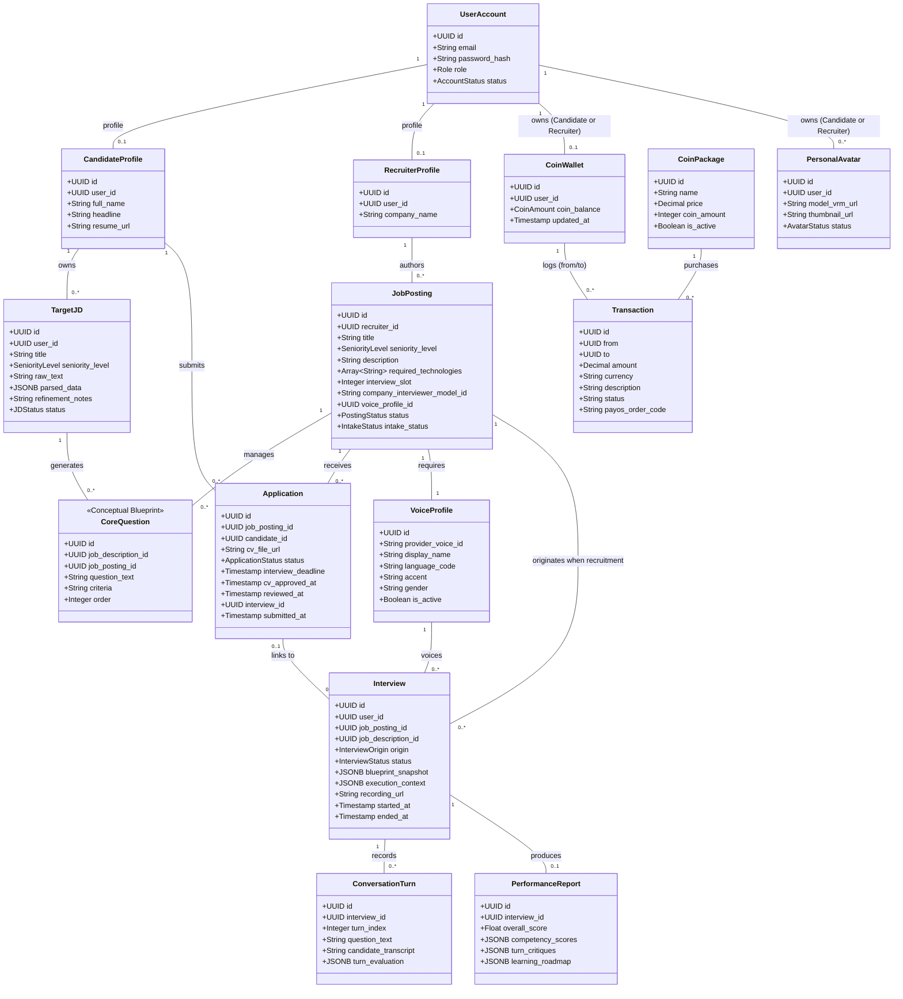

# Conceptual Domain Model

This document maps the primary business entities of the RoleCue platform and illustrates their conceptual relationships, multiplicities, and boundaries.

> [!NOTE]
> The frozen RoleCue Use Case Diagram and frozen RoleCue ERD (named `RoleCue`) are authoritative.
> Conceptual models and entity names in this document illustrate domain relationships and business invariants conforming strictly to the frozen contract. RoleCue does not redesign payment models, propose V2/vNext schemas, or invent missing business rules.

---

## 1. Conceptual Entity-Relationship Model

---

## 2. Entity Descriptions & Invariants

### 2.1. Identity, Wallets & Financials
* **`UserAccount` (`accounts`):** Root authentication record. Holds system role (`Candidate`, `Recruiter`, `Admin`) and status (`ACTIVE`, `LOCKED`).
* **`CandidateProfile` (`candidate_profiles`):** Profile metadata specific to candidates.
* **`RecruiterProfile` (`recruiter_profiles`):** Employer identity metadata attached to a Recruiter account. Stores basic company identification without multi-tenant architecture.
* **`CoinWallet` (`wallets`):** Personal coin ledger owned individually by an authenticated **Candidate** or **Recruiter**. Holds `coin_balance`. Administrators do **NOT** have a wallet.
* **`CoinPackage` (`coin_packages`):** Fixed coin purchasing tiers available for purchase via PayOS.
* **`Transaction` (`transactions`):** The unified financial ledger table. Records both real-money PayOS checkout orders (via `payos_order_code`) and internal coin balance transfers/refunds between wallets or system accounts using `from`, `to`, `amount`, `currency`, `description`, and `status`.
  * *Accepted Technical Debt Note:* The team explicitly rejected the proposed payment architecture redesign (`payment_orders` + `coin_transactions`). The single unified `transactions` table is the authoritative model for this capstone.

### 2.2. Practice & Simulation Pipeline
* **`TargetJD` (`job_descriptions`):** The candidate's personal practice JD. Stores raw text, AI-extracted technical competencies, and natural-language `refinement_notes`.
* **`CoreQuestion` (`core_questions`):** The persistent question bank. "Interview Blueprint" is a conceptual product term only; there is no Blueprint database table. Stores core questions linked to a `job_description_id` (practice) or `job_posting_id` (recruitment).
* **`Interview` (`interviews`):** Concrete interview execution (practice or recruitment). Captures runtime state, `blueprint_snapshot`, `execution_context`, and audio/video `recording_url`.
  * *Recruitment Slot Invariant:* For recruitment interviews, slot capacity is consumed upon the Candidate's **first successful interview start**. Reconnects or resumes do not consume additional capacity.
* **`ConversationTurn` (`conversation_turns`):** Granular dialogue unit within an interview session. Captures interviewer questions, candidate transcripts, and turn evaluation.
* **`PerformanceReport` (`performance_reports`):** Authoritative evaluation artifact produced from completed sessions. Holds overall score, competency breakdown, turn critiques, and learning roadmap.

### 2.3. Recruitment Board
* **`JobPosting` (`job_postings`):** The company's Job Description authored by a Recruiter. Holds company 3D model and Voice Profile selections, links to its core questions, and tracks intake status (`OPEN`, `CLOSED`).
  * **`interview_slot` Field:** Singular integer field representing maximum recruitment interview capacity (maximum number of Candidates that may be approved to proceed into the interview stage). It does **NOT** limit total CV submissions and does **NOT** represent company hiring headcount or final hires. RoleCue does NOT persist or enforce company hiring headcount.
  * **Intake Lifecycle:**
    * **Intake Open:** Set automatically upon Admin approval. Candidates may submit an unlimited number of Applications/CVs. Submissions are immediately visible to the Recruiter in **View Application Detail**.
    * **Close Intake:** Manual Recruiter action (`Close Job Posting Intake`) or automated System Handler action (`Close Job Posting When Meet Configured Limitation` when approved count reaches `interview_slot`). Closes intake and automatically sets all unscreened/unapproved applications to terminal `REJECTED`. Already-approved candidates retain interview eligibility. There is **NO Reopen Intake** flow.
    * **Terminal Job Posting Close:** Automatically reached when EVERY application in scope has a terminal result (`APPROVED` or `REJECTED`). Automatically triggers `Refund unused JP Candidate Slot` to refund still-unused capacity to Recruiter's wallet as internal coins. There is **NO manual End Recruitment** command.
* **`Application` (`applications`):** The Candidate's application to a `JobPosting`.
  * **Intake Submission:** Candidates submit CV/resume while intake is OPEN; unlimited submissions permitted.
  * **CV Screening:** Recruiter reviews CV in **View Application Detail** and approves at most `interview_slot` Candidates (`CV_APPROVED`). Approval sets `interview_deadline = cv_approved_at + 24 hours`.
  * **Interview Deadline Enforcement:** If a candidate fails to start their interview before `interview_deadline`, the System Handler automatically marks the application as terminal `REJECTED`.
  * **Hard-Gated Final Decisions:** Recruiter final Approve/Reject decisions are **HARD-GATED until MAX(interview_deadline)** across all interview-eligible applications for that posting. After the gate, the Recruiter renders final **Approve / Reject Application** decisions consolidated directly inside **View Application Detail**.

### 2.4. Audio-Visual Presentation & Avatar Inventory
* **`VoiceProfile` (`voice_profiles`):** Voice configuration sourced from external TTS providers. Curated and managed by Administrators.
* **`PersonalAvatar` (`personal_avatars`):** Humanoid 3D avatar stored as a standardized VRM. RoleCue converts Avaturn's final GLB to VRM, persists the asset, and associates it with the owning **Candidate or Recruiter** in their personal avatar inventory.
