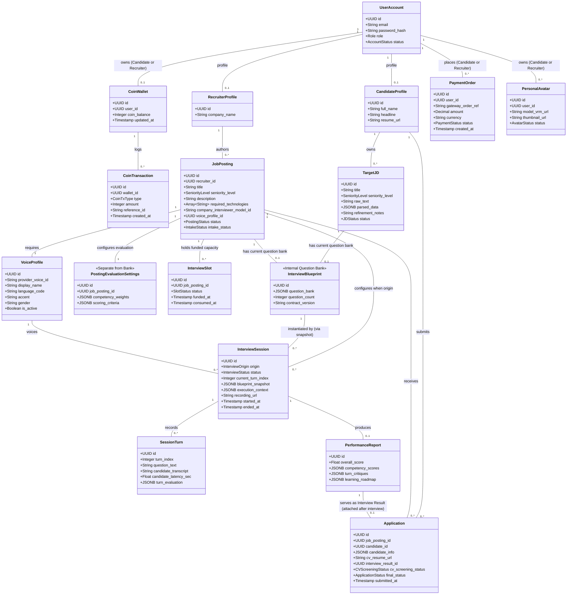

# Conceptual Domain Model

This document maps the primary business entities of the RoleCue platform and illustrates their conceptual relationships, multiplicities, and boundaries.

> [!NOTE]
> Conceptual models and entity names in this document illustrate domain relationships and business invariants. They must **not** be interpreted as approved physical database migration scripts or finalized SQL schema specifications.

---

## 1. Conceptual Entity-Relationship Model

---

## 2. Entity Descriptions & Invariants

### 2.1. Identity, Wallets & Financials
* **`UserAccount`:** Root authentication record. Holds system role (`Candidate`, `Recruiter`, `Admin`) and status (`ACTIVE`, `LOCKED`).
* **`CandidateProfile`:** Profile metadata specific to candidates.
* **`RecruiterProfile`:** Employer identity metadata attached to a Recruiter account. Stores basic company identification without multi-tenant architecture.
* **`CoinWallet`:** Personal coin ledger owned individually by an authenticated **Candidate** or **Recruiter**. Tracks current balance and append-only internal transactions. Administrators do **NOT** have a wallet.
* **`PaymentOrder`:** Real-money checkout record processed via external Payment Gateways to acquire coin packages.
* **`CoinTransaction`:** Immutable ledger entry recording internal credits/debits (practice interview starts, interview slot funding, avatar generation fees, avatar capacity purchases, and End Recruitment unused slot refunds).

### 2.2. Practice & Simulation Pipeline
* **`TargetJD`:** The candidate's personal practice JD. Stores raw text, AI-extracted technical competencies, and natural-language `refinement_notes`.
* **`InterviewBlueprint`:** The internal assessment plan and **core-question bank**. Contains topic coverage matrices, a comprehensive bank of core questions, depth milestones, and grading rubrics.
  * **Invariant:** Exactly **at most one current Blueprint** exists per Target JD or Job Posting (absent until generated). Hidden from Candidates; Recruiter can view and edit core questions for their own Job Posting.
* **`PostingEvaluationSettings`:** Recruiter posting-level settings and weights across technical competencies, stored **separately** from the question bank Blueprint.
* **`InterviewSession`:** Concrete interview execution. Records whether the session originated from a Target JD (debited from Candidate wallet) or a Job Posting (consumes prepaid Recruiter interview slot). Preserves the source's execution context and `blueprint_snapshot`.
* **`SessionTurn`:** Granular dialogue unit within a session. Captures interviewer questions, candidate transcripts, audio timing, and real-time response analysis.
* **`PerformanceReport`:** Authoritative evaluation artifact produced from completed sessions. Holds overall score, competency breakdown, turn critiques, and learning roadmap.

### 2.3. Recruitment Board
* **`JobPosting`:** The company's Job Description authored by a Recruiter from JD-like content. Holds company 3D model and Voice Profile selections, links to its current question bank Blueprint and evaluation settings, and tracks intake status (`OPEN`, `CLOSED`).
* **`InterviewSlot`:** Unit of prepaid interview capacity allocated to a Job Posting, funded by the Recruiter using wallet coins. Consumed upon interview start; eligible unused slots are refunded as coins upon End Recruitment.
* **`Application`:** The Candidate's application to a `JobPosting`.
  * **Immediate Visibility:** Visible to the Recruiter immediately upon submission with uploaded CV/resume.
  * **Initial Result Optionality:** `interview_result_id` is initially null/optional; attached only after the approved applicant completes the required technical interview.
  * **Two Distinct Decisions:** Tracks initial `cv_screening_status` (`PENDING`, `CV_PASSED`, `CV_REJECTED`) and terminal `final_status` (`APPROVED`, `REJECTED`).

### 2.4. Audio-Visual Presentation & Avatar Inventory
* **`VoiceProfile`:** Voice configuration sourced from external TTS providers. Curated and managed by Administrators.
* **`PersonalAvatar`:** Humanoid 3D avatar stored as a standardized VRM. RoleCue converts Avaturn's final GLB to VRM, persists the asset, and associates it with the owning **Candidate or Recruiter** in their personal avatar inventory.
