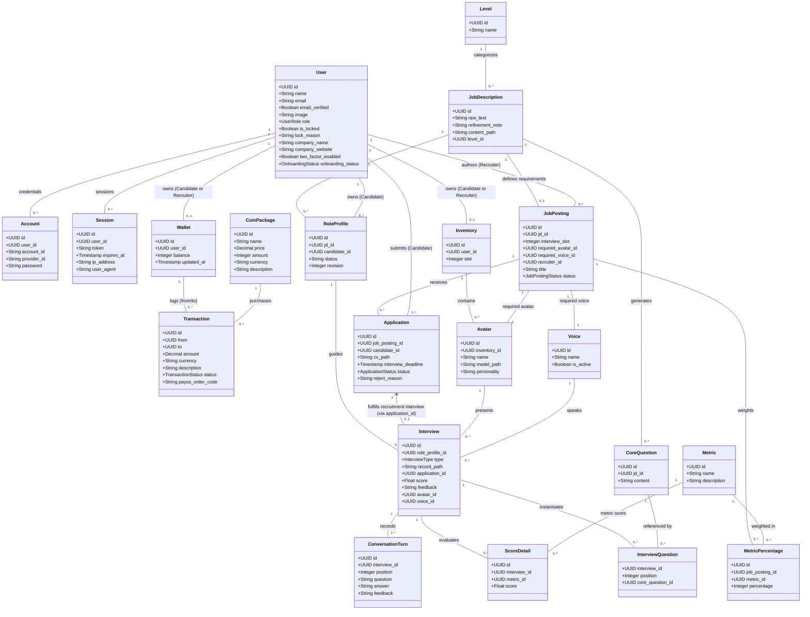

# Conceptual Domain Model

This document maps the primary business entities of the RoleCue platform and illustrates their conceptual relationships, multiplicities, and boundaries.

> [!NOTE]
> The frozen RoleCue Use Case Diagram and frozen RoleCue ERD (named `RoleCue`) are authoritative.
> Conceptual models and entity names in this document illustrate domain relationships and business invariants conforming strictly to the frozen contract. RoleCue does not redesign payment models, propose V2/vNext schemas, or invent missing business rules.

---

## 1. Conceptual Entity-Relationship Model

---

## 2. Entity Descriptions & Invariants

### 2.1. Identity, Wallets & Financials
* **`User` (`users`):** Root authentication and identity record managed via Better Auth runtime. Stores basic profile (`name`, `email`, `email_verified`, `image`), role (`candidate`, `recruiter`, `admin`), lock state (`is_locked`, `lock_reason`), 2FA configuration (`two_factor_enabled`), onboarding status (`onboarding_status`), and company information (`company_name`, `company_website`) directly on the user record. There are no separate candidate or recruiter profile tables.
* **`Account` (`accounts`) & `Session` (`sessions`):** Better Auth credential tables. `accounts` stores third-party OAuth provider links and hashed local passwords. `sessions` stores active single-session cookie records. RoleCue uses session cookies with `/api/auth/get-session` runtime validation; there is no custom JWT/refresh-token rotation layer.
* **`Wallet` (`wallets`):** Personal coin ledger owned individually by an authenticated **Candidate** or **Recruiter** (`user_id UNIQUE`). Holds `balance`. Administrators do **NOT** have a wallet.
* **`CoinPackage` (`coin_packages`):** Fixed coin purchasing tiers available for purchase via PayOS (`name`, `price`, `amount`, `currency`, `description`).
* **`Transaction` (`transactions`):** The unified financial ledger table. Records both real-money PayOS checkout orders (via `payos_order_code`) and internal coin balance transfers/refunds between wallets or system accounts using `from`, `to`, `amount`, `currency`, `description`, and `status` (`pending`, `success`, `failed`, `cancelled`).
  * *Accepted Technical Debt Note:* The team explicitly rejected the proposed payment architecture redesign (`payment_orders` + `coin_transactions`). The single unified `transactions` table is the authoritative model for this capstone.

### 2.2. Practice & Simulation Pipeline
* **`Level` (`levels`):** Seniority classification tier (`intern`, `junior`, `mid`, `senior`, `lead`).
* **`JobDescription` (`job_descriptions`):** Persistent job description record storing `raw_text`, natural-language `refinement_note`, `content_path` (for multi-page PDF documents), and `level_id REFERENCES levels(id)`. Serves as the requirements foundation for both candidate practice role profiles and recruiter job postings.
* **`RoleProfile` (`role_profiles`):** Candidate practice profile instance linking a candidate (`candidate_id REFERENCES users(id)`) to a target job description (`jd_id REFERENCES job_descriptions(id)`). Maintains workflow `status` and `revision`.
* **`CoreQuestion` (`core_questions`):** The persistent question bank. "Interview Blueprint" is a conceptual product term only; there is no Blueprint database table. Stores core questions linked to `job_descriptions.id` (`jd_id REFERENCES job_descriptions(id)`).
* **`Interview` (`interviews`):** Concrete interview execution (practice or recruitment). Captures `role_profile_id REFERENCES role_profiles(id)`, `type` (`practice` or `recruitment`), `record_path`, `score`, `feedback`, `avatar_id REFERENCES avatars(id)`, and `voice_id REFERENCES voices(id)`.
  * *Recruitment Application Link:* For recruitment interviews, `application_id uuid UNIQUE REFERENCES applications(id)` links the interview to the candidate's application. Enforced via database CHECK constraint: practice $\rightarrow$ `application_id IS NULL`; recruitment $\rightarrow$ `application_id IS NOT NULL`.
  * *Recruitment Slot Invariant:* For recruitment interviews, slot capacity is consumed upon the Candidate's **first successful interview start**. Reconnects or resumes do not consume additional capacity. Candidates are never charged.
* **`InterviewQuestion` (`interview_questions`):** Relational question assignment table mapping each session turn position (`(interview_id, position)`) to its source `core_question_id REFERENCES core_questions(id)`. Replaces unnormalized `blueprint_snapshot` column while ensuring historical interview reproducibility.
* **`ConversationTurn` (`conversation_turns`):** Granular dialogue unit within an interview session. Captures `interview_id`, `position`, `question`, `answer`, and turn-level `feedback`.
* **Evaluation & Scoring:** RoleCue persists evaluation outcomes directly in `interviews.score`, `interviews.feedback`, `score_details (interview_id, metric_id, score)`, and `conversation_turns.feedback`. There is no separate `performance_reports` table.

### 2.3. Recruitment Board
* **`JobPosting` (`job_postings`):** The company's Job Description authored by a Recruiter. References `jd_id UNIQUE REFERENCES job_descriptions(id)`, `recruiter_id REFERENCES users(id)`, `required_avatar_id REFERENCES avatars(id)`, `required_voice_id REFERENCES voices(id)`, `title`, and `status` (`pending`, `open`, `intake_closed`, `closed`, `rejected`).
  * **`interview_slot` Field:** Singular integer field representing maximum recruitment interview capacity (maximum number of Candidates that may be approved to proceed into the interview stage). It does **NOT** limit total CV submissions and does **NOT** represent company hiring headcount or final hires. RoleCue does NOT persist or enforce company hiring headcount.
  * **Evaluation Weights (`metrics` & `metrics_percentage`):** Recruiters configure posting-level evaluation weights via `metrics_percentage (job_posting_id, metric_id, percentage)` referencing platform evaluation dimensions (`metrics`).
  * **Intake Lifecycle:**
    * **Intake Open:** Set automatically upon Admin approval (`status = 'open'`). Candidates may submit an unlimited number of Applications/CVs. Submissions are immediately visible to the Recruiter in **View Application Detail**.
    * **Close Intake:** Manual Recruiter action (`Close Job Posting Intake`) or automated System Handler action (`Close Job Posting When Meet Configured Limitation` when approved count reaches `interview_slot`). Transitions posting to `intake_closed` and automatically sets all unscreened/unapproved applications (`pending`) to terminal `rejected`. Already-approved candidates retain interview eligibility within their 24-hour deadline. There is **NO Reopen Intake** flow.
    * **Terminal Job Posting Close:** Automatically reached when EVERY application in scope has a terminal result (`approved` or `rejected`). Transitions posting to `closed`. Automatically triggers `Refund unused JP Candidate Slot` to refund still-unused capacity to Recruiter's wallet as internal coins. There is **NO manual End Recruitment** command.
* **`Application` (`applications`):** The Candidate's application to a `JobPosting`.
  * **Fields:** `job_posting_id`, `candidate_id`, `cv_path`, `interview_deadline`, `status` (`pending`, `interview_eligible`, `interviewed`, `approved`, `rejected`), `reject_reason`. Note that `applications` exists before the interview occurs and does **NOT** hold an `interview_id`; recruitment interviews link back to applications via `interviews.application_id`.
  * **Intake Submission:** Candidates submit CV/resume while intake is `open`; unlimited submissions permitted.
  * **CV Screening:** Recruiter reviews CV in **View Application Detail** and approves at most `interview_slot` Candidates (`interview_eligible`). Approval sets `interview_deadline = cv_approved_at + 24 hours`.
  * **Interview Deadline Enforcement:** If a candidate fails to start their interview before `interview_deadline`, the System Handler automatically marks the application as terminal `rejected`.
  * **Hard-Gated Final Decisions:** Recruiter final Approve/Reject decisions are **HARD-GATED until MAX(interview_deadline)** across all interview-eligible applications for that posting. After the gate, the Recruiter renders final **Approve / Reject Application** decisions (`approved` or `rejected`) consolidated directly inside **View Application Detail**.

### 2.4. Audio-Visual Presentation & Avatar Inventory
* **`Inventory` (`inventories`):** Personal avatar inventory record owned by a **Candidate or Recruiter** (`user_id REFERENCES users(id)`), tracking allocated storage capacity `slot`.
* **`Avatar` (`avatars`):** Humanoid 3D avatar stored as a standardized VRM asset (`inventory_id REFERENCES inventories(id)`, `name`, `model_path`, `personality`). RoleCue converts Avaturn's final GLB to VRM, persists the asset, and associates it with the owning user in their personal inventory.
* **`Voice` (`voices`):** Voice configuration sourced from external TTS providers (`name`, `is_active`). Curated and managed by Administrators.
