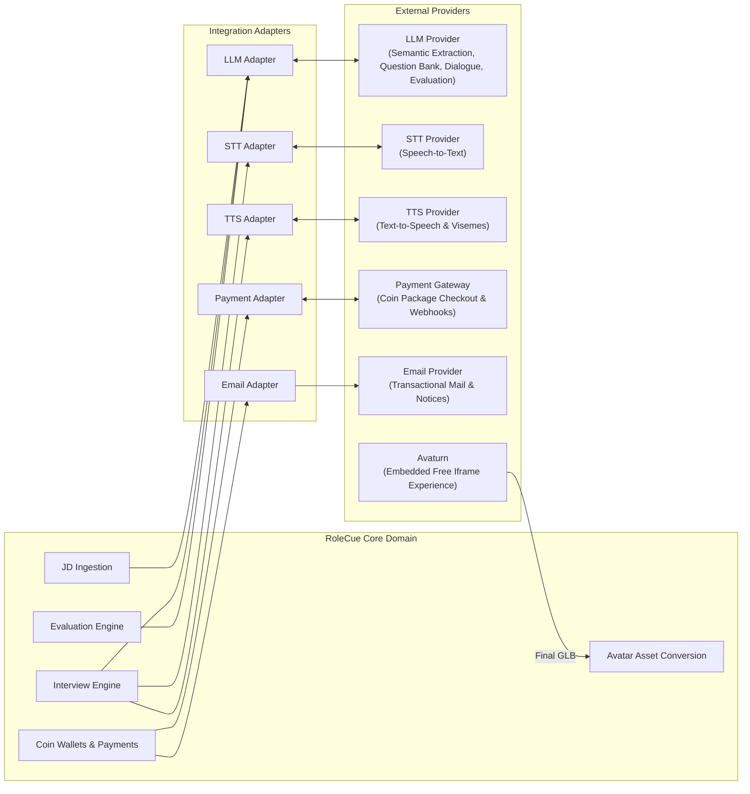

# External Service Integrations

This document specifies the integration architecture, operational requirements, and fault-tolerance policies for external third-party service providers connected to RoleCue.

---

## 1. Architectural Integration Principles

1. **Vendor Agnosticism:**
   Core domain entities and business workflows must never depend directly on vendor-specific SDKs or proprietary JSON schemas. Service-provider APIs are encapsulated behind internal interface adapters.
2. **Deterministic Pre/Post Validation:**
   Outputs from external AI providers (LLM extractions, STT transcripts) are treated as untrusted data. They must undergo deterministic schema validation and sanitization before entering domain persistence.
3. **Graceful Fallback:**
   When an external service experiences transient latency spikes or network timeouts, the platform must degrade gracefully without corrupting persisted session state or dropping conversation history.
4. **No Speculative Service Integrations:**
   RoleCue connects strictly to approved external service boundaries: LLM, STT, TTS, Payment Gateway, Email, and the embedded Avaturn iframe. There are **no external identity verification / eKYC providers, no AI video fraud/cheating analysis services, and no separate cloud storage providers** modeled as external architecture actors.

---

## 2. Integration Catalog

The RoleCue browser embeds the free Avaturn iframe directly. Avaturn owns capture instructions, three-photo capture, validation and retakes, preview generation, customization, and final GLB generation. RoleCue receives the final GLB, converts it to VRM, and persists the VRM asset in the user's avatar inventory. This is not an Avaturn Pro subscription, backend Avaturn API integration, or RoleCue-managed reconstruction pipeline.

---

## 3. Provider Specifications

### 3.1. Large Language Model (LLM) Provider
* **Purpose:**
  * **Structured JD Extraction:** Parses unstructured job description text into validated JSON technical competencies (title, seniority, categorized skills, technologies).
  * **Question-Bank Generation:** Autonomously builds the internal core-question bank (`core_questions`, conceptual Blueprint) from confirmed requirements and refinement notes.
  * **Adaptive Questioning Dialogue:** Analyzes candidate answers against the interview context to evaluate turns and generate bounded follow-up questions.
  * **Multi-Dimensional Evaluation:** Evaluates full session transcripts against the session snapshot's evaluation configuration across technical competencies.
* **Unresolved Decision Provider / Jev Status:**
  * Deciding whether to ask a follow-up and generating follow-up question wording are distinct responsibilities.
  * **Jev/TypeSafe is tentative, NOT selected.** No specific external vendor or standalone decision service has been ratified. The integration layer does not mandate a dedicated decision-provider SDK or lock follow-up decisions to a single vendor.
* **Fault Handling:**
  * If extraction fails or outputs an invalid schema, the system retries with adjusted parameters; surfaces an extraction failure if unresolvable.
  * If follow-up determination times out during a live turn, the system proceeds to the next core question from the bank to maintain conversational fluency.

### 3.2. Speech-to-Text (STT) Provider
* **Purpose:**
  Transcribes incoming candidate audio stream chunks into clean text transcripts during live interview simulations.
* **Fault Handling:**
  In the event of partial packet loss or STT dropouts, the system prompts the candidate or allows speech retry to maintain conversational continuity.

### 3.3. Text-to-Speech (TTS) Provider
* **Purpose:**
  Synthesizes realistic spoken interviewer audio from generated question text and produces synchronized blend-shape viseme timing metadata.
* **Requirements:**
  * Must support returning speech audio paired with phoneme/viseme timing metadata for facial blend-shape animation.
  * Must support multiple voice styles (cataloged and managed as Admin-governed Voice Profiles).
* **Fault Handling:**
  If the TTS stream fails, the session can display the question as text while attempting audio reconnection, avoiding an abrupt session abort.

### 3.4. Avaturn Embedded Avatar Experience
* **Purpose:**
  Provides the free iframe experience embedded by RoleCue for Personal 3D Avatar creation.
* **Ownership Boundary:**
  * Avaturn presents capture instructions, collects the three required photos, performs capture validation and retakes, generates the preview avatar, provides accessory/customization UI, and generates the final GLB.
  * RoleCue receives the final GLB, converts it to VRM, persists the VRM Personal 3D Avatar, and associates it with the owning Candidate or Recruiter in their avatar inventory.
* **Integration Constraint:**
  RoleCue does not use Avaturn Pro APIs or backend Avaturn API orchestration for capture, customization, or avatar generation. No marketplace or admin asset-upload catalog is integrated.

### 3.5. Payment Gateway (PayOS)
* **Purpose:**
  Facilitates secure electronic payment processing for **coin package purchases** using real money via PayOS. (Memberships and subscriptions have been completely superseded).
* **Confirmed Provider:**
  PayOS is the confirmed provider. PayOS order codes are tracked directly on the unified `transactions` table (`payos_order_code`). The team explicitly rejected the proposed redesign into split `payment_orders` / `coin_transactions` tables; the unified transaction model is the accepted contract.
* **Security & Invariants:**
  * Webhook callbacks must be cryptographically signed by PayOS.
  * Webhook handlers must verify signatures and maintain strictly idempotent processing to prevent duplicate status changes or coin minting.
  * Real-money transactions acquire coin packages; internal coin spending (practice start fees, interview slot funding, avatar generation fees, avatar capacity purchases) and internal refunds (unused slot coin refunds upon terminal Job Posting auto-close via `Refund unused JP Candidate Slot`) execute purely within the internal database and do **NOT** invoke PayOS.

### 3.6. Email Provider
* **Purpose:**
  Dispatches transactional system emails:
  * Account registration verification tokens.
  * Forgot Password recovery links.
  * Account lock and unlock notifications (notifying users when an Administrator locks or unlocks their account, including lock reason).
  * Application submission confirmations, CV screening outcome notices, and final application decisions (Approved/Rejected).
  * Security alerts and account notifications.
* **Operational Invariants:**
  * Asynchronous queue-based dispatch; failures in email delivery must never block core transactional API flows.
  * **Decoupling Invariant for Account Locks:** The database status transition (`is_locked`, `lock_reason`) executes immediately and independently of email transmission. A failure in the external email service must never roll back or block an administrative lock or unlock action.
