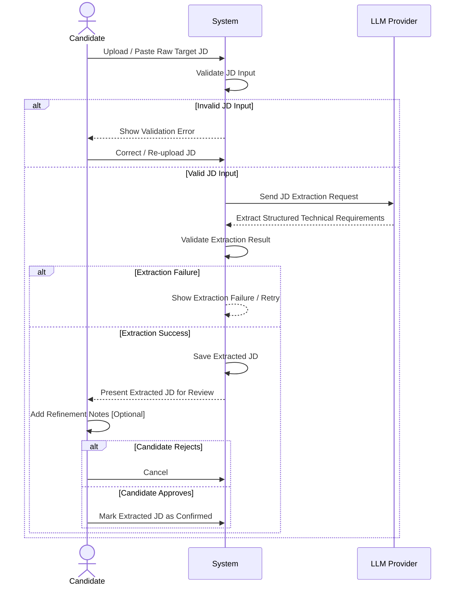
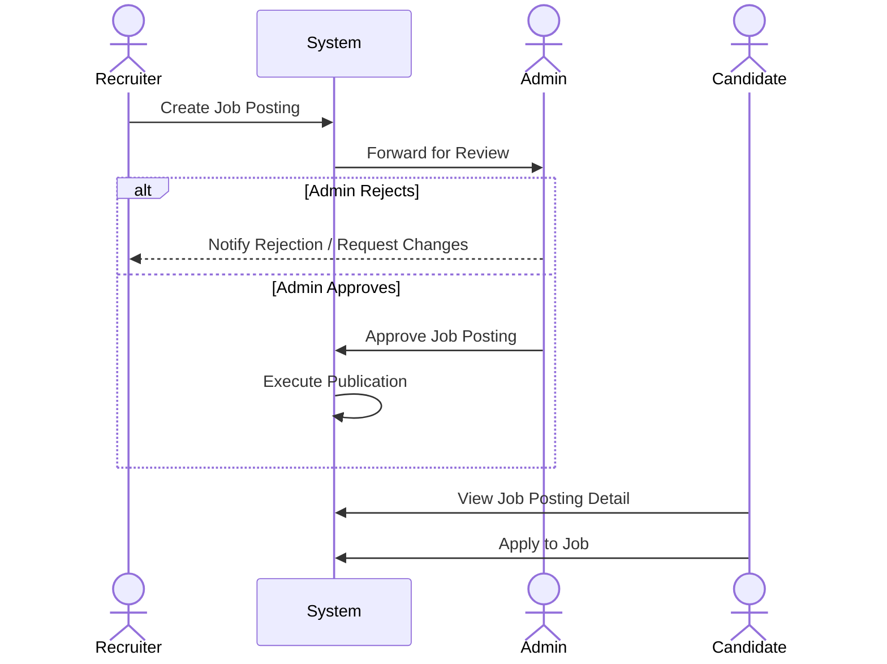
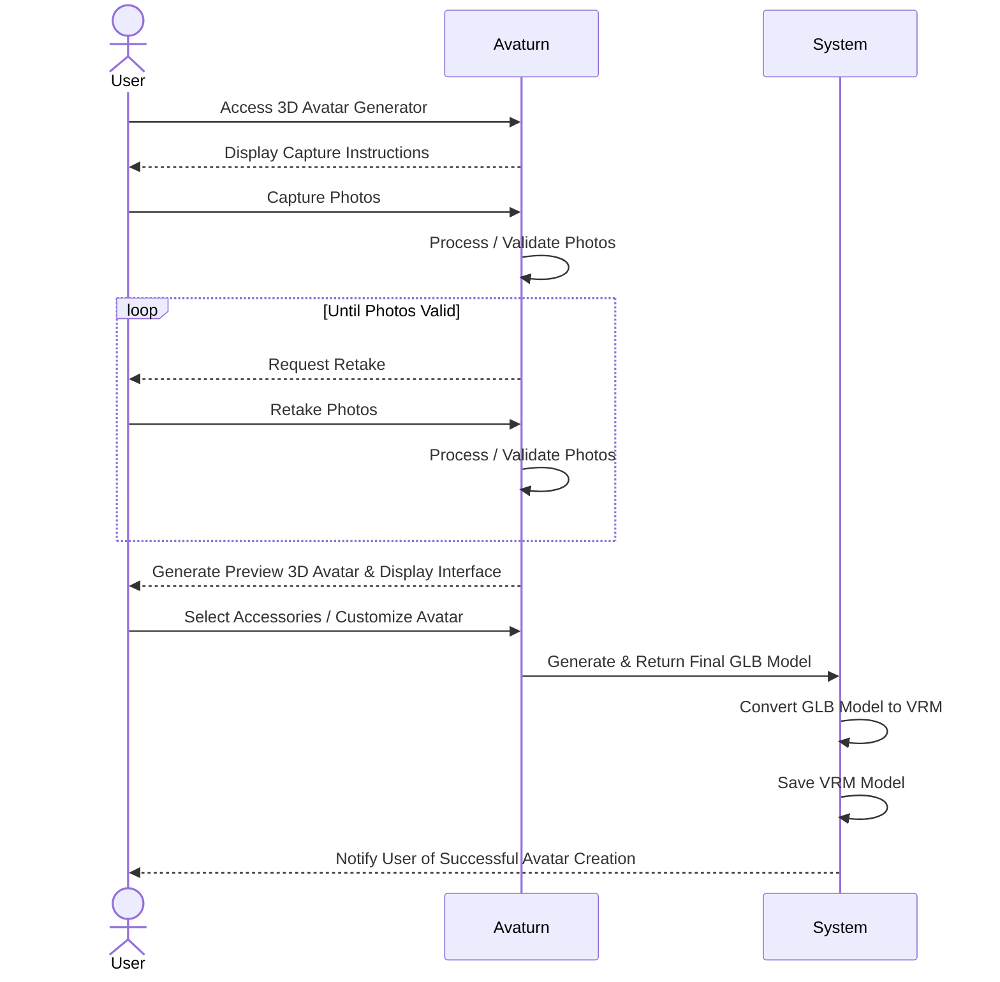
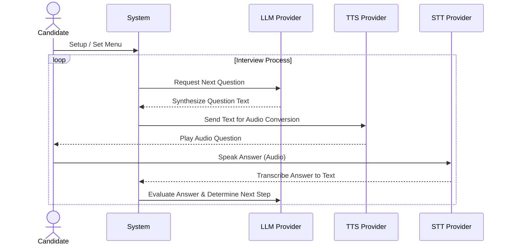

**MINISTRY OF EDUCATION AND TRAINING**

# **FPT UNIVERSITY**

Capstone Project Document

**Design and Development of an AI-Powered Virtual Technical Interview Simulation Platform with a 3D Virtual Interviewer**

**Product Name:** RoleCue  
**Project Code:** 09_GFA26SE84  
**Group Name:** Group 09

**Supervisor:** Mr. Nguyen The Hoang (`hoangnt20@fe.edu.vn`)

**Group Members:**

- Nguyen Huynh Nhat Anh – Team Leader / Full Stack Engineer (SE190291)
- To Chi Bao – Member / Full Stack Engineer (SE190084)
- Huynh Minh Khang – Member / Full Stack Engineer (SE192197)
- Nguyen Tan Trong – Member / Full Stack Engineer (SE190353)
- Dang Phuong Nam – Member / Full Stack Engineer (SE192107)

Ho Chi Minh City, September 2026

---

## **Table of Contents**

| Section                                                                 | Title | Page |
| :---------------------------------------------------------------------- | :---- | :--- |
| **Acknowledgement**                                                     |       | 4    |
| **Definition and Acronyms**                                             |       | 5    |
| **I. Project Introduction**                                             |       | 8    |
| 1. Overview                                                             |       | 8    |
| 1.1 Project Information                                                 |       | 8    |
| 1.2 Project Team                                                        |       | 8    |
| 2. Product Background                                                   |       | 9    |
| 2.1 The Industry Dilemma in Technical Hiring                            |       | 9    |
| 2.2 Pedagogical Rationale for Simulation                                |       | 11   |
| 3. Existing Systems                                                     |       | 12   |
| 3.1 Final Round AI                                                      |       | 12   |
| 3.2 interviewing.io                                                     |       | 14   |
| 3.3 LeetCode & Traditional Assessment Platforms                         |       | 16   |
| 3.4 Competitive Analysis & Synthesis Matrix                             |       | 17   |
| 4. Business Opportunity                                                 |       | 19   |
| 5. Software Product Vision                                              |       | 22   |
| 6. Project Scope & Limitations                                          |       | 25   |
| 6.1 Major Features (FE-01 to FE-16)                                     |       | 25   |
| 6.2 Technical Limitations & Exclusions                                  |       | 29   |
| **II. Project Management Plan**                                         |       | 31   |
| 1. Overview                                                             |       | 31   |
| 1.1 Scope & Estimation (WBS & Man-Days)                                 |       | 31   |
| 1.2 Project Objectives                                                  |       | 36   |
| 1.3 Project Risks                                                       |       | 38   |
| 2. Management Approach                                                  |       | 41   |
| 2.1 Project Process & Sprint Lifecycle                                  |       | 41   |
| 2.2 Quality Management & Verification Gates                             |       | 44   |
| 2.3 Training Plan                            |       | 46   |
| 3. Project Deliverables                                                 |       | 47   |
| 4. Responsibility Assignments (RACI Matrix)                             |       | 48   |
| 5. Project Communications Protocol                                      |       | 50   |
| 6. Configuration Management                                             |       | 51   |
| 6.1 Document Management                                                 |       | 51   |
| 6.2 Source Code Management & Gitflow                                    |       | 52   |
| 6.3 Tools, Frameworks & Infrastructures                                 |       | 53   |
| **III. Software Requirements Specification**                            |       | 55   |
| 1. Product Overview                                                     |       | 55   |
| 1.1 System Context Diagram                                              |       | 55   |
| 1.2 External System Interfaces                                          |       | 58   |
| 2. User Requirements                                                    |       | 60   |
| 2.1 System Actors Specification                                         |       | 60   |
| 2.2 Use Cases                                                           |       | 63   |
| 2.2.1 Use Case Diagrams (Overview, Candidate, Recruiter & Admin)        |       | 63   |
| 2.2.2 Complete Use Case Catalog & Descriptions (60 Use Cases)           |       | 66   |
| 3. Functional Requirements                                              |       | 75   |
| 3.1 System Functional Overview                                          |       | 75   |
| 3.1.1 Screens Flow & Main Business Activity Flows                       |       | 75   |
| 3.1.2 Screen Descriptions Catalog (34 Screens)                          |       | 78   |
| 3.1.3 Screen Authorization Matrix                                       |       | 86   |
| 3.1.4 Non-Screen Functions (8 Core Daemons)                             |       | 89   |
| 3.1.5 Entity Relationship Diagram (ERD) & Data Dictionary (11 Entities) |       | 93   |
| 3.2 Module 1: Authentication, Authorization & Account Management        |       | 103  |
| 3.3 Module 2: Job Description & Interview Blueprint Management          |       | 114  |
| 3.4 Module 3: 3D AI Virtual Interview Simulation                        |       | 125  |
| 3.5 Module 4: AI Performance Evaluation & Comprehensive Reporting       |       | 138  |
| 3.6 Module 5: Recruitment Pipeline & Job Board Management               |       | 149  |
| 3.7 Module 6: Subscription, Billing & Payment Gateway Integration       |       | 161  |
| 3.8 Module 7: Platform Administration & AI System Configuration         |       | 171  |
| 4. Non-Functional Requirements                                          |       | 181  |
| 4.1 External Interfaces                                                 |       | 181  |
| 4.2 Quality Attributes                                                  |       | 183  |
| 4.2.1 Usability & Accessibility                                         |       | 183  |
| 4.2.2 Security & Data Protection                                        |       | 184  |
| 4.2.3 Performance & Latency Budgets                                     |       | 186  |
| 4.2.4 Reliability, Fault Tolerance & Data Integrity                     |       | 188  |
| 4.2.5 Maintainability & Extensibility                                   |       | 190  |
| 5. Requirement Appendix                                                 |       | 191  |
| 5.1 Business Rules Catalog (BR-01 to BR-30)                             |       | 191  |
| 5.2 Common Requirements Specification (CR-01 to CR-18)                  |       | 198  |
| 5.3 Application Messages Catalog (MSG-01 to MSG-55)                     |       | 203  |

---

## **Acknowledgement**

First and foremost, we would like to express our deepest appreciation and heartfelt gratitude to our academic supervisor, **Mr. Nguyen The Hoang**, for his dedicated guidance, constructive criticism, and continuous technical advice throughout the conception, architectural design, and implementation of this capstone project. His profound understanding of distributed systems, artificial intelligence integration, and software engineering rigor has been an invaluable compass for our team, challenging us to elevate our standards and build an enterprise-grade solution.

We would like to express our sincere appreciation to the faculty members and academic reviewers of the Department of Software Engineering at **FPT University Ho Chi Minh City** for their critical evaluation and constructive suggestions during our formal project defense milestones. In particular, we extend our special gratitude to our mentor for the insightful feedback on our preliminary requirements modeling. That guidance directly inspired us to expand the platform's boundaries—incorporating the corporate **Recruiter** role, integrating candidate application pipelines, formalizing guest onboarding and 2-Factor Authentication, and instituting automated session lifecycle management.

We also thank the academic leadership of FPT University for fostering an innovative, project-centric educational environment that empowers students to address real-world challenges through modern software engineering methodologies.

Finally, we express our profound gratitude to our families, fellow students, and colleagues for their constant encouragement, patience, and unwavering belief in our abilities throughout this intensive journey. Their support provided the motivation for our team to remain steadfast, collaborate effectively, and successfully complete this graduation thesis project.

---

## **Definition and Acronyms**

| **Acronym / Term**            | **Definition**                                                                                                                                  |
| :---------------------------- | :---------------------------------------------------------------------------------------------------------------------------------------------- |
| **ACID**                      | Atomicity, Consistency, Isolation, Durability — A set of properties guaranteeing reliable database transaction processing.                      |
| **ADR**                       | Architecture Decision Record — A lightweight document capturing an important architectural decision, context, and consequences.                 |
| **AI**                        | Artificial Intelligence — Computational algorithms designed to simulate human cognitive functions and problem-solving abilities.                |
| **API**                       | Application Programming Interface — A set of defined protocols and tools for building software application communications.                      |
| **BA**                        | Business Analyst / Business Analysis — The discipline of identifying business needs and determining solutions to business problems.             |
| **Bcrypt**                    | A password-hashing function based on the Blowfish cipher incorporating salts and adaptive work factors to resist brute-force attacks.           |
| **Blendshape / Morph Target** | A 3D computer graphics technique used to deform meshes for facial animation, emotional expression, and phonetic lip-synchronization.            |
| **Blueprint**                 | A structured, persistent assessment plan derived from a Job Description defining evaluated competencies, question quotas, and rubrics.          |
| **BR**                        | Business Rule — Formal operational logic defining business policies and behavioral constraints enforced across the platform.                    |
| **CI/CD**                     | Continuous Integration and Continuous Deployment — Automated practices of building, testing, and deploying software changes continuously.       |
| **CR**                        | Common Requirement — Cross-cutting architectural and behavioral specifications applicable across multiple software modules.                     |
| **CRUD**                      | Create, Read, Update, Delete — The four fundamental functions of persistent data storage management.                                            |
| **ERD**                       | Entity Relationship Diagram — A visual diagram depicting database entities, relationships, attributes, and cardinality constraints.             |
| **FSM**                       | Finite State Machine — A computational model representing states and state transitions governing the interview conversational flow.             |
| **GLTF / GLB**                | Graphics Language Transmission Format — An open, royalty-free specification for the efficient transmission and loading of 3D scenes and models. |
| **GUI**                       | Graphical User Interface — Visual interaction front-end presented to users on web browsers.                                                     |
| **HMAC**                      | Hash-Based Message Authentication Code — Cryptographic construction used to verify data integrity and authenticity of webhooks.                 |
| **JD**                        | Job Description — Formal document listing technical skills, duties, qualifications, and domain knowledge expected by employers.                 |
| **JSON**                      | JavaScript Object Notation — Lightweight data-interchange format used for RESTful API payloads and semi-structured database columns.            |
| **JSONB**                     | Binary JSON format in PostgreSQL storing pre-parsed JSON data with indexing capabilities for high-performance querying.                         |
| **JWT**                       | JSON Web Token — An open standard (RFC 7519) for securely transmitting cryptographically signed information between client and server.          |
| **LLM**                       | Large Language Model — Advanced deep generative language model utilized for JD parsing, dialogue generation, and answer evaluation.             |
| **NFR**                       | Non-Functional Requirement — Criteria used to judge system operation (performance, security, scalability) rather than specific behaviors.       |
| **ORM**                       | Object-Relational Mapping — Software layer converting database records to programming language objects.                                         |
| **OTP**                       | One-Time Password — Automatically generated numeric string used for single-use authentication and two-factor challenge verification.            |
| **PCM**                       | Pulse-Code Modulation — A method used to digitally represent sampled analog audio signals.                                                      |
| **RBAC**                      | Role-Based Access Control — Method of restricting network or system access based on the roles of individual users within an enterprise.         |
| **REST**                      | Representational State Transfer — Architectural style for distributed systems utilizing standard HTTP methods and stateless communication.      |
| **SDD**                       | Software Design Description — Architectural and detailed design document of the software system.                                                |
| **SPMP**                      | Software Project Management Plan — The controlling document for managing a software project throughout its lifecycle.                           |
| **sqlc**                      | A compile-time tool that generates fully type-safe, idiomatic Go code directly from raw SQL queries.                                            |
| **SRS**                       | Software Requirements Specification — Formal description of the software system requirements and operational behaviors.                         |
| **STT**                       | Speech-to-Text — Speech recognition technology transforming spoken audio input into formatted textual transcripts.                              |
| **TTS**                       | Text-to-Speech — Speech synthesis technology converting written textual prompts into human-like audio waveforms.                                |
| **UAT**                       | User Acceptance Testing — Formal testing phase where intended end-users verify that the software meets operational business needs.              |
| **UC**                        | Use Case — A list of actions or event steps defining interactions between an actor and a system to achieve a specific goal.                     |
| **UUID**                      | Universally Unique Identifier — A 128-bit label used for unique identification of records across distributed systems.                           |
| **Viseme**                    | Visual speech representation — The visual equivalent of a phoneme representing the mouth shape corresponding to a spoken sound.                 |
| **WBS**                       | Work Breakdown Structure — Hierarchical decomposition of the total project scope to accomplish project deliverables.                            |
| **WebGL**                     | Web Graphics Library — JavaScript API for rendering high-performance interactive 3D and 2D graphics within modern web browsers.                 |

---

## **I. Project Introduction**

#### **1. Overview**

##### **1.1 Project Information**

- **Project Name:** Design and Development of an AI-Powered Virtual Technical Interview Simulation Platform with a 3D Virtual Interviewer
- **Product Name:** RoleCue
- **Project Code:** 09_GFA26SE84
- **Group Name:** Group 09
- **Academic Course:** Capstone Project (SEP490) – Fall 2026 Semester
- **Institution:** FPT University Ho Chi Minh City, Department of Software Engineering
- **Software Type:** Web-based Full-Stack Application (Next.js 16 App Router, React 19, Go Backend, PostgreSQL, WebGL Three.js)
- **Source Code Repository:** `https://github.com/swp391-group3/ai-interview-practice`
- **Production URL:** `https://rolecue.site` (Deployed Cloud Staging / Production)

##### **1.2 Project Team**

| **Full Name**             | **Student Code** | **Assigned Role**        | **Email**                    | **Mobile**   | **Core Responsibilities**                                                                  |
| :------------------------ | :--------------- | :----------------------- | :--------------------------- | :----------- | :----------------------------------------------------------------------------------------- |
| **Nguyen The Hoang**      | FE Supervisor    | Academic Supervisor      | `hoangnt20@fe.edu.vn`        | 0986 628 525 | Project oversight, architectural review, milestone evaluation, academic direction.         |
| **Nguyen Huynh Nhat Anh** | SE190291         | Team Leader / Full Stack | `anhnhse190291@fpt.edu.vn`   | 0901 234 567 | Architecture orchestration, JD extraction, blueprint planning engine, AI prompt design.    |
| **To Chi Bao**            | SE190084         | Full Stack / Backend     | `baotcse190084@fpt.edu.vn`   | 0912 345 678 | Go API development, PostgreSQL migrations, sqlc queries, payment gateway webhooks.         |
| **Huynh Minh Khang**      | SE192197         | Full Stack / 3D & Audio  | `khanghmse192197@fpt.edu.vn` | 0923 456 789 | Three.js WebGL avatar rendering, morph target lip-sync, STT/TTS audio streaming pipelines. |
| **Nguyen Tan Trong**      | SE190353         | Full Stack / Frontend    | `trongntse190353@fpt.edu.vn` | 0934 567 890 | Next.js 16 web application, Zustand client state, Tailwind UI/UX, candidate workflows.     |
| **Dang Phuong Nam**       | SE192107         | Full Stack / QA & DevOps | `namdpse192107@fpt.edu.vn`   | 0945 678 901 | CI/CD automation, Playwright end-to-end testing, Docker VPS deployment, recruiter portal.  |

---

#### **2. Product Background**

##### **2.1 The Industry Dilemma in Technical Hiring**

In today's rapidly evolving global software industry, technical interviews serve as the definitive evaluation filter determining entry into professional internships, junior engineering roles, and career advancement. However, a profound structural disconnect persists between the way candidates prepare for technical interviews and the way corporate employers conduct them:

1. **The Disconnect of Algorithmic Puzzles vs. Real Job Requirements:**
   Traditional preparation platforms emphasize isolated algorithmic problem-solving (e.g., dynamic programming, tree traversals, and mathematical puzzles). While useful for assessing raw computational fluency, modern software engineering positions demand contextual competencies: designing scalable RESTful APIs, configuring cloud infrastructure, reasoning about database concurrency, managing microservice trade-offs, and debugging complex runtime errors. A candidate may solve hundreds of algorithm problems and yet struggle when asked to explain distributed cache invalidation strategies required by a specific **Job Description (JD)**.
2. **The Scarcity and Cost of Human Mock Interviews:**
   To practice behavioral articulation and conversational problem-solving, candidates historically sought peer mock interviews or commercial coaching services. However, qualified senior software engineers capable of delivering rigorous technical screenings are scarce and expensive. Commercial human mock interview services command rates from $150 to $300 per hour. Consequently, university students and low-income candidates cannot access repeated, iterative practice sessions.
3. **The Static and Non-Adaptive Nature of Question Banks:**
   Static question banks provide pre-written questions and static answer keys. In contrast, genuine technical interviews are dynamic dialogues. When an experienced interviewer hears a vague response (e.g., _"We used Kafka for messaging"_), they immediately pivot to probe deeper: _"Why Kafka instead of RabbitMQ? How did you ensure exactly-once delivery semantics under consumer partition rebalances?"_ Static tools cannot reproduce this adaptive cognitive pressure.
4. **Superficial, Binary Assessment and Lack of Actionable Diagnostics:**
   Candidates who fail technical interviews rarely receive actionable diagnostic feedback due to employer liability constraints and time limitations. Candidates are left wondering whether they failed due to flawed technical architecture, unconfident communication, insufficient depth, or misaligned vocabulary.
5. **The Disconnected Recruitment Funnel:**
   From the corporate perspective, recruiters are inundated with hundreds of generic resumes for every posted position. Filtering resumes takes substantial recruiter hours, yet paper resumes fail to demonstrate whether an applicant can communicate technical decisions coherently under pressure.

##### **2.2 Pedagogical Rationale for Simulation**

Educational psychology and deliberate practice theory establish that complex cognitive and behavioral skills are best developed in realistic, psychologically safe simulation environments:

- **Psychological Safety & Anxiety Reduction:** Technical interviews induce acute performance anxiety. Practicing with an embodied 3D virtual agent reduces social judgment apprehension, allowing candidates to make mistakes, experiment with technical explanations, and build vocal confidence.
- **Immediate Diagnostic Feedback Loops:** Learning accelerates when error feedback is immediate and granular. RoleCue provides post-session rubric evaluations mapping candidate performance to specific competency dimensions.
- **Alignment with Employer Job Descriptions:** By anchoring the interview blueprint strictly in the employer's Job Description, RoleCue bridges academic knowledge and corporate operational reality.

---

#### **3. Existing Systems**

To ground our architectural and product decisions in established industry benchmarks, the engineering team conducted a thorough comparative investigation of three leading platforms:

##### **3.1 Final Round AI**

Final Round AI is an AI-native interview co-pilot and preparation platform designed to support job seekers through real-time transcription, automated cheat sheets, mock interviews, and resume optimization.

- **System Actors:** Candidates / Job Seekers and Platform Administrators.
- **Key Features:**
    - _Interview Copilot:_ Provides real-time assistive cues, speech transcription, and suggested technical answers during ongoing live remote interviews.
    - _AI Mock Interview:_ Generates AI-driven practice interview sessions with voice input and text responses.
    - _Resume Analysis and Question Prediction:_ Analyzes candidate resumes and company profiles to predict probable interview questions.
    - _Performance Scoring:_ Generates post-session feedback regarding speaking speed, filler words, and answer relevancy.
- **Strengths (Pros):**
    - Advanced real-time assistive guidance during actual teleconference calls.
    - Wide breadth of role categories covering software engineering, product management, sales, and finance.
    - Modern web interface with rapid turnaround times for speech-to-text transcription.
- **Weaknesses (Cons):**
    - **Ethical and Academic Integrity Concerns:** Its primary commercial differentiator—the real-time interview copilot—encourages unauthorized prompting during live company interviews, which violates employer codes of conduct and academic integrity policies.
    - **Absence of 3D Embodied Conversational Interaction:** Mock interviews utilize plain audio-visual wave animations or static synthetic images, lacking an expressive, embodied 3D virtual interviewer capable of conveying non-verbal cues and phonetic lip synchronization.
    - **Weak JD-to-Blueprint Customization:** Candidates cannot review, tune, or inspect the underlying assessment matrix extracted from a complex Job Description before launching practice sessions.
    - **No Integrated Recruitment Pipeline:** Operates purely as a private candidate utility without capabilities for recruiters to post jobs or review vetted applicant performance.
- **Platform URL:** `https://www.finalroundai.com/`

##### **3.2 interviewing.io**

interviewing.io is a premier anonymous technical mock interview and recruitment platform where candidates practice technical coding and system design interviews with verified engineers from top-tier technology firms (e.g., Google, Meta, Amazon).

- **System Actors:** Candidates (Job Seekers), Interviewers (Senior Industry Engineers), and Corporate Employers/Recruiters.
- **Key Features:**
    - _Anonymous Human Mock Interviews:_ Rigorous 60-to-90-minute live coding sessions conducted via an anonymous audio call and collaborative online code editor.
    - _Actionable Human Feedback:_ Comprehensive qualitative and quantitative scoring provided directly by seasoned engineers immediately after session termination.
    - _Fast-Track Recruitment:_ Candidates who consistently achieve top-decile ratings can unlock direct job interview invitations with partner tech companies without standard resume filtering.
    - _Recorded Interview Library:_ Extensive searchable library of recorded anonymous technical interviews for self-study.
- **Strengths (Pros):**
    - Authenticity of live interaction with verified senior software engineers from elite tech firms.
    - True anonymous environment removing bias during technical assessment.
    - High industry credibility and proven placement track record.
- **Weaknesses (Cons):**
    - **Prohibitive Pricing Model:** Individual mock interview sessions cost between $150 and $250 per session, making frequent practice inaccessible for university students and low-income candidates.
    - **Scheduling Bottlenecks:** Requires coordinating mutually available calendar slots with human engineers, eliminating on-demand, round-the-clock availability.
    - **Subjectivity and Human Inconsistency:** Human interviewers differ widely in their evaluation strictness, interview style, and feedback quality.
    - **Limited Scalability:** Relies entirely on human labor supply, creating an operational bottleneck that cannot scale instantaneously to meet demand spikes.
- **Platform URL:** `https://interviewing.io/`

##### **3.3 LeetCode & Traditional Assessment Platforms**

LeetCode is the global standard for competitive programming and technical interview algorithm screening.

- **System Actors:** Programmers / Job Seekers, Corporate Enterprise Recruiters, Platform Administrators.
- **Key Features:**
    - Massive repository of over 3,000 algorithmic challenges categorized by difficulty, topic tag, and company interview frequency.
    - Automated cloud judge supporting 14+ programming languages with automated memory and execution time benchmarking.
    - Corporate assessment portals allowing employers to dispatch timed coding assessments to applicants.
- **Strengths (Pros):**
    - Industry gold standard for data structures and algorithm screening.
    - Massive, active developer community providing multi-language solutions and discussion threads.
    - Highly reliable, instantaneous code execution sandbox.
- **Weaknesses (Cons):**
    - **Zero Spoken Verbal Interaction:** Eliminates communication, architectural explanation, requirement clarification, and conversational nuance entirely.
    - **Detached from Practical Job Descriptions:** Algorithm challenges rarely reflect daily software development tasks (e.g., database modeling, API error handling, cloud deployments).
    - **No Adaptive Probing:** The automated judge executes unit test cases; it cannot challenge a candidate's design decisions or probe their conceptual understanding.
- **Platform URL:** `https://leetcode.com/`

##### **3.4 Competitive Analysis & Synthesis Matrix**

| **Evaluation Dimension**         | **LeetCode**                | **Final Round AI**          | **interviewing.io**          | **RoleCue (Our Solution)**                |
| :------------------------------- | :-------------------------- | :-------------------------- | :--------------------------- | :---------------------------------------- |
| **Primary Interaction Mode**     | Text code editor / Judge    | Audio call + AI cheat-sheet | Voice call + Shared IDE      | **Spoken Dialogue + 3D WebGL Avatar**     |
| **Interviewer Presence**         | None (Automated runner)     | 2D audio wave / static art  | Real Human Engineer          | **Embodied 3D Avatar with Lip-Sync**      |
| **JD Personalization**           | None (Generic problem tags) | Company profile heuristics  | Human interviewer discretion | **Deterministic AI Extraction from JD**   |
| **Blueprint Transparency**       | None                        | Closed black box            | Human-designed               | **Full Candidate Review & Customization** |
| **Adaptive Follow-up Dialogue**  | None                        | Surface-level suggestions   | Natural human probing        | **Dynamic Contextual AI Probing FSM**     |
| **Evaluation Depth**             | Test case pass/fail rate    | Speech speed, filler words  | Comprehensive rubric         | **5-Axis Competency Diagnostic Report**   |
| **Study Recommendations**        | Similar algorithm tags      | Generic coaching advice     | Engineer written notes       | **Personalized Technical Growth Roadmap** |
| **Dual-Sided Job Board**         | Enterprise assessment links | None (Candidate-only)       | High-decile fast-track       | **Integrated Recruiter Portal & Board**   |
| **Verified Skill Credentialing** | None                        | None                        | Company referral             | **Attached Mock Score Badges**            |
| **On-Demand Availability**       | Instantaneous               | Instantaneous               | Requires booking             | **Instantaneous 24/7 Availability**       |
| **Pricing / Cost per Session**   | Free / $35/mo Premium       | $20–$50 / month             | $150–$250 per session        | **Freemium + Low-Cost Student Model**     |
| **Academic & Ethical Integrity** | High                        | Low (Aids live cheating)    | High                         | **High (Ethical Deliberate Practice)**    |

---

#### **4. Business Opportunity**

RoleCue addresses a repeat-practice problem for students, recent graduates, career switchers, and software developers preparing for a specific technical role. These candidates may have access to articles, question banks, or occasional mock interviews, but those resources are difficult to repeat under consistent conditions. An automated simulator can make structured practice available on demand without requiring another person to schedule and conduct every session.

The principal opportunity is job-specific preparation. A Candidate is usually applying to a role defined by a particular technology stack and set of responsibilities. RoleCue converts that JD into reviewed requirements and then into an interview blueprint. The result is more targeted than selecting only a broad category such as Backend, Frontend, or Data. It also gives the Candidate visibility into why a subject appears in the session.

A second opportunity is to combine technical depth with realistic communication practice. Technical knowledge alone does not guarantee a clear interview answer. Candidates must describe assumptions, explain reasoning, respond to follow-up questions, and communicate trade-offs. Voice interaction and a visible interviewer create a stronger rehearsal context than a text-only quiz, while the five evaluation competencies separate correctness from depth, relevance, problem-solving, and communication.

Research supports the value of structured interview preparation, although it also warns against assuming that repetition alone is sufficient. Roulin, Pham, and Bourdage's 2023 study of asynchronous video interviews found that training was associated with more structured responses and improved performance, while a basic practice opportunity by itself had negligible effects in the studied conditions. This supports RoleCue's decision to pair repeated simulation with explicit criteria, question-level feedback, and recommendations rather than treating completion of a mock session as the learning outcome.

Virtual interview training also has potential when it provides concrete behavioural feedback. Langer and colleagues reported improved interview performance and reduced anxiety in a virtual employment-interview training study that analysed non-verbal behaviour and provided real-time feedback. RoleCue does not adopt camera-based behavioural scoring in the current scope, but the study supports the broader value of an interactive virtual training environment. RoleCue focuses its assessment on spoken content and the competencies approved in the project register.

The competitor review shows an integration opportunity. Final Round AI publicly documents job-goal context, spoken AI practice, multiple scenarios, and automatic debriefing. interviewing.io offers strong coding and system-design practice with both AI and experienced engineers. RoleCue's proposed contribution is the combination of a Candidate-reviewed JD model, a reusable and traceable interview blueprint, adaptive runtime questions, a synchronized 3D interviewer, JD-grounded evaluation, and an administrator-controlled technical taxonomy within one academic project.

The system also creates an opportunity for measurable improvement. Because JDs, blueprints, interview turns, and reports are stored separately, a Candidate can repeat practice while preserving the basis of each historical result. Administrators can examine aggregate activity and commonly identified technical weaknesses without changing individual reports. This data can support product improvement, domain coverage decisions, and future evaluation of whether the platform's recommendations help Candidates improve over multiple sessions.

A subscription or interview-credit model can support the operating costs of external AI, speech, and payment services. The registered project scope includes subscription tiers, credit packages, transaction history, and revenue reporting. Exact pricing and free-tier rules are intentionally deferred until provider costs and team policy are confirmed; version 0.2 therefore defines the commercial capability without inventing prices.

RoleCue is a preparation tool, not a recruitment or automated selection system. The business value depends on transparent practice, useful feedback, privacy, and reliable recovery from external-service failures. The product must avoid presenting AI feedback as a hiring verdict and must protect each Candidate's JDs, transcripts, reports, and payment records.

_Research sources: Roulin, Pham and Bourdage 2023; Langer et al. 2016_

---

#### **5. Software Product Vision**

For Candidates preparing for technical roles, RoleCue is a web-based interview practice platform that turns a target Job Description into a transparent, repeatable, and realistic mock interview. Unlike generic question banks, RoleCue allows the Candidate to review extracted requirements before the system creates an assessment blueprint. The platform then conducts a voice-based interview through a 3D virtual interviewer, adapts follow-up questions to the conversation, and produces feedback grounded in the selected role.

For Administrators, RoleCue provides the governance needed to operate the learning platform: account and session management, technical-domain configuration, interview and evaluation settings, avatar and voice catalogue management, subscription and transaction oversight, revenue reporting, and aggregate analytics. The intended product outcome is an accessible practice environment in which Candidates understand what was assessed, why it was assessed, and what to improve before their next interview.

---

#### **6. Project Scope & Limitations**

The project delivers a deployed full-stack web application for two roles: Candidate and Admin. The Candidate journey covers authentication, JD ingestion and review, interview configuration, blueprint generation, voice-based interview execution, history, evaluation reports, subscriptions, credits, billing, and payment. The Admin journey covers governance of accounts, sessions, technical context, interview rules, avatar and voice availability, analytics, subscriptions, transactions, and revenue information.

The approved implementation direction uses a Next.js web client, a Go back end, PostgreSQL, JWT-based authentication, role-based authorization, Large Language Model APIs, Speech-to-Text and Text-to-Speech services, web-based 3D rendering, and a third-party payment gateway. Provider selection and detailed commercial conditions remain implementation decisions; the product requirements do not depend on one vendor.

##### **6.1 Major Features**

RoleCue delivers sixteen (16) comprehensive feature packages addressing the end-to-end simulation, recruitment, and platform governance lifecycle, directly mapped from the formal UML Use Case Diagram:

- **FE-01: Public Landing Page & User Authentication**
    - Public landing page with 3D interactive hero demonstration, platform feature showcases, and transparent membership pricing cards.
    - Multi-role self-registration supporting Candidate and Recruiter account creation with automated email OTP verification.
    - Stateless JWT token issuance (15-minute Access Token, 7-day Refresh Token stored in HTTP-only secure cookies).
    - Mandatory Two-Factor Authentication (2FA) challenge flow utilizing 6-digit numeric email OTP codes with 120-second TTL.
    - Self-service password recovery flow via secure 256-bit cryptographic reset links.
    - Role-Based Access Control (RBAC) middleware strictly isolating Candidate, Recruiter, and Admin operations.
- **FE-02: User Profile & Account Security Management**
    - Candidate profile management: personal bio, technical skill tags, GitHub/LinkedIn URLs, and resume PDF upload.
    - Recruiter corporate profile management: company name, industry sector, website, corporate logo, and office location.
    - In-profile password change with old password verification and cryptographic strength validation.
    - In-profile Two-Factor Authentication (2FA) enablement toggle and security preference settings.
    - User account status lifecycle enforcement (`active`, `locked`, `deactivated`) and instant session token revocation.
- **FE-03: Job Description Ingestion & Management**
    - Direct raw text copy-paste ingestion supporting comprehensive tech job postings with format sanitization.
    - Multi-page PDF document upload with server-side text extraction, sanitization, and layout filtering.
    - Candidate personal Job Description library: view own JDs, search and filter own JDs by title, seniority, and date.
    - Job Description deletion with referential integrity verification against dependent interview sessions.
- **FE-04: AI Technical Requirement Extraction & Review / Confirmation**
    - Generative LLM analysis isolating core technical entities: Programming Languages, Frameworks, Libraries, Databases, Cloud Tools, Architectural Concepts, and Responsibilities.
    - Candidate review interface allowing candidates to inspect, review, and confirm AI-extracted requirements in read-only mode without manual tag editing, ensuring deterministic fidelity with the raw JD.
    - Persistent normalized taxonomy storage enforcing strict candidate ownership data isolation.
- **FE-05: Interview Blueprint Generation & Configuration**
    - 1:N cardinality: One confirmed JD generates multiple reusable, customized Interview Blueprints.
    - Configurable parameters: difficulty (`easy`, `medium`, `hard`), target duration (30, 45, 60 minutes), question count, and avatar/voice selections.
    - Deterministic validation engine verifying balanced coverage across fundamentals, system design, and practical scenario-based problem solving.
- **FE-06: 3D Virtual Interviewer, Avatar Generation & Preview**
    - High-performance WebGL 3D avatar rendering using Three.js and `@react-three/fiber` with studio lighting and camera FOV controls.
    - Realistic morph-target blendshape lip-sync animation synchronized with synthesized speech audio waveforms.
    - Interactive 3D Interviewer Preview lobby allowing candidate to inspect avatar appearance, gestures, and vocal timbre prior to session start.
    - Personal 3D Avatar Generation from candidate photo upload via cloud reconstruction pipeline.
- **FE-07: Real-Time Audio Processing & Interview Readiness Testing**
    - Interactive audio and interview readiness test suite in the pre-interview lobby (microphone capture, volume visualizer, echo/noise check).
    - Browser microphone streaming and Speech-to-Text (STT) real-time transcription.
    - Cloud Text-to-Speech (TTS) vocal synthesis and audio stream buffer management.
    - Sensory feedback state visualizers (speaking waveform, listening radar, AI thinking spinner, connection latency).
- **FE-08: AI Virtual Interview Simulation Engine & Lifecycle**
    - Real-time session state machine: `created`, `in_progress`, `completed`, `interrupted`, and `abandoned`.
    - Conversational Finite State Machine (FSM) managing turn delivery, speech listening, processing states, and transitions.
    - Dynamic adaptive follow-up questioning: analyzes candidate answers and spontaneously generates probing questions to test depth of understanding.
    - Sequential turn tracking (questions, candidate audio/transcripts, timing, and follow-up markers).
    - Seamless network recovery (candidate can reconnect and resume interrupted session within 15 minutes) and automated session sweep by System Handler daemon terminating abandoned sessions.
- **FE-09: Post-Interview AI Evaluation & Comprehensive Reporting**
    - Holistic multi-dimensional assessment across five core competencies: Technical Accuracy, Depth of Understanding, Problem-Solving Methodology, Communication Clarity, and Answer Relevance.
    - Quantitative scoring (0–100) per competency, technical domain breakdowns, and weighted overall score (View Performance Scores).
    - Question-by-question diagnostic critique highlighting positive answers, misconceptions, and suggested model responses (View Question Feedback).
    - Personalized technical improvement roadmap and curated learning recommendations (View Improvement Recommendations).
    - Interactive evaluation dashboard rendering radar charts, score gauges, and collapsible question review cards.
- **FE-10: Interview History & PDF Report Export**
    - Paginated, filterable candidate interview library searchable by date, role, difficulty, and score (Search and Filter Interview Sessions).
    - Full interview session detail inspection, dialogue transcripts, and scorecards.
    - Export full evaluation report as a styled, publication-ready multi-page PDF document (Export Interview Session Result).
- **FE-11: Job Board & Job Posting Management**
    - Recruiter portal: create tech job postings, view own job postings, search and filter own job postings, update active postings, and archive/close listings.
    - Candidate portal: browse approved job postings, search and filter job postings by keywords, technical categories, and salary ranges, and inspect job posting details.
    - Administrative moderation workflow: view and filter job postings, review pending submissions, and approve or reject job postings.
- **FE-12: Job Application Pipeline & Candidate Tracking**
    - Candidate one-click job application submission with profile credentials and optional verified mock interview score badge attachment.
    - Live candidate application status tracking (`applied`, `under_review`, `approved`, `rejected`) and application detail inspection.
    - Recruiter applicant pipeline management: search and filter applications by role, match percentage, and mock score.
    - Recruiter applicant review: inspect candidate dossier and verified PDF evaluation reports, and execute decision workflow (approve/shortlist or reject with candidate notes).
- **FE-13: Subscription, Membership & Payment Gateway Integration**
    - Tiered membership subscriptions (Free Starter, Student Pro) and pay-per-use interview credit packages (Subscribe/Unsubscribe Membership).
    - Third-party Payment Gateway integration (VNPay / Stripe) with secure checkout redirect.
    - Cryptographic webhook verification (HMAC SHA-512), idempotent processing, and atomic database credit allocation.
    - Comprehensive billing and transaction history for users and administrators.
- **FE-14: Platform Administration & AI System Configuration**
    - Manage Voice Profiles: fetch available cloud TTS voices, view voice profiles, and delete inactive profiles.
    - Configure Interview Features: manage AI behavior guidelines (prompt templates, conversational tone, strictness) and edit evaluation criteria rubrics.
    - 3D avatar GLTF asset management: upload models, configure default camera FOVs, and set active interviewer personas.
- **FE-15: Admin User Moderation & Interview Session Oversight**
    - User account governance: view and filter user accounts across Candidate, Recruiter, and Admin roles; suspend or reinstate access (lock/unlock accounts) with mandatory audit notes.
    - Global interview session monitoring: search, filter, and view interview session details and audit logs across all platform users.
- **FE-16: Admin Revenue, Financial Management & Pricing**
    - Financial administration: view payment transactions ledger with payment gateway references and settlement statuses.
    - Revenue analytics: generate and export periodic revenue reports by day, month, and fiscal year with graphical trends.
    - Membership price configuration: adjust subscription package costs, credit allotments, and promotional discount rates.

##### **6.2 Technical Limitations & Exclusions**

To maintain project feasibility within the 15-week SEP490 academic timeline, the following explicit boundaries are established:

- **Browser-Only WebGL Deployment:** RoleCue is optimized for modern desktop web browsers supporting WebGL 2.0 (Google Chrome, Mozilla Firefox, Microsoft Edge, Safari). Native mobile applications (iOS/Android) and legacy browsers without hardware acceleration are excluded.
- **Third-Party AI Service Latency:** Conversational responsiveness depends on external cloud API latency from LLM providers (Google Gemini, OpenAI) and speech synthesis services. Temporary internet latency fluctuations are mitigated via visual loading states but cannot be eliminated entirely.
- **Synthetic Viseme Lip-Sync:** Avatar lip-sync relies on audio-amplitude-based phonetic viseme morph targets. While visually convincing, it does not represent cinema-grade motion capture or real-time facial expression tracking.
- **No Direct Coding IDE Execution:** RoleCue simulates verbal technical screenings, architectural discussions, and conceptual evaluations. It explicitly excludes an in-browser cloud code sandbox or compiler for live algorithmic code execution in the initial release.
- **No Direct Legal Employment Relationship:** RoleCue provides job postings and application transmission as an academic career portal. It does not act as an employment agency or process legally binding employment contracts.

---

## **II. Project Management Plan**

#### **1. Overview**

##### **1.1 Scope & Estimation**

The project management baseline organizes the development scope into a formal Work Breakdown Structure (WBS) aligned with the official FPT University Capstone format (`# | WBS Item | Complexity | Est. Effort (man-days)`). The WBS encompasses all sixteen (16) major feature packages and incorporates all sixty-one (61) operational use cases identified in the formal UML Use Case Diagram.

Effort estimates were established through team Planning Poker sessions calibrated against technical complexity, external cloud API integration dependencies, real-time WebGL rendering requirements, and FPT University capstone engineering standards. For a 5-member engineering team operating across the 15-week SEP490 capstone lifecycle, the total baseline effort is estimated at **165 man-days** (averaging approximately **33 man-days per team member**).

| **#**  | **WBS Item**                                                                                                                                          | **Complexity** | **Est. Effort (man-days)** |
| :----- | :---------------------------------------------------------------------------------------------------------------------------------------------------- | :------------: | :------------------------: |
| **1**  | **FE-01: Public Landing Page & User Authentication**                                                                                                  |                |           **11**           |
| 1.1    | FE-01.1 Public landing page, 3D interactive hero demo, core features showcase, and transparent pricing cards.                                         |     Simple     |             2              |
| 1.2    | FE-01.2 Guest self-registration onboarding supporting Candidate and Recruiter roles with email OTP verification.                                      |     Simple     |             2              |
| 1.3    | FE-01.3 Secure login, JWT stateless access token generation (15m TTL), and refresh token cookie management (7d TTL).                                  |     Medium     |             2              |
| 1.4    | FE-01.4 Mandatory Two-Factor Authentication (2FA) challenge flow with 6-digit numeric email OTP.                                                      |     Medium     |             2              |
| 1.5    | FE-01.5 Self-service password recovery flow via secure time-limited email reset tokens.                                                               |     Simple     |             1              |
| 1.6    | FE-01.6 Role-Based Access Control (RBAC) middleware strictly isolating Candidate, Recruiter, and Admin operations.                                    |     Medium     |             2              |
| **2**  | **FE-02: User Profile & Account Security Management**                                                                                                 |                |           **6**            |
| 2.1    | FE-02.1 Candidate profile management (bio, target role seniority, technical skill highlights, resume PDF upload).                                     |     Simple     |             2              |
| 2.2    | FE-02.2 Recruiter corporate profile management (company name, industry, website, corporate logo, office location).                                    |     Simple     |             1              |
| 2.3    | FE-02.3 In-profile password change with old password verification and cryptographic strength validation.                                              |     Simple     |             1              |
| 2.4    | FE-02.4 In-profile Two-Factor Authentication (2FA) enablement toggle and security preference settings.                                                |     Simple     |             1              |
| 2.5    | FE-02.5 User account status lifecycle enforcement (`active`, `locked`, `deactivated`) and session token revocation.                                   |     Simple     |             1              |
| **3**  | **FE-03: Job Description Ingestion & Management**                                                                                                     |                |           **6**            |
| 3.1    | FE-03.1 Ingest raw Job Description text via direct paste area with formatting sanitization and XSS prevention.                                        |     Simple     |             1              |
| 3.2    | FE-03.2 Upload multi-page PDF documents and parse raw text streams server-side.                                                                       |     Medium     |             2              |
| 3.3    | FE-03.3 Candidate personal Job Description library: view own JDs, search and filter own JDs by title and date.                                        |     Simple     |             2              |
| 3.4    | FE-03.4 Delete Job Description from candidate library with referential integrity validation.                                                          |     Simple     |             1              |
| **4**  | **FE-04: AI Technical Requirement Extraction & Review / Confirmation**                                                                                |                |           **6**            |
| 4.1    | FE-04.1 Asynchronous LLM technical requirement extraction (languages, frameworks, tools, seniority, core concepts).                                   |     Medium     |             3              |
| 4.2    | FE-04.2 Candidate review UI allowing candidate to inspect, review, and confirm AI-extracted Job Description requirements without manual tag editing.  |     Simple     |             2              |
| 4.3    | FE-04.3 Persistent taxonomy storage enforcing strict candidate ownership data isolation.                                                              |     Simple     |             1              |
| **5**  | **FE-05: Interview Blueprint Generation & Configuration**                                                                                             |                |           **8**            |
| 5.1    | FE-05.1 Configure interview difficulty (`easy`, `medium`, `hard`), target duration (30/45/60m), and question count.                                   |     Simple     |             2              |
| 5.2    | FE-05.2 Materialize 1:N reusable assessment blueprints with competency rubrics and time budgets from confirmed JD.                                    |     Medium     |             3              |
| 5.3    | FE-05.3 Maintain orthogonal separation between inferred role seniority and configured practice difficulty.                                            |     Simple     |             1              |
| 5.4    | FE-05.4 Validate competency coverage matrix and support non-destructive blueprint regeneration.                                                       |     Simple     |             2              |
| **6**  | **FE-06: 3D Virtual Interviewer, Avatar Generation & Preview**                                                                                        |                |           **15**           |
| 6.1    | FE-06.1 Three.js WebGL 3D avatar rendering with studio lighting rigs, camera FOV controls, and scene backgrounds.                                     |    Complex     |             4              |
| 6.2    | FE-06.2 Phoneme-to-viseme morph-target blendshape lip-sync animation synchronized with synthesized audio.                                             |    Complex     |             4              |
| 6.3    | FE-06.3 Interactive 3D Interviewer Preview lobby allowing candidate to inspect avatar appearance, gestures, and voice.                                |     Medium     |             3              |
| 6.4    | FE-06.4 Personal 3D Avatar Generation from candidate photo upload via cloud reconstruction pipeline.                                                  |    Complex     |             4              |
| **7**  | **FE-07: Real-Time Audio Processing & Interview Readiness Testing**                                                                                   |                |           **12**           |
| 7.1    | FE-07.1 Interactive audio and interview readiness test suite (microphone capture, volume visualizer, echo/noise check).                               |     Medium     |             3              |
| 7.2    | FE-07.2 Browser microphone streaming and Speech-to-Text (STT) real-time transcription.                                                                |     Medium     |             3              |
| 7.3    | FE-07.3 Cloud Text-to-Speech (TTS) vocal synthesis and audio stream buffer management.                                                                |     Medium     |             3              |
| 7.4    | FE-07.4 Sensory feedback state visualizers (speaking waveform, listening radar, AI thinking spinner, connection latency).                             |     Medium     |             3              |
| **8**  | **FE-08: AI Virtual Interview Simulation Engine & Lifecycle**                                                                                         |                |           **15**           |
| 8.1    | FE-08.1 Initialize mock interview session from approved blueprint and capture immutable configuration snapshot.                                       |     Medium     |             3              |
| 8.2    | FE-08.2 Conversational Finite State Machine (FSM) managing turn transitions and dialogue states.                                                      |    Complex     |             4              |
| 8.3    | FE-08.3 Adaptive follow-up question generator dynamically probing candidate answers based on semantic depth.                                          |    Complex     |             4              |
| 8.4    | FE-08.4 Sequential turn tracking (questions, candidate audio/transcripts, timing, and follow-up markers).                                             |     Simple     |             2              |
| 8.5    | FE-08.5 Session reconnection recovery for interrupted interviews and automated background termination of abandoned sessions by System Handler daemon. |     Simple     |             2              |
| **9**  | **FE-09: Post-Interview AI Evaluation & Comprehensive Reporting**                                                                                     |                |           **14**           |
| 9.1    | FE-09.1 Automated multi-dimensional rubric evaluation across 5 competencies (Technical Accuracy, Depth, Problem Solving, Clarity, Relevance).         |    Complex     |             4              |
| 9.2    | FE-09.2 Calculate weighted domain performance scores and persist immutable evaluation scorecard (View Performance Scores).                            |     Medium     |             3              |
| 9.3    | FE-09.3 Diagnostic question-by-question feedback critique detailing candidate misconceptions and model answers (View Question Feedback).              |     Medium     |             3              |
| 9.4    | FE-09.4 Personalized improvement recommendations and curated technical learning roadmap (View Improvement Recommendations).                           |     Medium     |             2              |
| 9.5    | FE-09.5 Interactive evaluation dashboard rendering radar charts, score gauges, and collapsible question cards.                                        |     Simple     |             2              |
| **10** | **FE-10: Interview History & PDF Report Export**                                                                                                      |                |           **8**            |
| 10.1   | FE-10.1 Paginated search, filter, and view of past interview sessions by date, role, difficulty, and score.                                           |     Simple     |             2              |
| 10.2   | FE-10.2 Inspect historical interview session details, dialogue transcripts, and evaluation scorecards.                                                |     Simple     |             2              |
| 10.3   | FE-10.3 Compile and export complete multi-page evaluation report as a tamper-resistant, branded PDF document (Export Interview Session Result).       |     Medium     |             4              |
| **11** | **FE-11: Job Board & Job Posting Management**                                                                                                         |                |           **14**           |
| 11.1   | FE-11.1 Recruiter job vacancy authoring, rich-text editing, salary ranges, and technical skill tagging.                                               |     Medium     |             3              |
| 11.2   | FE-11.2 Recruiter portal to view own job postings, search/filter active listings, update postings, and archive/close positions.                       |     Medium     |             3              |
| 11.3   | FE-11.3 Admin job posting moderation console (review pending listings, approve for public board, reject with reasons).                                |     Simple     |             2              |
| 11.4   | FE-11.4 Public and Candidate job board search, technical category filtering, and salary sliders.                                                      |     Medium     |             3              |
| 11.5   | FE-11.5 Detailed job posting view displaying corporate brand profile, responsibilities, and application requirements.                                 |     Medium     |             3              |
| **12** | **FE-12: Job Application Pipeline & Candidate Tracking**                                                                                              |                |           **12**           |
| 12.1   | FE-12.1 Candidate one-click application submission with profile credentials, resume link, and verified mock score badge attachment.                   |     Simple     |             2              |
| 12.2   | FE-12.2 Candidate application status tracking dashboard (`applied`, `under_review`, `approved`, `rejected`) and application detail view.              |     Simple     |             2              |
| 12.3   | FE-12.3 Recruiter applicant pipeline management (search and filter applications by role, match percentage, and mock score).                           |     Medium     |             3              |
| 12.4   | FE-12.4 Recruiter applicant dossier review, attached PDF evaluation report inspection, and candidate evaluation notes.                                |     Medium     |             3              |
| 12.5   | FE-12.5 Recruiter decision workflow (approve/shortlist or reject with candidate feedback) and automated notification trigger.                         |     Simple     |             2              |
| **13** | **FE-13: Subscription, Membership & Payment Gateway Integration**                                                                                     |                |           **11**           |
| 13.1   | FE-13.1 Candidate subscription tier display, membership subscribe/unsubscribe management, and interview credit balance.                               |     Simple     |             2              |
| 13.2   | FE-13.2 Secure checkout redirect via third-party payment gateways (VNPay / Stripe).                                                                   |     Medium     |             3              |
| 13.3   | FE-13.3 Cryptographic webhook verification (HMAC SHA-512), idempotent processing, and atomic credit allocation.                                       |     Medium     |             4              |
| 13.4   | FE-13.4 Candidate and administrator transaction ledger viewing with electronic payment receipts.                                                      |     Simple     |             2              |
| **14** | **FE-14: Platform Administration & AI System Configuration**                                                                                          |                |           **11**           |
| 14.1   | FE-14.1 Manage Voice Profiles: fetch available cloud TTS voices, view voice profiles, and delete inactive profiles.                                   |     Medium     |             3              |
| 14.2   | FE-14.2 Manage AI Behaviour: configure LLM base prompt templates, conversational persona tone, and probing strictness.                                |     Medium     |             3              |
| 14.3   | FE-14.3 Edit Evaluation Criteria: calibrate evaluation rubrics and adjust competency weights (enforcing 100% sum validation).                         |     Medium     |             3              |
| 14.4   | FE-14.4 3D Avatar asset management: upload GLTF models, configure default camera FOVs, and set active interviewer personas.                           |     Simple     |             2              |
| **15** | **FE-15: Admin User Moderation & Interview Session Oversight**                                                                                        |                |           **9**            |
| 15.1   | FE-15.1 View and filter user accounts across Candidate, Recruiter, and Admin roles with pagination and search.                                        |     Simple     |             2              |
| 15.2   | FE-15.2 Moderate user accounts: suspend or reinstate access (lock/unlock accounts) with mandatory audit justification notes.                          |     Simple     |             2              |
| 15.3   | FE-15.3 Global interview session monitoring: search, filter, and inspect past candidate interview sessions across the platform.                       |     Simple     |             2              |
| 15.4   | FE-15.4 Inspect granular interview session details, turn transcripts, AI evaluation breakdowns, and audit logs.                                       |     Medium     |             3              |
| **16** | **FE-16: Admin Revenue, Financial Management & Pricing**                                                                                              |                |           **7**            |
| 16.1   | FE-16.1 View global payment transactions ledger with payment gateway references, customer identities, and settlement statuses.                        |     Simple     |             2              |
| 16.2   | FE-16.2 Generate and export periodic revenue reports by day, month, and fiscal quarter with graphical trends.                                         |     Medium     |             3              |
| 16.3   | FE-16.3 Update membership price: configure subscription plan rates, credit package costs, and promotional discounts.                                  |     Simple     |             2              |
|        | **Total Estimated Effort (man-days)**                                                                                                                 |                |          **165**           |

##### **1.2 Project Objectives**

The project objective is to design, develop, and deploy RoleCue: an AI-powered virtual technical interview simulation platform that turns a target Job Description into a reviewed set of requirements, a reusable interview blueprint, a voice-based interview with a 3D virtual interviewer, and a detailed AI performance report, for the Candidate and Admin roles defined in the Capstone Project Register. The project will also produce the required SEP490 documents, source code, database scripts, test documentation, installation guidance, and a deployable software package.

Quality objectives and measurable targets:

- Common operations (login, profile viewing, interview-history retrieval, report viewing) target a response time within 3 seconds under normal test conditions (LI-05).
- AI analysis and evaluation may take longer, but must show a loading/progress indication (LI-05).
- The system targets at least 20 concurrent users under normal testing (LI-06).
- JWT-based authentication and role-based authorization between Candidate and Admin (Capstone Register NFR).
- HTTPS for all client–server communication (Capstone Register NFR).

Quality:

| **#** | **Testing Stage** | **Test Coverage**           | **No. of Defects** | **% of Defect** | **Notes**     |
| :---: | :---------------- | :-------------------------- | :----------------: | :-------------: | :------------ |
| **1** | Reviewing         | 100% Pull Requests Reviewed | ≤ 10 Minor Defects |       8%        | Code review   |
| **2** | Unit Test         | 70% Core Service Coverage   |    ≤ 8 Defects     |       7%        | Core logic    |
| **3** | Integration Test  | 100% Critical APIs          |    ≤ 6 Defects     |       4%        | API flow      |
| **4** | System Test       | 100% Main Functionalities   |    ≤ 5 Defects     |       5%        | End-to-end    |
| **5** | Acceptance Test   | 100% Client Requirements    |    ≤ 2 Defects     |       0%        | Client verify |

##### **1.3 Project Risks**

Risks below are drawn from Report 1 v0.2 (LI-08, LI-10) and the project's engineering decision log — they reflect real open technical decisions, not hypothetical scenarios. Impact/Possibility ratings are a starting assessment; the team should review and confirm before finalizing.

| **#** | **Risk Description**                                                                                                                                         | **Impact** | **Possibility** | **Response Plans**                                                                                                                                                                |
| :---: | :----------------------------------------------------------------------------------------------------------------------------------------------------------- | :--------: | :-------------: | :-------------------------------------------------------------------------------------------------------------------------------------------------------------------------------- |
| **1** | Speech-to-Text / Text-to-Speech provider not yet selected (candidates: Whisper/Deepgram for STT, ElevenLabs/Azure Speech for TTS).                           |    High    |     Medium      | Timebox a latency/quality benchmarking spike before Code Iteration 1; select the provider behind a configurable interface so it can be swapped without redesign.                  |
| **2** | Production 3D avatar rendering and blend-shape lip-sync architecture is still a research spike (Three.js / @react-three/fiber prototype only).               |    High    |     Medium      | Complete the lip-sync spike (SPK-03) early; rely on the audio-only fallback already defined in Report 1 v0.2 (LI-08) if 3D integration slips.                                     |
| **3** | Payment gateway provider not yet selected (candidates: VNPay, MoMo, Stripe, PayOS).                                                                          |   Medium   |     Medium      | Select the gateway early given the academic requirement for a Vietnamese gateway; isolate integration behind a payment-adapter interface; process callbacks idempotently.         |
| **4** | Go PDF extraction library not yet chosen and the ingestion pipeline is unverified.                                                                           |   Medium   |     Medium      | Run the planned benchmarking spike (SPK-01: pdfcpu / ledongthuc/pdf / pdftotext CLI); keep PDF text extraction isolated from LLM extraction so the choice does not affect KAN-18. |
| **5** | Jira ticket status can show "Done" while the corresponding implementation is still an open, unmerged pull request, risking an inaccurate progress picture.   |    Low     |     Medium      | Report actual progress by merged-code state (not Jira status alone) in weekly reports and in the Report 2/3 update cycles.                                                        |
| **6** | Several core technical decisions (voice provider, avatar pipeline, payment gateway, PDF library) remain open while the SEP490 timeline is fixed at 15 weeks. |    High    |     Medium      | Resolve all open technical decisions by the end of Week 3 (Overall Requirement Description) so Code Iteration 1 does not start with unresolved dependencies.                      |

---

#### **2. Management Approach**

##### **2.1 Project Process & Sprint Lifecycle**

The project adopts an **Iterative Agile / Scrum** development lifecycle tailored to the official 15-week SEP490 Capstone sequence at FPT University. Work is planned, tracked, and verified across six consecutive bi-weekly sprints, monitored through Jira (Board "KAN") and automated GitHub project tracking:

- **Phase 1: Inception & Architectural Formulation (Weeks 1 – 3)**
    - _Week 1 (07–11 Sep 2026):_ Project charter, stakeholder identification, problem statement, and Report 1 (Project Introduction v0.2) submission.
    - _Week 2 (14–18 Sep 2026):_ WBS decomposition, resource estimation (165 man-days baseline), risk planning, and Report 2 (Project Management Plan v0.2) submission.
    - _Week 3 (21–25 Sep 2026):_ Overall requirements baseline, mentor feedback incorporation (Recruiter role and Context/Use Case diagram adjustments), and Report 3 (SRS v0.2) submission.
- **Phase 2: Architectural Design & Foundation Framework (Weeks 4 – 5)**
    - _Week 4 (28 Sep – 02 Oct 2026):_ High-level architectural design, RESTful API contract specifications, database normalization, and Three.js 3D avatar spikes.
    - _Week 5 (05–09 Oct 2026):_ Overall Software Design Document (Report 4), initial test documentation, backend Golang repository scaffolding, and frontend Next.js frame setup.
- **Phase 3: Core Implementation & Feature Iterations (Weeks 6 – 11)**
    - _Sprint 1 / Iteration 1 (Weeks 6 – 7, 12–23 Oct 2026):_ Completion of FE-01 (Public Landing & Auth), FE-02 (User Profiles & Security), FE-03 (JD Ingestion), FE-04 (AI Extraction & Confirmation), and core database migrations.
    - _Sprint 2 / Iteration 2 (Weeks 8 – 9, 26 Oct – 06 Nov 2026):_ Implementation of FE-05 (Blueprint Planner), FE-06 (3D Avatar, Photo Avatar, Preview), FE-07 (Audio Readiness, STT/TTS), and FE-08 (Simulation Engine & FSM).
    - _Sprint 3 / Iteration 3 (Weeks 10 – 11, 09–20 Nov 2026):_ Implementation of FE-09 (AI Evaluation, Feedback & Scoring), FE-10 (Interview History & PDF Export), FE-11 (Job Board), FE-12 (Job Applications Pipeline), and FE-13 (Subscription & Payment Gateway).
- **Phase 4: System Integration, Verification & User Acceptance (Weeks 12 – 13)**
    - _Sprint 4 / Iteration 4 (Weeks 12 – 13, 23 Nov – 04 Dec 2026):_ Completion of FE-14 (Platform Admin & AI Voice/Behaviour Configuration), FE-15 (User Moderation & Session Oversight), FE-16 (Revenue Reports & Pricing), end-to-end integration testing, and Report 5 (Test Documentation).
- **Phase 5: Release, Transition & Defense Preparation (Weeks 14 – 15)**
    - _Week 14 (07–11 Dec 2026):_ Production VPS deployment, domain binding, SSL certification, user manual authoring (Report 6), and supervisor pre-defense check.
    - _Week 15 (14–18 Dec 2026):_ Final Project Report (Report 7) synthesis, final rehearsal, and formal Capstone Thesis Defense.

##### **2.2 Quality Management & Verification Gates**

Quality assurance is integrated into every development iteration through automated tooling, code review gates, and comprehensive testing standards:

- **Source Code Review Standard:** Every code change must be submitted as a GitHub Pull Request (PR) targeted to the `develop` branch. PRs require a minimum of two peer review approvals and successful automated build execution before merge. Direct commits to `main` and `develop` are cryptographically blocked.
- **Automated Continuous Integration (CI):**
    - Backend: Automated Go test suite execution (`go test -v -race ./...`), static analysis with `golangci-lint`, and SQL validation via `sqlc verify`.
    - Frontend: Automated TypeScript compilation checking (`tsc --noEmit`), ESLint linting, and Next.js production build verification (`bun run build`).
- **Test Strategy & Coverage Targets:**
    - _Unit Testing:_ Mandatory unit tests for all business calculation services, JWT token validation, JD prompt formatters, blueprint parsing algorithms, and state machine transitions. Target code coverage: **≥ 80%** on core domain packages.
    - _Integration Testing:_ Database integration tests utilizing PostgreSQL test instances to verify database constraints, CASCADE/RESTRICT policies, and payment transaction atomicity.
    - _End-to-End System Testing:_ Comprehensive functional scenario verification covering candidate mock interview completion, recruiter job posting review, and payment checkout flows.
- **Defect Tracking & Severity Levels:**
    - _Blocker (P0):_ Application crash, data corruption, payment failure, or security breach. Must be resolved within 12 hours before any other development resumes.
    - _Critical (P1):_ Major functional breakdown (e.g., STT failure, evaluation report generation error) with no workaround. Resolved within 24 hours.
    - _Major (P2):_ Non-critical functional defects or UI layout discrepancies with available workarounds. Scheduled in current sprint.
    - _Minor (P3):_ Cosmetic UI inconsistencies, minor text typos, or edge-case styling flaws. Handled as backlog polish.

##### **2.3 Training Plan**

To ensure high engineering velocity and technical consistency, team members participated in targeted technology training during Weeks 1–3:

| **Training Area**                    | **Participants**       | **When, Duration**   | **Waiver Criteria**                 | **Learning Outcomes**                                                      |
| :----------------------------------- | :--------------------- | :------------------- | :---------------------------------- | :------------------------------------------------------------------------- |
| **Go (Golang) & sqlc**               | Nhat Anh, Chi Bao, Nam | Weeks 1–2 (16 hours) | Prior Go production experience      | Type-safe SQL generation, goroutine concurrency, middleware design.        |
| **Next.js 16 & React 19**            | Khang, Trong, Nam      | Weeks 1–2 (16 hours) | Prior Next.js full-stack experience | Server actions, client state via Zustand v5, Zod form validation.          |
| **Three.js & 3D WebGL Avatar**       | Khang, Nhat Anh        | Weeks 2–3 (20 hours) | Mandatory for 3D domain leads       | GLTF mesh loading, lighting rigs, morph target phoneme blendshapes.        |
| **LLM Prompt Engineering & Schemas** | Full Team              | Week 2 (10 hours)    | Mandatory for all members           | Structured JSON output validation, few-shot prompting, temperature tuning. |
| **Gitflow, CI/CD & Playwright**      | Full Team              | Week 1 (8 hours)     | Mandatory for all members           | Branching model, PR review checklist, automated E2E test authoring.        |

---

#### **3. Project Deliverables**

The project commitments and formal university deliverables across all milestone weeks are specified below:

| **#**  | **Deliverable**                               | **Due Date** |   **Format**   | **Notes / Scope**                                                            |
| :----: | :-------------------------------------------- | :----------: | :------------: | :--------------------------------------------------------------------------- |
| **1**  | Report 1: Project Introduction                |  11/09/2026  |   DOCX / PDF   | Project overview, background, existing systems, opportunity, scope.          |
| **2**  | Report 2: Project Management Plan             |  18/09/2026  |   DOCX / PDF   | WBS (165 man-days), estimation, objectives, risks, lifecycle, RACI.          |
| **3**  | Report 3: Software Requirements Specification |  25/09/2026  |   DOCX / PDF   | Context diagram, actor specs, use cases, screen flows, ERD, BRs.             |
| **4**  | Project Tracking Workbook                     |  25/09/2026  |      XLSX      | Initial sprint backlog, estimation baseline, team allocation.                |
| **5**  | Report 4: Software Design Document            |  09/10/2026  |   DOCX / PDF   | System architecture, package diagrams, DB design, class & sequence diagrams. |
| **6**  | Initial Test Plan & Frame Code                |  09/10/2026  |  Repo / DOCX   | Scaffolding repositories on GitHub, initial test cases, CI setup.            |
| **7**  | Code Iteration 1 Package                      |  23/10/2026  |  GitHub Repo   | Merged PRs for Auth, 2FA, Profiles, JD Ingestion & AI Extraction.            |
| **8**  | Code Iteration 2 Package                      |  06/11/2026  |  GitHub Repo   | Merged PRs for 3D Avatar, Conversational FSM, STT/TTS, Blueprint engine.     |
| **9**  | Code Iteration 3 Package                      |  20/11/2026  |  GitHub Repo   | Merged PRs for AI Evaluation, Job Board, Recruiter Portal, Payment Gateway.  |
| **10** | Report 5: Software Testing Documentation      |  04/12/2026  |  DOCX / XLSX   | Complete Unit Test reports, System Test cases, performance benchmarks.       |
| **11** | Report 6: Software User Guides                |  11/12/2026  |   DOCX / PDF   | User manuals for Candidates, Recruiters, and Administrators; VPS guide.      |
| **12** | Report 7: Final Project Report                |  18/12/2026  |   DOCX / MD    | Comprehensive synthesis document consolidating all thesis sections.          |
| **13** | Production Software Release                   |  18/12/2026  | Web Deployment | Live deployed web system, database backups, source code tags.                |

---

#### **4. Responsibility Assignments**

Team responsibilities are defined using the **RACI** matrix framework:

- **A (Accountable):** Overall owner of deliverable completion.
- **R (Responsible):** Direct implementer executing the task.
- **C (Consulted):** Domain specialist providing input and review.
- **I (Informed):** Team member updated on task status.

| **WBS Functional Domain / Task**                                    | **Nhat Anh (Leader)** | **Chi Bao** | **Minh Khang** | **Tan Trong** | **Phuong Nam** |
| :------------------------------------------------------------------ | :-------------------: | :---------: | :------------: | :-----------: | :------------: |
| **Architecture & Database Design**                                  |       **A / R**       |      R      |       C        |       C       |       I        |
| **Backend Core & Database Migrations (Go, sqlc)**                   |           C           |  **A / R**  |       I        |       I       |       R        |
| **FE-01: Public Landing Page & User Authentication**                |           C           |  **A / R**  |       I        |       R       |       C        |
| **FE-02: User Profile & Account Security Management**               |           C           |  **A / R**  |       I        |       R       |       C        |
| **FE-03: Job Description Ingestion & Management**                   |       **A / R**       |      C      |       R        |       I       |       I        |
| **FE-04: AI Technical Requirement Extraction & Confirmation**       |       **A / R**       |      C      |       R        |       I       |       I        |
| **FE-05: Interview Blueprint Generation & Configuration**           |       **A / R**       |      R      |       C        |       I       |       I        |
| **FE-06: 3D Virtual Interviewer, Avatar Generation & Preview**      |           C           |      I      |   **A / R**    |       R       |       I        |
| **FE-07: Real-Time Audio Processing & Interview Readiness Testing** |           R           |      I      |   **A / R**    |       C       |       I        |
| **FE-08: AI Virtual Interview Simulation Engine & Lifecycle**       |           R           |      I      |   **A / R**    |       C       |       I        |
| **FE-09: Post-Interview AI Evaluation & Comprehensive Reporting**   |       **A / R**       |      C      |       R        |       C       |       I        |
| **FE-10: Interview History & PDF Report Export**                    |       **A / R**       |      C      |       R        |       C       |       I        |
| **FE-11: Job Board & Job Posting Management**                       |           R           |  **A / R**  |       I        |       R       |       C        |
| **FE-12: Job Application Pipeline & Candidate Tracking**            |           R           |  **A / R**  |       I        |       R       |       C        |
| **FE-13: Subscription, Membership & Payment Gateway Integration**   |           C           |  **A / R**  |       I        |       C       |       R        |
| **FE-14: Platform Administration & AI System Configuration**        |       **A / R**       |      R      |       R        |       C       |       I        |
| **FE-15: Admin User Moderation & Interview Session Oversight**      |           C           |  **A / R**  |       I        |       R       |       C        |
| **FE-16: Admin Revenue, Financial Management & Pricing**            |           C           |  **A / R**  |       I        |       C       |       R        |
| **System Testing, Test Cases & QA Automation**                      |           C           |      C      |       I        |       C       |   **A / R**    |
| **DevOps, CI/CD Pipelines & VPS Production Deploy**                 |           R           |  **A / R**  |       I        |       I       |       R        |
| **Academic Reports & Documentation Authoring**                      |       **A / R**       |      R      |       R        |       R       |       R        |

---

#### **5. Project Communications Protocol**

| **Communication Item**              | **Who / Target**                       | **Purpose**                                                                   | **When, Frequency**         | **Type, Tool, Method(s)**  |
| :---------------------------------- | :------------------------------------- | :---------------------------------------------------------------------------- | :-------------------------- | :------------------------- |
| **Supervisor Consultation**         | Team + Supervisor Mr. Nguyen The Hoang | Review weekly sprint deliverables, address blockers, receive academic advice. | Flexible                    | Face-to-face / Google Meet |
| **Daily Scrum Standup**             | Full Project Team                      | 15-minute sync: Completed tasks, planned tasks, active impediments.           | Mon – Fri, 08:30 PM         | Online (Discord Voice)     |
| **Sprint Planning & Retrospective** | Full Project Team                      | Sprint backlog grooming, man-day effort tracking, review merged features.     | Alternate Sundays, 02:00 PM | Discord & Jira Board       |

---

#### **6. Configuration Management**

##### **6.1 Document Management**

- **Document Versioning:** All formal academic deliverables follow semantic versioning (`v0.1` initial draft, `v0.2` supervisor-reviewed, `v1.0` final release).
- **Format Consistency:** Reports are authored in standardized GitHub Flavored Markdown and compiled to official Microsoft Word (`.docx`) and PDF documents conforming to FPT University formatting guidelines.
- **Repository Organization:** Documentation is tracked under version control within the project knowledge base:
    - `00_Control_Center/`: Source of truth, decision registry, sync logs.
    - `01_Contracts/`: Architecture contracts (Frontend, Backend, Audio, Payment).
    - `03_Domains/`: Domain specifications (JD, Interview, Evaluation, Recruiter, Admin).
    - `08_Reports/`: Official report submissions, university templates, and mentor notes.

##### **6.2 Source Code Management & Gitflow**

The project employs a structured Gitflow-inspired branching model:

- **`main` Branch:** Represents the stable, production-ready release. Protected branch; only merged via Pull Request from `develop` upon supervisor milestone acceptance.
- **`develop` Branch:** Active integration branch containing verified sprint features. Protected branch requiring 2 peer reviews and green CI build status.
- **`feature/<issue-key>-<short-description>`:** Ephemeral feature branches branched from `develop` for specific Jira tasks (e.g., `feature/KAN-46-blueprint-generator`).
- **`bugfix/<issue-key>-<description>`:** Defect resolution branches for fixing bugs identified during test iterations.
- **Commit Convention:** Standardized Conventional Commits format: `feat:`, `fix:`, `docs:`, `test:`, `refactor:`, `chore:`, accompanied by the Jira issue ID (e.g., `feat(jd): implement PDF text extraction [KAN-44]`).

##### **6.3 Tools, Frameworks & Infrastructures**

| **Category**                 | **Selected Tool / Infrastructure**         | **Purpose & Justification**                                                          |
| :--------------------------- | :----------------------------------------- | :----------------------------------------------------------------------------------- |
| **Technology (Backend)**     | Go (Golang) 1.22+ / Gin Framework          | High-performance, low memory footprint, native concurrency for audio/STT handling.   |
| **Technology (Frontend)**    | Next.js 16 (App Router), React 19, Bun     | Modern React server components, optimal bundle splitting, fast Bun runtime.          |
| **Technology (3D Graphics)** | Three.js / React Three Fiber               | Cross-browser WebGL rendering, GLTF avatar loading, morph target lip-sync.           |
| **Database**                 | PostgreSQL 16 + `pgx/v5` + `sqlc`          | Robust relational data integrity, JSONB semi-structured storage, type-safe queries.  |
| **Generative AI**            | Google Gemini API (Gemini 1.5 Flash / Pro) | High-speed structured JSON output generation, large context window for JD ingestion. |
| **Speech Processing**        | Web Speech API / Cloud STT & TTS           | Sub-second voice transcription and natural speech synthesis.                         |
| **Payment Gateway**          | VNPay / Stripe Gateway Sandbox             | Payment gateway integration with cryptographic webhook validation.                   |
| **IDEs / Editors**           | Visual Studio Code, GoLand                 | Development environments with language servers and linting integrations.             |
| **Diagramming**              | Diagrams.net (Draw.io), Figma              | Architectural UML diagrams, ERDs, UI mockups.                                        |
| **Version Control & CI**     | GitHub (Source Code & CI/CD Actions)       | Git hosting, branch protection, automated testing pipelines.                         |
| **Project Management**       | Jira Software (Cloud)                      | Agile sprint tracking, WBS effort management, burndown charts.                       |
| **Deployment Server**        | Ubuntu Linux VPS (Docker + Nginx)          | Containerized deployment, automated SSL via Let's Encrypt, production hosting.       |

---

## **III. Software Requirements Specification**

#### **1. Product Overview**

##### **1.1 System Context Diagram**

The **AI-Powered Virtual Technical Interview Simulation Platform** operates as a centralized, distributed web ecosystem mediating between human stakeholders (Candidates, Recruiters, Guests, Administrators), automated internal background services (System Handler), and external enterprise cloud platform providers (Payment Gateway, Email Provider, Large Language Model Provider, Text-to-Speech Provider, Speech-to-Text Provider).

<!-- High-Level System Context Diagram Image Placeholder -->
<p align="center">
  
  <br>
  <em>Figure III-1: System Context Diagram for AI-Powered Virtual Technical Interview Simulation Platform</em>
</p>

The platform establishes distinct contextual boundaries, isolating operational responsibilities across internal computational services and third-party SaaS infrastructure. Below is the formal specification of boundary information flows across all participating actors and external systems, fully aligned with the architectural context specification:

**Detailed Boundary Information Flows:**

1. **Guest Interactions:**
    - _Guest to System:_
        * `Landing Page Request`: Initiates HTTP/HTTPS access to public root domain routes.
        * `Registration Data`: Submits prospective user credentials (full name, email address, password hash salt, role indicator).
    - _System to Guest:_
        * `Landing Page Information`: Delivers public marketing content, platform overview, feature showcases, pricing tier breakdowns, and interactive demonstrations.
        * `Registration Result`: Delivers account provisioning confirmation, error diagnostics, or one-time verification challenge requests.

2. **Candidate Interactions:**
    - _Candidate to System:_
        * `Practice JD Import Data`: Ingests raw technical job descriptions via drag-and-drop file upload (PDF/DOCX) or plain text paste.
        * `Job Description Search Criteria`: Dispatches search queries, keyword filters, and seniority criteria across personal JD libraries.
        * `JD Deletion Request`: Submits requests to remove obsolete or unwanted job descriptions.
        * `Extracted JD Review Decision`: Transmits candidate confirmation or cancellation of AI-extracted technical taxonomies.
        * `JD Refinement Notes`: Provides optional candidate annotations to guide interview blueprint generation.
        * `Interview Configuration`: Sets simulation parameters including duration, question count, difficulty, interviewer persona style, 3D interviewer avatar model, and vocal timbre profile.
        * `Interview Session Creation Request`: Commences session instantiation and escrows required practice credits.
        * `Interview Join Request`: Dispatches WebRTC and WebSocket connection handshake requests to join an active simulation lobby.
        * `Interview Responses`: Streams real-time spoken candidate answers via browser media streams.
        * `Interview Resume Request`: Dispatches reconnection tokens to resume an active or temporarily dropped session.
        * `3D Interviewer Preview Request`: Requests 3D rendering assets and audio samples to preview interviewer configurations in the lobby.
        * `Personal Photo for 3D Avatar Generation`: Uploads facial photo captures to initiate personalized 3D avatar generation.
        * `Interview History Search Criteria`: Submits filter criteria (date range, target role, competency score) to query past session archives.
        * `Interview Result Request`: Queries comprehensive evaluation scorecards, question feedback, and competency breakdowns.
        * `Interview Result Export Request`: Requests the on-demand generation and binary download of verified PDF assessment dossiers.
        * `Job Search Criteria`: Submits search parameters (keywords, tech stack, employment type, location) against the active corporate job board.
        * `Job Application Submission`: Dispatches corporate job applications bundling uploaded resumes and verified simulation scorecards.
        * `Application Detail Request`: Queries specific job application metadata and recruiter review timeline.
        * `Application Status Request`: Fetches real-time status progression (`Submitted`, `Under Review`, `Shortlisted`, `Rejected`, `Withdrawn`).
        * `Membership Subscription Request`: Initiates membership tier purchases or credit bundle top-ups.
        * `Membership Cancellation Request`: Transmits recurring subscription termination directives.
    - _System to Candidate:_
        * `Job Descriptions`: Renders searchable personal JD libraries and document metadata.
        * `Extracted Job Description`: Displays categorized technical requirement taxonomies (languages, frameworks, tools, seniority).
        * `Interview Sessions`: Returns paginated lists of past and active interview sessions.
        * `Interview Session Details`: Renders granular session metadata, parameters, and question logs.
        * `Interview Readiness Result`: Delivers hardware pre-check verification metrics (mic signal, camera, latency, WebGL 2.0).
        * `3D Interviewer Preview`: Streams live WebGL mesh rendering and vocal previews of selected interviewer models.
        * `Generated Personal 3D Avatar`: Delivers processed and validated personal 3D avatar assets (VRM model).
        * `Interview Results`: Surfaces multi-dimensional competency scores, radar charts, and hiring recommendations.
        * `Question Feedback`: Delivers granular question-by-question critiques, model answers, and gap analyses.
        * `Performance Scores`: Displays quantitative benchmark metrics across technical, problem-solving, and communication axes.
        * `Improvement Recommendations`: Provides personalized actionable technical study guides and preparation roadmaps.
        * `Exported Interview Report`: Serves dynamically generated, cryptographically verified PDF report documents.
        * `Job Postings`: Renders public listings of approved corporate technical vacancies.
        * `Job Posting Details`: Displays comprehensive job requirements, company profiles, and salary brackets.
        * `Application Details`: Presents submitted application dossiers and recruiter status updates.
        * `Application Status`: Emits real-time state change updates regarding candidate job submissions.
        * `Membership Options`: Renders transparent subscription packages, pricing tiers, and credit allowances.
        * `Membership Status`: Returns active credit balances, billing cycles, and subscription renewal states.

3. **Recruiter Interactions:**
    - _Recruiter to System:_
        * `Job Posting Creation Data`: Submits raw JD text, company 3D interviewer model, voice profile, and corporate role parameters.
        * `Job Posting Update Data`: Transmits modifications to existing corporate vacancy postings.
        * `Job Posting Archive Request`: Requests closure or archival of active corporate job listings.
        * `Job Posting Search Criteria`: Filters organizational job listings by title, status, and department.
        * `Application Search Criteria`: Filters applicant pipelines by job role, experience, and verified interview score.
        * `Application Detail Request`: Accesses comprehensive candidate dossier, resume, and attached interview evaluation.
        * `Application Review Decision`: Dispatches official candidate hiring decisions (`Shortlisted`, `Rejected`) and internal notes.
    - _System to Recruiter:_
        * `Own Job Postings`: Delivers organizational job listings with real-time applicant counts and moderation statuses.
        * `Applications`: Displays active applicant pools structured across Kanban and tabular review pipelines.
        * `Application Details`: Renders candidate profile, uploaded PDF resume, and verified AI mock interview evaluation scorecard.

4. **Administrator Interactions:**
    - _Admin to System:_
        * `Account Search and Filter Criteria`: Submits queries across registered user directories by email, role, and account status.
        * `Account Lock / Unlock Action`: Dispatches governance directives to lock compromised accounts or restore access.
        * `Job Posting Search and Filter Criteria`: Queries pending, approved, and rejected recruiter job listings.
        * `Job Posting Moderation Decision`: Issues official approval or rejection decisions (with mandatory rejection rationales).
        * `Interview Session Search and Filter Criteria`: Filters global platform interview sessions for audit and monitoring.
        * `Interview Feature Configuration`: Transmits global system parameters governing session timeouts and feature flags.
        * `Voice Profile Management Request`: Triggers cloud synchronization or deletion of available TTS voice profiles.
        * `AI Behaviour Configuration`: Calibrates system prompt instructions, conversational tone, and evaluation strictness.
        * `Evaluation Criteria Update`: Modifies weight distributions across evaluation competency dimensions (enforcing 100% sum).
        * `Revenue Report Request`: Requests financial aggregation reports across custom date ranges.
        * `Membership Pricing Update`: Updates pricing tiers, subscription fees, and credit package allocations.
    - _System to Admin:_
        * `Accounts`: Delivers paginated user account directories with status badges and security logs.
        * `Job Postings`: Surfaces moderation queue items requiring administrative verification.
        * `Interview Sessions`: Renders global session audit records with real-time telemetry and transcript logs.
        * `Interview Session Details`: Renders end-to-end conversation turns, latency metrics, and evaluation payloads.
        * `Interview Feature Configuration Data`: Outputs active global platform configurations and limits.
        * `Voice Profiles`: Lists available neural voice profiles with language, provider, and preview samples.
        * `AI Behaviour Settings`: Displays active prompt templates, persona configurations, and safety constraints.
        * `Evaluation Criteria`: Outputs competency rubric definitions and scoring weight assignments.
        * `Payment Transactions`: Renders immutable real-time financial transaction ledgers.
        * `Revenue Report`: Delivers visual financial analytics (gross volume, MRR, churn, net revenue).
        * `Membership Pricing`: Displays active subscription plan pricing schemes and credit quotas.

5. **LLM Provider (Google Gemini / OpenAI):**
    - _System to LLM Provider:_
        * `JD Extraction Request`: Transmits unstructured job description text for technical skill taxonomy extraction.
        * `Blueprint Generation Context`: Sends role seniority, extracted competency tags, and persona constraints for question planning.
        * `Interview Conversation Context`: Streams dialogue history to generate context-aware adaptive follow-up inquiries.
        * `Candidate Answer Context`: Dispatches transcribed candidate speech along with target competency rubrics.
        * `Evaluation Request`: Submits complete session transcripts, technical rubrics, and scoring guidelines for assessment synthesis.
    - _LLM Provider to System:_
        * `Extracted Job Description`: Returns structured JSON containing categorized competencies, frameworks, and tools.
        * `Interview Blueprint`: Delivers structured question sequencing plans aligned with seniority and difficulty.
        * `Core Interview Questions`: Returns curated technical questions targeting verified blueprint competencies.
        * `Adaptive Follow-up Question`: Synthesizes dynamic probe questions based on candidate response gaps or depth.
        * `Evaluation Analysis`: Delivers multi-dimensional evaluation scorecards with numeric grades and actionable critiques.

6. **TTS Provider (Google Cloud TTS / ElevenLabs):**
    - _System to TTS Provider:_
        * `Interviewer Questions Text`: Dispatches synthesized question text to be rendered into neural speech audio.
        * `Voice Profile List`: Queries available cloud provider neural voice models, accents, and gender profiles.
    - _TTS Provider to System:_
        * `Synthesized Interviewer Audio`: Streams binary audio waveforms (MP3/PCM) paired with phoneme-viseme timing metadata.
        * `Provider Voice Profiles`: Returns catalog of available neural speech synthesis voice models.

7. **STT Provider (Google Cloud STT / Whisper / Deepgram):**
    - _System to STT Provider:_
        * `Candidate Speech Audio`: Streams continuous 16kHz PCM audio buffers captured from candidate microphone.
    - _STT Provider to System:_
        * `Candidate Speech Transcript`: Returns real-time transcribed text with word-level confidence scores and punctuation.

8. **Payment Gateway (VNPay / Stripe):**
    - _System to Payment Gateway:_
        * `Payment Request`: Transmits cryptographically signed order payloads (Order ID, Amount, Currency, Return URL).
    - _Payment Gateway to System:_
        * `Payment Checkout URL`: Delivers hosted checkout session redirects for secure user payment processing.
        * `Payment Status / Callback`: Dispatches signed HMAC-SHA512 webhook events and query callbacks verifying transaction settlement.

9. **Email Provider (SendGrid / SMTP Relay):**
    - _System to Email Provider:_
        * `Authentication and Notification Email Request`: Dispatches transactional email payloads (OTPs, password reset deep-links, moderation notices, application updates).
    - _Email Provider to System:_
        * `Email Delivery Status`: Emits asynchronous webhook telemetry (Delivered, Bounced, Dropped) for delivery audit tracking.

---

##### **1.2 External System Interfaces**

The platform maintains strict decoupled boundaries with external cloud services via resilient RESTful APIs, WebSockets, and asynchronous webhook protocols. The technical interface specifications are formalized in Table III-1.

_Table III-1: External System Interface Specifications_

| **External System** | **Integration Mechanism** | **Security / Authentication** | **Payload Format** | **Data Exchanged** | **SLA / Failure Strategy** |
| :--- | :--- | :--- | :--- | :--- | :--- |
| **Payment Gateway** _(VNPay / Stripe)_ | RESTful API (v2) & Asynchronous Webhooks | HMAC-SHA512 Signatures, Secret API Keys, TLS 1.3 | JSON / URL-encoded parameters | Order ID, Amount, Currency, Customer Email, Transaction Status, Gateway Txn Ref | Exponential backoff retry (3 attempts). Dead-letter queue for unverified webhooks. Idempotent order fulfillment. |
| **Email Service Provider** _(SendGrid / SMTP)_ | Asynchronous REST API (v3) / SMTP Relay | Bearer API Key, TLS Encryption | JSON / MIME Multipart | Recipient Email, Template ID, OTP Tokens, Dynamic Variable Mapping | In-memory Redis queue retry worker with max 5 attempts over 1 hour. Delivery tracking telemetry. |
| **LLM Inference Provider** _(Google Gemini / OpenAI)_ | High-speed Streaming REST API / gRPC | Bearer Token, Project IAM Role | JSON Schema Mode / Structured Outputs | System Prompts, JD Raw Text, Conversation Turn History, Evaluation Rubrics | Circuit breaker pattern. Fallback to secondary model endpoint if latency exceeds 4,000ms. Response streaming for low latency. |
| **Cloud Text-to-Speech** _(Google Cloud TTS / ElevenLabs)_ | Bi-directional WebSocket / Streaming REST | Service Account OAuth 2.0 / API Keys | Binary Audio Stream (MP3/PCM) + JSON Viseme Metadata | Question Text, Voice Timbre ID, Speed (0.9x-1.1x), Pitch Offset, Phoneme Timestamps | In-memory caching of static introduction audio; dynamic streaming chunk buffer; latency budget < 800ms. |
| **Cloud Speech-to-Text** _(Google Cloud STT / Whisper / Deepgram)_ | Streaming WebSocket / gRPC Duplex Stream | API Key, Service Account OAuth 2.0, TLS 1.3 | 16kHz 16-bit Linear PCM Audio Buffer / JSON Transcripts | Live Candidate Spoken Audio, Word-level Confidence Scores, Punctuation, Interstitial Transcripts | Real-time audio buffering in 250ms frames; client-side Voice Activity Detection (VAD) fallback; latency budget < 500ms. |

---

#### **2. User Requirements**

##### **2.1 Actors**

The system models five human actors and one autonomous background daemon actor, establishing a strict Role-Based Access Control (RBAC) hierarchy.

_Table III-2: System Actors Specification_

| **Actor** | **Inheritance** | **Description & Strategic Responsibilities** | **Primary Motivations** |
| :--- | :--- | :--- | :--- |
| **Guest** | None (Unauthenticated) | Prospective platform visitor exploring public landing pages, viewing feature breakdowns, inspecting pricing tiers, and initiating self-service registration. | Evaluate platform capabilities, understand subscription value, register an account. |
| **Registered User** | Guest | Abstract base authenticated identity. Encapsulates fundamental account operations: logging in, logging out, 2FA challenge verification, password recovery, password change, and personal profile editing. Base actor for Candidate and Recruiter. | Maintain secure account credentials and personal preferences. |
| **Candidate** | Registered User | Primary end-user practicing technical interviews. Submits JDs, reviews extracted competencies, generates personal 3D avatars via Avaturn, configures blueprints, interacts with 3D virtual interviewers, reviews multi-dimensional evaluation scorecards, and applies for jobs with attached verified simulation scores. | Eliminate technical interview anxiety, obtain objective performance feedback, benchmark technical competencies, secure employment. |
| **Recruiter** | Registered User | Enterprise talent acquisition partner. Publishes and manages corporate job postings (selecting corporate 3D interviewer models and voices), monitors applicant pipelines, inspects verified candidate simulation scorecards, and updates application statuses. | Source pre-screened technical talent, reduce first-round screening costs, accelerate hiring cycles with verified competency proof. |
| **Administrator** | Registered User | Platform governance authority. Manages user accounts, moderates recruiter job postings, manages neural voice profiles, configures AI behavioural guidelines, updates pricing plans, and audits system health. | Maintain platform integrity, moderate content, ensure financial compliance, optimize AI latency and compute costs. |
| **System Handler** | Autonomous Daemon | Internal background cron worker operating outside human interaction. Automates scheduled session sweeps, timeout terminations, orphaned WebSockets cleanup, and maintenance tasks. | Prevent compute resource leaks, reclaim orphaned WebRTC/LLM sessions, maintain database hygiene. |

---

##### **2.2 Use Cases**

###### **2.2.1 Use Case Diagram(s)**

The functional capabilities of the platform are formally structured into an overarching UML Use Case Diagram reflecting the complete architectural system boundary of the **AI-Powered Virtual Technical Interview Simulation Platform**. The system defines six (6) distinct actors—encompassing five human roles (`Guest`, `Registered User`, `Candidate`, `Recruiter`, `Administrator`) organized via clean object-oriented generalization hierarchies, alongside an autonomous background daemon (`System Handler`).

In this structural model:
1. `Candidate` and `Recruiter` specialize `Registered User`, thereby inheriting common authentication, profile, password, and security preferences.
2. Complex operational capabilities feature explicit specialization relationships:
   - `View Interview Session Result` generalizes into three specialized evaluation perspectives: `View Question Feedback`, `View Performance Scores`, and `View Improvement Recommendations`.
   - `Configure Interview Features` generalizes into `Manage AI Behaviour` and `Edit Evaluation Criteria`.
   - `Manage Voice Profiles` generalizes into `Fetch Voice Profiles`, `Delete Voice Profiles`, and `View Voice Profiles`.
3. The background daemon `System Handler` is associated with `Terminate Candidate's Abandoned Session`.

<!-- High-Level System Use Case Diagram Image Placeholder -->
<p align="center">
  
  <br>
  <em>Figure III-2: Comprehensive System Use Case Diagram (AI-Powered Virtual Technical Interview Simulation Platform)</em>
</p>

<!-- Subsystem Candidate and Guest Use Case Diagram Image Placeholder -->
<p align="center">
  
  <br>
  <em>Figure III-3: Candidate and Guest Subsystem Use Case Diagram</em>
</p>

<!-- Subsystem Recruiter and Administrator Use Case Diagram Image Placeholder -->
<p align="center">
  
  <br>
  <em>Figure III-4: Recruiter, Administrator, and System Handler Subsystem Use Case Diagram</em>
</p>

---

###### **2.2.2 Use Case Catalog & Descriptions**

The platform encompasses sixty (60) operational use cases directly organized from the formal UML Use Case Diagram across the system actors, detailed in Table III-3.

_Table III-3: Comprehensive System Use Case Catalog (60 Use Cases)_

| **Use Case ID** | **Use Case Name** | **Primary Actor** | **Secondary Actor(s)** | **Complexity** | **Trigger** | **Preconditions** | **Postconditions** |
| :--- | :--- | :--- | :--- | :--- | :--- | :--- | :--- |
| **UC-G01** | View Landing Page | Guest | None | Simple | Guest accesses root domain URL | Network connectivity | Public landing page, 3D interactive hero demo, feature showcases, and pricing cards rendered |
| **UC-G02** | Register | Guest | Email Provider | Medium | Guest clicks 'Sign Up' and submits form | Guest possesses valid, unregistered email | User account record created in `PENDING` state; 6-digit email OTP dispatched |
| **UC-U01** | Log in | Registered User | None | Medium | User submits login credentials | Account registered and in `ACTIVE` state | Stateless JWT access token (15m) and refresh token cookie (7d) issued |
| **UC-U02** | Log out | Registered User | None | Simple | User clicks 'Log Out' button | User session active | Refresh token revoked in database; HTTP-only session cookies cleared |
| **UC-U03** | View Profile | Registered User | None | Simple | User navigates to profile view | User authenticated | Personal or corporate profile information, avatar, and settings rendered |
| **UC-U04** | Edit Own Profile | Registered User | None | Medium | User modifies profile fields and clicks 'Save' | User authenticated | Profile updates persisted in `user_profiles`; audit log recorded |
| **UC-U05** | Forgot Password | Registered User | Email Provider | Medium | User clicks 'Forgot Password' and submits email | User account exists | Cryptographic reset token generated and dispatched via email; user guided to reset screen |
| **UC-U06** | Change Password | Registered User | None | Medium | Authenticated user submits current and new passwords | User authenticated | Password bcrypt hash updated; active sessions except current revoked |
| **UC-U07** | Enable 2-Factor Authentication | Registered User | Email Provider | Medium | User toggles 2FA in security settings | User authenticated | 2FA challenge enabled; verification code confirmed |
| **UC-C01** | Import Target JD for Practice | Candidate | None | Medium | Candidate uploads PDF/text JD on SCR-09 | Candidate authenticated; valid document | Raw JD record created in `job_descriptions` table |
| **UC-C02** | Review and Confirm Extracted Job Description | Candidate | LLM Provider | Complex | Candidate clicks 'Parse JD' on SCR-09 | Valid raw JD ingested | AI extracts competencies; Candidate reviews, adds optional notes, and confirms |
| **UC-C03** | Search and Filter Own Job Descriptions | Candidate | None | Simple | Candidate inputs search query on JD library | Candidate possesses uploaded JDs | Matching JD records rendered with title, company, and date |
| **UC-C04** | View Own Job Descriptions | Candidate | None | Simple | Candidate clicks a JD card | JD exists and belongs to candidate | Full JD text, extracted taxonomy, and associated blueprints displayed |
| **UC-C05** | Delete Job Description | Candidate | None | Simple | Candidate clicks 'Delete JD' with confirmation | JD belongs to candidate | JD record soft-deleted (`deleted_at = NOW()`) |
| **UC-C06** | Configure Interview Session | Candidate | None | Medium | Candidate customizes blueprint settings on SCR-11 | Confirmed JD available | Session parameters (questions, duration, difficulty, avatar, voice) selected |
| **UC-C07** | Preview 3D Interviewer | Candidate | TTS Provider | Medium | Candidate selects avatar/voice on SCR-11/12 | Avatar asset available | WebGL 3D avatar rendered with vocal sample speech and lip-sync |
| **UC-C08** | Test Audio and Interview Readiness | Candidate | None | Medium | Candidate runs pre-check diagnostics on SCR-12 | Browser media permissions granted | Microphone VU meter, camera preview, latency, and WebGL readiness verified |
| **UC-C09** | Generate Personal 3D Avatar from Photo | Candidate | Avaturn System | Complex | Candidate uploads photos to Avaturn Studio | Photos meet lighting and angle guidelines | Photos validated; Avaturn generates GLB; System converts to VRM and stores |
| **UC-C10** | Create Interview Session | Candidate | LLM Provider | Complex | Candidate clicks 'Generate Blueprint & Start' | Candidate has >= 1 credit; confirmed JD | Session created in `PENDING` state; questions synthesized; 1 credit escrowed |
| **UC-C11** | Join Interview Session | Candidate | None | Medium | Candidate clicks 'Enter Room' on SCR-12 | Session in `PENDING` state; hardware verified | WebRTC/WebSocket established; session transitions to `IN_PROGRESS` |
| **UC-C12** | Interact with 3D AI Virtual Interviewer | Candidate | LLM, TTS, STT | Complex | Live dialogue commences on SCR-13 | Session in `IN_PROGRESS` state | Avatar speaks questions; candidate speaks answers; STT transcribes; LLM drives dialogue |
| **UC-C13** | Resume Interrupted Interview Session | Candidate | None | Medium | Candidate reconnects within 15-minute window | Session in `IN_PROGRESS` with recent heartbeat | WebRTC/WebSocket re-established; dialogue resumes at exact active question |
| **UC-C14** | Search and Filter Interview Sessions | Candidate | None | Simple | Candidate filters past sessions on SCR-15 | Authenticated as Candidate | Filtered historical sessions rendered with score badges and dates |
| **UC-C15** | View Interview Session Result | Candidate | None | Medium | Candidate accesses completed session report | Session evaluated | Multi-dimensional scorecard, overall grade, and hiring recommendation rendered |
| **UC-C16** | View Question Feedback | Candidate | None | Simple | Candidate expands question card on SCR-14 | Evaluation completed | Question transcript, candidate answer, strengths, model answer, and critique shown |
| **UC-C17** | View Performance Scores | Candidate | None | Simple | Candidate views radar chart on SCR-14 | Evaluation completed | Granular scores across Technical, Problem Solving, Communication, and Depth displayed |
| **UC-C18** | View Improvement Recommendations | Candidate | None | Simple | Candidate inspects study plan card on SCR-14 | Evaluation completed | Targeted technical study topics and personalized practice recommendations rendered |
| **UC-C19** | Export Interview Session Result | Candidate | None | Medium | Candidate clicks 'Download PDF Report' | Session evaluation exists | High-resolution PDF generated and delivered via browser download |
| **UC-C20** | Search and Filter Job Postings | Candidate | None | Simple | Candidate applies filters on Job Board (SCR-16) | Network connectivity | Filtered corporate job postings rendered matching criteria |
| **UC-C21** | View Job Postings | Candidate | None | Simple | Candidate accesses Job Board (SCR-16) | Authenticated or Guest | Paginated list of active corporate vacancies displayed |
| **UC-C22** | View Job Posting Detail | Candidate | None | Simple | Candidate clicks a job card (SCR-17) | Job posting in `ACTIVE` state | Comprehensive role requirements, corporate profile, avatar, and benefits displayed |
| **UC-C23** | Apply to Job Posting | Candidate | Email Provider | Complex | Candidate clicks 'Apply Now' and submits application | Job `ACTIVE`; resume uploaded | Application record created; attached mock interview score linked; recruiter notified |
| **UC-C24** | View Application Detail | Candidate | None | Simple | Candidate opens application card on SCR-18 | Application belongs to candidate | Applied job details, submitted resume, attached evaluation, and timeline rendered |
| **UC-C25** | View Application Status | Candidate | None | Simple | Candidate views applications board (SCR-18) | Authenticated as Candidate | Real-time statuses (`Submitted`, `Under Review`, `Shortlisted`, `Rejected`) rendered |
| **UC-C26** | Subscribe/ Unsubscribe Membership | Candidate | Payment Gateway | Medium | Candidate selects plan on SCR-19 and checks out | Authenticated as Candidate | Order created; user redirected to Payment Gateway; credit balance updated |
| **UC-R01** | Search and Filter Own Job Postings | Recruiter | None | Simple | Recruiter filters postings on SCR-22 | Authenticated as Recruiter | Filtered corporate listings rendered with status badges and applicant counts |
| **UC-R02** | View Own Job Postings | Recruiter | None | Simple | Recruiter navigates to Job Manager (SCR-22) | Authenticated as Recruiter | List of all company job postings rendered |
| **UC-R03** | Create Job Posting | Recruiter | LLM Provider | Complex | Recruiter creates vacancy on SCR-23 | Authenticated as Recruiter | Job details, company 3D interviewer avatar, and voice selected; saved as `PENDING` |
| **UC-R04** | Update Job Posting | Recruiter | None | Medium | Recruiter edits job posting fields | Recruiter owns target posting | Updated job posting persisted; re-enters moderation if core fields altered |
| **UC-R05** | Archive Job Posting | Recruiter | None | Simple | Recruiter closes posting on SCR-22 | Recruiter owns target posting | Job status updated to `CLOSED`; hidden from public search |
| **UC-R06** | Search and Filter Applications | Recruiter | None | Medium | Recruiter searches applicant pool by role/score | Recruiter owns job posting | Filtered applicant cards rendered with match percentages and score badges |
| **UC-R07** | View Application Detail | Recruiter | None | Simple | Recruiter opens candidate dossier on SCR-25 | Recruiter owns job posting | Candidate resume, profile details, and verified mock report rendered |
| **UC-R08** | Approve / Reject Application | Recruiter | Email Provider | Medium | Recruiter updates applicant status | Recruiter owns job application | Application status updated in database; automated email dispatched to candidate |
| **UC-A01** | View and Filter Accounts | Administrator | None | Simple | Admin opens user administration directory | Authenticated as Admin | Paginated list of users rendered with search and role filters |
| **UC-A02** | Lock/Unlock Account | Administrator | Email Provider | Medium | Admin toggles user account lock status | Target user != self | User account status toggled (`ACTIVE` / `LOCKED`); active tokens revoked |
| **UC-A03** | View and Filter Job Posting | Administrator | None | Simple | Admin opens job moderation queue | Authenticated as Admin | Job postings displayed with status filters (`PENDING`, `ACTIVE`, `REJECTED`) |
| **UC-A04** | Approve / Reject Job Posting | Administrator | Email Provider | Medium | Admin reviews pending job listing | Authenticated as Admin | Posting status set to `ACTIVE` or `REJECTED`; recruiter notified |
| **UC-A05** | Configure Interview Features | Administrator | None | Medium | Admin accesses AI interview feature settings | Authenticated as Admin | Global interview parameters, thresholds, and behavior configurations updated |
| **UC-A06** | Manage AI Behaviour | Administrator | None | Complex | Admin updates prompt templates or strictness | Authenticated as Admin | Base system prompt version, conversational persona, and tone calibrated |
| **UC-A07** | Edit Evaluation Criteria | Administrator | None | Medium | Admin modifies competency rubric weights | Authenticated as Admin | Rubric weights updated in database (validates sum equals 100%) |
| **UC-A08** | Manage Voice Profiles | Administrator | None | Medium | Admin opens voice profiles management panel | Authenticated as Admin | Available TTS voice configurations catalog displayed |
| **UC-A09** | Fetch Voice Profiles | Administrator | Cloud TTS API | Medium | Admin clicks 'Fetch Voices from Cloud Provider' | Authenticated as Admin | New voice profile identifiers queried from Google Cloud TTS / ElevenLabs and cached |
| **UC-A10** | Delete Voice Profiles | Administrator | None | Simple | Admin deletes obsolete voice profile | Authenticated as Admin | Voice profile soft-deleted from catalog |
| **UC-A11** | View Voice Profiles | Administrator | None | Simple | Admin inspects voice details and samples | Authenticated as Admin | Voice characteristics, language, gender, and sample audio rendered |
| **UC-A12** | Search and Filter Interview Sessions | Administrator | None | Simple | Admin opens global session monitoring log | Authenticated as Admin | Paginated sessions rendered with filters for status, date, and candidate |
| **UC-A13** | View Interview Session Detail | Administrator | None | Simple | Admin opens specific session audit record | Authenticated as Admin | Granular session turns, LLM latencies, audio timestamps, and scorecards displayed |
| **UC-A14** | View Payment Transactions | Administrator | None | Simple | Admin navigates to payment audit ledger | Authenticated as Admin | Real-time transaction log with gateway order IDs, amounts, and statuses shown |
| **UC-A15** | Generate Revenue Report | Administrator | None | Medium | Admin clicks 'Generate Revenue Report' | Authenticated as Admin | Consolidated financial reports compiled across daily, monthly, and yearly intervals |
| **UC-A16** | Update Membership Price | Administrator | None | Simple | Admin modifies subscription plan prices or credits | Authenticated as Admin | Updated membership pricing effective immediately for subsequent checkout sessions |
| **UC-S01** | Terminate Candidate's Abandoned Session | System Handler | None | Simple | Scheduled background cron tick (every 60s) | Candidate session disconnected > 15 minutes | Session status marked `ABANDONED`; escrowed credit forfeited; compute resources released |

---

#### **3. Functional Requirements**

##### **3.1 System Functional Overview**

###### **3.1.1 Screens Flow & Main Business Activity Flows**

The graphical user interface of the platform is engineered as a responsive, Single-Page Application (SPA) leveraging modern component architectures, client-side route guards, and real-time WebSockets. Screen navigation flows are partitioned into four distinct role-based operational tracks:

```
[Public / Guest Track]
  SCR-01 (Landing Page) ──┬──> SCR-02 (Register) ──> SCR-03 (Login) ──> SCR-04 (2FA Challenge)
                          └──> SCR-05 (Forgot Password) ──> SCR-06 (Reset Password)

[Candidate Track (Authenticated)]
  SCR-07 (Candidate Dashboard)
    ├──> SCR-08 (Profile & Settings) ──> SCR-32 (Personal 3D Avatar Studio - Avaturn)
    ├──> SCR-09 (JD Upload & Ingestion) ──> SCR-10 (Review & Confirm Extracted JD) ──> SCR-11 (Blueprint Builder)
    │                                                                                        │
    │   ┌────────────────────────────────────────────────────────────────────────────────────┘
    │   ▼
    ├──> SCR-12 (Lobby: Audio Test & 3D Preview) ──> SCR-13 (Live 3D Simulation) ──> SCR-14 (Evaluation Report)
    ├──> SCR-15 (Historical Reports & Analytics) ──────────────────────────────────────────┘
    ├──> SCR-16 (Job Board Search) ──> SCR-17 (Job Details & Application Modal)
    ├──> SCR-18 (My Applications Tracking)
    └──> SCR-19 (Pricing & Upgrade) ──> SCR-20 (Payment Checkout / Return)

[Recruiter Track (Authenticated)]
  SCR-21 (Recruiter Dashboard & Profile)
    ├──> SCR-22 (Job Postings Manager) ──> SCR-23 (Create / Edit Job Posting Modal)
    ├──> SCR-24 (Applicant Review Pipeline) ──> SCR-25 (Candidate Dossier & Verified Scorecard Modal)
    └──> SCR-26 (Company Profile & Recruitment Settings)

[Administrator Track (Authenticated & Authorized)]
  SCR-27 (User Accounts Management & Moderation)
  SCR-28 (Job Moderation Queue)
  SCR-29 (Global Interview Session Audit & Monitoring)
  SCR-30 (Payment Ledger & Revenue Analytics) ──> SCR-34 (Revenue Reports & Pricing Configuration)
  SCR-31 (Platform System Configuration: 3D Avatars & Prompts) ──> SCR-33 (Voice Profiles Management)
```

To formally capture the dynamic end-to-end interactions across system actors, computational backends, and external AI cloud services, the platform specifies four (4) Primary Business Activity Flows. These workflows govern the core lifecycle of technical requirement extraction, recruitment job governance, personalized 3D avatar generation, and live conversational technical interviews.

---

**Main Flow 1: Extract Target Job Description**

Main Flow 1 governs the ingestion and structural parsing of raw technical Job Descriptions (JDs) uploaded by candidates. It enforces validation gates on the input, coordinates with the LLM Provider for technical competency taxonomy extraction, and provides an interactive candidate verification loop before finalizing the JD for interview blueprinting.

*Swimlane Activity Breakdown:*
- **Candidate Swimlane:**
  1. Initiates action by uploading a JD document (PDF/DOCX) or pasting raw JD text.
  2. If the JD input is flagged as invalid, receives a validation error notification and corrects/re-uploads the JD.
  3. Upon successful extraction, reviews the extracted technical requirements.
  4. Optionally appends refinement notes to guide the simulation focus.
  5. Evaluates the extracted profile: either cancels the extraction (terminating the flow) or marks the extracted JD as confirmed.
- **System Swimlane:**
  1. Receives raw JD input and executes input validation (checking character length >= 100 characters and valid MIME type).
  2. If invalid, displays a descriptive validation error to the candidate.
  3. If valid, constructs a structured prompt payload and dispatches a JD Extraction Request to the LLM Provider.
  4. Receives extracted technical data and executes structural validation against the platform taxonomy schema.
  5. If extraction fails or returns malformed JSON, triggers an automated retry or displays an extraction failure alert.
  6. If extraction succeeds, persists the extracted JD in the database and presents the categorized taxonomy to the candidate for review.
  7. Upon candidate approval, marks the extracted JD as confirmed and ready for interview blueprint generation.
- **LLM Provider Swimlane:**
  1. Ingests raw JD text within a zero-shot/few-shot taxonomy extraction chain.
  2. Synthesizes and returns a structured JSON payload isolating role seniority, core languages, frameworks, databases, and architectural competencies.



---

**Main Flow 2: Job Posting Publication and Candidate Application**

Main Flow 2 orchestrates the enterprise recruitment lifecycle. It empowers recruiters to author job listings with tailored company 3D interviewer models and voices, routes listings through mandatory administrator moderation to guarantee quality, publishes verified postings to the candidate job board, and enables candidates to submit applications paired with verified AI technical interview performance results.

*Swimlane Activity Breakdown:*
- **Recruiter Swimlane:**
  1. Initiates job posting creation by uploading or pasting corporate job description requirements.
  2. Reviews extracted job posting information presented by the system; if confirmed, proceeds with configuration.
  3. Selects the corporate 3D Interviewer Model (e.g., Alex, Sarah, or custom company avatar).
  4. Selects the Interview Voice profile (neural timbre, speaking pace).
  5. Submits the fully configured job posting for administrator moderation.
  6. If rejected by administrator, receives rejection notification with reason and rectifies the listing.
  7. Upon candidate application, receives notification and reviews completed candidate dossiers with attached interview scores.
- **System Swimlane:**
  1. Extracts job posting information, presents extracted fields to recruiter, and persists confirmed data.
  2. Saves job posting in `PENDING_REVIEW` state and notifies administrators for moderation.
  3. If administrator rejects, marks posting as `REJECTED` and dispatches notification email to recruiter.
  4. If administrator approves, marks posting as `ACTIVE` and executes public job board publication.
  5. Renders approved job postings on the candidate job board (SCR-16/17).
  6. When candidate applies, accepts uploaded CV and links the candidate's completed interview simulation result.
  7. Instantiates application record, associates it with the job posting, and dispatches real-time alerts to the recruiter.
  8. Emits application confirmation receipt to the candidate.
- **Admin Swimlane:**
  1. Inspects pending job listings in the moderation queue (SCR-28).
  2. Evaluates listing legitimacy, role clarity, and compliance; makes an approval or rejection decision.
- **Candidate Swimlane:**
  1. Searches and browses approved corporate job postings on the job board.
  2. Views granular job details, required competencies, and corporate interviewer configurations.
  3. Initiates application, uploads tailored PDF CV, and completes the required AI technical interview simulation (via Main Flow 4).



---

**Main Flow 3: Generate Personal 3D Avatar with Avaturn**

Main Flow 3 defines the integration of the Avaturn 3D photorealistic avatar reconstruction engine into the platform's Avatar Studio. It enables candidates to generate authentic personalized 3D virtual representations from facial photo captures, converts the resulting GLB mesh into the VRM standard required for real-time WebGL blendshape lip-synchronization, and equips candidates with a customized digital presence.

*Swimlane Activity Breakdown:*
- **User (Candidate) Swimlane:**
  1. Accesses the 3D Avatar Generator Studio from personal profile settings (SCR-32).
  2. Reviews facial capture guidelines (neutral lighting, forward-facing angle, neutral expression).
  3. Captures or uploads frontal and profile facial photographs via web camera or file uploader.
  4. If photo validation fails, follows prompts to retake photos until successfully accepted.
  5. Reviews the generated 3D avatar preview inside the interactive Avaturn customization interface.
  6. Customizes hair, wardrobe, accessories, and stylistic elements.
  7. Finalizes customization and confirms model generation.
  8. Receives notification of successful avatar creation and preview in profile settings.
- **Avaturn System Swimlane:**
  1. Serves capture instructions and captures photo inputs from the user.
  2. Analyzes and validates photos (detecting facial landmarks, lighting uniformity, and resolution).
  3. If invalid, requests immediate photo retake.
  4. Reconstructs 3D facial topology and generates an interactive 3D avatar preview.
  5. Embeds ARKit 52 facial blendshape morph targets into the mesh.
  6. Synthesizes the finalized 3D mesh and returns the binary GLB model asset URL to the platform.
- **System Swimlane:**
  1. Receives the finalized GLB model from the Avaturn API webhook callback.
  2. Executes backend model conversion pipeline (NSF-08), converting the GLB mesh to the VRM 1.0 standard with optimized skeletal rigs and spring bone physics.
  3. Validates VRM blendshapes for real-time viseme lip-sync compatibility.
  4. Persists the VRM model asset URL into the candidate's profile record.
  5. Dispatches success notification to user interface.



---

**Main Flow 4: AI Technical Interview**

Main Flow 4 represents the core simulation engine of the platform. It executes the multi-modal, real-time conversational interview dialogue. The flow accommodates dual interview origins—either a Candidate's personal target JD or an approved Recruiter corporate job posting—and orchestrates streaming Text-to-Speech (TTS), WebGL 3D avatar lip-synchronization, streaming Speech-to-Text (STT), and adaptive LLM conversational evaluation loops.

*Swimlane Activity Breakdown:*
- **Candidate Swimlane:**
  1. Selects the Interview Source: either "Own Target JD" or "Recruiter Job Posting".
  2. If "Own Target JD": selects personal JD, chooses preferred 3D Interviewer Model, and selects Voice Profile.
  3. If "Recruiter Job Posting": selects active corporate job listing (inheriting company-mandated avatar and voice).
  4. Enters hardware pre-check lobby, verifies microphone and audio, and clicks 'Start Interview'.
  5. Listens to spoken technical questions uttered by the animated 3D interviewer avatar.
  6. Responds verbally by speaking answers into the microphone in real-time.
  7. Concludes interview turns and, upon completion, inspects the multi-dimensional evaluation report.
- **System Swimlane:**
  1. Depending on source selection:
     - For Own Target JD: applies candidate's selected avatar and voice configurations.
     - For Recruiter Job Posting: loads company-configured 3D interviewer model and voice profile.
  2. Builds Blueprint Generation Context and initializes session record in `interview_sessions`.
  3. Requests initial question sequence from LLM Provider.
  4. Dispatches synthesized question text to TTS Provider.
  5. Renders 3D interviewer avatar speech and facial viseme blendshapes in WebGL canvas.
  6. Captures candidate microphone stream and pipes binary PCM audio to STT Provider.
  7. Receives transcribed candidate answer text from STT Provider.
  8. Forwards transcribed answer along with interview dialogue context to LLM Provider.
  9. Evaluates answer completeness; determines whether to branch into an adaptive follow-up or advance to the next blueprint question.
  10. When all question turns conclude, requests final multi-dimensional performance evaluation from LLM Provider.
  11. Persists evaluation scorecard and delivers comprehensive report to candidate.
- **LLM Provider Swimlane:**
  1. Synthesizes core technical interview questions tailored to blueprint competencies and difficulty.
  2. Analyzes candidate spoken answer transcripts against target rubric definitions.
  3. Synthesizes dynamic, context-aware follow-up probes or advances questioning.
  4. Generates comprehensive final evaluation payload (scores across 4 competency axes, radar chart data, strengths, improvement roadmap).
- **TTS Provider Swimlane:**
  1. Ingests question text and selected neural voice parameters.
  2. Synthesizes binary audio stream and returns precise phoneme-viseme timestamp sequences for lip-sync.
- **STT Provider Swimlane:**
  1. Receives streaming 16kHz PCM audio buffer from candidate microphone.
  2. Executes real-time speech recognition and returns transcribed text with confidence metrics.



---

###### **3.1.2 Screen Descriptions Catalog**

Table III-4 provides a rigorous specification of all thirty-four (34) graphical user interface screens comprising the platform.

_Table III-4: Comprehensive Graphical Screen Specifications (34 Screens)_

| **Screen ID** | **Screen Name** | **Primary Role** | **Core UI Components & Layout Structure** | **User Inputs & Interactive Triggers** | **Backend Processing & Validation Rules** |
| :--- | :--- | :--- | :--- | :--- | :--- |
| **SCR-01** | Landing Page | Guest, All | Hero banner with interactive 3D avatar demo, platform value propositions, feature cards, pricing tiers table, public footer with links. | Actions: 'Get Started' button, 'Sign In' button, pricing plan selector cards. | Renders static assets; checks existing session cookie for auto-redirect to dashboard. |
| **SCR-02** | Registration Screen | Guest | Split-screen layout: marketing visual on left; signup form on right with role toggle (`Candidate` / `Recruiter`), name, email, password strength indicator. | Inputs: Full Name, Email, Password, Confirm Password, Role selector. Actions: 'Create Account' button, 'Sign In with Google' OAuth. | Validates email syntax, checks uniqueness against `users` table; enforces password complexity (min 8 chars, 1 uppercase, 1 special char). Generates OTP. |
| **SCR-03** | Login Screen | Guest | Centered authentication modal card with email, password fields, 'Remember Me' checkbox, 'Forgot Password?' deep link. | Inputs: Email, Password. Actions: 'Sign In' button, OAuth buttons. | Authenticates bcrypt hash; verifies account status is `ACTIVE`. Checks `two_factor_enabled`; if true, routes to SCR-04; else issues JWT tokens. |
| **SCR-04** | 2FA Challenge Screen | All Users | Centered card with 6-digit segmented OTP input boxes, countdown timer (60s), 'Resend OTP' link. | Inputs: 6-digit numeric OTP code. Actions: 'Verify Code' button, 'Resend Code'. | Verifies OTP against Redis key; validates expiry (< 5 mins) and attempt limit (< 3 failures). Issues access and refresh tokens. |
| **SCR-05** | Forgot Password Screen | Guest | Centered card with email input field and instructions for password reset dispatch. | Inputs: Registered Email address. Actions: 'Send Reset Link' button, 'Back to Login'. | Checks user existence; generates cryptographic reset token with 15-minute TTL; dispatches email via SendGrid. Rate limited to 1 request/min. |
| **SCR-06** | Reset Password Screen | Guest, User | Centered card with password strength meter, new password, and confirmation password inputs. | Inputs: New Password, Confirm New Password. Actions: 'Update Password' button. | Verifies token cryptographic validity and expiry (< 15 mins). Updates bcrypt hash; revokes existing sessions. |
| **SCR-07** | Candidate Dashboard | Candidate | Top header with profile/credit widget; metrics overview (Simulations completed, Average score, Active applications); quick action cards; recent activity feed. | Actions: 'Start New Interview', 'Browse Jobs', 'View Reports', 'Upgrade Account'. | Fetches candidate session aggregate metrics; verifies active subscription credit balance. |
| **SCR-08** | Candidate Profile Settings | Candidate | Multi-tab container: Personal Info, Technical Skills, Resume Upload (PDF), Security & Password, 3D Avatar Studio link. | Inputs: Full Name, Headline, Bio, Target Role, Skill tags, File dropzone (PDF < 5MB). Actions: 'Save Profile', 'Open Avatar Studio'. | Validates file MIME type and size. Updates `user_profiles` table. |
| **SCR-09** | JD Upload & Ingestion | Candidate | Drag-and-drop file upload zone, raw text input area, recent JD list sidebar, seniority selector. | Inputs: Job Title, Target Company, Seniority Level selector, Raw Textarea, PDF File Upload button. Action: 'Parse Job Description'. | Validates minimum text length (min 100 characters). Triggers LLM skill extraction background job (Main Flow 1). |
| **SCR-10** | Review & Confirm Extracted Job Description | Candidate | Categorized taxonomy display presenting AI-extracted competencies (Core Languages, Frameworks, Databases, Architecture, Seniority). | Actions: Refinement Notes textarea, 'Confirm & Configure Blueprint' button, 'Cancel / Re-upload' button. | Validates extracted taxonomy contains valid competencies; records optional candidate refinement notes; transitions to blueprint setup. |
| **SCR-11** | Blueprint Builder | Candidate | Wizard configuration form: question count selector (3, 5, 7), duration limit (15, 30, 45 min), avatar selector carousel, voice profile dropdown, persona strictness (Supportive, Neutral, Rigorous). | Inputs: Radio buttons for Avatar model (Male/Female/Neutral/Custom VRM), Voice profile dropdown, Persona strictness cards. Action: 'Generate Blueprint & Questions'. | Verifies candidate has available simulation credits. Generates question set via LLM; transitions to SCR-12. |
| **SCR-12** | Hardware Pre-Check Lobby | Candidate | Video preview window, audio visualizer level meter, network latency ping indicator, 3D WebGL test canvas, interviewer preview card. | Actions: Camera Select dropdown, Microphone Select dropdown, 'Test Mic' record/playback toggle, 'Enter Simulation Room' button. | Confirms WebRTC media stream permissions, verifies WebGL 2.0 support, blocks entry if microphone is disabled. |
| **SCR-13** | Live 3D Simulation Room | Candidate | Three.js 3D viewport displaying animated virtual interviewer; top status bar with question counter and elapsed timer; live audio waveform visualizer; candidate response panel; 'Finish Answer' button. | Actions: Microphone mute toggle, 'Submit Answer / Next Question' button, 'Request Clarification' button, 'Emergency Exit' modal. | Streams real-time audio; renders synchronized viseme facial blendshapes; sends turn transcripts to STT/LLM; enforces timer limits. |
| **SCR-14** | AI Evaluation Report Screen | Candidate | Header with overall grade (0-100) and hire recommendation; radar chart across 4 competencies; accordion question-by-question breakdown; strengths & improvement recommendations card. | Actions: 'Download PDF Report', 'Practice Again with Same JD', 'Share to Recruiter Profile', 'Return to Dashboard'. | Renders multi-dimensional scorecard; fetches LLM-generated comprehensive feedback. |
| **SCR-15** | Past Reports & Analytics | Candidate | Historical list table with date, JD title, score badge, duration; historical progress line chart showing score progression over time. | Inputs: Search query input, date range picker, score filter dropdown. Actions: 'View Full Report', 'Export PDF'. | Paginated query of candidate's historical completed sessions. |
| **SCR-16** | Job Board Search Screen | Candidate | Search bar with keyword and location inputs; filter sidebar (Experience level, Remote/Onsite, Salary range, Tech stack tags); list of matching corporate job cards. | Inputs: Search keyword, multi-select checkboxes for tech stacks, salary slider. Actions: 'Apply Filters', 'Clear Filters', 'View Job'. | Performs full-text search against approved `job_postings` table records. |
| **SCR-17** | Job Details & Application Modal | Candidate | Detailed job description view: company overview, responsibilities, requirements, benefits, company 3D interviewer badge; 'Apply Now' slide-over drawer. | Inputs: Resume selector (use profile resume or upload new), Mock Interview Score attachment selector checkbox, Cover note textarea. Action: 'Submit Application'. | Validates application uniqueness (prevent duplicate applications per candidate per job). Enforces interview simulation completion requirement. |
| **SCR-18** | My Applications Screen | Candidate | Kanban or tabular status board displaying submitted applications: `Submitted`, `Under Review`, `Shortlisted`, `Rejected`, `Withdrawn`. | Actions: 'View Job Details', 'Withdraw Application' button (with confirmation modal). | Fetches candidate's applications with real-time status updates from recruiters. |
| **SCR-19** | Subscription & Pricing | Candidate, User | Pricing matrix cards: Free Tier, Credit Bundles (5 / 10 sessions), Pro Monthly, Pro Annual. Feature comparison table. | Actions: 'Select Plan', 'Purchase Credits', 'Manage Current Subscription'. | Reads current user tier; handles tier upgrade / downgrade requests. |
| **SCR-20** | Payment Checkout & Return | Candidate, User | Processing spinner / transaction confirmation receipt screen; order summary; transaction reference code; payment status badge. | Actions: 'Return to Dashboard', 'Download Invoice Receipt'. | Verifies signed webhook status or return query parameters; updates user credit wallet. |
| **SCR-21** | Recruiter Dashboard & Profile | Recruiter | Executive dashboard: Total active jobs, Total applicants, Shortlisted count, Pending review count; company profile preview; quick action buttons. | Actions: 'Create New Job', 'Manage Postings', 'Edit Company Profile'. | Aggregates recruiter's organizational statistics. |
| **SCR-22** | Job Postings Manager | Recruiter | Data table of company job postings with columns: Title, Status (`Active`, `Pending Review`, `Closed`, `Rejected`), Applicants Count, Date Posted, Actions. | Inputs: Status filter dropdown, search input. Actions: 'New Job', 'Edit', 'Close Posting', 'Delete Posting'. | Enforces ownership security checks (recruiters can only manage their own organization's postings). |
| **SCR-23** | Create / Edit Job Posting Modal | Recruiter | Structured form: Job Title, Employment Type, Work Mode, Salary Min/Max, Required Skills input, Detailed Description markdown editor, Company 3D Interviewer selector, Voice profile dropdown. | Inputs: Form fields, skill tags, description editor, avatar model selector, voice dropdown. Actions: 'Submit for Moderation', 'Save Draft'. | Validates mandatory fields; saves job listing and sets status to `PENDING_REVIEW` for admin approval (Main Flow 2). |
| **SCR-24** | Applicant Review Pipeline | Recruiter | Multi-stage hiring pipeline (Kanban view): New Applications, Reviewed, Shortlisted, Rejected. Summary applicant cards with match percentage and mock score badges. | Inputs: Search applicant by name/skill, filter by minimum interview score. Actions: Drag-and-drop card between stages, click card to open SCR-25. | Updates application status in database on drag-drop; triggers email notifications to candidates. |
| **SCR-25** | Candidate Dossier & Scorecard Modal | Recruiter | Split modal view: Candidate profile and resume preview on left; attached verified AI interview evaluation report on right (score, radar chart, strengths/weaknesses). | Inputs: Recruiter internal notes textarea, rejection feedback textarea. Actions: 'Shortlist Candidate', 'Reject Candidate', 'Download Resume'. | Persists recruiter notes and status updates; maintains candidate privacy rules. |
| **SCR-26** | Company Profile Settings | Recruiter | Form with company logo upload, company name, industry, website URL, corporate description, office location. | Inputs: Text inputs, image uploader (PNG/JPG < 2MB). Actions: 'Save Company Profile'. | Updates recruiter company metadata displayed on public job boards. |
| **SCR-27** | User Accounts Management | Administrator | Master administration table of all registered users: ID, Avatar, Full Name, Email, Role, Status (`Active`, `Locked`, `Pending`), Created Date. | Inputs: Search by email/name, role filter dropdown, status filter. Actions: 'Lock Account' / 'Unlock Account' toggle, 'View Activity Log'. | Prevents locking self; invalidates Redis refresh tokens immediately upon account locking. |
| **SCR-28** | Job Moderation Queue | Administrator | Approval queue table showing jobs in `PENDING_REVIEW` state: Company, Title, Tech Stack, 3D Interviewer Model, Voice Profile, Date Submitted. | Actions: 'Inspect Posting', 'Approve Job', 'Reject Job' (with mandatory reason modal). | Transitions status to `ACTIVE` or `REJECTED`; dispatches email alert to recruiter (Main Flow 2). |
| **SCR-29** | Global Interview Session Audit | Administrator | Monitoring table of all platform interview sessions: Session ID, Candidate Email, Blueprint ID, Duration, Final Score, Session Status (`Completed`, `Abandoned`, `In Progress`). | Inputs: Date range, status filter, candidate email search. Actions: 'View Transcript', 'Force Terminate Session'. | Audits platform usage, identifies anomalous API consumption, inspects LLM latency logs. |
| **SCR-30** | Payment Ledger & Analytics | Administrator | Financial dashboard: Total gross revenue, Active subscribers, Monthly Recurring Revenue (MRR); ledger table of all processed gateway transactions. | Inputs: Date filter, payment status filter (`Succeeded`, `Failed`, `Refunded`). Actions: 'Export CSV', 'Inspect Transaction Details'. | Renders immutable audit trail of financial events from `orders` table. |
| **SCR-31** | Platform System Configuration | Administrator | Multi-tab configuration center: (1) 3D Avatars management (upload GLB models, preview mesh blendshapes); (2) AI System Prompts (edit base LLM prompt templates); (3) Evaluation Criteria Rubric weights editor. | Inputs: GLB File Uploader, prompt textarea with syntax highlighting, rubric weight sliders (validating 100% sum). Actions: 'Save & Deploy Configuration'. | Validates GLB mesh blendshape compliance (ARKit 52 morph targets); updates system configuration key-value store. |
| **SCR-32** | Personal 3D Avatar Studio (Avaturn) | Candidate | Integrated Avaturn SDK photo capture viewport, real-time facial guidance overlay, customization panel (hair, clothing, accessories), GLB-to-VRM conversion status indicator. | Inputs: Camera capture trigger, photo upload dropzone, customization sliders. Actions: 'Retake Photo', 'Generate 3D Avatar', 'Save Avatar to Profile'. | Validates facial landmarks and lighting; initiates Avaturn GLB generation; triggers backend GLB-to-VRM conversion pipeline (Main Flow 3). |
| **SCR-33** | Voice Profiles Management | Administrator | Management dashboard for neural TTS voices: Provider selector (Google Cloud TTS / ElevenLabs), Voice table (Voice ID, Language, Gender, Accent, Status). | Actions: 'Fetch Voices from Cloud Provider', 'Preview Audio Sample', 'Delete Voice Profile'. | Dispatches query to Cloud TTS APIs; caches new voice models; soft-deletes deprecated voices. |
| **SCR-34** | Revenue Analytics & Membership Pricing | Administrator | Financial analytics graphs (gross volume, subscriber churn, MRR); pricing package configuration editor (edit subscription price, currency, credit quantity). | Inputs: Numeric price inputs, currency selector, credit bundle steppers. Actions: 'Update Plan Pricing', 'Export Financial Report'. | Validates non-negative numerical values; updates active pricing tiers for subsequent checkout sessions. |

---

###### **3.1.3 Screen Authorization Matrix**

Role-Based Access Control governs access to every platform screen, enforced via server-side JWT authentication middleware and client-side route guards.

_Table III-5: Screen Authorization Matrix_

| **Screen ID** | **Screen Name** | **Guest** | **Candidate** | **Recruiter** | **Administrator** |
| :--- | :--- | :---: | :---: | :---: | :---: |
| **SCR-01** | Landing Page | **V** | **V** | **V** | **V** |
| **SCR-02** | Registration Screen | **V, E** | Denied | Denied | Denied |
| **SCR-03** | Login Screen | **V, E** | Denied | Denied | Denied |
| **SCR-04** | 2FA Challenge Screen | **V, E** | **V, E** | **V, E** | **V, E** |
| **SCR-05** | Forgot Password Screen | **V, E** | Denied | Denied | Denied |
| **SCR-06** | Reset Password Screen | **V, E** | Denied | Denied | Denied |
| **SCR-07** | Candidate Dashboard | Denied | **V, E** | Denied | Denied |
| **SCR-08** | Candidate Profile Settings | Denied | **V, E** | Denied | Denied |
| **SCR-09** | JD Upload & Ingestion | Denied | **V, E** | Denied | Denied |
| **SCR-10** | Review & Confirm Extracted Job Description | Denied | **V, E** | Denied | Denied |
| **SCR-11** | Blueprint Builder | Denied | **V, E** | Denied | Denied |
| **SCR-12** | Hardware Pre-Check Lobby | Denied | **V, E** | Denied | Denied |
| **SCR-13** | Live 3D Simulation Room | Denied | **V, E, X** | Denied | Denied |
| **SCR-14** | AI Evaluation Report Screen | Denied | **V, E** | Denied | Denied |
| **SCR-15** | Past Reports & Analytics | Denied | **V** | Denied | Denied |
| **SCR-16** | Job Board Search Screen | **V** | **V** | **V** | **V** |
| **SCR-17** | Job Details & Application Modal | **V** | **V, E** | **V** | **V** |
| **SCR-18** | My Applications Screen | Denied | **V, E** | Denied | Denied |
| **SCR-19** | Subscription & Pricing | **V** | **V, E** | **V, E** | **V** |
| **SCR-20** | Payment Checkout & Return | Denied | **V, E** | **V, E** | Denied |
| **SCR-21** | Recruiter Dashboard & Profile | Denied | Denied | **V, E** | Denied |
| **SCR-22** | Job Postings Manager | Denied | Denied | **V, E** | Denied |
| **SCR-23** | Create / Edit Job Posting Modal | Denied | Denied | **V, E** | Denied |
| **SCR-24** | Applicant Review Pipeline | Denied | Denied | **V, E** | Denied |
| **SCR-25** | Candidate Dossier & Scorecard Modal | Denied | Denied | **V, E** | Denied |
| **SCR-26** | Company Profile Settings | Denied | Denied | **V, E** | Denied |
| **SCR-27** | User Accounts Management | Denied | Denied | Denied | **V, E, X** |
| **SCR-28** | Job Moderation Queue | Denied | Denied | Denied | **V, E, X** |
| **SCR-29** | Global Interview Session Audit | Denied | Denied | Denied | **V, E** |
| **SCR-30** | Payment Ledger & Analytics | Denied | Denied | Denied | **V** |
| **SCR-31** | Platform System Configuration | Denied | Denied | Denied | **V, E, X** |
| **SCR-32** | Personal 3D Avatar Studio (Avaturn) | Denied | **V, E, X** | Denied | Denied |
| **SCR-33** | Voice Profiles Management | Denied | Denied | Denied | **V, E, X** |
| **SCR-34** | Revenue Analytics & Membership Pricing | Denied | Denied | Denied | **V, E, X** |

_Legend: V = View Access; E = Edit / Submit Data; X = Execute Administrative Action; Denied = Access Forbidden (HTTP 403 / Redirect)._

---

###### **3.1.4 Non-Screen Functions**

The platform incorporates eight (8) critical asynchronous background daemons and internal automated services that operate without direct graphical user interaction.

_Table III-6: Comprehensive Non-Screen Functions Specification (8 Daemons)_

| **Function ID** | **Function Name** | **Triggering Mechanism** | **Input Parameters** | **Processing Logic & Operational Workflow** | **Output & Side Effects** | **Failure & Exception Handling** |
| :--- | :--- | :--- | :--- | :--- | :--- | :--- |
| **NSF-01** | Session Inactivity Sweeper | Autonomous cron daemon executing every 60 seconds. | Inactivity threshold constant ($T_{inactivity} = 15\text{ minutes}$). | Scans `interview_sessions` for rows with `status = 'IN_PROGRESS'` where $\text{CURRENT\_TIMESTAMP} - \text{last\_heartbeat\_at} > T_{inactivity}$. Calculates total elapsed time and marks session `ABANDONED`. | Updates session status; terminates open WebRTC channels; releases allocated LLM contexts; logs audit record. | If DB connection drops, retry on next 60s cycle. Logs error alert if 3 consecutive sweeps fail. |
| **NSF-02** | LLM Token Budget & Quota Tracking | Synchronous interceptor before LLM API invocation. | Candidate user ID, requested prompt length, user plan quota limit. | Queries Redis cached user credit counter. Checks if $\text{available\_credits} \ge 1$. Verifies daily prompt tokens do not exceed hard tier limits. Deducts credits on successful completion. | Increments Redis usage counter; allows or denies API invocation. | Returns `ERR_INSUFFICIENT_CREDITS` (HTTP 402) if balance is zero. Reverts deducted token count on upstream LLM timeout. |
| **NSF-03** | Webhook Verification & Order Fulfillment | HTTP POST endpoint triggered by Payment Gateway. | Raw HTTP request body, HTTP headers (`X-Signature` or `vnp_SecureHash`). | Extracts raw payload bytes; computes HMAC-SHA512 using stored Gateway Secret; compares signature in constant-time. Validates order status is `PENDING`. Updates order to `SUCCEEDED` and increments user credit balance inside an ACID transaction. | Sets order status; increments `credits_balance` in `user_profiles`; dispatches confirmation email. | Returns HTTP 400 for signature mismatch. Returns HTTP 200 with no-op if order was already processed (idempotency). |
| **NSF-04** | Automated Evaluation Synthesis Worker | Asynchronous task queue triggered when final question ends. | `session_id`, transcript array, target blueprint rubrics. | Aggregates all question-answer turns; formats prompt with few-shot evaluation rubrics; dispatches to LLM in JSON Schema mode. Validates schema structure; persists evaluation scorecard. | Inserts record into `session_evaluations`; updates session status to `EVALUATED`; notifies client via WebSocket. | If LLM fails or returns invalid JSON, retries up to 3 times with exponential backoff. Marks session `EVALUATION_FAILED` if unresolvable. |
| **NSF-05** | Real-time Audio Stream Transcoder & STT Worker | Continuous stream event triggered during candidate answer. | Raw PCM audio chunks (16kHz, 16-bit mono) from WebRTC buffer. | Buffers audio in 250ms chunks; performs Voice Activity Detection (VAD) to identify speech boundaries; feeds stream to STT engine. Emits partial transcripts to candidate UI. | Emits incremental transcript tokens; identifies end-of-speech silence ($>1.5\text{s}$). | Automatically restarts audio buffer on packet drops. Falls back to manual 'Submit Answer' button if VAD fails. |
| **NSF-06** | Email Dispatch Queue & Retry Engine | Asynchronous event bus triggered by system events. | Recipient email, email template enum, variable payload map. | Enqueues email job into Redis queue. Worker pulls job; formats HTML template; dispatches via SendGrid API. On failure, calculates backoff delay ($2^n \times 5\text{s}$) and re-queues up to 5 times. | Delivers transactional emails (OTP, password reset, application notices, purchase receipts). | After 5 failed attempts, moves message to Dead-Letter Queue (DLQ) and raises admin alert. |
| **NSF-07** | System Audit Log Archiver | Scheduled nightly cron executing at 02:00 UTC. | Retention window constant ($T_{retention} = 90\text{ days}$). | Queries security audit tables for records older than 90 days. Serializes records to compressed JSON gzip files; uploads to secure object storage (S3); truncates archived DB rows. | Reduces PostgreSQL storage footprint; maintains regulatory compliance archive. | Rolls back deletion transaction if S3 upload fails. Retries next night. |
| **NSF-08** | 3D Model Conversion & Optimization Daemon | Asynchronous job triggered upon receiving Avaturn GLB callback. | `user_id`, raw GLB asset URL, avatar metadata. | Downloads raw GLB model; executes Blender / gltf-transform pipeline to convert GLB mesh into standardized VRM 1.0 format; validates ARKit 52 facial blendshapes; compresses textures to KTX2/Basis. Uploads VRM asset to S3 CDN. | Inserts/updates `user_profiles.vrm_avatar_url`; dispatches WebSocket notification of avatar readiness. | If model lacks required morph targets or conversion fails, records error in audit log and notifies user with retake guidance. |

---

###### **3.1.5 Entity Relationship Diagram (ERD) & Data Model**

The persistence tier of the platform is built upon PostgreSQL 16, utilizing relational integrity constraints, foreign key cascades, unique indices, and JSONB data types for semi-structured AI payloads.

<!-- ERD Diagram Image Placeholder -->
<p align="center">
  
  <br>
  <em>Figure III-5: Entity Relationship Diagram (ERD) for Platform Database</em>
</p>

The database schema comprises 11 core tables detailed below:

_Table III-7: Database Schema Data Dictionary (11 Entities)_

1. **`users` Table:** Stores authentication identities and security credentials.
    - `id` (UUID, Primary Key, Default: `gen_random_uuid()`): Unique identifier for each registered account.
    - `email` (VARCHAR(255), Unique, Not Null): User email address used for login and notifications. Indexed.
    - `password_hash` (VARCHAR(255), Not Null): Cryptographically hashed password using bcrypt (work factor 12).
    - `role` (VARCHAR(50), Not Null): Role-based access control tier (`CANDIDATE`, `RECRUITER`, `ADMIN`).
    - `status` (VARCHAR(50), Not Null, Default: `'PENDING'`): Account state (`PENDING`, `ACTIVE`, `LOCKED`, `DELETED`).
    - `two_factor_enabled` (BOOLEAN, Not Null, Default: `FALSE`): Flag indicating if 2FA OTP is required on login.
    - `created_at` (TIMESTAMPTZ, Not Null, Default: `NOW()`): Timestamp of registration.
    - `updated_at` (TIMESTAMPTZ, Not Null, Default: `NOW()`): Timestamp of last record modification.

2. **`user_profiles` Table:** Stores domain-specific user information, wallet balance, and 3D avatar assets.
    - `id` (UUID, Primary Key, Default: `gen_random_uuid()`): Unique profile identifier.
    - `user_id` (UUID, Unique, Not Null, Foreign Key -> `users.id` ON DELETE CASCADE): Associated user.
    - `full_name` (VARCHAR(150), Not Null): Display name of user.
    - `avatar_url` (VARCHAR(500), Nullable): Link to uploaded user 2D profile photo.
    - `glb_avatar_url` (VARCHAR(500), Nullable): Storage URL to raw Avaturn GLB 3D model asset.
    - `vrm_avatar_url` (VARCHAR(500), Nullable): Storage URL to converted VRM 1.0 model used for 3D live simulation.
    - `headline` (VARCHAR(255), Nullable): Professional tagline (e.g., 'Senior Backend Engineer').
    - `bio` (TEXT, Nullable): Personal biographical summary.
    - `resume_url` (VARCHAR(500), Nullable): Storage URL to candidate's parsed PDF resume.
    - `company_name` (VARCHAR(200), Nullable): Organization name (populated for Recruiters).
    - `company_website` (VARCHAR(255), Nullable): Corporate website URL.
    - `credits_balance` (INT, Not Null, Default: `3`): Available simulation credits for candidates.
    - `updated_at` (TIMESTAMPTZ, Not Null, Default: `NOW()`): Timestamp of last profile update.

3. **`job_descriptions` Table:** Ingested technical job descriptions for practice.
    - `id` (UUID, Primary Key, Default: `gen_random_uuid()`): Unique identifier of JD record.
    - `user_id` (UUID, Not Null, Foreign Key -> `users.id` ON DELETE CASCADE): Candidate who uploaded the JD.
    - `title` (VARCHAR(200), Not Null): Extracted or user-specified job title.
    - `company_name` (VARCHAR(200), Nullable): Hiring company name.
    - `seniority_level` (VARCHAR(50), Not Null): Seniority tier (`INTERN`, `JUNIOR`, `MID`, `SENIOR`, `LEAD`).
    - `raw_content` (TEXT, Not Null): Original unprocessed job description text or parsed PDF text.
    - `extracted_skills` (JSONB, Not Null, Default: `'[]'`): Structured JSON array of extracted technical competencies.
    - `refinement_notes` (TEXT, Nullable): Optional candidate notes guiding blueprint generation.
    - `is_confirmed` (BOOLEAN, Not Null, Default: `FALSE`): Indicates if candidate confirmed the extraction.
    - `created_at` (TIMESTAMPTZ, Not Null, Default: `NOW()`): Ingestion timestamp.
    - `deleted_at` (TIMESTAMPTZ, Nullable): Soft-delete timestamp.

4. **`blueprints` Table:** Synthesized interview blueprints guiding the virtual simulation.
    - `id` (UUID, Primary Key, Default: `gen_random_uuid()`): Unique blueprint identifier.
    - `jd_id` (UUID, Nullable, Foreign Key -> `job_descriptions.id` ON DELETE CASCADE): Source candidate JD record (if source is Own JD).
    - `job_posting_id` (UUID, Nullable, Foreign Key -> `job_postings.id` ON DELETE SET NULL): Source recruiter job posting (if source is Recruiter Posting).
    - `user_id` (UUID, Not Null, Foreign Key -> `users.id` ON DELETE CASCADE): Candidate owner.
    - `question_count` (INT, Not Null, Default: `5`): Total number of questions scheduled (3 to 7).
    - `duration_minutes` (INT, Not Null, Default: `30`): Allocated maximum interview time window.
    - `difficulty` (VARCHAR(50), Not Null, Default: `'MEDIUM'`): Difficulty setting (`EASY`, `MEDIUM`, `HARD`).
    - `persona_style` (VARCHAR(50), Not Null, Default: `'NEUTRAL'`): Persona behavior (`SUPPORTIVE`, `NEUTRAL`, `RIGOROUS`).
    - `avatar_id` (VARCHAR(100), Not Null, Default: `'default_female'`): Selected 3D avatar asset key (or candidate custom VRM).
    - `voice_id` (VARCHAR(100), Not Null, Default: `'en-US-Standard-C'`): Selected TTS voice identifier.
    - `created_at` (TIMESTAMPTZ, Not Null, Default: `NOW()`): Blueprint creation timestamp.

5. **`interview_sessions` Table:** Real-time conversational interview simulation lifecycle records.
    - `id` (UUID, Primary Key, Default: `gen_random_uuid()`): Unique session identifier.
    - `blueprint_id` (UUID, Not Null, Foreign Key -> `blueprints.id` ON DELETE CASCADE): Guiding blueprint.
    - `candidate_id` (UUID, Not Null, Foreign Key -> `users.id` ON DELETE CASCADE): Interviewee candidate.
    - `status` (VARCHAR(50), Not Null, Default: `'PENDING'`): Session lifecycle state (`PENDING`, `IN_PROGRESS`, `COMPLETED`, `ABANDONED`, `EVALUATED`).
    - `started_at` (TIMESTAMPTZ, Nullable): Time when candidate commenced Question 1.
    - `ended_at` (TIMESTAMPTZ, Nullable): Time when session finished or was terminated.
    - `last_heartbeat_at` (TIMESTAMPTZ, Not Null, Default: `NOW()`): Telemetry ping used by NSF-01 sweeper.
    - `current_question_index` (INT, Not Null, Default: `0`): Zero-indexed indicator of active question.

6. **`session_questions` Table:** Individual question turns and candidate response transcripts.
    - `id` (UUID, Primary Key, Default: `gen_random_uuid()`): Unique question turn identifier.
    - `session_id` (UUID, Not Null, Foreign Key -> `interview_sessions.id` ON DELETE CASCADE): Associated session.
    - `question_index` (INT, Not Null): Sequential order index of the question (1 to N).
    - `competency_tag` (VARCHAR(100), Not Null): Technical skill being evaluated (e.g., 'Concurrency', 'SQL').
    - `question_text` (TEXT, Not Null): Spoken question prompt uttered by 3D interviewer.
    - `candidate_audio_url` (VARCHAR(500), Nullable): Link to recorded candidate answer audio stream.
    - `candidate_answer_text` (TEXT, Nullable): Transcribed spoken answer from candidate (via STT Provider).
    - `time_spent_seconds` (INT, Nullable): Total duration candidate spent answering this turn.
    - `created_at` (TIMESTAMPTZ, Not Null, Default: `NOW()`): Turn generation timestamp.

7. **`session_evaluations` Table:** Multi-dimensional assessment scorecards generated by LLM.
    - `id` (UUID, Primary Key, Default: `gen_random_uuid()`): Unique evaluation identifier.
    - `session_id` (UUID, Unique, Not Null, Foreign Key -> `interview_sessions.id` ON DELETE CASCADE): Session evaluated.
    - `overall_score` (NUMERIC(5,2), Not Null): Aggregate competency score (0.00 to 100.00).
    - `technical_score` (NUMERIC(5,2), Not Null): Technical correctness and domain knowledge rating.
    - `problem_solving_score` (NUMERIC(5,2), Not Null): Algorithmic logic and systematic reasoning score.
    - `communication_score` (NUMERIC(5,2), Not Null): Conciseness, clarity, and articulation score.
    - `depth_score` (NUMERIC(5,2), Not Null): Advanced edge-case handling and architectural depth score.
    - `detailed_feedback` (JSONB, Not Null): Hierarchical JSON storing question-level critiques and model answers.
    - `strengths` (TEXT[], Not Null, Default: `'{}'`): Array of identified technical strengths.
    - `improvements` (TEXT[], Not Null, Default: `'{}'`): Array of concrete developmental recommendations.
    - `hiring_recommendation` (VARCHAR(50), Not Null): Recommendation tier (`STRONG_NO_HIRE`, `NO_HIRE`, `LEANING_HIRE`, `HIRE`, `STRONG_HIRE`).
    - `created_at` (TIMESTAMPTZ, Not Null, Default: `NOW()`): Report generation timestamp.

8. **`job_postings` Table:** Corporate job board listings managed by recruiters.
    - `id` (UUID, Primary Key, Default: `gen_random_uuid()`): Unique job posting identifier.
    - `recruiter_id` (UUID, Not Null, Foreign Key -> `users.id` ON DELETE CASCADE): Authoring recruiter.
    - `title` (VARCHAR(200), Not Null): Corporate job title.
    - `department` (VARCHAR(100), Nullable): Engineering department or team.
    - `employment_type` (VARCHAR(50), Not Null): Employment contract type (`FULL_TIME`, `PART_TIME`, `CONTRACT`).
    - `work_location` (VARCHAR(50), Not Null): Location setting (`REMOTE`, `HYBRID`, `ONSITE`).
    - `salary_min` (NUMERIC(12,2), Nullable): Lower bound of salary range.
    - `salary_max` (NUMERIC(12,2), Nullable): Upper bound of salary range.
    - `currency` (VARCHAR(10), Not Null, Default: `'VND'`): Currency code (`VND`, `USD`).
    - `description` (TEXT, Not Null): Rich-text markdown describing responsibilities and requirements.
    - `required_skills` (TEXT[], Not Null, Default: `'{}'`): Array of mandatory skill keywords.
    - `company_avatar_id` (VARCHAR(100), Not Null, Default: `'default_female'`): Selected company 3D interviewer avatar model.
    - `voice_id` (VARCHAR(100), Not Null, Default: `'en-US-Standard-C'`): Selected neural interview voice.
    - `status` (VARCHAR(50), Not Null, Default: `'PENDING_REVIEW'`): Moderation state (`PENDING_REVIEW`, `ACTIVE`, `REJECTED`, `CLOSED`, `DELETED`).
    - `moderation_note` (TEXT, Nullable): Feedback note from administrator on rejection.
    - `created_at` (TIMESTAMPTZ, Not Null, Default: `NOW()`): Posting creation timestamp.
    - `updated_at` (TIMESTAMPTZ, Not Null, Default: `NOW()`): Posting modification timestamp.

9. **`job_applications` Table:** Candidate applications submitted to recruiter job postings.
    - `id` (UUID, Primary Key, Default: `gen_random_uuid()`): Unique application identifier.
    - `job_posting_id` (UUID, Not Null, Foreign Key -> `job_postings.id` ON DELETE CASCADE): Applied job.
    - `candidate_id` (UUID, Not Null, Foreign Key -> `users.id` ON DELETE CASCADE): Applying candidate.
    - `resume_url` (VARCHAR(500), Not Null): Resume PDF link submitted with this application.
    - `cover_note` (TEXT, Nullable): Candidate introductory message to recruiter.
    - `attached_evaluation_id` (UUID, Nullable, Foreign Key -> `session_evaluations.id` ON DELETE SET NULL): Attached verified mock interview report.
    - `status` (VARCHAR(50), Not Null, Default: `'SUBMITTED'`): Application pipeline state (`SUBMITTED`, `UNDER_REVIEW`, `SHORTLISTED`, `REJECTED`, `WITHDRAWN`).
    - `recruiter_notes` (TEXT, Nullable): Private assessment notes entered by recruiter.
    - `created_at` (TIMESTAMPTZ, Not Null, Default: `NOW()`): Application submission timestamp.
    - `updated_at` (TIMESTAMPTZ, Not Null, Default: `NOW()`): Status update timestamp.
    - _Constraint:_ Unique composite index on `(job_posting_id, candidate_id)` preventing duplicate submissions.

10. **`orders` Table:** Subscription and credit package financial transactions.
    - `id` (UUID, Primary Key, Default: `gen_random_uuid()`): Unique internal order identifier.
    - `user_id` (UUID, Not Null, Foreign Key -> `users.id` ON DELETE CASCADE): Purchasing customer.
    - `gateway_order_ref` (VARCHAR(255), Nullable): Transaction reference returned by Payment Gateway.
    - `plan_tier` (VARCHAR(50), Not Null): Purchased plan (`CREDIT_PACK_5`, `PRO_MONTHLY`, `PRO_ANNUAL`).
    - `amount` (NUMERIC(12,2), Not Null): Total monetary amount charged.
    - `currency` (VARCHAR(10), Not Null, Default: `'VND'`): Transaction currency.
    - `status` (VARCHAR(50), Not Null, Default: `'PENDING'`): Transaction status (`PENDING`, `SUCCEEDED`, `FAILED`, `REFUNDED`).
    - `credits_granted` (INT, Not Null): Quantity of simulation credits added to wallet upon completion.
    - `payment_gateway` (VARCHAR(50), Not Null): Gateway provider (`VNPAY`, `STRIPE`).
    - `created_at` (TIMESTAMPTZ, Not Null, Default: `NOW()`): Checkout creation timestamp.
    - `completed_at` (TIMESTAMPTZ, Nullable): Webhook completion timestamp.

11. **`system_configs` Table:** Global platform settings, voice profiles, and AI configuration key-value store.
    - `config_key` (VARCHAR(100), Primary Key): Unique configuration key (e.g., `'llm.default_model'`, `'avatar.catalog'`, `'tts.voices'`).
    - `config_value` (JSONB, Not Null): Structured JSON configuration payload.
    - `description` (VARCHAR(255), Nullable): Administrative description of the parameter.
    - `updated_by` (UUID, Nullable, Foreign Key -> `users.id` ON DELETE SET NULL): Administrator user ID who applied the change.
    - `updated_at` (TIMESTAMPTZ, Not Null, Default: `NOW()`): Timestamp of last configuration update.

---

##### **3.2 Module 1: User Identity, Access Management & Administrative Governance**

###### **3.2.1 User Registration (UC-G02, SCR-02)**

- **Description:** Enables unauthenticated guests to provision a platform account as either a `Candidate` or a `Recruiter`, establishing digital identity, encrypting credentials, and initiating email verification.
- **Primary Actor:** Guest.
- **Secondary Actor:** Email Provider (SendGrid / SMTP).
- **Trigger:** Guest clicks 'Sign Up' or 'Get Started' on SCR-01 and submits registration on SCR-02.
- **Layout & Inputs:** Screen SCR-02 features a dual-column layout:
    - Role selector toggle buttons: `Candidate` (default) vs. `Recruiter`.
    - Text field `Full Name` (required, 2-150 characters).
    - Email input `Work or Personal Email` (required, standard RFC 5322 syntax).
    - Password input with dynamic visual strength meter (evaluating entropy: min 8 characters, uppercase, lowercase, number, special character).
    - Checkbox `Terms of Service & Privacy Policy` agreement.
    - Primary button `Create Account`.
    - Alternate OAuth button `Continue with Google`.
- **Preconditions:** Guest is unauthenticated. Target email must not exist in `users` table.
- **Postconditions:** User record created in `users` table with `status = 'PENDING'`. A 6-digit numeric OTP is generated in Redis (TTL = 300s). Email containing the verification code is dispatched via SendGrid.
- **Normal Flow:**
    1. Guest fills out registration fields, selects role `Candidate`, and clicks `Create Account`.
    2. Client performs client-side format checks and submits POST request to `/api/v1/auth/register`.
    3. Server verifies email uniqueness against `users` table.
    4. Server generates cryptographically secure bcrypt password hash (work factor 12).
    5. Server generates UUID, inserts row into `users` with `role = 'CANDIDATE'` and `status = 'PENDING'`, and initializes associated `user_profiles` row with default 3 practice credits.
    6. Server generates 6-digit OTP, stores in Redis key `otp:verify:{user_id}`, and enqueues transactional email job (NSF-06).
    7. Client receives HTTP 201 Created and transitions to 2FA Challenge screen (SCR-04) for email confirmation.
- **Alternative & Error Flows:**
    - _3a. Email Already Exists:_ Server aborts registration, returns HTTP 409 Conflict with `MSG-01: An account with this email address already exists. Please log in or reset your password.`
    - _4a. Password Fails Complexity (BR-01):_ Form displays inline error `MSG-02: Password must be at least 8 characters long and contain uppercase, lowercase, numbers, and special characters.`

---

###### **3.2.2 User Login & 2FA Challenge (UC-U01, UC-U07, SCR-03, SCR-04)**

- **Description:** Authenticates registered users via credentials and an optional secondary multi-factor challenge (2FA), issuing short-lived access JWTs and secure HTTP-only refresh tokens.
- **Primary Actor:** Registered User.
- **Secondary Actor:** Email Provider.
- **Trigger:** User navigates to SCR-03 and submits email and password.
- **Layout & Inputs:**
    - Screen SCR-03: Email input, Password input, 'Remember Me' checkbox (extends refresh token from 7 to 30 days), 'Forgot Password?' link, 'Sign In' button.
    - Screen SCR-04: Segmented 6-box numeric OTP input, 60-second cooldown timer, 'Resend Code' link.
- **Preconditions:** Account exists and possesses `status = 'ACTIVE'`.
- **Postconditions:** Authenticated session established; JWT access token (15m expiration) returned in JSON payload; refresh token set as encrypted, HTTP-only, SameSite=Strict cookie; audit log recorded in database.
- **Normal Flow:**
    1. User enters registered email and password on SCR-03 and clicks `Sign In`.
    2. Server verifies email existence and verifies password against stored bcrypt hash.
    3. Server inspects `users.status`. Status is verified as `ACTIVE`.
    4. Server inspects `two_factor_enabled`. If false, issues JWT tokens directly and redirects to role dashboard (Candidate: SCR-07; Recruiter: SCR-21; Admin: SCR-27).
    5. If `two_factor_enabled` is true, server generates 6-digit OTP, saves in Redis (TTL = 300s), dispatches OTP email via SendGrid, returns HTTP 200 with temporary session token, and UI navigates to SCR-04.
    6. User enters 6-digit OTP on SCR-04 and submits.
    7. Server validates OTP against Redis. Upon match, invalidates OTP key and issues JWT access token and refresh token.
- **Alternative & Error Flows:**
    - _2a. Invalid Credentials:_ Server returns HTTP 401 Unauthorized with `MSG-03: Invalid email or password. Please verify your credentials.`
    - _3a. Account Locked (BR-02):_ Server blocks login with HTTP 403 Forbidden displaying `MSG-04: Your account has been temporarily locked by an administrator. Please contact support.`
    - _7a. Incorrect OTP Code:_ If entered code does not match Redis, server returns HTTP 400 with `MSG-05: Invalid verification code. Please check your email and try again.` Increments failure counter; if failures exceed 3, invalidates OTP.

---

###### **3.2.3 Password Recovery, Reset & Change (UC-U05, UC-U06, SCR-05, SCR-06)**

- **Description:** Provides self-service recovery for forgotten passwords via cryptographic one-time reset tokens dispatched by email, and enables authenticated users to modify passwords from profile settings.
- **Primary Actor:** Registered User.
- **Secondary Actor:** Email Provider.
- **Trigger:** User clicks 'Forgot Password?' on SCR-03 or accesses 'Change Password' in settings (SCR-08/21).
- **Layout & Inputs:**
    - Screen SCR-05: Single email input, 'Send Reset Instructions' button.
    - Screen SCR-06: New Password input, Confirm New Password input, dynamic strength indicator, 'Update Password' button.
- **Preconditions:** For password recovery: valid registered account exists. For password change: user authenticated with valid JWT.
- **Postconditions:** User password hash updated with bcrypt; all active refresh tokens for the account revoked in Redis, forcing re-authentication across all active devices.
- **Normal Flow (Recovery):**
    1. User enters email on SCR-05 and clicks `Send Reset Instructions`.
    2. Server verifies user existence; generates a 32-byte cryptographically secure random token; hashes token with SHA-256 and persists in Redis with key `pwd_reset:{hash}` (TTL = 900s).
    3. Server dispatches email with deep link `https://app.rolecue.com/reset-password?token={raw_token}`.
    4. User clicks email link and is directed to SCR-06. Client extracts token from query parameter.
    5. User inputs new password meeting complexity criteria and submits form.
    6. Server hashes token parameter, validates presence in Redis, hashes new password with bcrypt (work factor 12), updates `users.password_hash`, deletes Redis token, and returns HTTP 200.
    7. UI displays `MSG-06: Password updated successfully. Please sign in with your new credentials.` and routes to SCR-03.
- **Alternative & Error Flows:**
    - _4a. Expired or Tampered Reset Token:_ If token is absent from Redis or expired, server returns HTTP 400 Bad Request with `MSG-07: The password reset link is invalid or has expired. Please request a new one.`

---

###### **3.2.4 Profile Management & Security Preferences (UC-U03, UC-U04, UC-U07, SCR-08, SCR-21)**

- **Description:** Enables candidates and recruiters to inspect and update personal or organizational profile details, upload avatars, manage contact metadata, and configure two-factor authentication security preferences.
- **Primary Actor:** Registered User (Candidate, Recruiter).
- **Secondary Actor:** Email Provider.
- **Trigger:** User navigates to profile settings (SCR-08 for Candidates, SCR-26 for Recruiters).
- **Layout & Inputs:**
    - Personal details tab: Full Name, Professional Headline, Bio, Target Role, Skill tags, Profile Avatar uploader (PNG/JPG < 2MB).
    - Security tab: Toggle switch for `Two-Factor Authentication (2FA)`, Current Password input, New Password input.
    - Action buttons: 'Save Changes', 'Open 3D Avatar Studio (Avaturn)' (Candidates only).
- **Preconditions:** User authenticated with valid JWT token.
- **Postconditions:** Modified profile attributes persisted in `user_profiles` table; profile cache invalidated.
- **Normal Flow:**
    1. User updates display name, headline, and bio, and toggles `Two-Factor Authentication` to Enabled.
    2. User clicks `Save Changes`. Client dispatches PUT request to `/api/v1/users/profile`.
    3. If 2FA toggle was altered from false to true, server generates verification OTP, dispatches to user email, and displays confirmation modal.
    4. Upon entering valid confirmation code, server sets `users.two_factor_enabled = TRUE`.
    5. Server persists profile updates to `user_profiles` table and returns HTTP 200 with updated profile payload.
    6. UI displays success toast `MSG-08: Profile information updated successfully.`

---

###### **3.2.5 Administrative Account Moderation (UC-A01, UC-A02, SCR-27)**

- **Description:** Empowers system administrators to inspect the platform user directory, search and filter accounts across roles and statuses, and toggle account lockouts to prevent malicious or abusive behavior.
- **Primary Actor:** Administrator.
- **Secondary Actor:** Email Provider.
- **Trigger:** Administrator opens User Accounts Management screen (SCR-27).
- **Layout & Inputs:** Master data table displaying user records: User ID, Avatar, Full Name, Email, Role (`Candidate`, `Recruiter`, `Admin`), Account Status (`Active`, `Locked`, `Pending`), Registration Date. Search bar with instant debounced filtering, Role filter dropdown, Status filter dropdown. Action column with 'Lock Account' / 'Unlock Account' toggle buttons.
- **Preconditions:** User authenticated and verified with `role = 'ADMIN'`.
- **Postconditions:** User `status` column toggled between `'ACTIVE'` and `'LOCKED'`; active refresh tokens revoked in Redis, severing active user sessions immediately.
- **Normal Flow:**
    1. Administrator navigates to SCR-27, inputs search keyword or filters by role.
    2. Table renders paginated user records via GET `/api/v1/admin/users`.
    3. Administrator clicks `Lock Account` on a target user displaying abusive behavior.
    4. Confirmation modal prompts administrator for confirmation and optional moderation note.
    5. Administrator confirms. Server executes PUT `/api/v1/admin/users/{id}/status` with `status = 'LOCKED'`.
    6. Server enforces safety rule (BR-03): verifies target `user_id` does not equal current admin's own ID.
    7. Server updates `users.status = 'LOCKED'`, purges all active session keys from Redis (`sessions:{user_id}:*`), and dispatches account suspension notification email.
    8. Table updates row status badge to red 'Locked'. Toast displays `MSG-09: User account has been locked and active sessions revoked.`

---

##### **3.3 Module 2: Job Description & Interview Blueprint Management**

###### **3.3.1 Job Description Ingestion & Library (UC-C01, UC-C03, UC-C04, UC-C05, SCR-09)**

- **Description:** Manages the candidate's personal repository of technical job descriptions. Allows importing raw JD text or documents, viewing parsed taxonomies, searching through saved JDs, and soft-deleting obsolete postings.
- **Primary Actor:** Candidate.
- **Secondary Actor:** None.
- **Trigger:** Candidate navigates to JD Upload screen (SCR-09) or clicks 'My Job Descriptions' library.
- **Layout & Inputs:** Screen SCR-09 features:
    - Input `Job Title` (e.g., 'Senior Go Microservices Engineer').
    - Input `Target Company Name` (optional, e.g., 'Grab').
    - Selector `Seniority Level` (Intern, Junior, Mid-Level, Senior, Lead).
    - Drag-and-drop file dropzone accepting `.pdf`, `.docx`, and `.txt` files (max size 5MB).
    - Large raw text textarea for pasting text directly (with character counter, min 100 characters).
    - Action button `Parse Job Description`.
    - Sidebar list of recently ingested JDs with search bar and deletion buttons.
- **Preconditions:** Candidate authenticated. Input document or text must exceed 100 characters (BR-04).
- **Postconditions:** Record inserted into `job_descriptions` table with raw text and metadata; candidate transitioned to Review screen (SCR-10).
- **Normal Flow:**
    1. Candidate pastes raw JD text or uploads a PDF document into SCR-09, selects 'Senior', and clicks `Parse Job Description`.
    2. Client verifies text length >= 100 characters and dispatches multipart POST request to `/api/v1/jds/ingest`.
    3. If a file was uploaded, server extracts text content using PDF/Docx parser workers.
    4. Server sanitizes raw text, creates a new row in `job_descriptions` table with `is_confirmed = FALSE`, and returns `jd_id`.
    5. UI navigates candidate to the Review & Confirm screen (SCR-10) to initiate Main Flow 1.
- **Alternative & Error Flows:**
    - _2a. Inadequate JD Length (BR-04):_ If input text contains fewer than 100 characters, client blocks submission displaying `MSG-10: Job Description text is too short. Please provide at least 100 characters of detailed job content.`

---

###### **3.3.2 AI Technical Requirement Extraction & Review / Confirmation (UC-C02, SCR-10)**

- **Description:** Implements **Main Flow 1: Extract Target Job Description**. Leverages the LLM Provider to parse raw JD content into structured technical competency taxonomies, presents the extracted requirements to the candidate for review, allows optional candidate refinement notes, and captures candidate confirmation.
- **Primary Actor:** Candidate.
- **Secondary Actor:** LLM Provider.
- **Trigger:** Invoked automatically upon successful raw JD ingestion from SCR-09.
- **Layout & Inputs:** Screen SCR-10 displays a structured card-based taxonomy review interface:
    - Target Role summary badge (Job Title, Seniority Level, Company).
    - Categorized Competency Tags: Core Languages (e.g., Go, TypeScript), Frameworks & Libraries (e.g., Gin, React), Databases & Storage (e.g., PostgreSQL, Redis), Architecture & Cloud (e.g., Docker, Kubernetes, Microservices).
    - Textarea `Candidate Refinement Notes (Optional)`: Allows candidate to input specific focus areas (e.g., "Emphasize concurrency and distributed transactions").
    - Action buttons: 'Confirm & Configure Blueprint' (primary green button), 'Cancel / Re-upload' (secondary outlined button).
- **Preconditions:** Raw JD record exists in `job_descriptions` table.
- **Postconditions:** LLM extraction validated; `job_descriptions.extracted_skills` and `refinement_notes` persisted; `is_confirmed` set to `TRUE`; candidate routed to Blueprint Builder (SCR-11).
- **Normal Flow (Main Flow 1):**
    1. System constructs extraction prompt with raw JD content and dispatches request to LLM Provider using JSON Schema Mode.
    2. LLM Provider returns structured JSON isolating categorized competencies and weighting indicators.
    3. System validates extraction result: confirms that at least one recognizable technical skill was identified (BR-05).
    4. System saves extracted skills into `job_descriptions.extracted_skills` and renders taxonomy on SCR-10.
    5. Candidate reviews extracted competencies and optionally inputs refinement notes in the textarea.
    6. Candidate clicks `Confirm & Configure Blueprint`.
    7. Client sends confirmation request POST `/api/v1/jds/{id}/confirm` with refinement notes.
    8. System marks `job_descriptions.is_confirmed = TRUE` and persists refinement notes.
    9. UI transitions smoothly to Blueprint Builder wizard (SCR-11).
- **Alternative & Error Flows (Main Flow 1):**
    - _1a. Invalid JD Input Detected:_ If raw input fails validation, system displays validation error toast `MSG-11: Unable to parse document format. Please re-upload a valid PDF or text document.` Candidate corrects and re-uploads.
    - _3a. LLM Extraction Failure / Schema Error:_ If LLM returns malformed JSON or times out, system retries up to 2 times. If failure persists, system displays `MSG-12: AI skill extraction failed. Please try again or re-paste the Job Description text.`
    - _6a. Candidate Rejects / Cancels:_ Candidate clicks `Cancel / Re-upload`. System aborts confirmation; candidate is redirected back to SCR-09 to provide revised JD content.

---

###### **3.3.3 Interview Blueprint Generation & Configuration (UC-C06, UC-C10, SCR-11)**

- **Description:** Enables candidates to configure interview simulation parameters—including question count, duration, difficulty, 3D interviewer avatar appearance, and vocal persona—generating an immutable session blueprint and creating the interview session.
- **Primary Actor:** Candidate.
- **Secondary Actor:** LLM Provider.
- **Trigger:** Candidate confirms skills on SCR-10 or selects an existing confirmed JD from library.
- **Layout & Inputs:** Screen SCR-11 renders a guided configuration wizard:
    - Selector `Question Count & Duration`: Radio options (3 Questions / 15 min, 5 Questions / 30 min, 7 Questions / 45 min).
    - Selector `Simulation Difficulty`: Cards (Standard, Challenging, Rigorous).
    - Selector `Interviewer Persona Strictness`:
        * _Supportive:_ Encouraging tone, constructive guidance, hints on hesitation.
        * _Neutral:_ Professional, objective corporate interviewer persona.
        * _Rigorous:_ Deep adversarial follow-up probing, challenging edge cases, strict evaluation.
    - 3D Avatar Selection Carousel: Previews preset 3D avatars (Alex - Male, Sarah - Female) or candidate's personal custom VRM avatar (generated via Avaturn Studio).
    - Voice Profile Selector: Dropdown of natural neural TTS voices with 'Test Voice Sample' preview button.
    - Primary button `Generate Blueprint & Start Session`.
- **Preconditions:** Candidate must possess at least 1 simulation credit in wallet (BR-06). Source JD record must be confirmed (`is_confirmed = TRUE`).
- **Postconditions:** Record created in `blueprints` table; `interview_sessions` record initialized in `PENDING` state; LLM Provider generates question sequence; 1 credit held in escrow; candidate directed to Hardware Lobby (SCR-12).
- **Normal Flow:**
    1. Candidate selects 5 Questions (30 minutes), 'Rigorous' persona, 'Sarah' avatar, and Neural Voice B.
    2. Candidate clicks `Generate Blueprint & Start Session`.
    3. Server verifies candidate wallet balance (`credits_balance >= 1`) via NSF-02.
    4. Server creates `blueprints` record linking to `jd_id`.
    5. Server formats prompt chain with candidate seniority, target competencies, refinement notes, and difficulty.
    6. Server requests initial question sequence from LLM Provider in JSON format.
    7. LLM returns question list with competency tags and model evaluation rubrics.
    8. Server persists question sequence into `session_questions` table linked to new session ID.
    9. Server escrows 1 credit from candidate wallet.
    10. Server returns HTTP 201 with `session_id`; UI navigates to SCR-12.
- **Alternative & Error Flows:**
    - _3a. Insufficient Credit Balance (BR-06):_ If credit balance is 0, server blocks generation with HTTP 402 Payment Required. UI opens modal prompting user to purchase credits (redirecting to SCR-19).

---

##### **3.4 Module 3: 3D AI Virtual Interview Simulation**

###### **3.4.1 Pre-Interview Lobby, Hardware Pre-Check & Avaturn Studio (UC-C07, UC-C08, UC-C09, SCR-12, SCR-32)**

- **Description:** Validates client hardware peripherals (microphone, camera, speakers), network latency, and WebGL 2.0 rendering capabilities prior to entering the simulation room. Integrates **Main Flow 3: Generate Personal 3D Avatar with Avaturn** within the Avatar Studio (SCR-32), enabling candidates to create personalized 3D avatars from facial photos.
- **Primary Actor:** Candidate.
- **Secondary Actor:** Avaturn System.
- **Trigger:** Candidate enters session lobby (SCR-12) or opens 3D Avatar Studio (SCR-32).
- **Layout & Inputs:**
    - Screen SCR-12 (Hardware Lobby): Camera preview card with device dropdown; Microphone selector with real-time green audio VU-meter; Audio test button 'Play Test Chime'; Network ping badge; WebGL test canvas; 3D Interviewer preview card; Checklist indicators; Primary button `Enter Interview Room`.
    - Screen SCR-32 (Avaturn Studio): Embedded Avaturn SDK iframe/viewport; Photo capture guidance; Live camera capture trigger; Photo upload zone; Avatar customization panel (hair, clothing, glasses); Action button `Save Avatar to Profile`.
- **Preconditions:** For lobby: session in `PENDING` state. For Avaturn Studio: user authenticated; web camera or photo files available.
- **Postconditions:**
    - For lobby: peripherals verified; WebGL initialized; session transitions to `IN_PROGRESS`.
    - For Avaturn (Main Flow 3): photos validated; Avaturn generates GLB model; backend converts GLB to VRM 1.0 (NSF-08); VRM URL persisted in `user_profiles.vrm_avatar_url`.
- **Normal Flow (Main Flow 3: Generate 3D Avatar with Avaturn):**
    1. Candidate accesses 3D Avatar Studio (SCR-32) from profile settings.
    2. Avaturn interface displays capture instructions (neutral lighting, frontal angle, closed mouth).
    3. Candidate captures photos using webcam or uploads high-resolution facial images.
    4. Avaturn processes and validates photos: checks facial symmetry, illumination, and feature clarity.
    5. If validation passes, Avaturn generates interactive 3D avatar preview and displays customization interface.
    6. Candidate selects hairstyle, clothing, and accessories, and clicks 'Done / Export'.
    7. Avaturn synthesizes final GLB 3D model containing ARKit 52 facial blendshapes and posts model URL to platform webhook.
    8. Platform backend receives GLB model, triggers conversion daemon (NSF-08) to convert GLB to standardized VRM 1.0 format, and saves asset to CDN.
    9. System persists `user_profiles.vrm_avatar_url` and dispatches success notification to user (`MSG-13: Personal 3D avatar created successfully and ready for interview simulation!`).
- **Normal Flow (Hardware Lobby):**
    1. Candidate arrives at SCR-12. Browser prompts for microphone and camera permissions.
    2. Candidate grants permissions. Microphone VU-meter responds to candidate voice.
    3. System verifies network round-trip ping (< 250ms) and confirms WebGL 2.0 GPU hardware acceleration.
    4. All checklist items turn green. `Enter Interview Room` button becomes active.
    5. Candidate clicks `Enter Interview Room`. Client dispatches WebSocket `SESSION_JOIN` event.
    6. Server transitions `interview_sessions.status = 'IN_PROGRESS'` and `started_at = NOW()`.
    7. UI transitions to Live 3D Simulation Room (SCR-13).
- **Alternative & Error Flows:**
    - _Avaturn Photo Retake Loop (Main Flow 3):_ If photos exhibit poor lighting, non-frontal angles, or motion blur, Avaturn prompts user with specific error guidance and loops back for immediate photo retake until valid.
    - _Microphone Permission Denied:_ If microphone permission is blocked, enter button remains disabled. Modal displays instructions on enabling browser microphone access (`MSG-14`).

---

###### **3.4.2 Live 3D Conversational Interaction & Voice AI (UC-C11, UC-C12, SCR-13)**

- **Description:** Implements **Main Flow 4: AI Technical Interview**. Conducts real-time, multi-modal conversational dialogue. Accommodates dual interview sources (Candidate's Own Target JD or Recruiter corporate job posting), orchestrates neural TTS question audio, renders Three.js 3D avatar lip-sync blendshapes, transcribes candidate spoken answers in real-time via STT, and dynamically executes LLM adaptive follow-up loops.
- **Primary Actor:** Candidate.
- **Secondary Actor:** LLM Provider, TTS Provider, STT Provider.
- **Trigger:** Candidate enters simulation room from SCR-12.
- **Layout & Inputs:** Screen SCR-13 features:
    - Central 3D Viewport: Full-height Three.js canvas rendering the 3D virtual interviewer in an executive office setting with dynamic lighting and camera framing.
    - Top Status Bar: Question counter (e.g., 'Question 2 of 5'), countdown timer for current question, elapsed total time, network connection quality badge.
    - Real-time Audio Waveform Visualizer: Active during candidate speech turn.
    - Candidate Response Panel: Real-time live transcript stream (transcribed by STT Provider); 'Finish Answer / Next Question' button; 'Request Clarification' button.
    - Emergency Controls: Audio mute button; 'Pause Interview' button; 'Exit Session' modal.
- **Preconditions:** Interview session in `IN_PROGRESS` state; WebSocket connected.
- **Postconditions:** Spoken answers transcribed and stored in `session_questions`; audio recordings saved; upon final question completion, automated evaluation triggered via NSF-04.
- **Normal Flow (Main Flow 4: AI Technical Interview):**
    1. **Source Loading:** System initializes session based on origin:
       - If *Own Target JD*: applies candidate's selected 3D interviewer model and voice profile.
       - If *Recruiter Job Posting*: loads company-mandated 3D interviewer model and company voice profile.
    2. System requests Question 1 text from LLM Provider based on the session blueprint context.
    3. System sends synthesized question text to TTS Provider.
    4. TTS Provider streams synthesized neural audio waveform paired with phoneme-viseme timestamp metadata.
    5. System plays audio through candidate speakers while animating the 3D virtual interviewer avatar in Three.js, mapping viseme frames to mouth blendshape morph targets in real-time.
    6. Avatar finishes speaking. Status bar switches to `Candidate Turn` and microphone activates.
    7. Candidate speaks technical response into microphone.
    8. Browser media stream streams 16kHz PCM audio buffers to STT Provider via WebSocket.
    9. STT Provider transcribes audio and emits real-time text stream to Candidate Response Panel.
    10. Candidate clicks `Finish Answer / Next Question` (or silence detection triggers after 5 seconds).
    11. System captures full answer transcript, saves to `session_questions`, and dispatches answer along with conversation context to LLM Provider.
    12. LLM Provider analyzes response against target competency rubrics:
        - If answer exhibits ambiguity or high depth, LLM synthesizes an adaptive follow-up question.
        - If answer is sufficient, LLM advances to next blueprint core question.
    13. Steps 3 through 12 repeat until all scheduled questions are completed.
    14. Upon conclusion of final question, system displays `MSG-15: Interview completed! Generating your evaluation report...` and invokes Automated Evaluation Synthesis Worker (NSF-04).
    15. UI transitions to AI Evaluation Report screen (SCR-14).
- **Alternative & Error Flows:**
    - _11a. STT Packet Drop / Transcription Glitch:_ If audio stream suffers packet loss, candidate can manually edit or append text in the response transcript area before confirming submission.
    - _Turn Timeout Exceeded (BR-07):_ If question countdown reaches 00:00, system automatically closes candidate microphone, submits recorded transcript, and advances to next turn.

---

###### **3.4.3 Reconnection & Abandoned Session Recovery (UC-C13, UC-S01)**

- **Description:** Manages transient network disconnects and state recovery. Maintains a 15-minute grace window during which candidates can resume dropped sessions at the exact question index, and invokes autonomous background daemon NSF-01 to reclaim orphaned compute resources upon timeout.
- **Primary Actor:** Candidate, System Handler.
- **Secondary Actor:** None.
- **Trigger:** Candidate suffers connection loss or refreshes browser during an active session; background cron sweeps expired sessions.
- **Preconditions:** Session record has `status = 'IN_PROGRESS'`.
- **Postconditions:** If reconnected: session resumes at active question turn. If timeout expires: session marked `ABANDONED`; escrowed credit forfeited (BR-08); compute allocations terminated.
- **Normal Flow (Reconnection):**
    1. Candidate browser experiences temporary Wi-Fi drop or tab closure during Question 3.
    2. Server WebSocket detects socket termination and records `last_heartbeat_at = NOW()`.
    3. Candidate re-opens platform within 5 minutes and navigates to SCR-07.
    4. Dashboard displays prominent alert banner: `Active interview in progress. Click here to resume.`
    5. Candidate clicks resume; client presents lobby pre-check (SCR-12) to re-verify audio, then reconnects to WebSocket with `session_id` and recovery token.
    6. Server validates session is still within the 15-minute grace period ($T_{inactivity} < 15\text{ min}$).
    7. Server restores dialogue state at Question 3, re-streams current question text, and resumes simulation without penalty.
- **Alternative & Error Flows (Abandoned Session Cleanup - UC-S01):**
    - _Candidate Does Not Reconnect within 15 Minutes:_ System Handler daemon (NSF-01) sweeps `interview_sessions` every 60 seconds. Identifies session with `last_heartbeat_at` older than 15 minutes. Daemon updates `interview_sessions.status = 'ABANDONED'`, records session end time, terminates allocated LLM contexts, forfeits the escrowed credit (BR-08), and logs security audit record.

---

##### **3.5 Module 4: AI Performance Evaluation & Reporting**

###### **3.5.1 Automated Multi-Dimensional Assessment & Feedback (UC-C15, UC-C16, UC-C17, UC-C18, SCR-14)**

- **Description:** Synthesizes objective, multi-dimensional evaluation scorecards from interview conversation transcripts. Decomposes evaluations into specialized perspectives: Question Feedback (UC-C16), Performance Scores (UC-C17), and Improvement Recommendations (UC-C18).
- **Primary Actor:** Candidate.
- **Secondary Actor:** LLM Provider.
- **Trigger:** Final interview turn concludes on SCR-13.
- **Layout & Inputs:** Screen SCR-14 features:
    - Executive Summary Banner: Overall Score badge (0-100), Seniority Readiness tier, Hiring Recommendation (`Strong Hire`, `Hire`, `Leaning Hire`, `No Hire`, `Strong No Hire`).
    - Multi-Axis Radar Chart: Visualizing scores across Technical Accuracy (35%), Problem Solving (25%), Communication Clarity (20%), and Architectural Depth (20%).
    - Accordion Question Breakdown (UC-C16): Expandable cards for each question turn displaying spoken question, candidate answer transcript, AI critique, identified strengths/weaknesses, and benchmark model answer.
    - Strengths & Key Highlights card: Bulleted technical competencies demonstrated.
    - Personalized Improvement Roadmap (UC-C18): Concrete developmental action items, suggested algorithms/system designs to review, and recommended study resources.
    - Action buttons: 'Download PDF Report', 'Practice Again', 'Share to Recruiter Profile'.
- **Preconditions:** Target interview session completed with all question turns recorded.
- **Postconditions:** Evaluation scorecard persisted in `session_evaluations` table; session status set to `'EVALUATED'`; candidate notified via real-time WebSocket.
- **Normal Flow:**
    1. Automated Evaluation Synthesis Worker (NSF-04) aggregates all question turns and candidate answer transcripts.
    2. Worker formats comprehensive evaluation prompt with target JD competencies, candidate seniority level, and rubric definitions.
    3. Worker dispatches prompt to LLM Provider using JSON Schema Mode.
    4. LLM Provider computes numeric scores (0.00-100.00) across all four competency axes, derives weighted overall grade, determines hiring recommendation, and writes granular question feedback.
    5. Server validates schema structure, calculates database aggregates, and inserts record into `session_evaluations`.
    6. Server updates `interview_sessions.status = 'EVALUATED'`.
    7. Client receives WebSocket push notification and renders complete evaluation scorecard on SCR-14.

---

###### **3.5.2 PDF Report Export (UC-C19)**

- **Description:** Generates and serves a publication-quality, cryptographically verifiable PDF evaluation report document for offline review, portfolio archiving, or job application attachment.
- **Primary Actor:** Candidate.
- **Secondary Actor:** None.
- **Trigger:** Candidate clicks 'Download PDF Report' button on SCR-14 or SCR-15.
- **Layout & Inputs:** Renders progress spinner modal `Generating official assessment PDF...`.
- **Preconditions:** Evaluation record exists in `session_evaluations` table.
- **Postconditions:** PDF binary document generated on server and delivered as file download (`RoleCue_Evaluation_{session_id}.pdf`).
- **Normal Flow:**
    1. Candidate clicks `Download PDF Report` on SCR-14.
    2. Client sends GET request to `/api/v1/evaluations/{id}/pdf`.
    3. Server loads session metadata, competency scores, radar chart SVG, and question feedback.
    4. Headless rendering engine (Puppeteer / PDFKit) compiles formatted multi-page PDF document featuring RoleCue verification QR code and cryptographic signature hash.
    5. Server streams PDF binary with `Content-Type: application/pdf` and `Content-Disposition: attachment`.
    6. Browser initiates file download to candidate local device.

---

###### **3.5.3 Interview History & Search (UC-C14, SCR-15)**

- **Description:** Enables candidates to browse, search, and filter historical interview simulation sessions, inspecting score progression trends over time and benchmarking technical growth.
- **Primary Actor:** Candidate.
- **Secondary Actor:** None.
- **Trigger:** Candidate clicks 'Past Reports & Analytics' (SCR-15) from dashboard.
- **Layout & Inputs:** Screen SCR-15 renders:
    - Longitudinal Performance Chart: Interactive line graph tracking overall score progression across completed sessions over time.
    - Historical Sessions Data Table: Columns for Date, Target Role / JD Title, Duration, Question Count, Overall Score badge, Hire Recommendation, Actions ('View Report', 'Download PDF').
    - Filter controls: Date range picker, minimum score slider, role search text input.
- **Preconditions:** Candidate authenticated.
- **Postconditions:** Historical sessions query executed and paginated results rendered.
- **Normal Flow:**
    1. Candidate navigates to SCR-15. Client dispatches query GET `/api/v1/sessions/history` with default pagination.
    2. Server queries `interview_sessions` joined with `session_evaluations` and `job_descriptions` where `candidate_id = current_user_id`.
    3. UI renders performance timeline chart and populates historical session cards.
    4. Candidate can click any session row to navigate directly to its detailed scorecard (SCR-14).

---

##### **3.6 Module 5: Recruitment & Job Board Management**

###### **3.6.1 Job Posting Authoring, Archival & Management (UC-R01, UC-R02, UC-R03, UC-R04, UC-R05, SCR-22, SCR-23)**

- **Description:** Implements recruiter capabilities within **Main Flow 2: Job Posting Publication and Candidate Application**. Empowers recruiters to create corporate job listings, configure company 3D interviewer models and voices, manage active vacancies, update listing details, and archive filled positions.
- **Primary Actor:** Recruiter.
- **Secondary Actor:** LLM Provider.
- **Trigger:** Recruiter clicks 'Create New Job' on SCR-21/22 or edits an existing job listing.
- **Layout & Inputs:** Screen SCR-23 (Create / Edit Job Posting Modal) provides:
    - Text field `Job Title` (required, 5-200 characters).
    - Dropdown `Department` (Engineering, Product, DevOps, QA).
    - Selector `Employment Type` (Full-Time, Part-Time, Contract, Internship).
    - Selector `Work Mode` (Remote, Hybrid, On-Site).
    - Numeric inputs `Salary Min` and `Salary Max` with Currency selector (`VND`, `USD`).
    - Rich-text markdown editor for `Detailed Job Description & Requirements`.
    - Tag input for `Required Technical Skills` (mandatory keywords).
    - Selector `Company 3D Interviewer Model`: Dropdown and preview carousel of company-branded 3D avatar models (e.g., Alex, Sarah, David, or custom corporate 3D mesh).
    - Selector `Interview Voice Profile`: Neural TTS voice dropdown with audio sample player.
    - Primary button `Submit for Moderation`, Secondary button `Save Draft`.
- **Preconditions:** Recruiter authenticated with active corporate profile.
- **Postconditions:** Job posting record inserted into `job_postings` with `status = 'PENDING_REVIEW'`; company avatar and voice persisted; administrator notification enqueued.
- **Normal Flow (Main Flow 2):**
    1. Recruiter opens SCR-23 and inputs job posting requirements and description text.
    2. Recruiter clicks 'Extract Information'; system utilizes LLM to auto-extract core skills and presents structured preview.
    3. Recruiter confirms extracted information and selects Company 3D Interviewer Model (e.g., 'Sarah - Corporate') and Interview Voice (e.g., 'en-US-Neural2-F').
    4. Recruiter clicks `Submit for Moderation`.
    5. Server validates required fields, inserts row into `job_postings` with `status = 'PENDING_REVIEW'`, and notifies administrator moderation queue (SCR-28).
    6. UI displays `MSG-16: Job posting submitted for approval. It will appear on the public job board once verified by platform administrators.`
- **Alternative & Error Flows:**
    - _Archiving a Job Posting (UC-R05):_ Recruiter clicks 'Archive' on SCR-22. System presents confirmation dialog; upon confirmation, updates `job_postings.status = 'CLOSED'`. The listing is immediately removed from public candidate job boards.

---

###### **3.6.2 Admin Job Moderation (UC-A03, UC-A04, SCR-28)**

- **Description:** Implements administrator moderation within **Main Flow 2**. Establishes a quality verification gate for recruiter job listings, preventing spam, fraudulent postings, or non-compliant content before listings appear on public job boards.
- **Primary Actor:** Administrator.
- **Secondary Actor:** Email Provider.
- **Trigger:** Administrator opens Job Moderation Queue screen (SCR-28).
- **Layout & Inputs:** Screen SCR-28 renders:
    - Data table of pending postings: Company Name, Job Title, Employment Type, Configured 3D Interviewer Model, Voice Profile, Submission Timestamp, Actions ('Inspect', 'Approve', 'Reject').
    - Inspection Modal: Full markdown description preview, extracted skills, company website.
    - Rejection Modal: Mandatory textarea for inputting specific rejection reason feedback to recruiter.
- **Preconditions:** Administrator authenticated with `role = 'ADMIN'`.
- **Postconditions:**
    - If approved: `job_postings.status` transitions to `'ACTIVE'`; posting published to candidate job board; confirmation email dispatched to recruiter.
    - If rejected: `job_postings.status` transitions to `'REJECTED'`; rejection note persisted in `moderation_note`; notification email dispatched to recruiter.
- **Normal Flow (Main Flow 2):**
    1. Administrator opens SCR-28 and selects a pending job posting.
    2. Administrator reviews role description, salary bounds, and selected company avatar/voice.
    3. Administrator clicks `Approve Job`.
    4. Client sends PUT request to `/api/v1/admin/jobs/{id}/moderate` with `decision = 'APPROVE'`.
    5. Server updates `job_postings.status = 'ACTIVE'`, enqueues approval notification email, and makes listing queryable on public job board.
    6. Table row removes pending item; toast displays `MSG-17: Job posting approved and published successfully.`
- **Alternative & Error Flows (Rejection):**
    - _Listing Fails Guidelines:_ Administrator clicks `Reject Job`, enters rejection feedback ("Salary range missing; role description ambiguous"), and confirms. Server updates status to `'REJECTED'`, stores feedback, and dispatches email alert to recruiter guiding revision.

---

###### **3.6.3 Candidate Job Board & Application Submission (UC-C20, UC-C21, UC-C22, UC-C23, SCR-16, SCR-17)**

- **Description:** Enables candidates to discover verified corporate vacancies, inspect role requirements and corporate interview configurations, and submit job applications bundling uploaded resumes and verified AI interview simulation scores.
- **Primary Actor:** Candidate.
- **Secondary Actor:** Email Provider.
- **Trigger:** Candidate navigates to Job Board (SCR-16) and clicks 'Apply Now' on a job detail modal (SCR-17).
- **Layout & Inputs:**
    - Screen SCR-16 (Job Board): Keyword search bar, location filter, tech stack tag pills, employment type checkboxes, salary range slider, paginated list of job cards.
    - Screen SCR-17 (Job Detail & Application Modal): Full job description view, company details, required competencies; slide-over application drawer:
        * Resume selector dropdown (choose existing profile resume or upload new PDF < 5MB).
        * Cover note textarea (optional, max 1000 characters).
        * Checkbox `Attach Verified RoleCue Interview Evaluation` (displays candidate's latest completed simulation score for this role).
        * Action button `Submit Application`.
- **Preconditions:** Candidate authenticated; job posting in `ACTIVE` state; candidate must possess an uploaded resume PDF; candidate must complete the required AI technical interview simulation for this role (BR-09).
- **Postconditions:** Application row inserted into `job_applications` table with `status = 'SUBMITTED'`; duplicate applications prevented via database unique constraint; recruiter notified via email.
- **Normal Flow (Main Flow 2):**
    1. Candidate searches and filters job postings on SCR-16 and selects a target job.
    2. Candidate reviews job requirements, company overview, and required competencies on SCR-17.
    3. Candidate ensures they have completed the simulated interview for this role (via Main Flow 4).
    4. Candidate clicks `Apply Now`, selects their uploaded PDF resume, checks `Attach Verified Evaluation`, and inputs an optional cover note.
    5. Candidate clicks `Submit Application`.
    6. Server validates that candidate has not previously applied to this job posting (BR-10).
    7. Server creates record in `job_applications` with `status = 'SUBMITTED'`, linking `job_posting_id`, `candidate_id`, `resume_url`, and `attached_evaluation_id`.
    8. Server enqueues application receipt email to candidate and new applicant alert to recruiter.
    9. UI displays success toast `MSG-18: Application submitted successfully!` and routes to My Applications tracking (SCR-18).

---

###### **3.6.4 Recruiter Application Review & Decision Pipeline (UC-R06, UC-R07, UC-R08, SCR-24, SCR-25)**

- **Description:** Equips recruiters with a multi-stage hiring pipeline to screen applicants, inspect verified AI interview scorecards alongside candidate resumes, record internal evaluation notes, and update applicant hiring statuses.
- **Primary Actor:** Recruiter.
- **Secondary Actor:** Email Provider.
- **Trigger:** Recruiter opens Applicant Review Pipeline (SCR-24) from dashboard.
- **Layout & Inputs:**
    - Screen SCR-24: Kanban board with stages: `New Applications`, `Under Review`, `Shortlisted`, `Rejected`. Cards display candidate name, role applied, application date, match percentage, and verified AI interview score badge. Drag-and-drop enabled.
    - Screen SCR-25 (Candidate Dossier Modal): Split view:
        * Left panel: Candidate profile details, contact info, embedded PDF resume viewer with download button.
        * Right panel: Attached verified AI interview evaluation report: overall grade, competency radar chart, question-by-question audio recordings and transcripts, strengths/weaknesses.
        * Bottom panel: Internal recruiter notes textarea, candidate feedback textarea, Action buttons: `Shortlist Candidate`, `Reject Candidate`.
- **Preconditions:** Recruiter owns target job posting; applicant record exists.
- **Postconditions:** `job_applications.status` updated; recruiter notes saved; automated email notification dispatched to candidate regarding status change.
- **Normal Flow:**
    1. Recruiter accesses SCR-24 for a specific job posting, reviews applicant cards, and clicks a candidate card.
    2. Dossier modal (SCR-25) opens, loading resume on the left and verified interview scorecard on the right.
    3. Recruiter inspects candidate's spoken technical answers, score breakdown, and system architectural depth.
    4. Recruiter inputs internal evaluation notes and clicks `Shortlist Candidate`.
    5. Server updates `job_applications.status = 'SHORTLISTED'`, persists notes, and enqueues status notification email to candidate.
    6. Modal closes; Kanban card moves smoothly to the `Shortlisted` column.

---

###### **3.6.5 Candidate Application Status Tracking (UC-C24, UC-C25, SCR-18)**

- **Description:** Provides candidates with transparent, real-time visibility into all submitted job applications, review stages, recruiter decisions, and the option to withdraw active applications.
- **Primary Actor:** Candidate.
- **Secondary Actor:** None.
- **Trigger:** Candidate navigates to My Applications screen (SCR-18).
- **Layout & Inputs:** Screen SCR-18 presents:
    - Tabular application tracking board: Company Logo, Job Title, Date Applied, Attached Interview Score, Current Status badge (`Submitted` - Blue, `Under Review` - Yellow, `Shortlisted` - Green, `Rejected` - Red, `Withdrawn` - Gray).
    - Action buttons: 'View Job Details', 'View Submitted Dossier', 'Withdraw Application'.
- **Preconditions:** Candidate authenticated.
- **Postconditions:** Displays real-time application records; if withdrawn, status updated to `'WITHDRAWN'`.
- **Normal Flow:**
    1. Candidate navigates to SCR-18. Client fetches GET `/api/v1/applications/my-applications`.
    2. Board renders all submitted corporate applications with real-time status progression.
    3. If candidate wishes to retract an application, candidate clicks `Withdraw Application`.
    4. Confirmation dialog prompts candidate (`MSG-19: Are you sure you want to withdraw this application? This action cannot be undone.`); candidate confirms.
    5. Server updates `job_applications.status = 'WITHDRAWN'` and notifies recruiter. Status badge updates to Gray 'Withdrawn'.

---

##### **3.7 Module 6: Subscription, Billing & Payment Gateway Integration**

###### **3.7.1 Subscription Tiers & Membership Management (UC-C26, SCR-19)**

- **Description:** Manages monetization tiers, simulation credit packages, recurring subscription benefits, and candidate credit wallet balances.
- **Primary Actor:** Candidate, Registered User.
- **Secondary Actor:** None.
- **Trigger:** User accesses Subscription & Pricing page (SCR-19) or exhausts practice credits.
- **Layout & Inputs:** Screen SCR-19 renders:
    - Current Wallet Balance widget (e.g., 'Available Credits: 2').
    - Tiered Pricing Cards:
        * _Starter Free:_ 3 practice credits included upon registration; basic text reports.
        * _Credit Pack (5 Simulations):_ One-time purchase of 5 simulation credits; full 3D avatar & PDF export.
        * _Pro Monthly:_ Unlimited simulation practice credits; priority LLM inference; custom 3D Avaturn studio access; verified job board score sharing.
        * _Pro Annual:_ All Pro features with 20% annual discount.
    - Action buttons: 'Select Package' / 'Upgrade Now'.
- **Preconditions:** User authenticated.
- **Postconditions:** Selected purchase order initialized in `orders` table; user guided to payment checkout (SCR-20).
- **Normal Flow:**
    1. Candidate selects 'Credit Pack (5 Simulations)' and clicks `Purchase Credits`.
    2. Client submits POST request to `/api/v1/billing/checkout` with `plan_tier = 'CREDIT_PACK_5'`.
    3. Server creates order row in `orders` table with `status = 'PENDING'` and monetary amount.
    4. Server calls Payment Gateway API to generate secure payment checkout session.
    5. Server returns payment checkout URL; UI redirects user to gateway hosted checkout (SCR-20).

---

###### **3.7.2 Payment Gateway Checkout Flow (UC-C26, SCR-20)**

- **Description:** Executes secure electronic transactions via external payment gateways (VNPay / Stripe), handles user redirect returns, verifies cryptographic webhook callbacks (NSF-03), and fulfills credit grants idempotently.
- **Primary Actor:** Candidate.
- **Secondary Actor:** Payment Gateway (VNPay / Stripe).
- **Trigger:** Candidate redirected to Payment Gateway hosted payment page.
- **Layout & Inputs:**
    - External Gateway Page: Card number, expiration, CVV, OTP banking challenge / QR code scanning.
    - Screen SCR-20 (Platform Return Screen): Processing spinner, transaction confirmation badge, order invoice summary, 'Return to Dashboard' button.
- **Preconditions:** Valid pending order record exists in `orders` table.
- **Postconditions:** Payment verified via HMAC-SHA512 cryptographic signature; order marked `SUCCEEDED`; credits incremented in `user_profiles.credits_balance`; invoice receipt emailed.
- **Normal Flow:**
    1. Candidate completes payment on external Payment Gateway page.
    2. Payment Gateway redirects candidate browser back to platform return URL (SCR-20) with transaction query parameters.
    3. Concurrently, Payment Gateway issues an asynchronous server-to-server webhook POST to `/api/v1/billing/webhook` containing signed transaction payload.
    4. Webhook Verification Daemon (NSF-03) extracts payload bytes, computes HMAC-SHA512 hash using stored gateway secret, and compares signatures in constant time.
    5. Upon verification, server executes an ACID database transaction: updates `orders.status = 'SUCCEEDED'`, increments `user_profiles.credits_balance` by granted credits (e.g., +5), and records payment timestamp.
    6. Server dispatches order invoice receipt email to candidate (NSF-06).
    7. Candidate's return screen (SCR-20) confirms successful transaction and displays updated credit balance.
- **Alternative & Error Flows:**
    - _Payment Cancelled or Failed:_ If candidate cancels or card is declined, gateway redirects with failure status. Screen SCR-20 displays red failure badge `MSG-20: Payment transaction failed or was cancelled. Your account was not charged.` Order is marked `FAILED`.

---

###### **3.7.3 Admin Revenue Reporting & Pricing Configuration (UC-A14, UC-A15, UC-A16, SCR-30, SCR-34)**

- **Description:** Empowers administrators to audit platform payment ledgers, analyze longitudinal revenue analytics (gross volume, MRR, customer churn), generate financial reports, and modify subscription package pricing.
- **Primary Actor:** Administrator.
- **Secondary Actor:** None.
- **Trigger:** Administrator navigates to Payment Ledger (SCR-30) or Revenue Analytics & Pricing (SCR-34).
- **Layout & Inputs:**
    - Screen SCR-30: Real-time financial ledger table: Order ID, Customer Email, Gateway Txn Ref, Plan Tier, Amount, Currency, Payment Status (`Succeeded`, `Failed`, `Pending`), Date.
    - Screen SCR-34: Financial charts (Gross Volume, Monthly Recurring Revenue, Active Subscriptions); Pricing Configuration form: inputs for Plan Price, Currency, Granted Credits quantity, 'Update Pricing' button, 'Export CSV Report' button.
- **Preconditions:** Administrator authenticated with `role = 'ADMIN'`.
- **Postconditions:** Financial audit logs inspected; updated plan prices persisted in `system_configs` and immediately applied to subsequent checkout sessions.
- **Normal Flow:**
    1. Administrator opens SCR-34, reviews financial trends, and modifies the price of 'Credit Pack (5 Simulations)'.
    2. Form validates input is a positive number.
    3. Administrator clicks `Update Pricing`.
    4. Server updates key `'pricing.credit_pack_5'` in `system_configs` table and logs administrative action.
    5. Subsequent user visits to SCR-19 immediately reflect the updated pricing.
    6. Administrator clicks `Export CSV Report`; server generates and downloads aggregated financial transaction CSV.

---

##### **3.8 Module 7: Platform Administration & AI System Configuration**

###### **3.8.1 3D Avatar & Environment Configuration (SCR-31, SCR-32)**

- **Description:** Allows administrators to manage the platform's global 3D virtual interviewer assets, upload and inspect GLB/VRM meshes, validate ARKit 52 facial blendshape compliance, and configure 3D virtual studio environments.
- **Primary Actor:** Administrator.
- **Secondary Actor:** None.
- **Trigger:** Administrator accesses '3D Avatars & Studio' tab on SCR-31.
- **Layout & Inputs:** Avatar asset catalog grid; 'Upload New Avatar Mesh (.glb/.vrm)' file uploader (max 50MB); 3D WebGL inspection viewport with morph target animation test sliders (jawOpen, eyeBlinkLeft, mouthSmile, etc.); Action buttons: 'Deploy to Catalog', 'Set as Default Avatar', 'Delete Mesh'.
- **Preconditions:** Administrator authenticated with `role = 'ADMIN'`.
- **Postconditions:** Uploaded 3D model validated for ARKit 52 blendshape compliance (BR-11); asset uploaded to CDN; avatar record registered in system catalog.
- **Normal Flow:**
    1. Administrator uploads new 3D avatar GLB mesh on SCR-31.
    2. Server validates file structure: confirms presence of bone skeleton rig and all 52 standard ARKit facial morph targets required for real-time viseme lip-sync.
    3. Server runs texture compression (KTX2) to minimize download size for client browsers.
    4. Server uploads asset to S3 CDN, registers asset in `system_configs`, and renders interactive 3D preview in admin canvas.
    5. Avatar becomes immediately selectable across candidate blueprints (SCR-11) and recruiter job postings (SCR-23).

---

###### **3.8.2 Voice Profile Management & Cloud Sync (UC-A08, UC-A09, UC-A10, UC-A11, SCR-33)**

- **Description:** Manages the platform's catalog of neural Text-to-Speech (TTS) voices. Allows querying available voices from cloud providers (Google Cloud TTS / ElevenLabs), previewing audio samples, and curating available voices for interview blueprints.
- **Primary Actor:** Administrator.
- **Secondary Actor:** TTS Provider.
- **Trigger:** Administrator opens Voice Profiles Management screen (SCR-33).
- **Layout & Inputs:** Provider tab selector (Google Cloud TTS, ElevenLabs); Master voice data table: Voice ID, Display Name, Language & Locale (e.g., `en-US`, `vi-VN`), Gender, Vocal Quality Tier, Status (`Active`, `Disabled`); Action buttons: 'Fetch Voices from Cloud Provider', 'Play Voice Preview Sample', 'Delete Voice Profile'.
- **Preconditions:** Administrator authenticated with `role = 'ADMIN'`.
- **Postconditions:** Cloud voice catalog synchronized with provider APIs; active voice options updated in system cache.
- **Normal Flow:**
    1. Administrator clicks `Fetch Voices from Cloud Provider` on SCR-33.
    2. Server queries Google Cloud TTS `/v1/voices` endpoint using cloud service credentials.
    3. Provider returns full list of available WaveNet and Neural2 voice profiles.
    4. Server filters supported languages, identifies new voice models, and adds them to `system_configs.tts_voices`.
    5. Administrator clicks `Play Voice Preview Sample` next to a new voice; system synthesizes and streams a test technical question audio snippet.
    6. Administrator sets voice status to `Active`; voice becomes selectable in candidate blueprint builder (SCR-11) and recruiter job authoring modal (SCR-23).
- **Alternative & Error Flows (UC-A10):**
    - _Deleting / Deprecating Voice Profile:_ Administrator clicks `Delete Voice Profile`. Server marks voice as deprecated; existing blueprints retain the voice ID, but it is hidden from subsequent selection wizards.

---

###### **3.8.3 AI Behavioral Guidelines & Evaluation Criteria Rubrics (UC-A05, UC-A06, UC-A07, SCR-31)**

- **Description:** Enables administrators to calibrate the core intelligence parameters of the simulation engine—editing base system prompt instructions, tuning persona behavioral guidelines, configuring strictness thresholds, and adjusting scoring weight distributions across evaluation competency dimensions.
- **Primary Actor:** Administrator.
- **Secondary Actor:** None.
- **Trigger:** Administrator accesses 'AI Behaviour & Evaluation Rubrics' tab on SCR-31.
- **Layout & Inputs:**
    - Persona Prompt Templates editor: Rich code editor with syntax highlighting for base system prompts across `Supportive`, `Neutral`, and `Rigorous` personas.
    - Evaluation Dimension Weight Sliders:
        * Technical Accuracy weight slider (%).
        * Problem Solving Logic weight slider (%).
        * Communication Clarity weight slider (%).
        * Architectural Depth weight slider (%).
        * Real-time Cumulative Total indicator (must equal exactly 100%).
    - Action button `Save & Deploy Configuration`.
- **Preconditions:** Administrator authenticated with `role = 'ADMIN'`.
- **Postconditions:** Weight sum verified to equal 100% (BR-12); updated prompts and scoring weights persisted in `system_configs`; active AI inference pipelines reloaded.
- **Normal Flow:**
    1. Administrator adjusts rubric sliders: Technical Accuracy = 40%, Problem Solving = 25%, Communication = 20%, Depth = 15% (Total = 100%).
    2. Administrator refines system prompt template for the 'Rigorous' persona, instructing the model to emphasize distributed system failure modes.
    3. Administrator clicks `Save & Deploy Configuration`.
    4. Server verifies mathematical constraint: `Technical + ProblemSolving + Communication + Depth == 100%`.
    5. Server persists configuration in `system_configs`, invalidates Redis prompt cache, and logs audit entry.
    6. Subsequent interview sessions and automated evaluations immediately execute under the calibrated guidelines.
- **Alternative & Error Flows:**
    - _Weight Sum Inequality (BR-12):_ If sliders sum to any value other than 100% (e.g., 95% or 105%), the save button is disabled. If submitted via API, server returns HTTP 422 Unprocessable Entity with `MSG-21: Evaluation rubric competency weights must sum to exactly 100%.`

---

#### **4. Non-Functional Requirements**

##### **4.1 External Interfaces**

The platform interfaces with external clients, services, and hardware devices through standardized, modern communication protocols:
1. **User Interface Devices:** Responsive web client rendering on desktop and tablet browsers (Chrome >= 110, Firefox >= 115, Edge >= 110, Safari >= 16.4) with WebGL 2.0 GPU hardware acceleration.
2. **Audio/Video Peripherals:** Standard USB or integrated web cameras and microphones accessed via the W3C WebRTC `MediaDevices.getUserMedia()` API, capturing 16kHz or 48kHz audio streams.
3. **Application Programming Interfaces (APIs):** RESTful JSON APIs adhering to OpenAPI 3.0 specifications over HTTPS/TLS 1.3, alongside bi-directional WebSocket connections (`wss://`) for live simulation event streams.
4. **Third-Party Cloud Gateways:** REST and WebSocket streaming connections to LLM providers (Google Gemini / OpenAI), Cloud TTS engines (Google Cloud TTS / ElevenLabs), Cloud STT engines (Google Cloud STT / Whisper / Deepgram), Payment Gateways (VNPay / Stripe), and transactional Email Relays (SendGrid / SMTP).

---

##### **4.2 Quality Attributes**

###### **4.2.1 Usability & Accessibility**

- **WCAG 2.1 AA Compliance:** The user interface adheres to Web Content Accessibility Guidelines (WCAG 2.1 Level AA), providing high-contrast color ratios (minimum 4.5:1 for standard text, 3:1 for large text), accessible form labels, ARIA landmarks, and keyboard navigation support across all non-canvas interactive elements.
- **Responsive Layout & Visual Ergonomics:** The application provides adaptive layouts fluidly supporting display resolutions from 1024x768 up to 4K (3840x2160). 3D viewport canvas scales dynamically to maintain aspect ratio and prevent distortion.
- **Intuitive Feedback & State Communication:** Every asynchronous user operation (file uploads, parsing, payment processing) is paired with descriptive visual indicators (progress steppers, skeleton loaders, and non-blocking toast notifications).

###### **4.2.2 Security & Data Protection**

- **Cryptographic Credential Storage:** User passwords are never stored in plaintext; all credentials are encrypted using bcrypt with an adaptive cost factor of 12.
- **Authentication & Token Governance:** Employs dual-token stateless authentication: short-lived JSON Web Tokens (JWT, 15-minute expiration) signed via RS256 algorithms, paired with long-lived refresh tokens stored in cryptographically sealed, HTTP-only, SameSite=Strict cookies.
- **Financial Security & Integrity:** Payment transactions enforce HMAC-SHA512 cryptographic signature verification for all incoming webhooks and callback queries. Secrets are stored in encrypted environment parameter vaults.
- **Data Protection & Privacy:** User uploaded resumes and evaluation reports are stored in encrypted Amazon S3 buckets with restricted IAM access policies and pre-signed access URLs with 15-minute validity windows.
- **Injection Prevention:** Database queries strictly utilize parameterized Object-Relational Mapping (Prisma / SQLx) to eliminate SQL injection vulnerabilities. Client inputs are sanitized against XSS via DOMPurify.

###### **4.2.3 Performance & Latency Budgets**

To deliver a natural, photorealistic conversational experience during the live 3D interview simulation, the platform enforces strict latency budgets across each processing phase:

_Table III-8: Real-Time Conversational Latency Budgets_

| **Pipeline Stage** | **Target Latency (P50)** | **Maximum Latency (P95)** | **Optimization Strategy** |
| :--- | :--- | :--- | :--- |
| **Speech-to-Text (STT) Transcription** | 250 ms | 500 ms | Streaming 250ms PCM chunks with duplex WebSocket; client-side Voice Activity Detection. |
| **LLM Inference (First Token TTFT)** | 600 ms | 1,200 ms | Server-side prompt caching; streaming token responses; compact system prompts. |
| **TTS Speech Audio Synthesis** | 350 ms | 800 ms | Chunked audio streaming; pre-caching static introductions; optimized neural voice tiers. |
| **Total Conversational Turn Latency** | 1,200 ms | 2,500 ms | Pipelined concurrent execution of STT, LLM streaming, and chunked TTS playback. |
| **3D Rendering Frame Rate** | 60 FPS | >= 30 FPS | Three.js WebGL draw call batching; KTX2 compressed textures; LOD mesh optimizations. |
| **Standard REST API Response Time** | 60 ms | 200 ms | Redis in-memory caching; connection pooling; indexed database queries. |

###### **4.2.4 Reliability, Fault Tolerance & Data Integrity**

- **High Availability Target:** The platform targets 99.5% uptime during operational business hours, excluding scheduled maintenance windows announced 48 hours in advance.
- **Circuit Breaker Pattern:** Integrates resilience circuit breakers (Hystrix pattern) on external LLM, TTS, and STT cloud API endpoints. If failure rates exceed 15% over a 1-minute window, the gateway switches to secondary cloud providers.
- **Session State Recovery:** Active interview sessions maintain real-time Redis state snapshots, enabling candidates to resume dropped sessions within a 15-minute window without data or credit loss.
- **Database Durability & ACID Guarantees:** Financial transactions, credit wallet deductions, and job application submissions execute within strict ACID database transactions with automated daily snapshots and write-ahead logging (WAL).

###### **4.2.5 Maintainability & Extensibility**

- **Modular Architecture:** The codebase is organized into decoupled domain modules (Auth, JD, Simulation, Evaluation, Recruitment, Billing, Admin) with explicit service layer interfaces, facilitating independent updates and testing.
- **Containerization & CI/CD:** Complete backend, frontend, and conversion daemon environments are fully containerized using Docker and Docker Compose. Automated GitHub Actions CI/CD pipelines enforce automated linting, unit test coverage (> 80%), and build verifications on every pull request.
- **Comprehensive API Documentation:** All exposed endpoints are fully documented via automated OpenAPI / Swagger 3.0 specifications.

---

#### **5. Requirement Appendix**

##### **5.1 Business Rules**

_Table III-9: System Business Rules Catalog (BR-01 to BR-30)_

| **Rule ID** | **Rule Name** | **Enforcement Level** | **Governing Specification & Logic** |
| :--- | :--- | :--- | :--- |
| **BR-01** | Password Complexity Policy | Mandatory | Passwords must contain at least 8 characters, including at least one uppercase letter, one lowercase letter, one digit, and one special character (`!@#$%^&*()_+-=`). |
| **BR-02** | Account Lockout Enforcement | Mandatory | Accounts exhibiting `status = 'LOCKED'` are forbidden from logging in or maintaining active sessions. All active refresh tokens are immediately revoked. |
| **BR-03** | Self-Locking Prevention | Mandatory | System administrators are strictly prohibited from modifying their own account status to `LOCKED` or deleting their own administrator accounts. |
| **BR-04** | Minimum JD Content Length | Mandatory | Uploaded or pasted Job Description text must contain a minimum of 100 characters of meaningful content prior to initiating AI technical skill extraction. |
| **BR-05** | Mandatory Technical Competency Extraction | Mandatory | An ingested Job Description cannot be confirmed or used to generate an interview blueprint unless the AI extraction successfully identifies at least one valid technical competency. |
| **BR-06** | Simulation Credit Balance Requirement | Mandatory | A candidate must possess at least one (1) available practice simulation credit in their profile wallet to instantiate an interview blueprint and generate question sequences. |
| **BR-07** | Turn Answering Timeout Enforcement | Mandatory | Candidates are allocated a maximum answering window per question turn (default 180 seconds). Upon timer expiry, the microphone stream is automatically terminated and the current transcript submitted. |
| **BR-08** | Inactive Session Credit Forfeiture | Mandatory | If an active interview session experiences zero candidate telemetry or connection for longer than 15 consecutive minutes, the session is marked `ABANDONED` and the escrowed simulation credit is forfeited. |
| **BR-09** | Mandatory Interview Completion for Job Application | Mandatory | A candidate cannot submit a formal job application to an active recruiter job listing unless they have completed the required AI technical interview simulation associated with that role. |
| **BR-10** | Single Application Constraint | Mandatory | A candidate is restricted to submitting exactly one (1) application per job posting. Subsequent attempts return a duplicate submission error. |
| **BR-11** | ARKit 52 Facial Blendshapes Compliance | Mandatory | All 3D avatar meshes uploaded to the platform or generated via external SDKs must contain the complete standard set of 52 ARKit facial blendshape morph targets to enable real-time WebGL lip-sync. |
| **BR-12** | Evaluation Rubric Weight Sum Constraint | Mandatory | The mathematical sum of all configured competency rubric weights (Technical Accuracy, Problem Solving, Communication, Architectural Depth) must equal exactly 100%. |
| **BR-13** | Avaturn Facial Photo Validation Criteria | Mandatory | Photos captured for Avaturn 3D avatar generation must pass facial landmark detection, display uniform illumination without harsh shadows, feature a frontal gaze angle (< 15° deflection), and have a minimum resolution of 640x480. |
| **BR-14** | Recruiter Job Posting Avatar & Voice Selection | Mandatory | When authoring a corporate job posting, recruiters must explicitly select a Company 3D Interviewer Model and an Interview Voice Profile, ensuring candidate simulation consistency. |
| **BR-15** | Mandatory Admin Job Moderation | Mandatory | Corporate job postings authored by recruiters remain in `PENDING_REVIEW` state and are hidden from candidate job boards until explicitly verified and approved by a platform administrator. |
| **BR-16** | Confirmed JD Immutability | Mandatory | Once an extracted Job Description is confirmed by a candidate (`is_confirmed = TRUE`), its core technical competency taxonomy becomes immutable to maintain deterministic evaluation baselines. |
| **BR-17** | Soft Deletion Archival Policy | Mandatory | Deletion requests for job descriptions, job postings, and user profiles execute soft-deletion by setting a `deleted_at` timestamp, preserving historical audit trails and relational referential integrity. |
| **BR-18** | Maximum Spoken Answer Duration | Mandatory | Spoken candidate answer recordings are capped at a maximum duration of 300 seconds per turn to prevent audio buffer overflows. |
| **BR-19** | Payment Webhook Cryptographic Verification | Mandatory | Inbound payment notifications from payment gateways must be authenticated via HMAC-SHA512 signature comparison using the server's securely stored gateway secret. |
| **BR-20** | API Endpoint Rate Limiting | Mandatory | Public authentication and AI generation endpoints are throttled to a maximum of 10 requests per minute per IP address to safeguard against credential stuffing and denial-of-service attacks. |
| **BR-21** | Automatic Token Revocation on Security Events | Mandatory | Password resets, account status updates, or email modifications immediately invalidate all active JWT refresh token cookies and Redis session caches for that user. |
| **BR-22** | GLB to VRM Model Transformation Verification | Mandatory | Converted 3D avatar VRM models must be verified for correct humanoid bone hierarchy mapping, spring bone dynamics, and WebGL rendering stability prior to catalog deployment. |
| **BR-23** | Voice Activity Detection (VAD) Silence Window | Mandatory | Candidate verbal response completion is detected if client-side VAD observes continuous silence exceeding 5.0 seconds during candidate speaking turn, triggering auto-submission. |
| **BR-24** | Idempotent Payment Order Fulfillment | Mandatory | Payment fulfillment processing must be strictly idempotent: duplicate webhook delivery for an already settled order must return HTTP 200 without double-crediting user wallets. |
| **BR-25** | Multi-Factor OTP Expiry and Limit | Mandatory | 2FA verification OTP codes expire exactly 300 seconds (5 minutes) after generation and allow a maximum of three (3) failed entry attempts before invalidation. |
| **BR-26** | Corporate Recruiter Profile Verification | Mandatory | Recruiter accounts must supply a valid corporate email domain and company website URL to be eligible to publish corporate job postings. |
| **BR-27** | PDF Evaluation Cryptographic Hash Verification | Mandatory | Exported PDF evaluation reports must embed a SHA-256 integrity hash and verification QR code linking to the platform's public certificate verification endpoint. |
| **BR-28** | Candidate Application Withdrawal Irreversibility | Mandatory | Withdrawing a submitted job application is irreversible; a candidate cannot restore a withdrawn application, though they may reapply if permitted by posting settings. |
| **BR-29** | Administrative Financial Report Retention | Mandatory | Financial ledgers, transaction records, and revenue summaries are immutable and retained indefinitely for tax and regulatory compliance. |
| **BR-30** | AI Persona Strictness Calibration Boundaries | Mandatory | System prompts for virtual interviewer personas must adhere to safety guardrails prohibiting biased, offensive, or discriminatory interview questioning. |

---

##### **5.2 Common Requirements**

_Table III-10: System Common Requirements Specification (CR-01 to CR-18)_

| **Requirement ID** | **Requirement Name** | **Governing Specification & Engineering Standard** |
| :--- | :--- | :--- |
| **CR-01** | Unified Error Handling | All API error responses return RFC 7807 Problem Details JSON format containing `type`, `title`, `status`, `detail`, and `instance`. |
| **CR-02** | Form Validation Feedback | Client-side form fields validate inputs on blur and display accessible inline error text adjacent to the relevant input element. |
| **CR-03** | Asynchronous Action Indicators | Any user-initiated operation exceeding 200ms latency must display a visible visual loading spinner or progress bar. |
| **CR-04** | Confirmation Modals | Destructive or irreversible user actions (deleting JDs, archiving job postings, withdrawing applications) require explicit confirmation dialogs. |
| **CR-05** | Audit Trail Logging | All administrative governance actions, account lockouts, moderation decisions, and payment events generate structured JSON audit log records. |
| **CR-06** | Responsive Design Adaptability | Application screens adapt fluidly across desktop, tablet, and high-DPI displays without horizontal scrollbars or overlapping text. |
| **CR-07** | Cross-Browser Compatibility | Full operational parity across latest stable releases of Google Chrome, Mozilla Firefox, Microsoft Edge, and Apple Safari. |
| **CR-08** | Input Data Sanitization | All user-supplied text inputs are sanitized on ingress to prevent Cross-Site Scripting (XSS) and HTML tag injection. |
| **CR-09** | Timezone Uniformity | All database timestamps are persisted in UTC (`TIMESTAMPTZ`) and rendered in client-localized time formats across user screens. |
| **CR-10** | Session Expiry Warnings | When an active user session token nears expiration (< 2 minutes), the UI prompts user with a non-intrusive re-authentication toast. |
| **CR-11** | Media Asset Caching | Static 3D meshes, textures, sound chimes, and UI icons are served with HTTP `Cache-Control: public, max-age=31536000, immutable`. |
| **CR-12** | Database Connection Pooling | PostgreSQL connections are managed via PgBouncer pooling, restricting concurrent connection spikes under high concurrency. |
| **CR-13** | Graceful Degradation | If WebGL 2.0 acceleration is unavailable, the platform displays informative hardware guidance rather than crashing unhandled. |
| **CR-14** | Toast Notification System | System success, informational, and warning notifications appear as non-modal toast messages in the top-right viewport corner (auto-dismiss 4s). |
| **CR-15** | API Rate Limiting Headers | All rate-limited API responses emit standard `X-RateLimit-Limit`, `X-RateLimit-Remaining`, and `Retry-After` headers. |
| **CR-16** | WebSocket Auto-Reconnection | Dropped WebSocket connections automatically attempt exponential backoff reconnection (1s, 2s, 4s, 8s, max 16s). |
| **CR-17** | Accessible Semantic HTML | Web interfaces utilize semantic HTML5 tags (`<main>`, `<nav>`, `<article>`, `<header>`, `<button>`) to guarantee screen reader navigability. |
| **CR-18** | Security Headers Enforcement | Production HTTP servers emit strict security headers: `Strict-Transport-Security`, `X-Content-Type-Options: nosniff`, `X-Frame-Options: DENY`, `Content-Security-Policy`. |

---

##### **5.3 Application Messages List**

_Table III-11: Comprehensive Application Messages Catalog (MSG-01 to MSG-55)_

| **Message ID** | **Type** | **Message Text** | **Trigger Context & Placement** | **User Guidance & Resolution** |
| :--- | :--- | :--- | :--- | :--- |
| **MSG-01** | ERROR | An account with this email address already exists. | Displayed on SCR-02 when email uniqueness check fails. | Sign in with your existing account or use the 'Forgot Password' link. |
| **MSG-02** | ERROR | Password must be at least 8 characters long and contain uppercase, lowercase, numbers, and special characters. | Inline error on SCR-02/06 during registration or password reset (BR-01). | Adjust your password to meet the complexity requirements. |
| **MSG-03** | ERROR | Invalid email or password. Please verify your credentials. | Displayed on SCR-03 upon failed password authentication. | Check your credentials and re-enter your email and password. |
| **MSG-04** | ERROR | Your account has been temporarily locked by an administrator. Please contact support. | Displayed on SCR-03 if user account status is `LOCKED` (BR-02). | Contact platform administrative support for account review. |
| **MSG-05** | ERROR | Invalid verification code. Please check your email and try again. | Displayed on SCR-04 when entered OTP does not match Redis key. | Check your email inbox for the latest 6-digit code. |
| **MSG-06** | SUCCESS | Password updated successfully. Please sign in with your new credentials. | Toast notification on SCR-06 upon successful password reset. | Proceed to log in with your updated password. |
| **MSG-07** | ERROR | The password reset link is invalid or has expired. Please request a new one. | Displayed on SCR-06 when cryptographic reset token is invalid or expired. | Return to the 'Forgot Password' screen to request a fresh link. |
| **MSG-08** | SUCCESS | Profile information updated successfully. | Toast notification on SCR-08/21/26 after profile updates. | Your updated personal or corporate information is now active. |
| **MSG-09** | SUCCESS | User account has been locked and active sessions revoked. | Toast notification on SCR-27 when administrator locks an account. | Target user will be immediately logged out and denied further access. |
| **MSG-10** | ERROR | Job Description text is too short. Please provide at least 100 characters of detailed job content. | Inline error on SCR-09 if input length < 100 characters (BR-04). | Paste or upload a complete job description with detailed requirements. |
| **MSG-11** | ERROR | Unable to parse document format. Please re-upload a valid PDF or text document. | Displayed on SCR-09 if document parser fails. | Ensure file is an uncorrupted PDF, DOCX, or TXT file (< 5MB). |
| **MSG-12** | ERROR | AI skill extraction failed. Please try again or re-paste the Job Description text. | Displayed on SCR-09/10 if LLM API call times out or returns malformed JSON. | Click 'Retry' or paste raw text directly into the textarea. |
| **MSG-13** | SUCCESS | Personal 3D avatar created successfully and ready for interview simulation! | Toast notification on SCR-32 after successful Avaturn VRM conversion. | Your personalized avatar is now available in the blueprint builder. |
| **MSG-14** | ERROR | Microphone access denied. Please grant microphone permissions in your browser. | Modal alert on SCR-12 if audio stream cannot be acquired. | Open browser site settings and allow microphone access for this site. |
| **MSG-15** | SUCCESS | Interview completed! Generating your evaluation report... | Status banner on SCR-13 upon concluding final question. | Please wait approximately 30 seconds while AI synthesizes your scorecard. |
| **MSG-16** | SUCCESS | Job posting submitted for approval. It will appear on the public job board once verified by platform administrators. | Displayed on SCR-23 after recruiter creates a job posting. | Platform administrators will review and approve your listing shortly. |
| **MSG-17** | SUCCESS | Job posting approved and published successfully. | Toast notification on SCR-28 when administrator approves job. | The corporate listing is now live and accepting candidate applications. |
| **MSG-18** | SUCCESS | Application submitted successfully! | Toast notification on SCR-17 after candidate applies to a job. | Recruiter has been notified and can review your verified scorecard. |
| **MSG-19** | WARN | Are you sure you want to withdraw this application? This action cannot be undone. | Confirmation modal on SCR-18 when candidate withdraws application. | Confirm withdrawal to permanently retract your submission. |
| **MSG-20** | ERROR | Payment transaction failed or was cancelled. Your account was not charged. | Displayed on SCR-20 if payment gateway reports failure or user aborts. | Verify your payment details with your bank or try an alternate card. |
| **MSG-21** | ERROR | Evaluation rubric competency weights must sum to exactly 100%. | Inline validation error on SCR-31 if slider sum != 100% (BR-12). | Adjust dimension sliders until the cumulative total equals 100%. |
| **MSG-22** | ERROR | Insufficient interview simulation credits. Please purchase credits to continue. | Modal alert on SCR-11 if candidate credit balance is 0 (BR-06). | Navigate to pricing plans and top up your simulation credits. |
| **MSG-23** | SUCCESS | Payment successful! Credits have been added to your wallet. | Displayed on SCR-20 upon order fulfillment. | You can now start new interview simulations immediately. |
| **MSG-24** | INFO | Photos do not meet quality standards. Please retake photo with neutral lighting and forward angle. | Displayed in Avaturn Studio (SCR-32) when photo validation fails (BR-13). | Ensure bright, even lighting and face the camera directly without smiling. |
| **MSG-25** | SUCCESS | Converted 3D avatar VRM mesh validated and saved to profile. | Toast notification on SCR-32 when conversion daemon finishes (NSF-08). | Avatar is fully rigged and ready for real-time WebGL simulation. |
| **MSG-26** | ERROR | You must complete the simulated technical interview before applying to this job. | Displayed on SCR-17 if candidate has not taken mock interview for role (BR-09). | Click 'Start Simulation' to take the role's practice interview first. |
| **MSG-27** | ERROR | You have already applied to this job posting. Duplicate applications are not permitted. | Alert banner on SCR-17 if duplicate application detected (BR-10). | Track your existing application status on the 'My Applications' screen. |
| **MSG-28** | SUCCESS | Job posting archived successfully. | Toast notification on SCR-22 when recruiter archives a job. | The posting is now closed and removed from public search. |
| **MSG-29** | ERROR | 3D model missing required ARKit 52 facial blendshapes. | Displayed on SCR-31 if uploaded GLB fails mesh validation (BR-11). | Re-export the 3D GLB mesh including standard facial morph targets. |
| **MSG-30** | ERROR | Failed to synthesize voice sample. Please verify TTS configuration. | Displayed on SCR-31/33 if TTS API credentials fail. | Verify cloud service account credentials and TTS voice parameters. |
| **MSG-31** | SUCCESS | AI system prompts and evaluation rubrics updated successfully. | Displayed on SCR-31 after saving evaluation prompts. | Updated prompts will govern all subsequent interview evaluations. |
| **MSG-32** | INFO | Initializing 3D interview room, please wait... | Loading screen indicator between SCR-12 and SCR-13. | Please wait while 3D mesh assets and audio buffers pre-load. |
| **MSG-33** | INFO | Interviewer is speaking... | Visual status indicator on SCR-13 during avatar speech. | Listen carefully to the technical question posed by the avatar. |
| **MSG-34** | INFO | Your turn to answer. Microphone is recording... | Visual status indicator on SCR-13 during candidate turn. | Speak your technical response clearly into your microphone. |
| **MSG-35** | SUCCESS | Answer recorded. Transitioning to next question... | Toast notification on SCR-13 upon submitting an answer. | Processing answer transcript and synthesizing next question. |
| **MSG-36** | ERROR | Failed to initialize WebGL 3D graphics. Please verify GPU acceleration. | Displayed on SCR-12 if WebGL 2.0 context is unavailable. | Enable hardware acceleration in your browser settings. |
| **MSG-37** | WARN | Network connection interrupted. Attempting to reconnect... | Overlay banner on SCR-13 during temporary WebSocket drop. | Keep the browser tab open while system attempts reconnection. |
| **MSG-38** | SUCCESS | Reconnected successfully! Resuming interview. | Toast notification on SCR-13 upon restoring connection. | Continue your interview session from where you left off. |
| **MSG-39** | INFO | Downloading evaluation report PDF to your device... | Toast notification on SCR-14 when PDF export commences. | PDF report will download automatically to your device. |
| **MSG-40** | SUCCESS | Recruiter notes saved successfully. | Displayed on SCR-25 after recruiter inputs notes. | Private evaluation notes are stored in the candidate dossier. |
| **MSG-41** | SUCCESS | Application decision notification emailed to candidate. | Displayed on SCR-25 when recruiter updates status. | Notification email has been queued and dispatched to the applicant. |
| **MSG-42** | SUCCESS | Application withdrawn successfully. | Displayed on SCR-18 after application withdrawal. | Application status updated to Withdrawn; recruiter notified. |
| **MSG-43** | ERROR | File exceeds maximum permitted upload size ({max}MB). | Triggered across upload fields for oversized files. | Compress or resize your file to be within the specified size threshold. |
| **MSG-44** | WARN | You are submitting requests too quickly. Please wait {s} seconds. | Triggered when rate limit threshold is exceeded (BR-20). | Pause briefly before submitting additional requests. |
| **MSG-45** | ERROR | Internal system error. The issue has been logged for resolution. | Returned on unexpected HTTP 500 errors. | Refresh the page or contact support if the problem persists. |
| **MSG-46** | SUCCESS | You have been logged out of the platform successfully. | Displayed on SCR-01/03 upon intentional user logout. | Sign in again to resume accessing your platform dashboard. |
| **MSG-47** | SUCCESS | 2-Factor Authentication enabled successfully. | Displayed on SCR-08 after confirming 2FA setup. | Subsequent logins will require an email verification challenge. |
| **MSG-48** | SUCCESS | Voice profiles fetched and updated from cloud provider. | Displayed on SCR-33 after fetching cloud TTS voices. | New voice profiles are now active in the platform catalog. |
| **MSG-49** | SUCCESS | Voice profile deleted successfully. | Displayed on SCR-33 after deleting a voice profile. | Deprecated voice has been removed from future selection wizards. |
| **MSG-50** | SUCCESS | Membership pricing configuration updated successfully. | Displayed on SCR-34 after admin updates prices. | New pricing is now active across all subscription checkout flows. |
| **MSG-51** | ERROR | Rejection feedback is required when rejecting a job posting. | Modal error on SCR-28 if admin rejects without notes. | Provide clear, actionable feedback explaining why the listing was rejected. |
| **MSG-52** | WARN | High network latency detected (> 500ms). Avatar speech may experience delays. | Warning badge on SCR-12 if network ping is high. | For optimal performance, connect to a faster network before proceeding. |
| **MSG-53** | INFO | Answering time limit reached. Submitting recorded answer... | Status banner on SCR-13 when turn timer reaches 00:00 (BR-07). | Your spoken answer has been submitted and the next turn is loading. |
| **MSG-54** | ERROR | Job Description lacks recognizable technical competencies. | Displayed on SCR-10 if LLM extraction yields zero recognized skills (BR-05). | Please re-upload a more detailed Job Description. |
| **MSG-55** | SUCCESS | Candidate refinement notes saved successfully. | Toast notification on SCR-10 upon inputting refinement notes. | Your notes will guide the AI interview question focus. |
